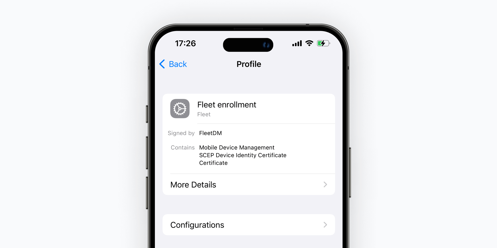

# Fleet now supports iOS and iPadOS, software deployment, and automated patch management

Managing security, control, and flexibility across diverse devices can be challenging, especially when proprietary systems hold you back. That’s why we’re thrilled to announce that Fleet now supports iOS and iPadOS devices and enhanced patch management features to give your team more control and scalability than ever.

**What does this mean for you?** Now, your team can manage iPhones, iPads, macOS, Windows, and Linux devices from a single platform. This latest release is designed to simplify mobile device management (MDM) while giving your team the control and flexibility they need to scale effectively.

**Highlights**:

* iPhone/iPad BYOD
* Self-service VPP apps
* Multiple ABM and VPP support
* Automatic installation of software on hosts

### Enrolling BYOD iPad/iOS devices in Fleet

[Enrolling BYOD iPhones and iPads in Fleet](https://fleetdm.com/guides/enroll-byod-ios-ipados-hosts) allows IT admins to manage software installations, enforce settings, and ensure devices comply with company policies—all without compromising user autonomy. This helps secure access to organizational resources while maintaining control over device configurations.

*Fleet enrollment profile on an iPhone.*

### Self-service Apple App Store apps

Fleet enables organizations to assign and install Apple App Store apps purchased through the Volume Purchase Program (VPP) directly via Self-Service using Fleet Desktop. This feature lets IT administrators [make VPP-purchased apps available to end users](https://fleetdm.com/guides/install-vpp-apps-on-macos-using-fleet). 

By integrating VPP app distribution into the Fleet Desktop Self-Service portal, organizations can streamline the deployment of essential software across their macOS devices. This ensures that users have easy access to the tools they need while maintaining control over software distribution. This update enhances the overall user experience and operational efficiency, empowering end users to install approved applications with minimal IT intervention.

### Multiple Apple Business Manager and VPP support

Alongside initial Volume Purchase Program (VPP) support, now you can add and manage multiple Apple Business Manager (ABM) and VPP tokens within a single Fleet instance. This feature is designed for both Managed Service Providers (MSPs) and large enterprises. Whether an MSP or an enterprise with multiple divisions, admins can set up separate workflows to automatically enroll devices and distribute apps through the App Store. This update simplifies the process of handling macOS, iOS, and iPadOS devices, providing a scalable solution for both MSPs and enterprises looking to centralize control while maintaining flexibility for different user groups.

*Add software modal.*

### Automatic installation of software on hosts

Fleet [v4.50.0](https://github.com/fleetdm/fleet/releases/tag/fleet-v4.50.0) introduced software deployment capabilities for your hosts. With the recent [v4.57.0](https://fleetdm.com/releases/fleet-4.57.0) update,  admins can automatically install software when a policy fails. This proactive approach helps maintain compliance and security without manual intervention.

This feature is handy when a device is found to have a vulnerable or outdated version of software installed. When a policy detects this, Fleet can automatically install a secure, updated version of the software to remediate the issue and bring the host back into compliance. This automation helps IT teams address vulnerabilities quickly and efficiently.

**Current supported software deployment formats:**

* macOS: .pkg
* Windows: .msi, .exe
* Linux: .deb

**Learn more about automatic software installation:** [https://fleetdm.com/guides/automatic-software-install-in-fleet](https://fleetdm.com/guides/automatic-software-install-in-fleet)

### A smoother path for MDM migrations

Switching MDM platforms has often been seen as a daunting task. Fleet makes the process of migrating easier and more efficient than ever before. With support for iOS and iPadOS, your team can seamlessly manage all your organization’s devices with a single tool that integrates with your existing GitHub repo and workflow.

By embracing open-source flexibility and cross-platform support, Fleet empowers teams to manage their devices in a way that suits their organization’s unique needs.

For more information on migrating to Fleet, check out: [https://fleetdm.com/guides/mdm-migration](https://fleetdm.com/guides/mdm-migration) 

### The future of device management is here

With our newly added support for iOS, iPadOS, and patch management tools, you can finally consolidate your device management across multiple platforms, streamlining your processes and reducing tool bloat.

As Mike McNeil, Fleet’s CEO, says: *“Our vision is to empower teams to manage their devices their way—without being locked into proprietary tools or vendor restrictions.”* With Fleet’s open-source approach, IT teams can take back control and build a future that fits their needs.

To learn more about how Fleet can support your organization, visit [fleetdm.com/mdm](https://fleetdm.com/mdm).

<meta name="category" value="announcements">
<meta name="authorGitHubUsername" value="Drew-P-drawers">
<meta name="authorFullName" value="Andrew Baker">
<meta name="publishedOn" value="2024-09-26">
<meta name="articleTitle" value="Fleet now supports iOS and iPadOS, software deployment, and automated patch management.">
<meta name="description" value="Fleet announces support for iOS and iPadOS, software deployment, and automated patch management">
