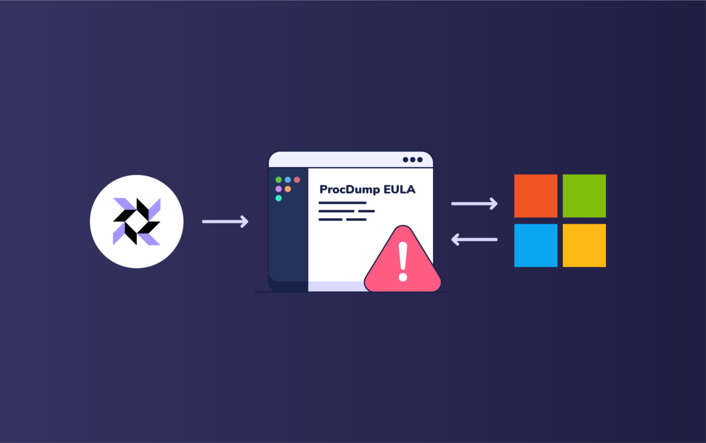

# Fleet quick tips — identify systems where the ProcDump EULA has been accepted.

By now, you’ve no doubt already heard of Microsoft’s big email hack.

While attackers initially flew largely under the radar via an unknown vulnerability in the email software, the folks at [Volexity](https://www.volexity.com/blog/2021/03/02/active-exploitation-of-microsoft-exchange-zero-day-vulnerabilities/) observed a handful of post exploitation activities and tools that operators used to gain a foothold — one such tool being ProcDump, which attackers were observed using to dump LSASS process memory.



As a possible detection method using osquery and Fleet, check out this query from [Recon InfoSec](https://rhq.reconinfosec.com/tactics/credential_access/#procdump) that looks for systems that accepted the ProcDump EULA. This query searches for a registry artifact that indicates ProcDump may have been used in a post-exploitation technique described by [Microsoft’s security blog](https://www.microsoft.com/security/blog/2021/03/02/hafnium-targeting-exchange-servers/).

```
SELECT datetime(mtime, ‘unixepoch’, ‘localtime’) AS EULA_accepted,path
FROM registry
WHERE path LIKE ‘HKEY_USERS\%\Software\Sysinternals\ProcDump\EulaAccepted’;
```

\*mtime = Time that EULA was accepted

For more information about the recent security breach, take a look at [Microsoft’s original blog post](https://www.microsoft.com/security/blog/2021/03/02/hafnium-targeting-exchange-servers/).

### Could this post be more helpful?
Let us know if you can think of any other example scenarios you’d like us to cover.

<meta name="category" value="guides">
<meta name="authorGitHubUsername" value="mike-j-thomas">
<meta name="authorFullName" value="Mike Thomas">
<meta name="publishedOn" value="2021-05-11">
<meta name="articleTitle" value="Fleet quick tips — identify systems where the ProcDump EULA has been accepted">
<meta name="articleImageUrl" value="../website/assets/images/articles/fleet-quick-tips-querying-procdump-eula-has-been-accepted-cover-700x440@2x.png">
