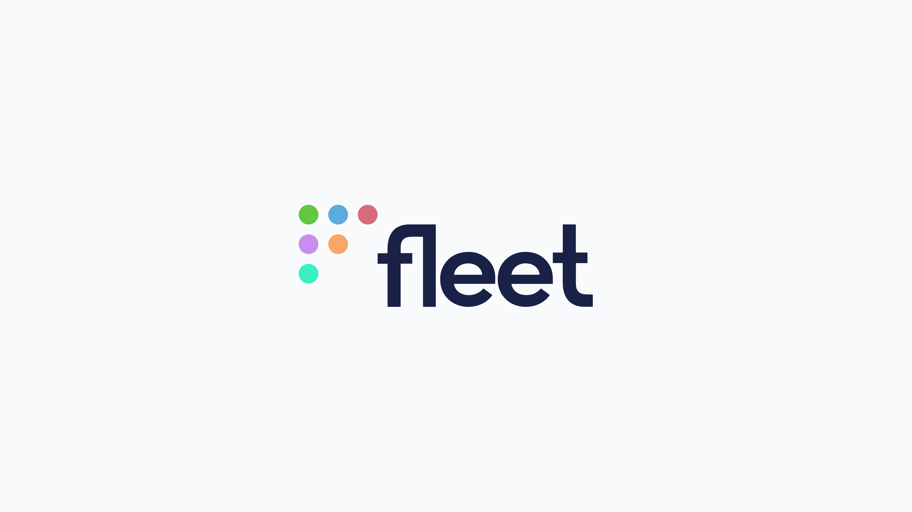

# Fleet reimagines observability with DevOps teams at Roblox, Atlassian, Dropbox

_Open-source project delivers new Arm64+ support for high-performance servers and Kubernetes clusters, speeding up compliance audits and enabling next-gen intrusion detection in the production infrastructures of industry giants including Atlassian, Dropbox, Roblox, Nubank, Fastly, and some of the world's most powerful HPC clusters (high-performance supercomputers)._

 
**AUSTIN — November 14, 2024 —** [Fleet](https://fleetdm.com?utm_content=eo-security), the leading open-source platform for Linux and Apple device management, today announced a new suite of expanded, multi-cloud features for DevOps and cloud security teams.  Fleet now includes a number of observability capabilities for servers and Kubernetes containers which make it easy to get data that was previously out of reach (or impractical to gather) from sensitive production environments like gaming servers and edge caching nodes. 

Industry pioneer [Mark Burgess](https://en.wikipedia.org/wiki/Mark_Burgess_(computer_scientist)), author of [CFEngine](https://en.m.wikipedia.org/wiki/CFEngine) and initiator of Promise Theory put it like this: "Configuring stuff is easy, but understanding the monster you've created is hard. This is why the challenges of infrastructure are all about knowledge management. Getting data is half the battle, and that's a big scaling challenge."

But the need for good data from production systems has never been greater.  Servers and containers have many of the same basic security visibility needs as laptops, like intrusion detection (HIDS), vulnerability reporting, and live investigation during incidents (DFIR).  They just require more painstaking steps to ensure the mere act of gathering the data doesn't cause negative performance impact or expensive downtime.  As companies increasingly rely on vast networks of servers to run their businesses, many opt not to take the risk of installing commercial endpoint detection and response (EDR) software on their production environments, worried about the performance "tax" and stability issues like the recent [worldwide "blue screen of death"](https://en.wikipedia.org/wiki/2024_CrowdStrike-related_IT_outages) that shut down some airports in the United States.

By contrast, Fleet is designed to scale seamlessly from tens of servers, to thousands of servers, to hundreds of thousands of servers, with minimal performance impact.  This dramatically simplifies gathering data for compliance audits, and it makes it possible to build more advanced security paradigms.  Now, Fleet is drawing increasing attention from companies that need to maximize both security and performance from their production infrastructures.

"We're able to address reliability and compliance concerns without sacrificing a single point-of-a-percent of performance for our servers.  All of this done consistently and continuously,” said [Charles Zaffery](https://www.linkedin.com/in/charleszaffery/), principal infrastructure engineer at [Roblox](https://en.wikipedia.org/wiki/Roblox). "Fleet is getting shown to our company board." 

Fleet's history and open-source nature give it a unique advantage.  Built atop [osquery](https://osquery.io), a popular open-source agent developed by Fleet co-founder [Zach Wasserman](https://github.com/zwass) during his time on Facebook's cybersecurity team, it has since been deployed across millions of devices and adopted widely in large enterprises and hobbyist setups worldwide.  This existing install base, coupled with the thousands of people reading its source code, make Fleet and osquery highly customizable and provide a firm, scalable foundation for shipping new, enterprise-ready features quickly.  For example, in just the last couple of months Fleet quietly trickled out multiple new features for infrastructure teams, including Arm64 support, [BPF events](https://en.wikipedia.org/wiki/Berkeley_Packet_Filter) on Arch Linux, remote installation of RPM packages, OVAL vulnerability scanning, auto-patching, zsh shell scripting, and AI-powered explanations of security policies for developers who build on company infrastructure. 

"Fleet's extremely wide and diverse set of data allows us [Roblox] to answer questions that we didn't even know we had," said Charles.  "On top of that, the experience is near instantaneous: Literally, seconds to sort through billions of data points and return the exact handful that we need, with complete auditing and transparency."

This data is one of Fleet's superpowers.  One example: Dre, a security engineer at a top electric vehicle manufacturer, used Fleet to identify which of their computers had a vulnerable [TPM chip](https://www.tomsguide.com/news/billions-of-pcs-and-other-devices-vulnerable-to-newly-discovered-tpm-20-flaws), an obscure hardware component. Even when the computer manufacturer couldn’t give him a straight answer over the phone, Fleet identified the vulnerable chip in seconds, across thousands of machines – from employee laptops to vehicle production lines.

"We picked Fleet for the simplicity of rolling it out and the ability to integrate into our environment," said another engineer at a different Fortune 100 computer and networking company. "Now, it is running on around 80,000 hosts internally at my company for threat detection, security reporting, and vulnerability management.”

Atlassian, Dropbox, Roblox, [Nubank](https://en.wikipedia.org/wiki/Nubank), Fastly, and other customers increase their adoption over time, standardizing on Fleet to easily get data and maintain surgical control across their entire infrastructure. For example, at Fastly, the cybersecurity department first purchased Fleet to replace a legacy, proprietary product installed on their servers, including high performance caching nodes, where even a small performance hit is critical.  Then one year later, new features in Fleet allowed it to spread to the IT department and replace a legacy device management vendor, eliminating more tool overlap while unifying security data across servers and laptops.

The growth and IPOs of open core companies like [GitLab](https://www.heavybit.com/library/video/commercial-open-source-business-strategies) and [Hashicorp](https://www.sec.gov/Archives/edgar/data/1720671/000119312521319849/d205906ds1.htm) have paved the way for open core companies like Fleet.  Unlike with proprietary, "black box" security software, which can be difficult to troubleshoot and can raise suspicions from engineers, Fleet customers retain access to 100% of the source code that runs on their servers and containers.  This makes Fleet easier to procure and easier for anyone to adopt and use, inside and outside of the enterprise. 

"Five years ago, I worked as a backend developer on an in-store payments product for a Fortune 1 company, and back then, there were a lot of late nights.  We had nothing but buggy, in-house tools for doing deployments and checking up on servers, plus a few commercial products that someone had bought, but that no one actually used," said [Mike McNeil](https://github.com/mikermcneil), CEO and co-founder of Fleet.  "The first time I met Zach and saw osquery, I realized this was going to change everything."

## About Fleet

[Fleet](https://fleetdm.com?utm_content=eo-security) is the leading [open-source](http://fleetdm.com/handbook/company/why-this-way?utm_content=eo-security#why-open-source) system for Linux observability and [Apple device management](https://fleetdm.com/better?utm_content=eo-security). Built on the power of osquery, Fleet enables organizations to inspect, collect, fix, install, patch, and program just about anything, every minute of the day, on any computer in their infrastructure with unprecedented flexibility and scale. Trusted by industry leaders like Roblox, Atlassian, Fastly, Nubank, and Dropbox, Fleet is transforming the way companies approach observability for large-scale, high-performance server deployments.

<meta name="category" value="announcements">
<meta name="authorFullName" value="Mike McNeil">
<meta name="authorGitHubUsername" value="mikermcneil">
<meta name="publishedOn" value="2024-11-14">
<meta name="articleTitle" value="Fleet reimagines observability with DevOps teams at Roblox, Atlassian, Dropbox">
<meta name="description" value="Fleet speeds up compliance audits and enables next-gen intrusion detection in large production infrastructures">
