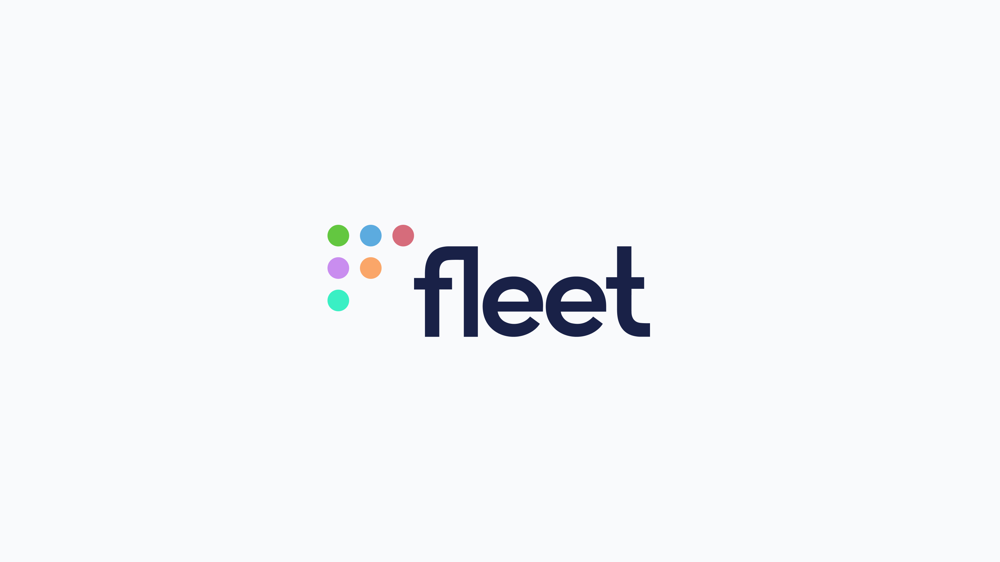

# Fleet user stories

## Cloud Security Technical Lead — F100 security and networking company.

When we spoke recently, our next Fleet user (whose name and employer must remain anonymous for contractual reasons) gave us candid insights into how osquery and Fleet has been adopted at their F100 security and networking company.

### How did you first get started using osquery?

The first time, or the real time? The first time was right after Facebook announced their new tool, called osquery. I was a security consultant at the time. I installed it on my Mac, ran a few queries, thought “this is cool,” closed it, and forgot about it.

A while later, I was reintroduced as part of a reorganization of our cloud security team, here at [censored]. We had an initiative to roll out osquery to all our server endpoints, and I was like “I’ve heard of this, neat!” That’s when I joined the osquery Slack, started talking to people about performance, and how to write queries.

Zach (Wasserman) and Fritz really helped me to get started with performant queries — the osquery community is really helpful.

My company uses osquery under the hood for a couple of projects, and it solves the problem of having endpoint visibility. The Carbon Blacks of the world will sell you their solutions with all the bells and whistles, but at the end of the day, what you really need is to be able to ask a question, and get an answer.

### Why are you using Fleet?

As a part of our whole osquery initiative, we had to deploy with Ansible, which was a little challenging. That, combined with the limitations of Kinesis, and the tooling capabilities we wanted led us to realizing that we needed a fleet manager. We wanted to help security operations be able to write queries to help them with IRs, and we wanted to collect information about devices and store them in the SIEM.

Level of maintenance and price were both factors. We evaluated a couple of products, like Zercurity, Kolide, osctrl, and sgt. When we heard Fleet was becoming a company, and was going open core, we saw that as a great opportunity to partner up, and drive features and roadmap requests. It would let us balance the needs of the business versus the needs of the many — like support for AWS Lambda as a long destination, for example.

### How do your end users feel about Fleet?

So far, the end user is me, and I like it a lot. There’s room for improvement in the UI — not to say that things are bad, but there are features that could be added to make it better. More visibility into what the hosts are doing when it interacts with osquery, getting a reporting dashboard around performance of the Fleet server itself, and the upcoming performance features spring to mind (editor note: query performance was recently released in Fleet 4.3.0.)

The auth model also has room for improvement, but I’m glad it was introduced. More granularity with that would be dope.

All that said, Fleet is exactly what we were looking for: a dead simple way to manage osquery and hosts.

### How are you dealing with alert fatigue and false positives from your SIEM?

I don’t directly deal with that — that’s our security operations team, mostly. I don’t think we deal with a lot of alert fatigue, or false positives. I would say, conservatively, that 80% of our alerts are actionable. We use Splunk mostly for historical and IR purposes. There are some alerts in there for some very specific purposes, and when they trigger, it means there’s a thing that needs to happen.

<meta name="category" value="success stories">
<meta name="authorGitHubUsername" value="mike-j-thomas">
<meta name="authorFullName" value="Mike Thomas">
<meta name="publishedOn" value="2021-09-29">
<meta name="articleTitle" value="Fleet user stories — F100">
<meta name="articleImageUrl" value="../website/assets/images/articles/fleet-user-stories-f100-cover-800x450@2x.png">