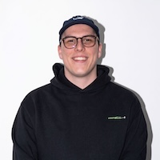
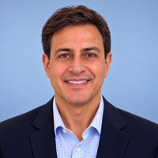

# Join the Fleet Virtual Summit 2026

Fleet is hosting its first virtual summit on Tuesday, November 10, 2026, at 11 AM ET / 8 AM PT / 4 PM GMT. Four panels of IT and security practitioners will talk about how GitOps, open source, and AI agents get device management to 2030. It streams free on LinkedIn Live.

## What to expect

- **Four 30-minute panels, back to back.** Mike McNeil, Fleet's cofounder and CEO, hosts all four.
- **Practitioners, not vendors.** Every panel is IT and security leaders talking about their own work: what they tried, what broke, and what they'd do differently. No slides and no demos.
- **Questions answered live.** Fleet's team joins the stream to answer your questions in the LinkedIn comments as they come in.

## The sessions

### Infrastructure as code for device management

Engineering teams version-control production infrastructure, review changes in pull requests, and roll back with a merge. Device management is one of the last IT functions still changed by hand in a console. Practitioners who moved their device configuration into Git share what it unlocked for shipping changes, compliance evidence, and recovering from mistakes.
- **Date:** Tuesday, November 10, 2026
- **Time:** 11 AM ET / 8 AM PT / 4 PM GMT

#### Panelists:

<table style="width:100%; border-collapse:collapse; font-family:Inter, sans-serif; color:#515774;">
  <tbody>
    <tr>
      <td style="border:1px solid #C5C7D1; padding:0; width:100px; vertical-align:middle;"></td>
      <td style="border:1px solid #C5C7D1; padding:16px; vertical-align:middle;">
<strong><a href="https://www.linkedin.com/in/ankle/">Adam Anklewicz</a></strong>, Treeline, Platform Architect
</td>
    </tr>
    <tr>
      <td style="border:1px solid #C5C7D1; padding:0; width:100px; vertical-align:middle;"></td>
      <td style="border:1px solid #C5C7D1; padding:16px; vertical-align:middle;">
<strong><a href="https://www.linkedin.com/in/brock-walters-247a2990/">Brock Walters</a></strong>, Thumbtack, Manager of IT Systems Engineering
</td>
    </tr>
    <tr>
      <td style="border:1px solid #C5C7D1; padding:0; width:100px; vertical-align:middle;"></td>
      <td style="border:1px solid #C5C7D1; padding:16px; vertical-align:middle;">
<strong><a href="https://www.linkedin.com/in/viktoralexfilipsson/?isSelfProfile=false">Viktor Filipsson</a></strong>, Sonos, Senior IT System Engineer
</td>
    </tr>
    <tr>
      <td style="border:1px solid #C5C7D1; padding:0; width:100px; vertical-align:middle;"></td>
      <td style="border:1px solid #C5C7D1; padding:16px; vertical-align:middle;">
<strong><a href="https://www.linkedin.com/in/betsykeiser/">Betsy Keiser</a></strong>, SandboxAQ, Staff Client Platform Engineer
</td>
    </tr>
  </tbody>
</table>

<a purpose="cta-button" no-icon href="https://calendly.com/fleetdm/fleet-virtual-summit-infrastructure-as-code">Reserve a spot in this session</a>

### Open source in enterprise device management

Open source runs most enterprise infrastructure, but the tools that manage employee devices are still mostly closed. This panel covers why organizations choose auditable code and portable data, and how that choice plays out in procurement, security reviews, and vendor negotiations.
- **Date:** Tuesday, November 10, 2026
- **Time:** 11:30 AM ET / 8:30 AM PT / 4:30 PM GMT

#### Panelists:

<table style="width:100%; border-collapse:collapse; font-family:Inter, sans-serif; color:#515774;">
  <tbody>
    <tr>
      <td style="border:1px solid #C5C7D1; padding:0; width:100px; vertical-align:middle;"></td>
      <td style="border:1px solid #C5C7D1; padding:16px; vertical-align:middle;">
<strong><a href="https://www.linkedin.com/in/sodahabit/">Daniel Moore</a></strong>, Red Hat, Manager and Mac Admin, Endpoint Systems
</td>
    </tr>
    <tr>
      <td style="border:1px solid #C5C7D1; padding:0; width:100px; vertical-align:middle;"></td>
      <td style="border:1px solid #C5C7D1; padding:16px; vertical-align:middle;">
<strong><a href="https://www.linkedin.com/in/patricia-egger/">Patricia Egger</a></strong>, Proton, Head of Security
</td>
    </tr>
    <tr>
      <td style="border:1px solid #C5C7D1; padding:0; width:100px; vertical-align:middle;"></td>
      <td style="border:1px solid #C5C7D1; padding:16px; vertical-align:middle;">
<strong><a href="https://www.linkedin.com/in/jarrydstanbrook/">Jarryd Stanbrook</a></strong>, Easygo, IT Systems Administrator
</td>
    </tr>
  </tbody>
</table>

<a purpose="cta-button" no-icon href="https://calendly.com/fleetdm/fleet-virtual-summit-open-source-in-device-management">Reserve a spot in this session</a>

### AI agents as a device management problem

AI agents are showing up on employee devices faster than IT can inventory them. They read files, call APIs, and act with the permissions of whoever installed them. At the same time, AI-driven exploits are shrinking the time between disclosure and attack. This panel covers both sides of the problem.
- **Date:** Tuesday, November 10, 2026
- **Time:** 12:00 PM ET / 9:00 AM PT / 5:00 PM GMT

#### Panelists:

<table style="width:100%; border-collapse:collapse; font-family:Inter, sans-serif; color:#515774;">
  <tbody>
    <tr>
      <td style="border:1px solid #C5C7D1; padding:0; width:100px; vertical-align:middle;"></td>
      <td style="border:1px solid #C5C7D1; padding:16px; vertical-align:middle;">
<strong><a href="https://www.linkedin.com/in/1dustindavis/">Dustin Davis</a></strong>, Pinterest, Sr Manager of IT Platform Engineering
</td>
    </tr>
    <tr>
      <td style="border:1px solid #C5C7D1; padding:0; width:100px; vertical-align:middle;"></td>
      <td style="border:1px solid #C5C7D1; padding:16px; vertical-align:middle;">
<strong><a href="https://www.linkedin.com/in/cjasonwalton/">Jason Walton</a></strong>, Schrödinger, VP of Information Security
</td>
    </tr>
  </tbody>
</table>

*More panelists to be announced*

<a purpose="cta-button" no-icon href="https://calendly.com/fleetdm/fleet-virtual-summit-ai-agents-as-a-device-management-problem">Reserve a spot in this session</a>

### Device management 2030

The devices IT manages, the tools it uses, and the skills the job requires will look different four years from now. Practitioners who are already placing bets on that future talk about where IT teams, tools, and the definition of an endpoint are headed.
- **Date:** Tuesday, November 10, 2026
- **Time:** 12:30 PM ET / 9:30 AM PT / 5:30 PM GMT

#### Panelists:

<table style="width:100%; border-collapse:collapse; font-family:Inter, sans-serif; color:#515774;">
  <tbody>
    <tr>
      <td style="border:1px solid #C5C7D1; padding:0; width:100px; vertical-align:middle;"></td>
      <td style="border:1px solid #C5C7D1; padding:16px; vertical-align:middle;">
<strong><a href="https://www.linkedin.com/in/mohammed-saqr/">Mohammed Saqr</a></strong>, Block, Manager of Infrastructure and Platform Engineering
</td>
    </tr>
    <tr>
      <td style="border:1px solid #C5C7D1; padding:0; width:100px; vertical-align:middle;"></td>
      <td style="border:1px solid #C5C7D1; padding:16px; vertical-align:middle;">
<strong>Dave Hannigan</strong>, former CISO, Nubank
</td>
    </tr>
  </tbody>
</table>

*More panelists to be announced*

<a purpose="cta-button" no-icon href="https://calendly.com/fleetdm/fleet-virtual-summit-device-management-2030">Reserve a spot in this session</a>

## How to watch

- **Date:** Tuesday, November 10, 2026
- **Time:** 11 AM ET / 8 AM PT / 4 PM GMT
- **Where:** LinkedIn Live
- **Cost:** Free

[Add the summit to your Google Calendar](https://calendar.google.com/calendar/render?action=TEMPLATE&text=Fleet+Virtual+Summit+2026&dates=20261110T160000Z%2F20261110T180000Z&details=Four+panel+conversations+on+how+GitOps%2C+open+source%2C+and+AI+agents+get+device+management+to+2030.+Streaming+free+on+LinkedIn+Live.+Details%3A+https%3A%2F%2Ffleetdm.com%2Fannouncements%2Ffleet-virtual-summit-2026&location=https%3A%2F%2Ffleetdm.com%2Fannouncements%2Ffleet-virtual-summit-2026), and [follow Fleet on LinkedIn](https://www.linkedin.com/company/fleetdm) to catch the stream when it goes live.

<meta name="category" value="announcements">
<meta name="authorFullName" value="Allen Houchins">
<meta name="authorGitHubUsername" value="allenhouchins">
<meta name="publishedOn" value="2026-10-02">
<meta name="articleTitle" value="Join the Fleet Virtual Summit 2026">
<meta name="description" value="Fleet's first virtual summit is November 10 on LinkedIn Live: four free panels on GitOps, open source, AI agents, and device management in 2030.">
