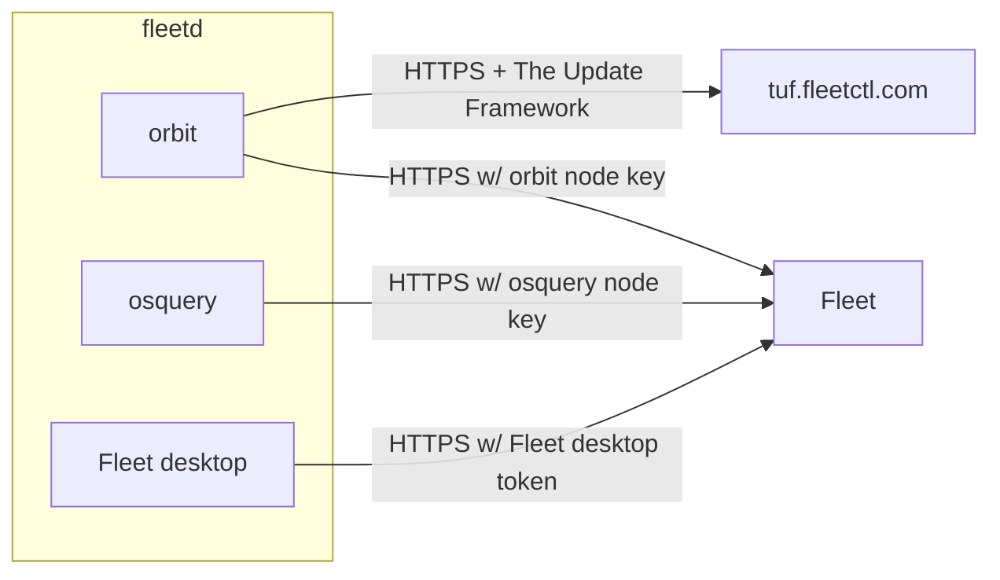

# Fleetd authentication

Fleetd is the agent that runs on the endpoints and communicates with Fleet to periodically send device data and to execute management tasks.

Fleetd is supported on macOS x86_64 and Apple Silicon (using universal binaries), Windows and Linux (x86_64), and Linux arm64.

The fleetd agent contains three components:
- [orbit](https://github.com/fleetdm/fleet/tree/main/orbit): This is the main daemon/service that starts all components on the endpoint.
- [osquery](https://github.com/osquery/osquery): Provides the endpoint with SQL-powered instrumentation, monitoring, and analytics.
- [Fleet desktop](https://fleetdm.com/guides/fleet-desktop#basic-article): This is the tray icon app to interface with users of the (Desktop) endpoint. This component can be disabled/missing on some endpoints (e.g. for servers without GUI).

This document aims to explain how all three components authenticate to Fleet servers.

## TLS

All fleetd components communicate to Fleet using HTTPS.

> Fleetd also supports mTLS, more on this below.

## Enrollment to Fleet

Endpoints use "enroll secrets" to authenticate to Fleet during the enrollment process.
- On Fleet free you can define multiple enroll secrets.
- On Fleet premium you can define multiple enroll secrets globally ("No team") and multiple enroll secrets for each team. Fleet will automatically join the device to the team that corresponds to the enroll secret.

Enroll secrets are generated randomly by Fleet (if not provided) or can be defined by the admin.
The enroll secrets randomly generated by Fleet are 24 bytes long, base64 encoded.

Enroll secrets are only used for authentication during the enrollment process. Once the endpoint is enrolled to Fleet, the device will use "node keys" for authentication, more on this below.

### Fleetd package generation

When generating a fleetd package using `fleetctl`, the admin provides an "enroll secret":
```sh
fleetctl package --type=pkg \
    --fleet-desktop \
    --fleet-url=... \
    --enroll-secret=...
```

The "Fleet URL" and "Enroll secret" are embedded into the generated package.

To learn more about `fleetctl package` to generate fleetd packages see [Enroll hosts](https://fleetdm.com/guides/enroll-hosts#basic-article).

## Enrollment process in fleetd

When installing a fleetd package the `orbit` binary is executed.
`orbit` runs as `root` on macOS/Linux and as a `SYSTEM` service on Windows.

During installation, the enroll secret is placed as a text file only accessible to `root`/`SYSTEM`.
When `orbit` starts for the first time, it will attempt to enroll to Fleet using the enroll secret.
If the enroll secret is valid, then the Fleet server will generate a random "orbit node key" and return it to `orbit`.
The `orbit` process will store such "node key" on a text file only accessible to `root`/`SYSTEM`.
After enrollment, the "orbit node key" will be used to authenticate orbit related requests to Fleet.

The `orbit` process will start the `osquery` daemon (that also runs as `root`/`SYSTEM`).
The `osquery` daemon will enroll to Fleet using the same enroll secret used by `orbit`.
Similarly, if the enroll secret is valid, then the Fleet server will generate a random "osquery node key" and return it to `osquery`.
`osquery` will store such "node key" on its internal RocksDB database file, only accessible to `root`/`SYSTEM`.
After enrollment, the "osquery node key" will be used to authenticate osquery related requests to Fleet.

The Fleet server uses the "Hardware UUID" of the endpoint to tie the `orbit` and `osquery` processes (to be identified as one "host" in Fleet). Users can alternatively use `--host-identifier=instance` flag in fleetd to support systems that have duplicate hardware UUIDs like cloned VMs.

On macOS and Windows, once the `orbit` and `osquery` enrollment process is completes, the enroll secret is removed from the file system and stored in the Apple keychain and Windows credentials manager respectively.
We currently don't support moving the enroll secret to a secret storage on Linux. Thus after enrollment, the enroll secret will remain in `/etc/default/orbit` (file only accessible to `root`).

After starting `osquery`, the `orbit` process will also start the `Fleet desktop` tray application.
Such application runs as the Desktop GUI user (it does not run as `root`/`SYSTEM`).
Before starting `Fleet desktop`, `orbit` will set a random "Fleet desktop token" and send it to Fleet server via the `orbit` authenticated communication channel.
The `orbit` process stores such token on a file accessible to the GUI user and `Fleet desktop` will use the token to authenticate requests to Fleet. When the user clicks on "My device" on the tray icon menu, `Fleet desktop` will open the default browser on a URL that contains the "Fleet desktop token" on its URL path. For this very reason, the "Fleet desktop token" is rotated every hour (by the `orbit` process).

Here's a diagram to summarize fleetd communication channels after enrollment (more on "tuf.fleetctl.com" below):


## Fleetd auto updates

`orbit` uses the [The Update Framework](https://theupdateframework.io/) to perform secure auto-updates.
By default, `orbit` has public root keys embedded in it to only trust updates published and signed in Fleet's TUF repository https://tuf.fleetctl.com (via HTTPS).

fleetd can also be customized to use a user-controlled "TUF" server.
More information can be found on orbit's Github [README](https://github.com/fleetdm/fleet/tree/main/orbit).

## TLS with custom CA certificates

By default, fleetd uses the OS root CA certificate store and also embeds the [Mozilla CA certificate store](https://curl.se/docs/caextract.html).
fleetd also supports setting custom root CA certificates that will be used to communicate to Fleet and the TUF server.
More information can be found on the [Certificates in fleetd]((https://fleetdm.com/guides/certificates-in-fleetd#basic-article) guide.

## mTLS

> The Fleet server does not provide support for mTLS.
> Users that want to use mTLS on their endpoints must setup a load balancer or TLS terminator like AWS's ELB or nginx that support mTLS.

The fleetd agent does provide basic support for mTLS. See the [Using mTLS](https://fleetdm.com/guides/enroll-hosts#using-mtls) guide.

## ADE and Autopilot MDM flow

When your macOS/Windows endpoints enroll to Fleet via MDM protocols, Fleet will send a command to automatically install fleetd on the enrolled endpoints.
Fleet will also send a configuration profile to automatically configure the "enroll secret" and "Fleet URL" so that the enrollment process documented above can take place.

<meta name="authorGitHubUsername" value="lucasmrod">
<meta name="authorFullName" value="Lucas Rodriguez">
<meta name="publishedOn" value="2024-11-14">
<meta name="articleTitle" value="Fleetd authentication">
<meta name="category" value="guides">