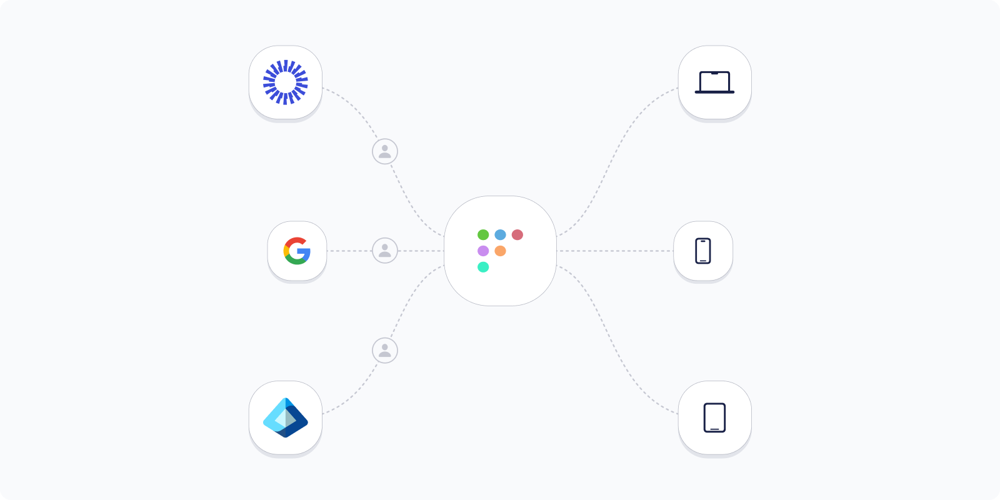
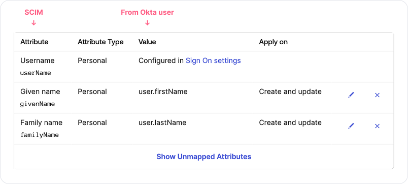
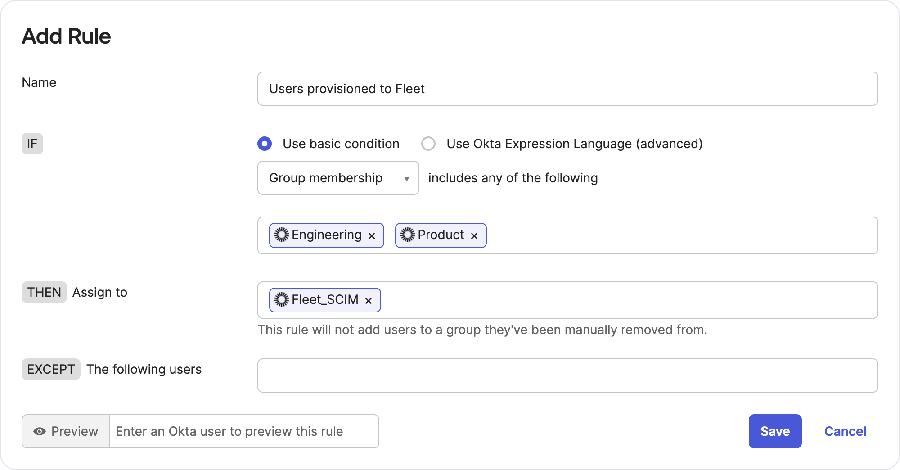
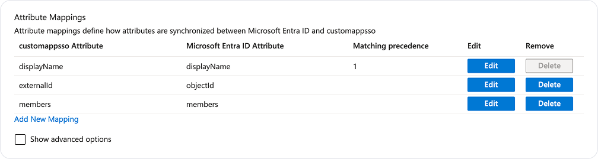
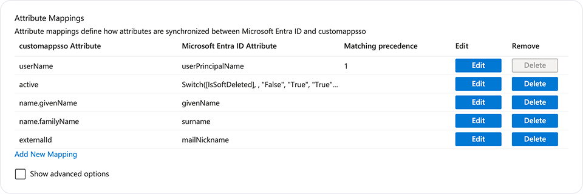
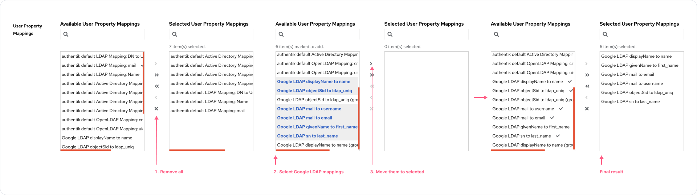
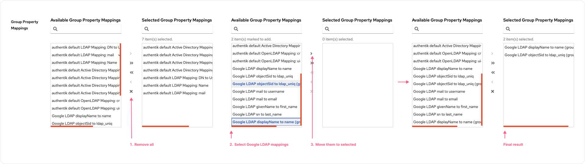

# Foreign vitals: map IdP users to hosts



_Available in Fleet Premium._

Fleet currently gathers your end user's IdP username when [end users log in](https://fleetdm.com/guides/macos-setup-experience#end-user-authentication) during the automatic enrollment (DEP) setup process.  

By connecting Fleet to your IdP to sync user data, you can add additional information, like the end user's groups and full name to your host data in Fleet. This allows you to leverage IdP information as variables in macOS configuration profiles to, for example, [deploy a WiFi certificate](https://fleetdm.com/guides/connect-end-user-to-wifi-with-certificate#step-4-add-pkcs-12-configuration-profile-to-fleet).

Fleet currently supports syncing data with [Okta](#okta), [Microsoft Active Directory (AD) / Entra ID](#microsoft-entra-id), [Google Workspace](#google-workspace), and [authentik](#google-workspace), with support for more idPs coming soon.

## Okta

To map users from Okta to hosts in Fleet, we'll do the following steps:

1. [Create application in Okta](#step-1-create-application-in-okta)
2. [Connect Okta to Fleet](#step-2-connect-okta-to-fleet)
3. [Map users and groups to hosts in Fleet](#step-3-map-users-and-groups-to-hosts-in-fleet)

#### Step 1: Create application in Okta

1. Head to Okta admin dashboard.
2. In the main menu, select **Applications > Applications**, then select **Create App Integration**.
3. Select **SAML 2.0** option and select **Next**.
4. On the **General Settings** page, add a friendly **App name** (e.g Fleet SCIM), and select **Next**.
5. On the **SAML Settings** page, add any URL to the **Single sign-on URL** and **Audience URI (SP Entity ID)** fields, and select **Next**.
> Okta requires us to setup SAML settings in order to setup a SCIM integration. Since we don't need SAML right now, you can set the URL to anything like "example.fleetdm.com".
6. On the **Feedback** page, provide feedback if you want, and select **Finish**.
7. Select the **General** tab in your newly created app and then select **Edit** in **App Settings**.
8. For **Provisioning**, select **SCIM** and select **Save**.

#### Step 2: Connect Okta to Fleet

1. Select the **Provisioning** tab and then, in **SCIM Connection**, select **Edit**.
2. For the **SCIM connector base URL**, enter `https://<your_fleet_server_url>/api/v1/fleet/scim`.
3. For the **Unique identifier field for users**, enter `userName`.
4. For the **Supported provisioning actions**, select **Push New Users**, **Push Profile Updates**, and **Push Groups**.
5. For the **Authentication Mode**, select **HTTP Header**.
6. [Create a Fleet API-only user](https://fleetdm.com/guides/fleetctl#create-api-only-user) with maintainer permissions and copy API token for that user. Paste your API token in Okta's **Authorization** field.
7. Select the **Test Connector Configuration** button. You should see success message in Okta.
8. In Fleet, head to **Settings > Integrations > Identity provider (IdP)** and verify that Fleet successfully received the request from IdP.
9. Back in Okta, select **Save**.
10. Under the **Provisioning** tab, select **To App** and then select **Edit** in the **Provisioning to App** section. Enable **Create Users**, **Update User Attributes**, **Deactivate Users**, and then select **Save**.
11. On the same page, make sure that `givenName` and `familyName` have Okta value assigned to it. Currently, Fleet requires the `userName`, `givenName`, and `familyName` SCIM attributes. Delete the rest of the attributes.



#### Step 3: Map users and groups to hosts in Fleet

To send users and groups information to Fleet, you have to assign them to your new SCIM app.

1. In OKta's main menu **Directory > Groups** and then select **Add group**. Name it "Fleet human-device mapping".
2. On the same page, select the **Rules** tab. Create a rule that will assign users to your  "Fleet human-device mapping" group.

3. In the main menu, select **Applications > Applications**  and select your new SCIM app. Then, select the **Assignments** tab.
4. Select **Assign > Assign to Groups** and then select **Assign** next to the "Fleet human-device mapping" group. Then, select **Done**. Now all users that you assigned to the  "Fleet human-device mapping" group will be provisioned to Fleet.
5. On the same page, select **Push Groups** tab. Then, select **Push Groups > Find groups by name** and add all groups that you assigned to "Fleet human-device mapping" group previously (make sure that **Push group memberships immediately** is selected). All groups will be provisioned in Fleet, and Fleet will map those groups to users.

## Microsoft Entra ID

To map users from Entra ID to hosts in Fleet, we'll do the following steps:

1. [Create enterprise application in Entra ID](#step-1-create-enterprise-application-in-entra-id)
2. [Connect Entra ID to Fleet](#step-2-connect-entra-id-to-fleet)
3. [Map users and groups to hosts in Fleet](#step-3-map-users-and-groups-to-hosts-in-fleet)

#### Step 1: Create enterprise application in Entra ID

1. Head to [Microsoft Entra](https://entra.microsoft.com/).
2. In the main menu, select **Applications > Enterprise applications**. Then, select **+ New
   application** and **+Create your own application**.
3. Add a friendly name for the app (e.g. Fleet SCIM), select **Integrate any other application you
   don't find in the gallery (Non-gallery)**, and select **Create**.

#### Step 2: Connect Entra ID to Fleet

1. From the side menu, select **Provisioning**.
2. In **Get started with application provisioning** section, select **Connect your application**.
3. For the **Tenant URL**, enter `https://<your_fleet_server_url>/api/v1/fleet/scim?aadOptscim062020`.
4. Create a Fleet API-only user with maintainer permissions and copy API token for that user (learn how [here](https://fleetdm.com/guides/fleetctl#create-api-only-user)). Paste your API token in the **Secret token** field.
5. Select the **Test connection** button. You should see success message.
6. Select **Create** and, after successful creation, you'll be redirected to the overview page.

#### Step 3: Map users and groups to hosts in Fleet

1. From the side menu, select **Attribute mapping** and then select **Provision Microsoft Entra ID Groups**.
2. Ensure that the attributes `displayName`, `members`, and `externalId` are mapped to **Microsoft Entra ID Attribute**. Currently, Fleet support only these attributes and they are required as well. Delete the rest of the attributes, select **Save**, and after it's
    saved, select close icon on the top right corner.
    
3. Select **Provision Microsoft Entra ID Users**.
4. Ensure that the attributes `userName`, `givenName`, `familyName`, `active`, and `externalId` are mapped to **Microsoft Entra ID Attribute**. Currently, Fleet requires the `userName` `givenName`, and `familyName` SCIM attributes. Delete the rest of the attributes. Then, elect **Save** and select the close icon in the top right corner.
  
5. Next, from the side menu, select **Users and groups** , **+ Add user/group**, and **None Selected**.
6. Select the users and groups that you want to map to hosts in Fleet and then select **Assign**. 
7. From the side menu, select **Overview** and select **Start provisioning**.

It might take up to 40 minutes until Microsoft Entra ID sends data to Fleet. To speed this up, you can use the "Provision on demand" option in Microsoft Entra ID.

## Google Workspace

Google Workspace doesn't natively support the [SCIM](https://scim.cloud/) standard. The best practice is to export users to [authentik](https://goauthentik.io/). Authentik then adds users to Fleet.

### Prerequisites

- [Install](https://docs.goauthentik.io/docs/install-config/install/aws) and run authentik
- Google Workspace Business Plus plan (or one of the plans listed in [Google Secure LDAP](https://support.google.com/a/answer/9048516?hl=en&ref_topic=9048334&sjid=5482490660946222035-EU) article)

### Connect

To map users from Google Workspace to hosts in Fleet, we'll do the following steps:

1. [Add LDAP client in Google Admin console](#step-1-add-ldap-client-in-google-admin-console)
2. [Add LDAP authentication certificate to authentik](#step-2-add-ldap-authentication-certificate-to-authentik)
3. [Add custom LDAP property mappings to authentik](#step-3-add-custom-ldap-property-mappings-to-authentik)
4. [Configure LDAP connection in authentik](#step-4-configure-ldap-connection-in-authentik)
5. [Map users and groups to hosts in Fleet](#step-5-map-users-to-hosts-in-fleet)

#### Step 1: Add LDAP client in Google Admin console

1. Head to the [Google Admin console](https://admin.google.com/).
2. From the side menu, select **Apps > LDAP**.
3. Select **ADD CLIENT**, add a friendly name (e.g. "authentik") and description, and then select **CONTINUE**.
4. Select **Entire domain** in **Verify user credentials** and **Read user information** sections.
5. Toggle the switch under **Read group information** to **On** and select **ADD LDAP CLIENT**.
6. Select **Download certificate** and select **CONTINUE TO CLIENT DETAILS**.
7. Select **Authentication card** and select **GENERATE NEW CREDENTIALS**.
8. Save **Username** and **Password**. We'll need those along with a certificate we'll download in the next section.


#### Step 2: Add LDAP authentication certificate to authentik

1. Navigate to your authentik admin dashboard.
2. From the side menu, select **System > Certificates**.
3. Select **Create** and add a friendly name (e.g. "Google LDAP certificate").
4. Now, find the downloaded certificate on your computer and unarchive it. Then, open the `.crt` with a text editor (e.g. TextEdit), copy its contents, and paste into the **Certificate** field.
5. Open the `.key` file with a text editor and copy its content to the **Private key** field. Then, select **Create**.

#### Step 3: Add custom LDAP property mappings to authentik

1. In authentik's side menu, select **Customization > Property Mappings**,
2. Select **Create** and **LDAP Source Property Mapping** from the list. Then, select **Next**.
3. You need to repeat this a few times and add each of these property mappings:

- **Name**: Google LDAP objectSid > ldap_uniq
- **Expression**:
    ```
    return {
        "attributes": {
            "ldap_uniq": list_flatten(ldap.get("objectSid")),
        },
    }
    ```

- **Name**: Google LDAP mail > username  
- **Expression**:
    ```
    return {
        "username": list_flatten(ldap.get("mail")),
    }
    ```

- **Name**: Google LDAP mail > email
- **Expression**:
    ```
    return {
        "email": list_flatten(ldap.get("mail")),
    }
    ```

- **Name**: Google LDAP givenName > givenName
- **Expression**:
    ```
    return {
        "attributes": {
            "givenName": list_flatten(ldap.get("givenName")),
        },
    }
    ```


- **Name**: Google LDAP sn > familyName
- **Expression**:
    ```
    return {
        "attributes": {
            "familyName": list_flatten(ldap.get("sn")),
        },
    }
    ```

- **Name**: Google LDAP displayName > name
- **Expression**:
    ```
    return {
        "name": list_flatten(ldap.get("displayName")),
    }
    ```

- **Name**: Google LDAP displayName > name (group)
- **Expression**:
    ```
    return {
        "name": list_flatten(ldap.get("displayName")),
    }
    ```

- **Name**: Google LDAP objectSid > ldap_uniq (group)
- **Expression**:
    ```
    return {
        "attributes": {
            "ldap_uniq": list_flatten(ldap.get("objectSid")),
        },
    }
    ```

#### Step 4: Configure LDAP connection in authentik

1. From the side menu, select **Directory > Federation and Social login**.
2. Select **Create**, **LDAP Source**, and **Next**.
3. Add a friendly name (e.g. "Google LDA"P").
4. Make sure that **Enable**, **Sync users** and **Sync groups** are toggled on.
5. In the **Server URL** enter `ldap://ldap.google.com`. For more information, refer to [Google docs](https://support.google.com/a/answer/9089736?hl=en&ref_topic=9173976&sjid=5482490660946222035-EU#basic-instructions).
6. For the **TLS client authentication certificate**, select your certificate created in 2nd section (Google LDAP certificate)
7. For the **Bind CN**, enter the username that you saved in the first step. For **Bind Password**, enter the password you saved.
8. In **Base DN**, enter your Google Workspace domain in a DN format (e.g. dc=yourcompany,dc=com).
9. For the **User Property Mappings,** remove all selected properties by clicking the "X" icon, and select all user properties that we created in the left box and select the ">" icon between boxes.

10. For the **Group Property Mappings**, remove all selected properties by clicking the "X" icon, and select all group properties that we created in the left box and select the ">" icon between boxes.

11. Under **Additional settings**, enter values below:
**User object filter** > `(objectClass=person)`,  **Group object filter** > `(objectClass= groupOfNames)`, **Group membership field** > `member`, **Object uniqueness field** > `objectSid`
13. Select **Finish** to save your configuration. 
14. After a few minutes, on the **Directory > Users** page, you should see users from your Google Workspace.

#### Step 5: Map users to hosts in Fleet

1. From the side menu, select **Applications > Providers**, **Create**, **SCIM Provider**, and then **Next**.
2. Add a friendly name (e.g. "Fleet SCIM provider").
3. For the **URL**, enter `https://<your_fleet_server_url>/api/v1/fleet/scim`.
4. Create a Fleet API-only user with maintainer permissions and copy the API token for that user (learn how [here](https://fleetdm.com/guides/fleetctl#create-api-only-user)). Paste your API token in the **Token** field.
5. Select **Finish** to save provider.
6. Now, from the side menu, select **Applications > Applications**. Then, select **Create**.
7. Add a friendly name (e.g. "Fleet SCIM app") and slug (e.g. "fleet-scim-app").
8. For the **Backchannel Providers**, select the provider created above ("Fleet SCIM provider").
9. Select **Create** to add the application.
10. After a few minutes, you should see users mapped to hosts in Fleet.

## Verify connection

After following the steps above, you should be able to see the latest requests from your IdP to Fleet if you navigate to **Settings > Integrations > Identity Provider (IdP)**. 

To verify that user information is added to a host, go to the host that has IdP username assigned, and verify that **Full name (IdP)** and **Groups (IdP)** are populated correctly.

### Troubleshooting

If you find that information from IdP (e.g full name or groups) is missing on the host, and the host has IdP username assigned to it, follow the steps below to resolve.

1. Please first go to Okta, select **Directory > People**, find user that is
missing information and make sure that it has all the fields required by Fleet (username, first name, and
last name).
2. If all required fields are present, then go to **Applications > Applications > fleet_scim_application > Provisioning > To App**, then scroll to the bottom of the page and make sure that `userName`, `givenName`, and `familyName` have a value assigned to them.
3. Otherwise, make sure that all settings from the instructions above were set correctly.

<meta name="authorGitHubUsername" value="marko-lisica">
<meta name="authorFullName" value="Marko Lisica">
<meta name="publishedOn" value="2025-04-11">
<meta name="articleTitle" value="Foreign vitals: map IdP users to hosts">
<meta name="articleImageUrl" value="../website/assets/images/articles/add-users-from-idp-cover-img.png">
<meta name="category" value="guides">
