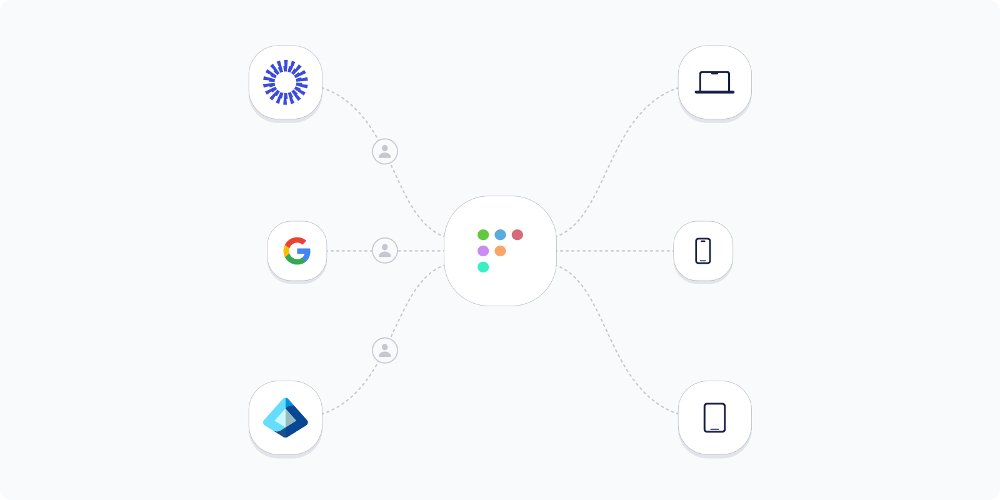
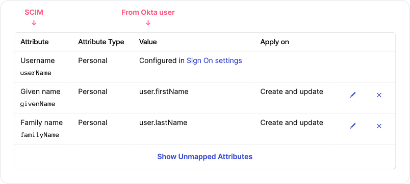
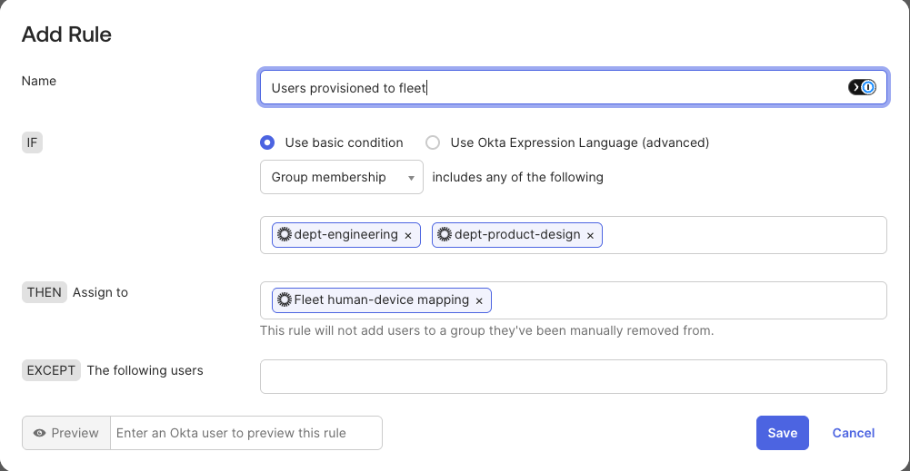
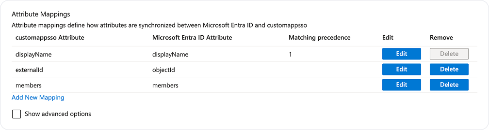
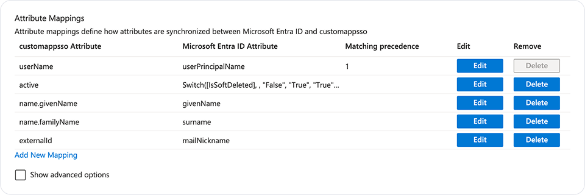

# Foreign host vitals: Identity provider (IdP) username, groups, and department

_Available in Fleet Premium._

Fleet can map an end user's IdP username, groups, and department to their host(s) in Fleet. Then, you can use these IdP host vitals as [variables in configuration profiles](https://fleetdm.com/guides/fleet-variables) or criteria for [labels](https://fleetdm.com/guides/managing-labels-in-fleet).

Fleet supports [Okta](#okta), [Microsoft Active Directory (AD) / Entra ID](#microsoft-entra-id), [Google Workspace](#google-workspace), [authentik](#google-workspace), as well as [any other IdP](#other-idps) that supports the [SCIM (System for Cross-domain Identity Management) protocol](https://scim.cloud/).

Fleet automatically collects IdP host vitals when an [end user authenticates](https://fleetdm.com/guides/setup-experience#require-idp-authentication) during these enrollment scenarios:
- Automatic enrollment for [Apple](https://fleetdm.com/guides/apple-mdm-setup#apple-business-manager-abm) (macOS, iOS, iPadOS) and [Windows](https://fleetdm.com/guides/windows-mdm-setup#automatic-enrollment) hosts.
- Manual enrollment for Apple (macOS, iOS, iPadOS), Android, Windows, and Linux hosts.

You can also manually add/update a host's IdP username on the Host details page. Fleet will then automatically map the username to other IdP vitals.

## Okta

To map users from Okta to hosts in Fleet, we'll do the following steps:

1. [Create application in Okta](#step-1-create-application-in-okta)
2. [Connect Okta to Fleet](#step-2-connect-okta-to-fleet)
3. [Map Okta users and groups to hosts in Fleet](#step-3-map-okta-users-and-groups-to-hosts-in-fleet)

#### Step 1: Create application in Okta

1. Head to Okta admin dashboard.
2. In the main menu, select **Applications > Applications**, then select **Create App Integration**.
3. Select **SAML 2.0** option and select **Next**.
4. On the **General Settings** page, add a friendly **App name** (e.g Fleet SCIM), and select **Next**.
5. On the **SAML Settings** page, add any fully-qualified URL to the **Single sign-on URL** and **Audience URI (SP Entity ID)** fields, and select **Next**.
> Okta requires setting up SAML to set up SCIM. Since we don't need SAML right now, you can set the URL to something arbitrary, e.g `https://example.fleetdm.com`.
6. On the **Feedback** page, provide feedback if you want, and select **Finish**.
7. Select the **General** tab in your newly created app and then select **Edit** in **App Settings**.
8. For **Provisioning**, select **SCIM** and select **Save**.

#### Step 2: Connect Okta to Fleet

1. Select the **Provisioning** tab and then, in **SCIM Connection**, select **Edit**.
2. For the **SCIM connector base URL**, enter `https://<your_fleet_server_url>/api/v1/fleet/scim`.
3. For the **Unique identifier field for users**, enter `userName`.
4. For the **Supported provisioning actions**, select **Push New Users**, **Push Profile Updates**, and **Push Groups**.
5. For the **Authentication Mode**, select **HTTP Header**.
6. [Create a Fleet API-only user](https://fleetdm.com/guides/fleetctl#create-api-only-user) with admin permissions and access to all [`/scim/*` API endpoints](https://fleetdm.com/docs/rest-api/rest-api#scim).
7. Copy the API token for that user and paste it in Okta's **Authorization** field.
8. Select the **Test Connector Configuration** button. You should see a success message pop up in Okta. You can close this message.
9. In Fleet, head to **Settings > Integrations > User mapping** and verify that Fleet successfully received the request from Okta.
10. Back in Okta, select **Save**.
11. Under the **Provisioning** tab, select **To App** and then select **Edit** in the **Provisioning to App** section. Enable **Create Users**, **Update User Attributes**, **Deactivate Users**, and then select **Save**.
12. On the same page, make sure that `givenName` and `familyName` attributes have Okta values assigned to them. Currently, Fleet requires the `userName`, `givenName`, and `familyName` SCIM attributes. Fleet also supports the `department` attribute, but does not require it. Remove the mapping for the rest of the attributes.

> If you use attributes other than the supported attributes above, the payload will be rejected by Fleet.

#### Step 3: Map Okta users and groups to hosts in Fleet

To send users and groups information to Fleet, you have to assign them to your new SCIM app.

1. In Okta's main menu **Directory > Groups** and then select **Add group**. Name it "Fleet human-device mapping".
2. On the same page, select the **Rules** tab. Select **Add Rule** to create a rule that will assign users to your "Fleet human-device mapping" group.

3. After saving your new rule, select **Activate** from the **Actions** menu to populate users into the human-device mapping group.
4. In the Okta main menu, select **Applications > Applications** and select your new SCIM app. Then, select the **Assignments** tab.
5. Select **Assign > Assign to Groups** and then select **Assign** next to the "Fleet human-device mapping" group, then **Save and Go Back**, then **Done**. Now all users that you assigned to the "Fleet human-device mapping" group will be provisioned to Fleet.
6. On the same page, select the **Push Groups** tab. Then, select **Push Groups > Find groups by name** and add all groups that you assigned to "Fleet human-device mapping" group previously (make sure that **Push group memberships immediately** is selected). All groups will be provisioned in Fleet, and Fleet will map those groups to users.

#### Troubleshooting

If you find that identity information (e.g full name or groups) is missing on the host, and the host has an IdP username assigned to it:

1. In Okta, select **Directory > People**, find the affected user, and make sure that it has all the fields required by Fleet (username, first name, and last name).
2. If all required fields are present, then go to **Applications > Applications**, select your app, then go to the **Provisioning** tab and select **To App**. Scroll to the bottom of the page and make sure that `userName`, `givenName`, and `familyName` have a value assigned to them.
3. Otherwise, make sure that all settings from the instructions above were set correctly.

## Microsoft Entra ID

To map users from Entra ID to hosts in Fleet, we'll do the following steps:

1. [Create enterprise application in Entra ID](#step-1-create-enterprise-application-in-entra-id)
2. [Connect Entra ID to Fleet](#step-2-connect-entra-id-to-fleet)
3. [Map Entra users and groups to hosts in Fleet](#step-3-map-entra-users-and-groups-to-hosts-in-fleet)

#### Step 1: Create enterprise application in Entra ID

1. Head to [Microsoft Entra](https://entra.microsoft.com/).
2. In the main menu, select **Applications > Enterprise applications**. Then, select **+ New
   application** and **+Create your own application**.
3. Add a friendly name for the app (e.g. Fleet SCIM), select **Integrate any other application you
   don't find in the gallery (Non-gallery)**, and select **Create**.

#### Step 2: Connect Entra ID to Fleet

1. From the side menu, select **Provisioning**.
2. In **Get started with application provisioning** section, select **Connect your application**.
3. For the **Tenant URL**, enter `https://<your_fleet_server_url>/api/v1/fleet/scim?aadOptscim062020`.
4. [Create a Fleet API-only user](https://fleetdm.com/guides/fleetctl#create-api-only-user) with maintainer permissions and copy API token for that user. Paste your API token in the **Secret token** field.
5. Select the **Test connection** button. You should see success message.
6. Select **Create** and, after successful creation, you'll be redirected to the overview page.

#### Step 3: Map Entra users and groups to hosts in Fleet

1. From the side menu, select **Attribute mapping** and then select **Provision Microsoft Entra ID Groups**.
    
2. Select **Provision Microsoft Entra ID Users**.
3. Ensure that the attributes `userName`, `givenName`, `familyName`, `department`, `active`, and `externalId` are mapped to **Microsoft Entra ID Attribute**. Currently, Fleet requires the `userName` `givenName`, and `familyName` SCIM attributes. Delete the rest of the attributes. Then, elect **Save** and select the close icon in the top right corner.
  
4. Next, from the side menu, select **Users and groups** , **+ Add user/group**, and **None Selected**.
5. Select the users and groups that you want to map to hosts in Fleet and then select **Assign**. 
6. From the side menu, select **Overview** and select **Start provisioning**.

> Note: Entra does not support [syncing nested groups using SCIM](https://learn.microsoft.com/en-us/entra/identity/app-provisioning/application-provisioning-config-problem-no-users-provisioned). Please consider using dynamic group membership instead.

It might take up to 40 minutes until Microsoft Entra ID sends data to Fleet. To speed this up, you can use the "Provision on demand" option in Microsoft Entra ID.

## Google Workspace

Google Workspace doesn't support the [SCIM](https://scim.cloud/) standard. Instead, Fleet connects directly to Google Workspace and pulls users, groups, and departments from the [Admin SDK Directory API](https://developers.google.com/workspace/admin/directory/reference/rest) on a schedule, using a Google Cloud service account with domain-wide delegation.

When a Google Workspace integration is configured, Fleet ignores SCIM requests from other identity providers. Configure either a SCIM integration (Okta, Entra ID, etc.) or Google Workspace, not both.

### Prerequisites

- Google Workspace with super admin access to the [Google Admin console](https://admin.google.com/)
- A Google Cloud project where you can create a service account

### Connect

To map users from Google Workspace to hosts in Fleet, complete the following steps:

1. [Create a service account in Google Cloud](#step-1-create-a-service-account-in-google-cloud)
2. [Authorize the service account via domain-wide delegation](#step-2-authorize-the-service-account-via-domain-wide-delegation)
3. [Connect Google Workspace to Fleet](#step-3-connect-google-workspace-to-fleet)
4. [Map users and groups to hosts in Fleet](#step-4-map-users-and-groups-to-hosts-in-fleet)

#### Step 1: Create a service account in Google Cloud

1. Go to the [Service accounts](https://console.cloud.google.com/iam-admin/serviceaccounts) page in the Google Cloud console.
2. Select or create a project, then select **Create service account**.
3. Enter a name (e.g., "Fleet IdP sync") and select **Create and continue**, then **Done**.
4. Select the new service account, open the **Keys** tab, and select **Add key > Create new key**.
5. Select the **JSON** key type and select **Create** to download the key file. You'll paste its contents into Fleet later.
6. Enable the [Admin SDK API](https://console.cloud.google.com/apis/library/admin.googleapis.com) in the same project as the service account. This is required, and it's easy to miss. If it's not enabled, the sync fails with a 403 `SERVICE_DISABLED` error.

#### Step 2: Authorize the service account via domain-wide delegation

1. In the [Google Admin console](https://admin.google.com/), go to **Security > Access and data control > API controls > Manage Domain Wide Delegation**.
2. Select **Add new**.
3. For **Client ID**, enter the service account's client ID. You can find this as the `client_id` value in the JSON key file.
4. For **OAuth scopes**, enter the following, separated by commas:
   - `https://www.googleapis.com/auth/admin.directory.user.readonly`
   - `https://www.googleapis.com/auth/admin.directory.group.readonly`
   - `https://www.googleapis.com/auth/admin.directory.group.member.readonly`
5. Select **Authorize**.

#### Step 3: Connect Google Workspace to Fleet

1. In Fleet, head to **Settings > Integrations > Identity provider (IdP)**.
2. In the **Google Workspace** section, paste the full contents of the JSON key file into **API key JSON**.
3. For **Primary domain**, enter your Google Workspace primary domain.
4. For **Admin email to impersonate**, enter a Google Workspace admin's email. The service account impersonates this user to read the directory.
5. Select **Save**.

Fleet syncs your directory shortly after you save, and then on a schedule. You can confirm the connection status in the **Identity provider (IdP)** section.

#### Step 4: Map users and groups to hosts in Fleet

Fleet maps each Google Workspace user to a host using the end user's IdP email collected during MDM enrollment. After a host is mapped, its IdP username, groups, and department are available on host details. To verify the mapping, see [Verify connection](#verify-connection) below.

#### Troubleshooting

If the sync fails, check the connection status in **Settings > Integrations > Identity provider (IdP)** and the Fleet server logs for the `google_workspace_sync` cron job.

- **"Admin SDK API has not been used in project ... or it is disabled" (403 `SERVICE_DISABLED`)**: enable the Admin SDK API in the Google Cloud project that owns the service account, not your Google Workspace organization. Open the activation link in the error (it includes the project ID) and select **Enable**. Wait a few minutes, then retry.
- **"unauthorized_client" or "access_denied" (403)**: domain-wide delegation isn't authorized correctly. In the Google Admin console, confirm the **Client ID** matches the service account's unique ID and that all three OAuth scopes are present and spelled exactly as listed in Step 2. Changes can take a few minutes to propagate.
- **"Admin email to impersonate" errors**: the impersonated user must be a real Google Workspace admin with permission to read users and groups.
- **Can't create a service account key ("Organization Policy ... disableServiceAccountKeyCreation")**: your organization enforces a policy that blocks key creation. Create the service account in a Google Cloud project that isn't part of that organization, or ask an Organization Policy Administrator to override the policy. Domain-wide delegation works regardless of which project or organization the service account belongs to.

## Other IdPs

IdPs generally require a Fleet SCIM URL and API token:

- SCIM URL - `https://<your_fleet_server_url>/api/v1/fleet/scim`
- API token - [Create a Fleet API-only user](https://fleetdm.com/guides/fleetctl#create-api-only-user) with maintainer permissions and copy API token for that user. Paste your API token in the **Secret token** field.

Fleet requires the `userName`, `givenName`, and `familyName` SCIM attributes. Make sure these attributes are correctly mapped in your IdP with `userName` as the unique identifier. Fleet uses the `userName` attribute to map to IdP groups and department.

Fleet also supports the `department` attribute. Delete all other attributes.

To map groups, configure your IdP to provision (push) them to Fleet.

## Verify connection

After following the steps above, you should be able to see the latest requests from your IdP to Fleet if you navigate to **Settings > Integrations > Identity Provider (IdP)**. 

To verify that user information is added to a host, go to the host that has an IdP username assigned and verify that **Full name (IdP)**, **Department (IdP)**, and **Groups (IdP)** are populated correctly.

<meta name="authorGitHubUsername" value="marko-lisica">
<meta name="authorFullName" value="Marko Lisica">
<meta name="publishedOn" value="2025-11-05">
<meta name="articleTitle" value="Foreign vitals: map IdP users to hosts">
<meta name="articleImageUrl" value="../website/assets/images/articles/add-users-from-idp-cover-img-800x400@2x.png">
<meta name="category" value="guides">
