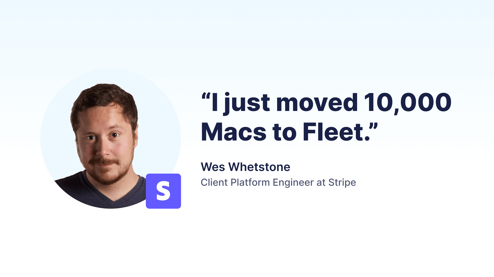

# Free migration from Jamf to Fleet

With Apple's release of macOS 26.0, Fleet helps organizations migrate from Jamf to Fleet — for free*. Our delivery team handles the complex parts: exporting profiles, translating smart groups, replacing extension attributes, mapping policies, and redeploying apps, so your IT team doesn’t have to.

## How It works

### Seamless device migration

Fleet follows Apple’s supported migration flow for Automated Device Enrollment (ADE). Devices re-enroll automatically, preserving user data and managed apps when possible. Migration deadlines, user notifications, and “await configuration” states are all handled in accordance with Apple's best practices. 

>**Note:** seamless migrations with no user interaction are currently supported for Jamf on-prem instances only.)

### Profile & policy replication

- Export `.mobileconfig` profiles from Jamf and re-apply them in Fleet.
- Translate smart groups into Fleet labels. 
- Replace extension attributes with Fleet queries, labels, or policies.
- Map Jamf policies to Fleet policies with automated remediation scripts or package installs.

### Software deployment, simplified

- Sync your Apple VPP apps directly into Fleet.
- Upload and scope custom macOS packages with labels.
- Preserve license continuity and ensure VPP token migration within Apple’s 30-day window.

### Security & compliance first

- FileVault recovery keys are automatically escrowed to Fleet at migration.
- New Activation Lock and security controls are applied automatically during enrollment. 
- Continuous inventory and compliance monitoring.

## Why customers choose Fleet migration

- It's free! Fleet covers migration as part of the onboarding process.
- Reduced IT burden – Fleet’s experts handle prep, mapping, and testing.
- GitOps by default – Everything version-controlled and repeatable.
- Risk-free – Canary testing ensures safety and planning windows before fleet-wide rollout
- Future-Proof – Continuous updates from Apple’s ecosystem and Fleet’s open-source foundation.

\*For qualified enterprise organizations with >500 devices. [Get in touch to submit a request](https://fleetdm.com/contact).

<meta name="articleTitle" value="Free migration from Jamf to Fleet">
<meta name="authorFullName" value="Alex Mitchell">
<meta name="authorGitHubUsername" value="alexmitchelliii">
<meta name="category" value="articles">
<meta name="publishedOn" value="2025-10-06">
<meta name="description" value="Switch from Jamf to Fleet for free. Fleet follows Apple’s new macOS Tahoe 26.0 migration flow for a seamless move.">
<meta name="articleImageUrl" value="../website/assets/images/articles/migrate-to-fleet-800x450@2x.png">
