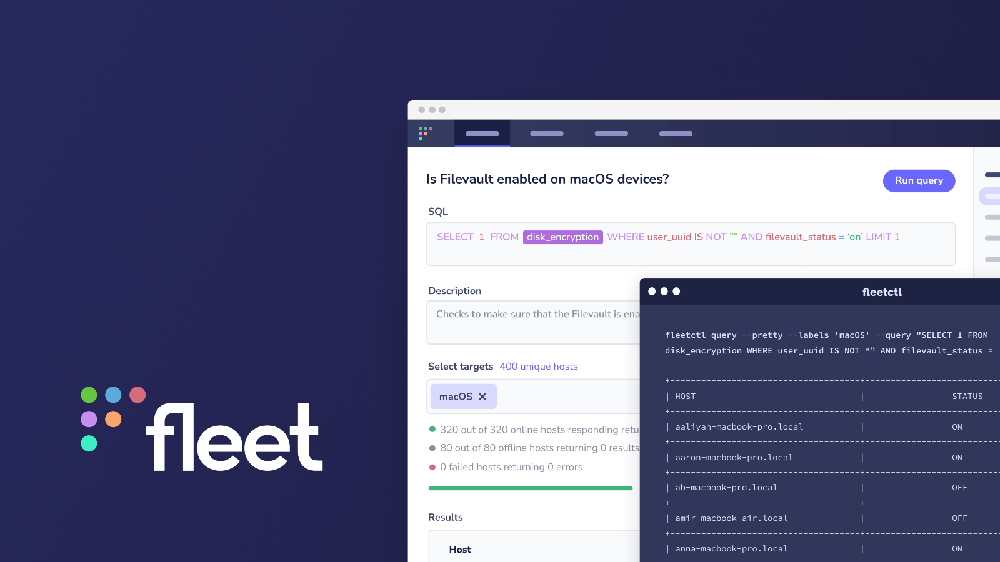

# The next step for Fleet: our $5M seed round 🌱

Eight years ago, I worked with some great minds at Facebook to build the best open source endpoint solution, osquery, together with the open source community. Since then, usage has grown beyond what we could have imagined, and osquery is now used across independent security professionals, startups, and fortune 50 companies to provide cross-platform endpoint visibility for tens of millions of devices.

As osquery usage increased within companies, so did the demand for an open source way to manage and deploy osquery at scale. [We started working on Fleet in 2016](https://fleetdm.com/handbook/company#history) to make it easier and more accessible to use osquery in enterprise environments. After several years as the lead maintainer of Fleet, co-founder and CEO Mike McNeil and I formed Fleet Device Management with a shared vision to build the future of device management. Today we share some exciting news: we’ve received a $5 million seed round of funding from [CRV](https://www.crv.com/), Mike Arpaia, Nico Waisman of [Lyft](https://www.lanacion.com.ar/tecnologia/nicolas-waisman-el-argentino-que-maneja-la-seguridad-informatica-de-lyft-la-competencia-de-uber-nid08102021/), Greg Martin of [Sumo Logic](https://techcrunch.com/2019/11/04/sumo-logic-acquires-jask-to-fill-security-operations-gap/), Jack Naglieri of [Panther Labs](https://www.reuters.com/markets/funds/cloud-security-firm-panther-labs-raises-fresh-funds-14-bln-valuation-2021-12-02/), Ezra Olubi of [Stripe](https://techcrunch.com/2020/10/15/stripe-acquires-nigerias-paystack-for-200m-to-expand-into-the-african-continent/), and Sid Sijbrandij to accelerate our progress.

## Fleet today

We started off building Fleet to solve the most common problems companies face when adopting osquery for endpoint visibility:

- Creating and managing a central osquery server requires build and maintenance time. Fleet is that central management server.
- Figuring out what queries you need to ask a question is time-consuming. Fleet makes this easy
  through an accessible UI and standard query library.
- Installing osquery across your entire device fleet can be challenging. Fleet provides a simple command-line tool for installing the osquery agent without battling certs and config settings.

Today 1.65 million devices are managed by Fleet from companies like Uber, Gusto, Schrodinger, and Dropbox, and we’re just getting started.

## Towards a more open, collaborative future for device management

We often hear that using osquery and Fleet bring IT and security teams closer together: one team learns that another team is using Fleet to assess common IT help issues and realizes their team can also use it to confirm the remote device updates they rolled out have been properly applied to all devices in the organization.

Similarly, Fleet fosters better relationships through providing transparency to both end-users and the IT and security professionals monitoring their devices. This starts with end-users understanding what their employer knows about their devices, building trust, and providing clarity for both parties. In this next stage, we’ll be focused on building more vulnerability management, and policy compliance features to simplify transparent communication and collaboration between IT, security, and end-users even further.

## Free forever, open core

Through developing Fleet in the open, we’ve validated that the spirit of openness and transparency is needed across the device management landscape–something we’re passionate about delivering on. We believe open source is the answer for endpoint visibility. Fleet’s core offering is open source, cross-platform, and developer-friendly, and there will always be a [free plan](http://fleetdm.com/pricing). We think this is a better way to manage computers. (Want to join us? [We’re hiring!](http://fleetdm.com/apply))

<meta name="category" value="announcements">
<meta name="authorGitHubUsername" value="zwass">
<meta name="authorFullName" value="Zach Wasserman">
<meta name="publishedOn" value="2022-01-20">
<meta name="articleTitle" value="The next step for Fleet: our $5M seed round 🌱">
<meta name="articleImageUrl" value="../website/assets/images/articles/from-osquery-to-fleet-planting-the-seed-cover-800x450@2x.png">