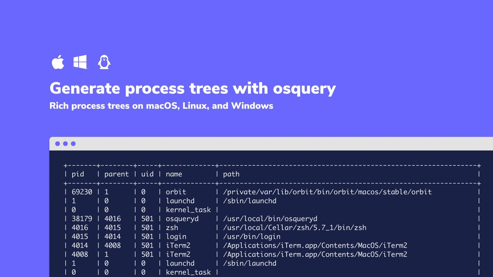

# Generate process trees with osquery

## Rich process trees on macOS, Linux, and Windows



Using advanced SQL syntax, it is possible to generate process trees in osquery similar to those generated by the `pstree` utility. With osquery, the generated trees can be extended to include additional information that can aid analysis.

Below is the basic structure of the query:

```
WITH target_procs AS (
 SELECT * FROM processes WHERE name = 'osqueryd'
)
SELECT *
FROM (
 WITH recursive parent_proc AS (
 SELECT * FROM target_procs
 UNION ALL
 SELECT p.* FROM processes p JOIN parent_proc pp ON p.pid = pp.parent
 WHERE pp.pid != pp.parent
 ORDER BY pid
 )
 SELECT pid, parent, uid, name, path
 FROM parent_proc
);
```

Running this query in `osqueryi` will generate results like:


```
+-------+--------+-----+-------------+---------------------------------------------------------------+
| pid   | parent | uid | name        | path                                                          |
+-------+--------+-----+-------------+---------------------------------------------------------------+
| 69230 | 1      | 0   | orbit       | /private/var/lib/orbit/bin/orbit/macos/stable/orbit           |
| 1     | 0      | 0   | launchd     | /sbin/launchd                                                 |
| 0     | 0      | 0   | kernel_task |                                                               |
| 38179 | 4016   | 501 | osqueryd    | /usr/local/bin/osqueryd                                       |
| 4016  | 4015   | 501 | zsh         | /usr/local/Cellar/zsh/5.7_1/bin/zsh                           |
| 4015  | 4014   | 501 | login       | /usr/bin/login                                                |
| 4014  | 4008   | 501 | iTerm2      | /Applications/iTerm.app/Contents/MacOS/iTerm2                 |
| 4008  | 1      | 501 | iTerm2      | /Applications/iTerm.app/Contents/MacOS/iTerm2                 |
| 1     | 0      | 0   | launchd     | /sbin/launchd                                                 |
| 0     | 0      | 0   | kernel_task |                                                               |
+-------+--------+-----+-------------+---------------------------------------------------------------+
```

## How it Works

This query makes use of [SQLite Common Table Expressions (CTEs)](https://sqlite.org/lang_with.html) to recursively generate the requested data. Below we will examine the components of the query:

```
WITH target_procs AS (
 SELECT * FROM processes WHERE name = 'osqueryd'
)
SELECT *
FROM (
 WITH recursive parent_proc AS (
 SELECT * FROM target_procs
 UNION ALL
 SELECT p.* FROM processes p JOIN parent_proc pp ON p.pid = pp.parent
 WHERE pp.pid != pp.parent
 ORDER BY pid
 )
 SELECT pid, parent, uid, name, path
 FROM parent_proc
);
```

- Line 2 — Set the target process(es) that the query will generate trees for.
- Line 10 — Stop the recursion when the process parent is the process itself. This prevents infinite recursion on macOS and Linux for the process `0`.
- Line 11 — Order the evaluation of recursive rows by the `pid`. This generally results in the process trees being output in the correct order (though we cannot guarantee that the ordering will be correct, we will get results for all processes in the trees). On Windows it can be better to `ORDER BY start_time` as `pids` are not increasing.
- Line 13 — Choose the columns to retrieve from the results. In this example we select a limited set of columns to ease interpretation of the results.

## Extend the Concept

There are a number of ways that this query can be extended to address different needs.

### Retrieve More Details

Change the `SELECT` statement in line 13 to retrieve a different set of results. A simple case could be changing to `SELECT *` to get all the columns from the `processes` table.

A more complex scenario could be to generate the hashes of the running binaries:

```
WITH target_procs AS (
 SELECT * FROM processes WHERE name = 'osqueryd'
)
SELECT *
FROM (
 WITH recursive parent_proc AS (
 SELECT * FROM target_procs
 UNION ALL
 SELECT p.* FROM processes p JOIN parent_proc pp ON p.pid = pp.parent
 WHERE pp.pid != pp.parent
 ORDER BY pid
 )
 SELECT pid, parent, uid, name, path, md5
 FROM parent_proc LEFT JOIN hash USING (path)
);
```

### Target Different Processes

Change the query on line 2 to generate trees for a different set of processes. One option would be `SELECT * FROM processes WHERE pid = 1234` if we know the pid of the process we are interested in. Targeting processes by attributes that remain consistent on different machines (like `name`, unlike `pid`) is a useful technique to ensure that live queries across hosts are successful.

This can also be extended using the full power of osquery. For example, we might want the process tree of every process bound to a port:

```
WITH target_procs AS (
    SELECT DISTINCT processes.*
    FROM processes JOIN listening_ports USING (pid)
    WHERE port != 0
)
SELECT *
FROM (
    WITH recursive parent_proc AS (
        SELECT * FROM target_procs
        UNION ALL
        SELECT p.* FROM processes p JOIN parent_proc pp ON p.pid = pp.parent
        WHERE pp.pid != pp.parent
        ORDER BY pid
    )
    SELECT pid, parent, uid, name, path
    FROM parent_proc
);
```

## Wrapping Up
With this query as a building block, osquery provides the capability to generate rich process trees. Consider using this with an osquery TLS server such as [Fleet](https://fleetdm.com/) to examine this information on multiple machines at once.


<meta name="category" value="guides">
<meta name="authorGitHubUsername" value="zwass">
<meta name="authorFullName" value="Zach Wasserman">
<meta name="publishedOn" value="2020-03-17">
<meta name="articleTitle" value="Generate process trees with osquery">
<meta name="articleImageUrl" value="../website/assets/images/articles/generate-process-trees-with-osquery-cover-700x393@2x.jpeg">
