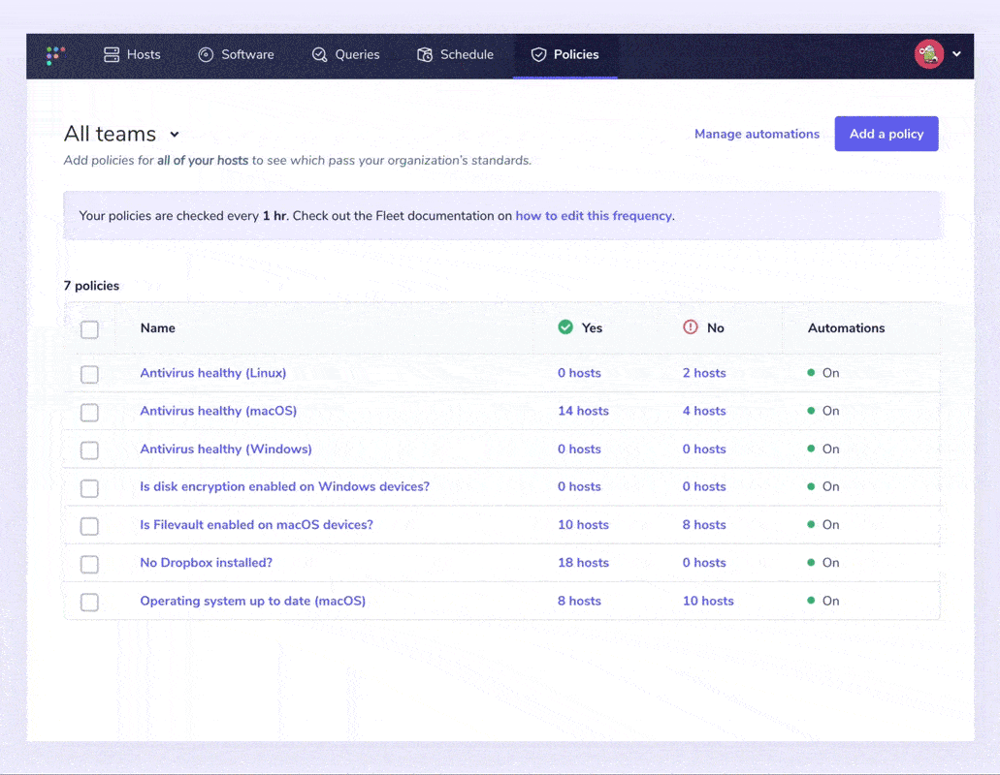

# Get and stay compliant across your devices with Fleet.

It’s essential for organizations to protect their systems and information — especially when customer data could be exposed. Security and IT teams are required to develop internal processes and controls and comply with specific laws and regulatory standards related to their industry. These controls and standards can often change, as do the threats and vulnerabilities they are serving to protect, so setting up and staying compliant across your devices can be tricky — even more so for organizations with complicated infrastructures, or workforces spread out across the globe.

In this article, we’ll explore each of these areas and look at how open source tools like [osquery](https://osquery.io/) and Fleet can help organizations get and stay compliant.

## What are internal processes and controls?

Internal controls are systems designed to safeguard internal processes and reduce risk to an acceptable level for your business. These controls can reduce the risk of external audits and protect against threats. It’s important to balance against excessive control so as not to harm productivity.

Controls can be *preventative*, *detective*, or *corrective*. While it’s nice to prevent issues, this will never be 100% successful, so a [good strategy](https://fleetdm.com/handbook/security#how-we-protect-end-user-devices) will ensure that problems are also detected and corrected.

Some examples of controls that most people are familiar with:

- Having a set of information security policies and standards
- Planning for disaster recovery and testing that plan
- Quarterly access revalidation
- Onboarding and offboarding checklists
- Password requirements on accounts
- Backing up to offline destinations

## Who is responsible?

Company leadership is responsible for determining a plan for managing risk and ensuring compliance. A large bank might have an internal audit team with sub-teams focusing on IT risk, investment risk, etc. Other companies might hire a Chief Information Security Officer (and a security team) that performs a risk assessment and develops a series of internal controls and policies to mitigate them.

## Beyond internal processes and controls: industry standards

Although companies set most of their controls and processes, they also have to comply with laws and industry regulations and then design internal controls to comply with these external requirements.

The most well-known standards include:

**HIPAA** — A US Federal law that governs the privacy and security of Personal Health Information (PHI).

**PCI DSS (Payment Card Industry Data Security Standard)** — A set of standards that organizations using credit cards must follow. It’s not a law, but if you’re an organization that must accept credit card payment, it might as well be.

**SOC 2** — A set of criteria developed by the American Institute of CPAs (AICPA) for organizations managing customer data. It’s often used by cloud providers looking for a way to demonstrate that they have basic security controls in place.

**GDPR** — A law enacted to protect personal privacy information and user data in the EU and UK.

**CIS** — These are best-practice cybersecurity standards for various IT systems and products.

**ISO 27001** — This is very similar to SOC 2, but for Europe.

## What does achieving (and maintaining) compliance mean?

Once a plan for internal processes and controls has been set, a system for monitoring and checking device status needs to exist across the company. Typically, it’s a checklist that lets the security team understand that the device is “compliant” and passing all policies. Often, a consultant can help build this checklist.

Achieving initial compliance can be an easy task. But maintaining it over time can prove challenging.

A team might provision 30 new servers. Then 10 new employees join the company and get laptops. An engineer switches to a Linux laptop for some of their projects. People leave the organization, developers install new packages on servers, and employees install new apps to be more productive. Sometimes, just for fun, employees even uninstall your monitoring tools.

Maintaining compliance is an ongoing battle, and as such, you’ll need a way to ensure it every day. But how do you do that?

Do you manually check every one of your servers and laptops one by one? Probably not. Ideally, you have a way to quickly glance and see where you stand on the compliance checklists every day.

## Meet compliance goals with Fleet

Whether you’re checking the device status of a small team of devices, or a fleet of thousands, add them to Fleet quickly and gain insight into their status and compliance.

### Fleet Policies

Fleet policies, built on osquery, are a great way to quickly monitor your compliance goals by asking yes/no questions about your devices. For example, suppose one of your defined controls ensures that all of your Mac devices have the latest version of macOS installed. In that case, a policy can be created to quickly and easily return that information from all your devices — no matter the operating system.

At Fleet, we use policies on our own devices to track:

- Is antivirus healthy?
- Is automatic login disabled?
- Is full disk encryption enabled?
- Is Gatekeeper enabled (macOS)?
- Is MDM enrolled?
- Is secure keyboard entry for Terminal.app enabled (macOS)
- Is the operating system up to date (macOS)
- Is system Integrity Protection enabled (macOS)

### Configure and send webhook automations

Fleet adds the ability to automate failing host policies. A ticket is automatically created if there is any deviation from compliance. i.e., if the compliance checklist isn’t 100% true for all servers and laptops.

Users can specify a webhook URL to send policy alerts. These alerts include all devices that answered “No” to a policy so that a user can easily create a support ticket and resolve each device.

Alongside policies, detected vulnerabilities can be automated when enabled. Users can tell Fleet to reach out when a common vulnerability and exposure (CVE) is detected. Then the process of notifying device owners or creating a ticket to track the vulnerability is also automated.

To keep signal noise to a minimum, Fleet only sends notifications for new vulnerabilities published within the last two days.

Thanks to automation and open source tools like osquery and Fleet, compliance is easier than ever before. Fleet policies help your security and IT teams feel confident that devices are passing your organization’s standards for compliance.

---

<meta name="category" value="security">
<meta name="authorFullName" value="Drew Baker">
<meta name="authorGitHubUsername" value="Drew-P-drawers">
<meta name="publishedOn" value="2022-03-09">
<meta name="articleTitle" value="Get and stay compliant across your devices with Fleet.">
<meta name="articleImageUrl" value="../website/assets/images/articles/get-and-stay-compliant-across-your-devices-with-fleet-cover-1600x900@2x.jpg">
