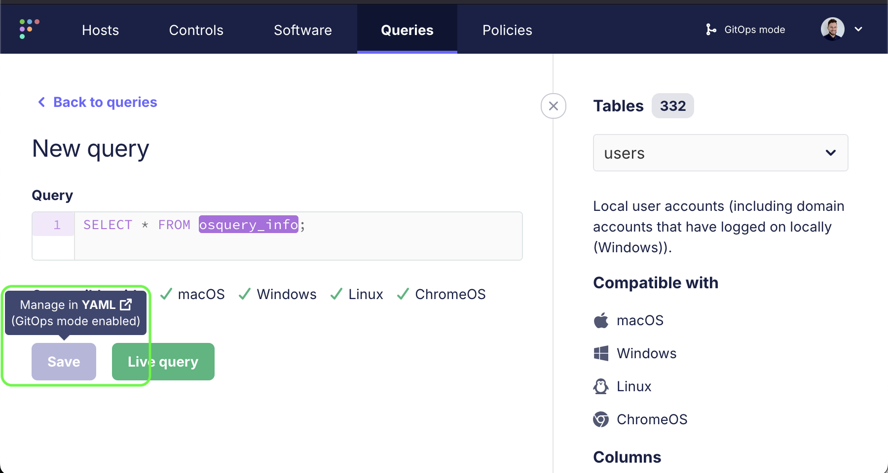
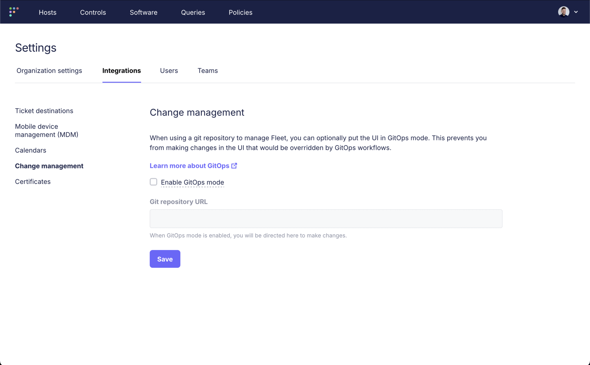

# GitOps mode

GitOps mode helps users avoid unexpected changes by preventing manual updates of [GitOps-configurable features](https://fleetdm.com/docs/configuration/yaml-files) in the UI.

For example, if a user in the Fleet UI adds a query and then GitOps runs, the query will be deleted.
GitOps mode helps avoid this by presenting the user from saving or editing the query in the first place
(though does still allow running an ad-hoc live query):

## Enabling
To turn GitOps mode on or off, navigate to **Settings** > **Integrations** > **Change management**:

## Still available

GitOps mode prevents the UI user from editing [GitOps-configurable features](https://fleetdm.com/docs/configuration/yaml-files). They will still be able to, for example:
- Read any data presented in the UI
- Add and edit users
- Add and edit labels
- Run live queries

## More
<!-- TODO - update to link to Allen's article, uncomment -->
<!-- - [Why use GitOps to configure Fleet?](https://www.example.com) -->
- [Preventing Mistakes with GitOps](https://fleetdm.com/guides/preventing-mistakes-with-gitops)

<meta name="articleTitle" value="GitOps mode">
<meta name="authorFullName" value="Jacob Shandling">
<meta name="authorGitHubUsername" value="jacobshandling">
<meta name="publishedOn" value="2025-03-21">
<meta name="category" value="guides">
<meta name="description" value="Help users avoid unexpected changes by preventing manual updates of GitOps-configurable features">
