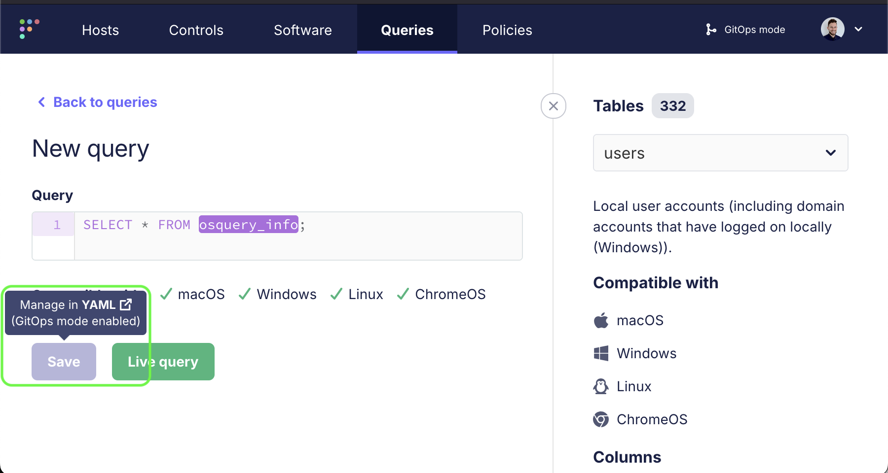
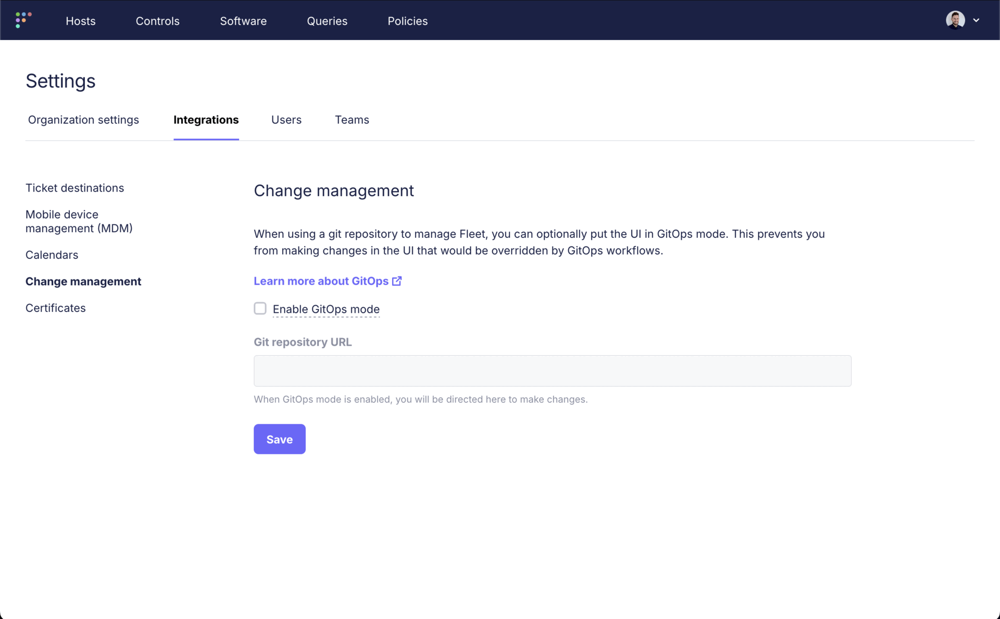

# GitOps mode

_Available in Fleet Premium_

GitOps mode helps users avoid unexpected changes by preventing manual updates of [GitOps-configurable features](https://fleetdm.com/docs/configuration/yaml-files) in the UI.

For example, if a user in the Fleet UI adds a report and then GitOps runs, the report will be deleted.
GitOps mode helps avoid this by preventing the user from saving or editing the report in the first place:

## Enabling
To turn GitOps mode on or off, navigate to **Settings** > **Integrations** > **Change management**:

## Exceptions

Exceptions let you opt a resource out of GitOps mode, so you can manage that resource in the Fleet UI while everything else stays in git. Under **Settings** > **Integrations** > **Change management**, you can add an exception for labels, software, or enroll secrets.

When a resource has an exception, three things happen:
- The Fleet UI stays editable for that resource, even with GitOps mode on.
- `fleetctl gitops` leaves your existing labels, software, or enroll secrets intact. Without the exception, omitting the key deletes them.
- `fleetctl gitops` fails if your YAML includes that resource's key. The error tells you to remove the key or disable the exception. This keeps the UI and git from overwriting each other.

Exceptions apply to `fleetctl gitops` whether or not GitOps mode is turned on.

Fleet enables the enroll secrets exception by default.

## Still available

GitOps mode prevents the UI user from editing [GitOps-configurable features](https://fleetdm.com/docs/configuration/yaml-files). They will still be able to, for example:
- Read any data presented in the UI
- Add and edit users
- Run live queries
- Add and edit labels, software, or enroll secrets, if that resource has an [exception](#exceptions)

## More
<!-- TODO - update to link to Allen's article, uncomment -->
<!-- - [Why use GitOps to configure Fleet?](https://www.example.com) -->
- [Preventing Mistakes with GitOps](https://fleetdm.com/guides/preventing-mistakes-with-gitops)

<meta name="articleTitle" value="GitOps mode">
<meta name="authorFullName" value="Jacob Shandling">
<meta name="authorGitHubUsername" value="jacobshandling">
<meta name="publishedOn" value="2025-03-21">
<meta name="category" value="guides">
<meta name="description" value="Help users avoid unexpected changes by preventing manual updates of GitOps-configurable features">
