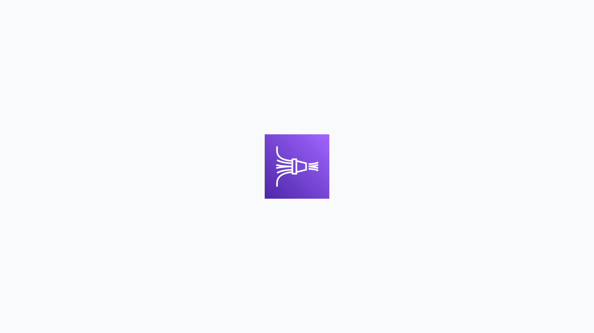
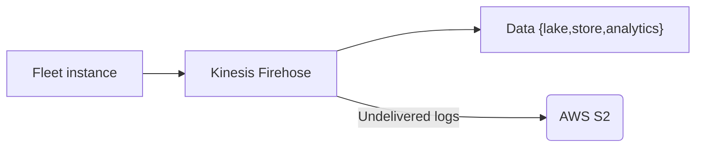

# How to configure logging destinations

Efficiently streaming and managing data is crucial for cloud customers. Amazon Web Services (AWS) provides robust tools for this purpose, with AWS Kinesis Date Firehose and Kinesis Data Streams being popular choices. This guide will help you set up the necessary infrastructure and configure your AWS environment to stream data to destinations like Sumo Logic and Splunk with Fleet.

With Fleet, you’re able to send with Automation to your logging destination:

* [Osquery status logs](https://osquery.readthedocs.io/en/stable/deployment/logging/#status-logs)
* [Osquery results logs](https://osquery.readthedocs.io/en/stable/deployment/logging/#Results-logs)
* [Fleet audit logs](https://fleetdm.com/docs/using-fleet/audit-logs)

### Choosing your destination mechanism

AWS offers two primary options for streaming data: Kinesis Data Streams and Kinesis Data Firehose. Select the one that best fits your needs:

* **Kinesis Data Streams:** Ideal for real-time data processing with low latency, Kinesis Data Streams is an AWS service for real-time data streaming. It enables you to continuously capture gigabytes of data per second from hundreds of thousands of sources, such as website clickstreams, database event streams, financial transactions, and social media feeds. This data can then be processed and analyzed in real-time.
* **Kinesis Data Firehose:** Kinesis Data Firehose is a fully managed service that simplifies loading streaming data into data lakes, data stores, and analytics services. It can capture, transform, and load streaming data into AWS services like Amazon S3, Amazon Redshift, and Amazon Elasticsearch Service, as well as third-party services like Splunk and Sumo Logic.

### Step 1: Set Up the required infrastructure

Before streaming data, ensure that you have the necessary infrastructure. The resources might be owned by another team or group in your organization:

1. **IAM Role ARN of the Fleet service**: The ARN (Amazon Resource Name) of the IAM (Identity and Access Management) role will be assuming the IAM role defined in this module to gain the permissions required to write to the Kinesis Data Stream(s). For example, this role might permit Fleet to write data from your Kinesis stream.

2. **IAM Role ARN for assumption**: The role that the Fleet service will assume, granting it the necessary permissions. This is typically used to delegate access control, enabling the Fleet service to perform actions on your behalf.

3. **ExternalId**: This is optional but recommended to enhance security by ensuring that only trusted entities can assume the role. The ExternalId helps prevent unauthorized access by adding an extra layer of security. More details can be found in the [AWS IAM User Guide](https://docs.aws.amazon.com/IAM/latest/UserGuide/id_roles_create_for-user_externalid.html).

**Note for Cloud Customers:**

1. Pick your destination mechanism (Kinesis/Firehose).

2. Set up the required infrastructure:

   - Requirement: IAM Role ARN of the Fleet service.

   - Supply back to Fleet Infrastructure/CSx groups:

     - IAM Role ARN of the role the Fleet service will assume.

     - Optionally, ExternalId ([more info](https://docs.aws.amazon.com/IAM/latest/UserGuide/id_roles_create_for-user_externalid.html)).

     - Specifics of destination configuration ([Kinesis](https://github.com/fleetdm/fleet/blob/main/terraform/addons/byo-kinesis-logging-destination/target-account/README.md) / [Firehose](https://github.com/fleetdm/fleet/blob/main/terraform/addons/byo-firehose-logging-destination/target-account/README.md)):

       - Stream name(s)

       - Region

### Step 2: Configure your destination

#### For Sumo Logic

Sumo Logic supports data ingestion via HTTP, making it a reliable choice for log management and analytics. To set up Sumo Logic as your Firehose destination:

1. **Create a Sumo Logic hosted collector/receiver**: This enables Sumo Logic to pull data from the stream.
2. **Set up Firehose**: Follow the steps outlined in the[ AWS documentation](https://docs.aws.amazon.com/firehose/latest/dev/create-destination.html?icmpid=docs_console_unmapped#create-destination-sumo-logic) to configure Firehose to send data to Sumo Logic.
3. **Configure Sumo Logic**: Refer to the detailed steps provided by Sumo Logic in their[ documentation](https://help.sumologic.com/docs/send-data/hosted-collectors/amazon-aws/aws-kinesis-firehose-logs-source/).

#### For Splunk

Splunk is a powerful platform for searching, monitoring, and analyzing machine-generated big data. Here’s how to integrate it with Firehose:

1. **Set up Firehose**: Use the AWS guide to configure your Firehose delivery stream for Splunk as a destination. The process involves specifying the Splunk endpoint and authentication details. Detailed instructions are available in the [AWS Firehose documentation](https://docs.aws.amazon.com/firehose/latest/dev/create-destination.html?icmpid=docs_console_unmapped#create-destination-splunk).
2. **Configure Splunk**: Follow the [Splunk documentation](https://docs.splunk.com/Documentation/AddOns/released/Firehose/RequestFirehose) to ensure Splunk is set to receive data from Firehose. This step involves setting up the necessary inputs and configuring Splunk to handle incoming data.
3. **Firehose to Splunk configuration**: Finalize the setup by configuring Firehose to send data to Splunk, following the guidelines in the [Splunk documentation](https://docs.splunk.com/Documentation/AddOns/released/Firehose/ConfigureFirehose).

### Conclusion

By carefully setting up your IAM roles and configuring your data streams, you can efficiently stream data to platforms like Sumo Logic and Splunk using AWS Kinesis Firehose. This setup simplifies data management and enhances your ability to analyze and act on your data in real-time, in S3, or for other teams and tools such as your SIEM platforms and CMS. For more detailed steps, refer to the respective documentation for Sumo Logic and Splunk.

<meta name="category" value="guides">
<meta name="authorFullName" value="Grant Bilstad">
<meta name="authorGitHubUsername" value="pacamaster">
<meta name="publishedOn" value="2024-06-28">
<meta name="articleTitle" value="How to configure logging destinations">
<meta name="articleImageUrl" value="../website/assets/images/articles/how-to-configure-logging-destinations-1600x900@2x.jpg">
