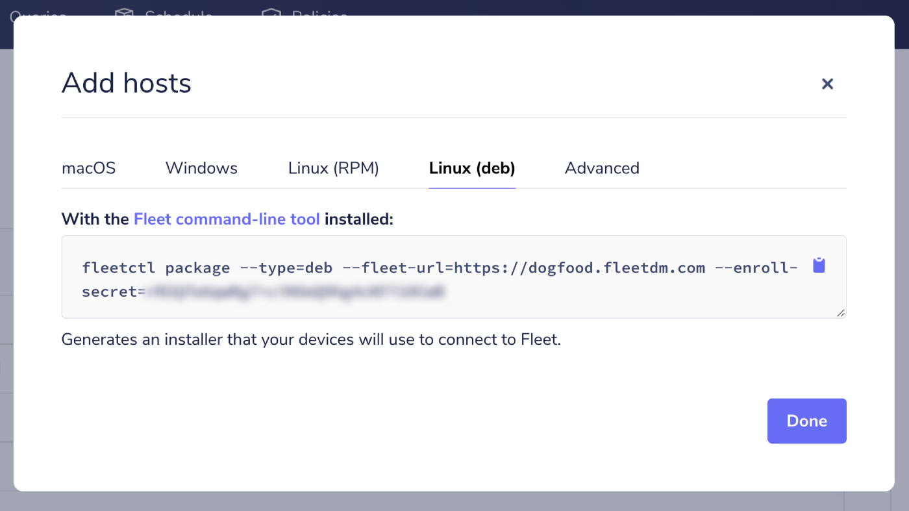

# How to install osquery and enroll Linux devices into Fleet

> **Archived** While still usable, this guide has not been updated recently. See the [Enroll hosts](http://fleetdm.com/guides/enroll-hosts) guide.

Here, we will cover enrolling Linux devices to an existing Fleet server. If you don’t have a Fleet
server configured already, check out [Deploying Fleet on Render](https://fleetdm.com/deploy/deploying-fleet-on-render). If you’re still getting to know Fleet and would like to skip the server setup process and try Fleet, you can [run Fleet in a preview environment](https://fleetdm.com/try-fleet/register).

## Prerequisites

1. Access to an existing Fleet server
2. The `fleetctl` command line tool

If you don’t already have it, `fleetctl` can be installed via npm by running the following command:

```
npm i -g fleetctl
```

After the above command has run successfully, you can confirm that you now have the fleetctl command-line tool by running:

```
fleetctl --version
```

The above command should return something that looks a bit like this:

```
fleetctl — version 4.8.0
branch: HEAD
revision: 09654d77eedbf9ed181bc8188a3d2be0324b29a5
build date: 2021–12–31
build user: runner
go version: go1.17.2
```

If you would rather not install node/npm/fleetctl directly on the host, that’s okay. You can generate the installer (see ‘Generate the installer’ below) on any computer with fleetctl installed. Just make sure you select the correct Operating System for the host you want to enroll.

Once the installer has been created, you can bring it over to the host you want to enroll using a copy you place on a thumb drive or a file-sharing service. Once the installer is on the host, you can continue the ‘Run the installer’ steps.

## Generate the installer

You can generate an osquery installer using `fleetctl` for Windows, macOS, and Linux distributions. For this article, we will assume you are enrolling a Linux device. To generate an osquery installer for a different OS, check out the guides for [macOS](https://fleetdm.com//guides/how-to-install-osquery-and-enroll-macos-devices-into-fleet) and [Windows](https://fleetdm.com//guides/how-to-install-osquery-and-enroll-windows-devices-into-fleet).

Installers are generated using the fleetctl package command. The full command looks like this:

```
fleetctl package --type=<type> --fleet-url=<server url> --enroll-secret=<enroll secret>
```

Thankfully, you don’t need to know the `type`, `server url`, or `enroll secret` off the top of your head. We recommend grabbing the full command from the Fleet UI. You can get that by clicking “Add Hosts” on the host’s page, selecting the OS for your host, and clicking the clipboard icon to copy the command with all of your data already populated (`enroll secret` hidden in the image below). Even if you know all that information, copying the command can save some typo woes. The enroll secret is long and random.

Make sure you choose the correct package type for your Linux distribution. Red Hat and SUSE distributions will use RPM, and Debian based distributions (like Ubuntu) will use DEB. If you aren’t sure which to use, Wikipedia has a [categorized list](https://en.wikipedia.org/wiki/List_of_Linux_distributions).



*Even if you know all of that information, getting the exact command from the Fleet UI can save some typo woes. The enroll secret is long and random.*

Next, head over to your terminal (or the magic box where you can run commands to make cool stuff happen), paste the copied command, and then hit enter and watch while `fleetctl` does its thing.

Once `fleetctl` has finished creating the installer, you can see the location of the installer package in the success message:

```
Success! You generated an osquery installer at /Users/currentUser/fleet-osquery.pkg
```

## Run the installer

You can run the installer using your package manager. Double click on the installer in your file manager to run the installer or use the terminal.

For DEB, run:

```
sudo apt install ./fleet-osquery.deb
```

For RPM, run:

```
yum install fleet-osquery.rpm
```

> Your file name may be slightly different. Check the success message for the file’s name and exact location.

## Enrolling more than one host

The installer created by `fleetctl` isn’t specific to one host. If you have multiple hosts you’d like to enroll that run the same OS, you can create one installer and copy it to a thumb drive (or upload it to cloud storage), then copy (or download) the installer to each host you want to enroll and run it.

If you’re managing an enterprise environment, you will likely have a deployment tool like Munki, Jamf Pro, Chef, Ansible, or Puppet to deliver software to your devices. Using your software management tool of choice, you can distribute your osquery installer and add all your devices to Fleet.

<meta name="category" value="guides">
<meta name="authorFullName" value="Kathy Satterlee">
<meta name="authorGitHubUsername" value="ksatter">
<meta name="publishedOn" value="2022-03-19">
<meta name="articleTitle" value="How to install osquery and enroll Linux devices into Fleet">
<meta name="articleImageUrl" value="../website/assets/images/articles/install-osquery-and-enroll-linux-devices-into-fleet-cover-1600x900@2x.jpg">
