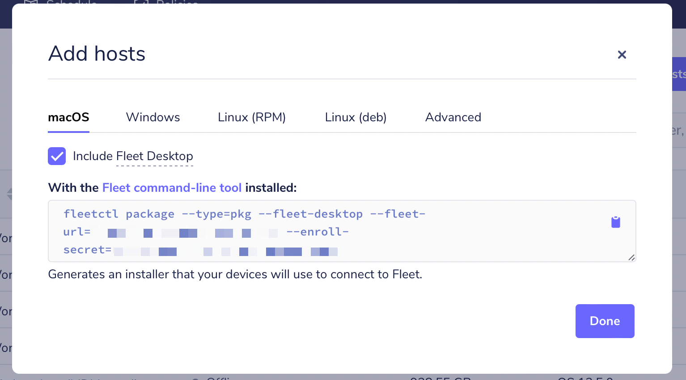

# How to install osquery and enroll macOS devices into Fleet

> **Archived** While still usable, this guide has not been updated recently. See the [Enroll hosts](http://fleetdm.com/guides/enroll-hosts) guide.

Here, we will cover enrolling macOS devices to an existing Fleet server. If you don’t have a Fleet
server configured already, check out [Deploying Fleet on Render](https://fleetdm.com/deploy/deploying-fleet-on-render). If you’re still getting to know Fleet and would like to skip the server setup process and try Fleet, you can [run Fleet in a preview environment](https://fleetdm.com/try-fleet/register).

## Prerequisites

1. Access to an existing Fleet server
2. The `fleetctl` command line tool

If you don’t already have it, `fleetctl` can be installed via npm by running the following command:

```
npm i -g fleetctl
```

After the above command has run successfully, you can confirm that you now have the `fleetctl` CLI tool by running:

```
fleetctl --version
```

This should return an output similar to the example below:

```
fleetctl.exe - version 4.8.0
  branch:  HEAD
  revision:  09654d77eedbf9ed181bc8188a3d2be0324b29a5
  build date:  2021-12-31
  build user:  runner
  go version:  go1.17.2
```

> You can generate an osquery installer using `fleetctl` for macOS on Windows and even Linux distributions, but for this article we are assuming generating on a macOS device. To generate an osquery installer for a different OS, check out the guides for [Windows](https://fleetdm.com//guides/how-to-install-osquery-and-enroll-windows-devices-into-fleet) and [Linux](https://fleetdm.com//guides/how-to-install-osquery-and-enroll-linux-devices-into-fleet).

## Installing osquery

Head to the Fleet UI **Hosts** page and click the **"Add hosts"** button. From the pop-up, choose the type of installer you want to generate. Make sure you are on the **"macOS"** tab and click on the clipboard icon to copy the installation command for macOS.


*Generate installer for osquery on macOS*

Head over to your command line, paste the copied command, and then hit enter.

Once `fleetctl` has finished creating your osquery installer, it will produce an installer file called `fleet-osquery.pkg` in your current directory, and display instructions on how to proceed.

## Running the installer

Double-click the installer and follow the guided steps to successfully install osquery on your macOS device and enrol it onFleet!

Alternatively, you can run open `fleet-osquery.pkg` from your command line to launch the installer.

## Deploying at scale?
Fleet makes it easy to install osquery and enrol macOS devices with fleetctl. If you’re managing an enterprise environment with multiple hosts, you likely have an enterprise deployment tool like [Munki](https://www.munki.org/munki/), [Jamf Pro] (https://www.jamf.com/products/jamf-pro/), [Chef](https://www.chef.io/), [Ansible](https://www.ansible.com/), or [Puppet](https://puppet.com/) to deliver software to your hosts. You can distribute your osquery installer and add all your devices to Fleet using your software management tool of choice.

<meta name="category" value="guides">
<meta name="authorFullName" value="Kelvin Omereshone">
<meta name="authorGitHubUsername" value="dominuskelvin">
<meta name="publishedOn" value="2022-01-13">
<meta name="articleTitle" value="How to install osquery and enroll macOS devices into Fleet">
<meta name="articleImageUrl" value="../website/assets/images/articles/install-osquery-and-enroll-macos-devices-into-fleet-cover-1600x900@2x.jpg">
