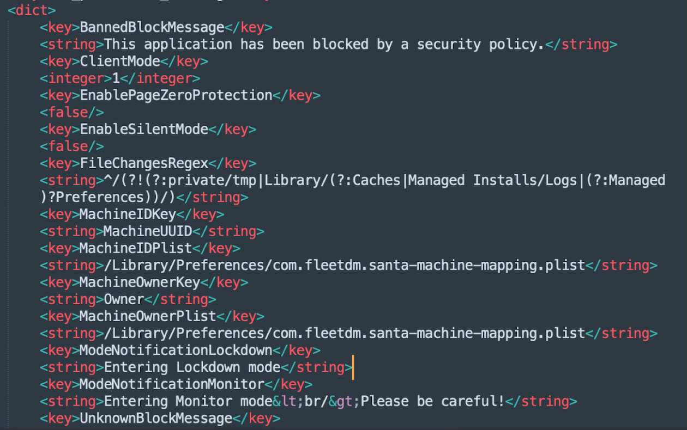
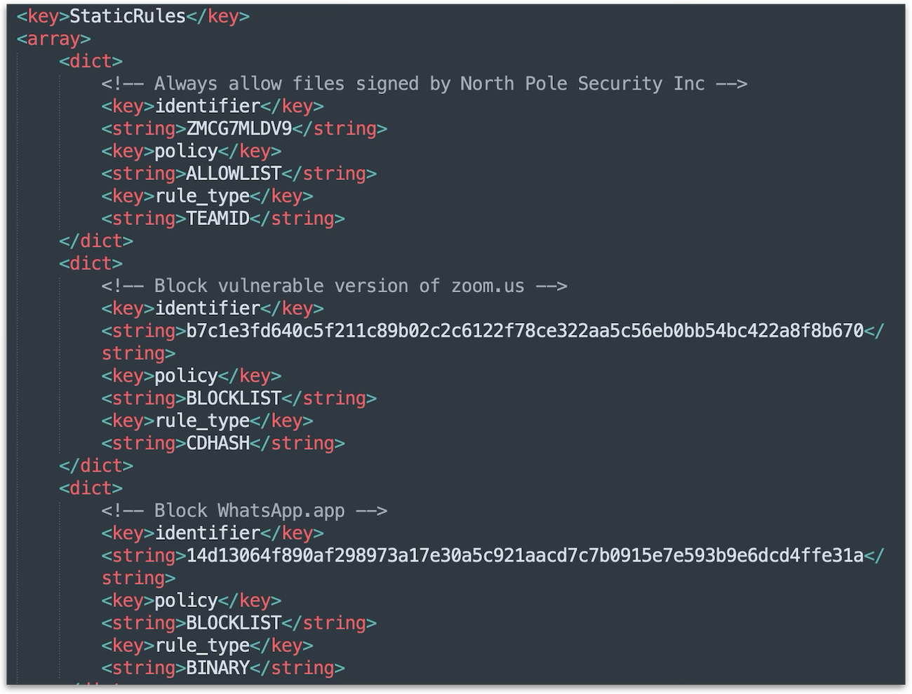
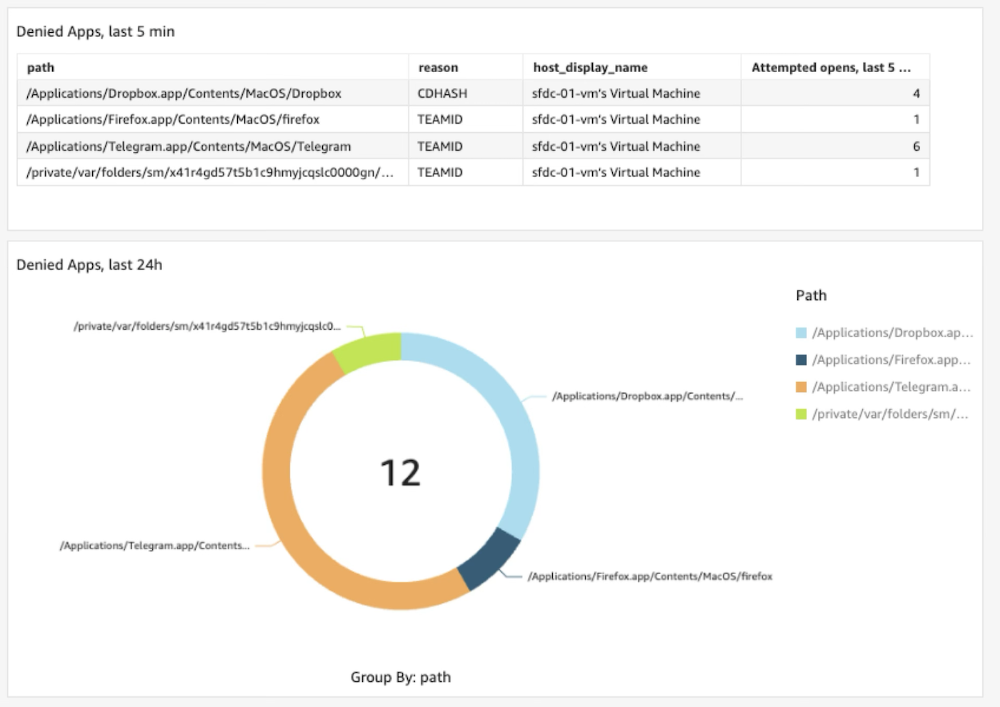
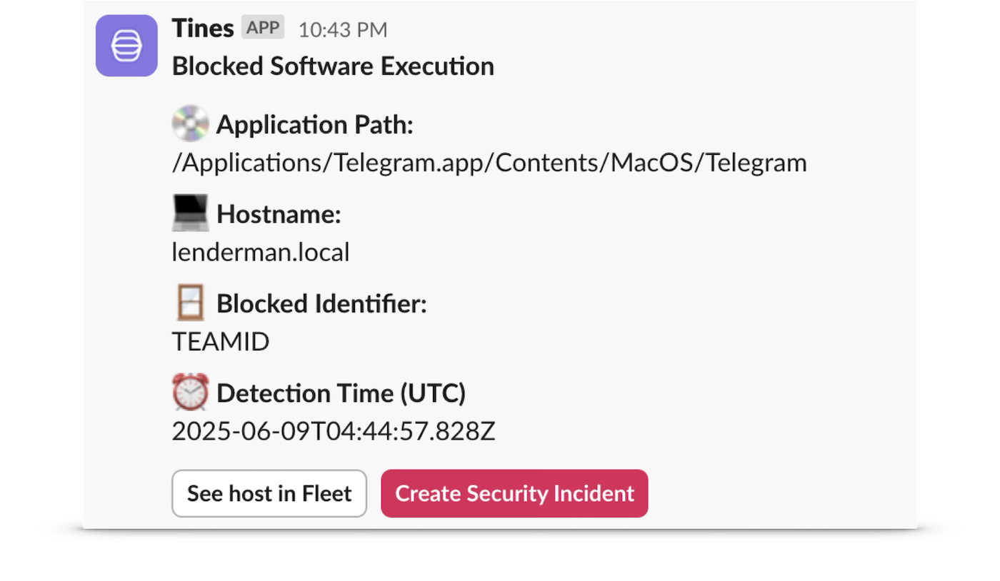
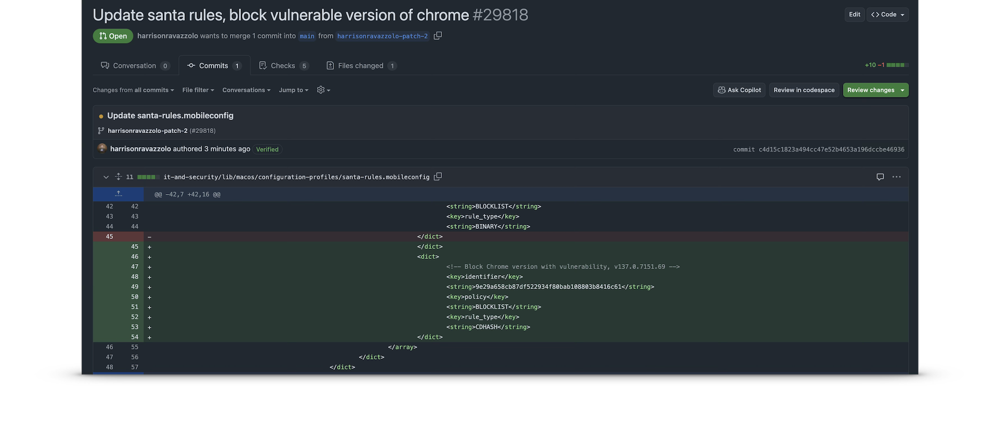

# How we deployed Santa at Fleet

### Links to article series:

- Part 1: [Deploy Santa with Fleet GitOps and skip the sync server](https://fleetdm.com/articles/deploy-santa-with-fleet-gitops-and-skip-the-sync-server)
- Part 2: How we deployed Santa at Fleet

Here's a real-world example of deploying Santa with the Fleet GitOps approach that we are using internally:

**Step 1: Deploy the Santa app via Fleet GitOps**

Santa is a [Fleet-maintained app](https://fmalibrary.com/) making deployment easy. Alternatively, you can use our deployment YAML file: https://github.com/fleetdm/fleet/blob/main/it-and-security/lib/macos/software/santa.yml

Either method allows the Santa app to be installed on a test device group through self service. This can be changed to fit your needs, for example, by using automatic deployment instead of self service or deploying to multiple labels. 

**Step 2: Deploy the Santa configuration**

Santa Configuration Profile: https://github.com/fleetdm/fleet/blob/main/it-and-security/lib/macos/configuration-profiles/santa-configuration.mobileconfig

Santa rules Configuration Profile: https://github.com/fleetdm/fleet/blob/main/it-and-security/lib/macos/configuration-profiles/santa-rules.mobileconfig

Our suggested best practice is to deploy two Configuration Profiles: one for managing the Santa app configuration and the other for managing Santa rules. Keeping the two configurations modular and separate minimizes the risk of Santa rules changes from interfering with the app config.

_Santa configuration_

_Santa rules_

**Step 3. Deploy Santa Extensions**

Policy to check if extensions exist: https://github.com/fleetdm/fleet/blob/main/it-and-security/lib/macos/policies/install-santa-extension.yml 

Script to install the extensions: https://github.com/fleetdm/fleet/blob/main/it-and-security/lib/macos/scripts/install-santa-extension.sh

We chose to deploy these via policy automation since the Santa extensions don't exist natively in Fleet. We have a policy that checks for the existence of the Santa extension. If it is not found, Fleet will immediately run a remediation script that handles the download and configuration of fleetd to start using the extension.

**Step 4. Collect Santa Events**

Collect Santa denied logs: https://github.com/fleetdm/fleet/blob/main/it-and-security/lib/macos/queries/collect-santa-denied-logs.yml

Here we are collecting every time a device attempts to open a blocklisted app. These logs can then be collected in our SIEM or used to fire a webhook to alert us via Slack.

_SIEM dashboard_

_Slack message_

## The GitOps advantage

_Pull Request adding an additional rule_

By leveraging GitOps principles through Fleet, Santa management becomes:

- **Version Controlled:** Every rule change is tracked in Git with full audit trails
- **Peer Reviewed:** Pull request workflows ensure rule changes are reviewed before deployment
- **Automatically Deployed:** CI/CD pipelines handle rule distribution without manual intervention
- **Easily Rollbacked:** Git reverts enable instant rollback of problematic rule changes

About the author: [Allen Houchins](https://www.linkedin.com/in/allenhouchins/) is a Solutions Consultant / individual contributor and head of IT at Fleet Device Management.

<meta name="articleTitle" value="How we deployed Santa at Fleet">
<meta name="authorFullName" value="Allen Houchins">
<meta name="authorGitHubUsername" value="allenhouchins">
<meta name="category" value="guides">
<meta name="publishedOn" value="2026-02-24">
<meta name="description" value="Part 2 of 2 - Learn to manage Santa in a whole new way with less complexity and overhead.">
