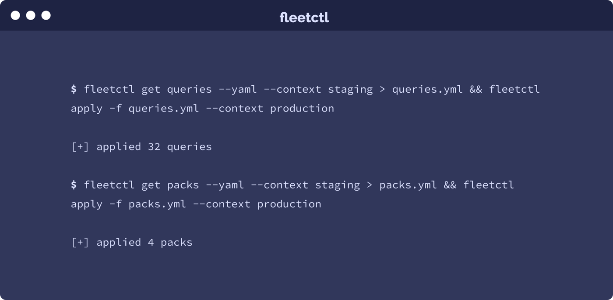

# Import and export queries and packs in Fleet

When managing multiple Fleet environments, you may want to move queries and/or packs from one environment to the other. Or, when inspired by a set of packs shared by a member of the osquery community, you might want to import these packs into your Fleet instance. To do this, you need to have access to a Unix shell and a basic knowledge of the [fleetctl CLI tool](https://www.npmjs.com/package/fleetctl).

Below are two example scenarios. For leaner instructions on how to move queries and packs from one Fleet environment to another, [check out Fleet’s documentation](https://github.com/fleetdm/fleet/blob/00ea74ed800568f063c6d5553f113dbd1e55a09c/docs/1-Using-Fleet/configuration-files/README.md#moving-queries-and-packs-from-one-fleet-environment-to-another).

### Example scenario 1: Moving packs, and their queries, from one Fleet environment to another

Let’s say you manage your organization’s staging and production servers. In order to keep your production servers speedy, you’ve set up two separate Fleet instances for the two environments: Staging and Production.

With this separation, you can diligently test your queries in Staging without negatively impacting the performance of servers in Production.

On Friday, after test results come in, you want to move all performant packs, and their queries, from Staging to Production. You know you can open up the Fleet UI for Production and create the packs manually, but each pack has at least 4 new queries. These packs already exist in Staging so you don’t need to spend time recreating each one in Production.

Here’s how you can quickly export and import the packs in 3 quick fleetctl commands:

1. Navigate to `~/.fleet/config` to find the context names for your “exporter” and “importer” environment. For the purpose of these instructions, we use the context names `staging` and `production` respectively.

2. Run the command `fleetctl get queries --yaml --context staging > queries.yml && fleetctl apply -f queries.yml --context production`. This will import all the queries from your Staging Fleet instance into your Production Fleet instance. *Note, this will also write a list of all queries in yaml syntax to a file names `queries.yml`.*

3. Run the command `fleetctl get packs --yaml --context staging > packs.yml && fleetctl apply -f packs.yml --context production`. This will import all the packs from your Staging Fleet instance into your Production Fleet instance. *Note, this will also write a list of all packs in yaml syntax to a file names `packs.yml`.*

*Note, when importing packs, you must always first import all the queries (step 2) that these packs contain.*

### Example scenario 2: Importing community packs into Fleet

You just found [a collection of awesome queries and packs for Fleet](https://github.com/palantir/osquery-configuration/tree/master/Fleet) and you want to import them into your *Staging Fleet* environment.

Here’s how you can do this in 2 quick fleetctl commands.

1. Create a new file, `awesome-packs.yml` and paste in the desired packs and queries in the [correct Fleet configuration format](https://github.com/fleetdm/fleet/tree/main/docs/1-Using-Fleet/configuration-files#using-yaml-files-in-fleet).
2. Run the command `fleetctl apply -f awesome-packs.yml`.

### Could this post be more helpful?

Let us know if you can think of any other example scenarios you’d like us to cover.

<meta name="category" value="guides">
<meta name="authorGitHubUsername" value="noahtalerman">
<meta name="authorFullName" value="Noah Talerman">
<meta name="publishedOn" value="2021-02-16">
<meta name="articleTitle" value="Import and export queries and packs in Fleet">
<meta name="articleImageUrl" value="../website/assets/images/articles/import-and-export-queries-and-packs-in-fleet-cover-700x343@2x.png">
