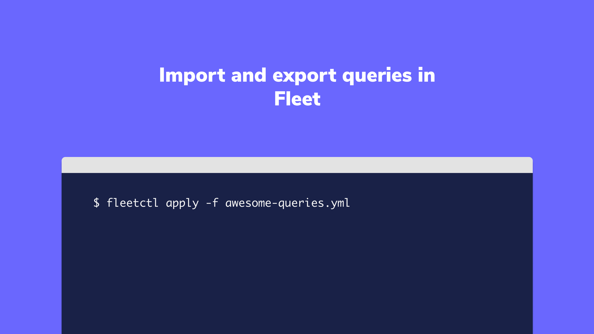

# Import and export queries in Fleet

When managing multiple Fleet instances, you may want to move queries from one instance to another. Or, when inspired by queries shared by a member of the osquery community, you might want to import these queries into your Fleet instance. To do this, you need to have access to a Unix shell and the [fleetctl CLI tool](https://fleetdm.com/fleetctl-preview).

Below are two example scenarios.

### Example scenario 1: Moving queries from one Fleet instance to another

Let’s say you use Fleet at work and you also have a Fleet instance in your lab at home. You were testing some queries at home and you want to share these queries with your team at work.

How to export and import queries:

1. In your home lab, run the `fleetctl login` command to log in to Fleet.

2. Run the following command to export your queries into a `queries.yml` file:

`fleetctl get queries --yaml > queries.yml`

> `queries.yml` will be created in your current working directory.

3. Upload your `queries.yml` file to GitHub so that you can download this file onto your work computer.

4. At work, with `queries.yml` downloaded in your current working directory, run the following
   command to import your queries:

`fleetctl apply -f queries.yml`

### Example scenario 2: Importing community queries into Fleet

You just found [a collection of awesome queries for Fleet](https://github.com/palantir/osquery-configuration/tree/master/Fleet) and you want to import
them into your Fleet instance.

How to import queries:

1. Create a new file, `palantir-queries.yml`, and paste in the desired queries in the [correct Fleet configuration format](https://fleetdm.com/docs/using-fleet/configuration-files#using-yaml-files-in-fleet).
2. Run the command `fleetctl apply -f awesome-queries.yml`.

### Could this post be more helpful?

Let us know if you can think of any other example scenarios you’d like us to cover.

<meta name="category" value="guides">
<meta name="authorGitHubUsername" value="noahtalerman">
<meta name="authorFullName" value="Noah Talerman">
<meta name="publishedOn" value="2021-02-16">
<meta name="articleTitle" value="Import and export queries in Fleet">
<meta name="articleImageUrl" value="../website/assets/images/articles/import-and-export-queries-in-Fleet-1600x900@2x.png">
