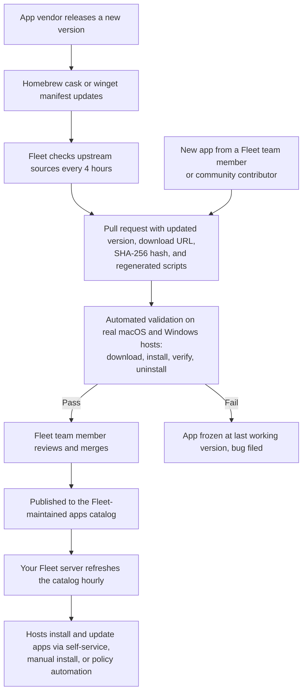

# How Fleet keeps Fleet-maintained apps safe and up to date

*Every app in Fleet's catalog is downloaded straight from the vendor, verified against a pinned hash, tested on real hardware, and reviewed by a human before your hosts ever see it. Here's the pipeline behind the catalog.*

## Key takeaways

- **Installers come straight from the vendor.** Fleet never re-hosts or modifies an installer. Your Fleet server downloads each app from the vendor's official distribution URL and verifies its SHA-256 hash before storing it.
- **The catalog updates itself.** Fleet checks upstream package sources every 4 hours, so a new release from an app vendor becomes an update candidate the same day it ships.
- **Nothing is published untested.** Every catalog change installs and uninstalls on real macOS and Windows hosts before a Fleet team member reviews and merges it.
- **Broken updates get frozen, not shipped.** If a new version fails validation, Fleet holds the app at the last version that worked and files a bug, so a bad update never replaces a good one.
- **Your hosts stay current without babysitting.** Apps update to the latest validated version by default, you can pin versions for change control, and patch policies remediate hosts running outdated software automatically.
- **Everything is auditable.** App manifests and install and uninstall scripts are open source, so you can read exactly what runs on your hosts and see the history of every change.

<a purpose="cta-button" href="/software-catalog">Browse the app catalog</a>

When you let a device management vendor install software on every computer in your company, you're trusting their supply chain as much as your own. Most vendors ask you to take that on faith.

We'd rather show you the pipeline. [Fleet-maintained apps](https://fleetdm.com/guides/fleet-maintained-apps) are a catalog of popular macOS and Windows applications that Fleet keeps installable, uninstallable, and up to date for you. Every app in the catalog moves through the same automated, publicly visible workflow before it reaches your hosts. Here's how it works.

## Where the catalog comes from

Fleet doesn't invent its own record of where each app lives. Metadata comes from the same upstream sources trusted by millions of developers: [Homebrew casks](https://formulae.brew.sh/) for macOS and [winget manifests](https://github.com/microsoft/winget-pkgs) for Windows. Automation [checks these sources every 4 hours](https://github.com/fleetdm/fleet/blob/main/.github/workflows/ingest-maintained-apps.yml). When a vendor ships a new version, that automation opens a pull request in the public [fleetdm/fleet repository](https://github.com/fleetdm/fleet/tree/main/ee/maintained-apps) that updates the app's version, download URL, and SHA-256 hash, and regenerates its install and uninstall scripts.

New apps enter the catalog the same way. A Fleet team member or community contributor writes an input manifest and opens a pull request. If you'd like to add an app yourself, see [contribute an app to the catalog](#contribute-an-app-to-the-catalog) below, or [file a request](https://fleetdm.com/feature-request) and let us do the work.

## Validation on real hosts

Before any change merges, automated tests download each changed app and put it through the full lifecycle on real hardware: install it, confirm the app actually exists on the host afterward, then uninstall it and confirm it's gone. macOS apps validate on macOS hosts, and Windows apps validate on x64 or Arm hardware to match the installer's architecture.

A change that passes still doesn't merge on its own. A Fleet team member reviews every pull request before it's published. A change that fails doesn't ship at all: Fleet freezes the app at the last version that installed successfully and files a bug. Freezing has one honest trade-off. If the vendor removes the download link for the older version while the app is frozen, installs of that app fail until Fleet publishes a fixed version. We think that beats the alternative of silently shipping an update we couldn't verify.

## The lifecycle at a glance

## How apps on your hosts stay updated

Once a change is published, your Fleet server picks it up on its own. The server refreshes the catalog every hour, or immediately when you run `fleetctl trigger --name=maintained_apps`. You don't need to upgrade Fleet to get new apps or new versions.

By default, Fleet-maintained apps track the latest validated version. When a vendor releases an update, Fleet uses it for new installs, and hosts running an older version move to the latest one the next time the app is installed, whether through [self-service](https://fleetdm.com/guides/software-self-service), a manual install, or a [policy automation](https://fleetdm.com/guides/automatic-software-install-in-fleet). If your change control process needs more predictability, [pin an app to a specific or major version](https://fleetdm.com/guides/fleet-maintained-apps#pin-a-version), and if an update introduces a bug, roll back by pinning the previous version.

Patch policies close the loop on hosts that fall behind. Add one from the app's details page under **Actions > Patch**, and Fleet generates a policy that detects hosts running outdated versions. Enable the install automation at **Policies > Manage automations > Install software**, and hosts that fail the policy get the update installed automatically. With [GitOps](https://fleetdm.com/docs/configuration/yaml-files#patch-policy), the patch policy's query updates itself to reference the latest version each time your specs are applied, so the policy never goes stale. The result is a chain with no manual links: the vendor releases, Fleet validates and publishes, your server syncs, and your hosts remediate.

## The security model

The catalog's security rests on a few plain commitments:

- **Vendor-direct downloads.** Fleet never re-hosts or modifies installers. When you add or update an app, your Fleet server downloads the installer from the vendor's official distribution URL, the same place you'd get it yourself.
- **Pinned hashes.** Each app version records the SHA-256 hash published in the upstream package manifest, and your Fleet server rejects a downloaded installer that doesn't match. Some vendors only publish rolling "latest" URLs that can't be pinned in advance. For those apps, Fleet records the installer's hash at download time instead.
- **Open source, end to end.** Every manifest, install script, and uninstall script lives in the public Fleet repository, and every change arrives as a pull request with its validation results attached. You never have to wonder what a Fleet-maintained app will run on your hosts. You can read it.

Fleet's process commitments for the catalog, including update and review targets, are documented in the [Fleet handbook](https://fleetdm.com/handbook/company/product-groups#fleet-maintained-apps). If you find a suspected security issue in a Fleet-maintained app, report it through Fleet's [vulnerability disclosure program](https://github.com/fleetdm/fleet/blob/main/SECURITY.md).

## Contribute an app to the catalog

Anyone can propose a new Fleet-maintained app. The step-by-step instructions live in the [contributor README](https://github.com/fleetdm/fleet/blob/main/ee/maintained-apps/README.md): write a short input manifest describing the app, run the generator to produce its output manifest and its install and uninstall scripts, add the app's icon, and open a pull request. New app submissions get the same automated validation as everything else in the catalog, and a Fleet engineering manager reviews them within 3 business days.

If you use [Claude Code](https://claude.com/product/claude-code), the repository ships a skill that automates most of the work. Open Claude Code in your fleetdm/fleet checkout and ask it to "add X as a macOS FMA" or "add X as a Windows FMA". The [`new-fma` skill](https://github.com/fleetdm/fleet/blob/main/.claude/skills/new-fma/SKILL.md) follows the README's workflow and adds the hard-won gotchas it doesn't cover: it verifies the installed app's real identity with tools like msitools and PlistBuddy instead of trusting upstream metadata, and it handles bootstrapper installers and version-matching quirks that commonly trip up first-time contributors. You still review the result and open the pull request yourself, and automated validation and human review still apply.

## Trust, but verify us

Software supply chain attacks work because most update pipelines are invisible. You can't audit what you can't see. Fleet's answer is to make the entire path from vendor release to host install public: the sources, the scripts, the tests, and the review. Don't take our word for any of this. The repository is open, and so is the pull request history.

## See it live

- Follow the [Fleet-maintained apps guide](https://fleetdm.com/guides/fleet-maintained-apps) to add your first app.
- Set up [patch policies](https://fleetdm.com/guides/how-to-use-policies-for-patch-management-in-fleet) to remediate outdated hosts automatically.
- **Get a demo** of Fleet: [schedule a call](https://fleetdm.com/contact).

---

*Questions about how an app is maintained? [Open an issue](https://github.com/fleetdm/fleet/issues/new/choose) or ask in [#fleet on Slack](https://fleetdm.com/support).*

<meta name="articleTitle" value="How Fleet keeps Fleet-maintained apps safe and up to date">
<meta name="authorFullName" value="Allen Houchins">
<meta name="authorGitHubUsername" value="allenhouchins">
<meta name="category" value="articles">
<meta name="publishedOn" value="2026-07-17">
<meta name="description" value="Inside the Fleet-maintained apps pipeline: vendor-direct downloads, pinned hashes, validation on real hardware, human review, and automatic patching.">
