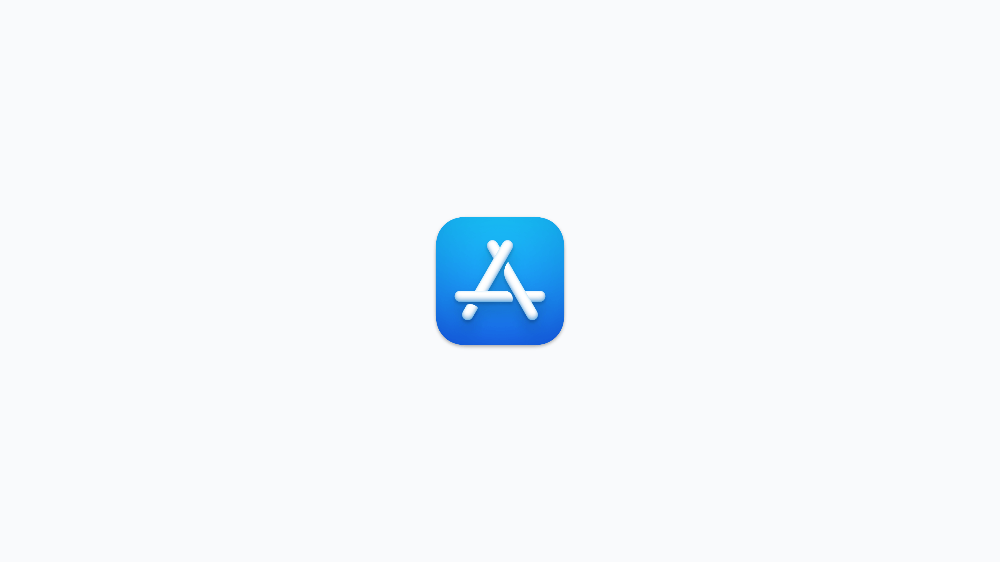

# Install App Store apps (VPP)

_Available in Fleet Premium_

In Fleet, you can install Apple App Store apps using the [Volume Purchasing Program (VPP)](https://support.apple.com/guide/app-store/volume-purchasing-app-store-mac-firc1767ec54/mac) on your macOS, iOS, and iPadOS hosts. This guide will walk you through using this feature to add apps from your Apple Business Manager account to Fleet and install those apps on your hosts.

Once a VPP app has been added to a team, it can be [automatically installed on hosts via policy automations](https://fleetdm.com/guides/automatic-software-install-in-fleet) as of Fleet [v4.63.0](https://github.com/fleetdm/fleet/releases/tag/fleet-v4.63.0), and policies can be automatically created when adding a VPP app to a team as of [v4.65.0](https://github.com/fleetdm/fleet/releases/tag/fleet-v4.65.0).

## Prerequisites
* **MDM features**: to use the VPP integration, you must first enable MDM features in Fleet. See the [MDM setup guide](https://fleetdm.com/docs/using-fleet/mdm-setup) for instructions on enabling MDM features.

> As of Fleet 4.55.0, there is a [known issue](https://github.com/fleetdm/fleet/issues/20686) that uninstalled or deleted VPP apps will continue to show a status of `installed`.

## Add your VPP token

1. **Navigate to the MDM integration settings page**: Click your avatar on the far right of the main navigation menu, and then **Settings > Integrations > "Mobile device management (MDM)"**

2. **Add your VPP token**: Scroll to the "Volume Purchasing Program (VPP)" section. Click "Add VPP", and then click "Add VPP" again on the following page. Follow the directions on the modal to get your VPP token from Apple Business Manager, and then click the "Upload" button at the bottom to upload it to Fleet.

3. **Edit the team assignment for the new token**: Find the token in the table of VPP tokens. Click the "Actions" dropdown, and then click "Edit teams". Use the picker to select which team(s) this VPP token should be assigned to.

## Purchase an app

To add apps to Fleet, you must first purchase them through Apple Business Manager, even if they are free. This ensures that all apps are appropriately licensed and available for distribution via the Volume Purchasing Program (VPP). For detailed instructions on selecting and buying content, please refer to Apple’s documentation on [purchasing apps through Apple Business Manager](https://support.apple.com/guide/apple-business-manager/select-and-buy-content-axmc21817890/web).

## Add the app to Fleet

1. **Navigate to the Software page**: Click on the "Software" tab in the main navigation menu.

2. **Select your team**: Click on the "All teams" dropdown in the top left of the page and select your desired team.

3. **Open the "Add software" modal**: Click on the "Add software" button in the top right of the page.

4. **View your available apps**: Click on the "App Store (VPP)" tab in the "Add software" page. The page will list the apps that you have purchased through VPP but still need to add to Fleet.

5. **Configure the app**: Select an app from the list. Select the hosts that you want to target with this app, under "Target". Select "All hosts" if you want the app to be available to all your hosts. Select "Custom" to scope the app to specific groups of hosts based on label membership. You can select "Include any", which will scope the app to hosts that have any of the labels you select, or "Exclude any", which will scope the app to hosts that do _not_ have the selected labels.

> For macOS apps, you can check the "Self-service" box on the page if you wish for the app to be available for user-initiated installs. You can also check the "Automatic install" box to have Fleet create a policy that installs the app on targeted hosts on the team that don't have the app already installed.

6. **Add the app**: Click the "Add software" button in the bottom right of the page. The app should appear in the software list for the selected team.

## Remove the app from Fleet

1. **Navigate to the Software page**: Click "Software" in the main navigation menu.

2. **Find the app you want to remove**: Search for the app using the search bar in the top right corner of the table.

3. **Access the app's details page**: Click on the app's name in the table.

4. **Remove the app**: Click on the "Actions" dropdown on the right side of the page. Click "Delete", then click "Delete" on the confirmation modal. Deleting an app will not uninstall the app from the hosts on which it was previously installed.

## Edit the app

1. **Navigate to the Software page**: Click "Software" in the main navigation menu.

2. **Find the app you want to remove**: Search for the app using the search bar in the top right corner of the table.

3. **Access the app's details page**: Click on the app's name in the table.

4. **Edit the app**: Click on the "Actions" dropdown on the right side of the page. Click "Edit". In the "Edit software" modal, you can change the hosts that you want to target with the app as well as the app's [self-service](https://fleetdm.com/guides/software-self-service) status.

## Install the app

1. **Add the host to the relevant team.**

2. **Go to the host's detail page**: Click the "Hosts" tab in the main navigation menu. Filter the hosts by the team, and click the host's name to see its details page.

3. **Find the app**: Click the **Software** > **Library** tab on the host details page. Search for the software you added in the software table's search bar. Instead of searching, you can also filter software by clicking the **All software** dropdown and selecting **Available for install.**

4. **Install the app**: Click the "Actions" dropdown on the far right of the app's entry in the
   table. Click "Install" to trigger an install. This action will send an MDM command to the host
   instructing it to install the app. If the host is offline, the upcoming install will show up in
   the **Details** > **Activity** > **Upcoming** tab of this page. Once Fleet has verified
   that the app is on the host, the app will show up as **Installed** in the **Software** > **Library** tab.
   After the app is installed, Fleet will automatically refetch the host's vitals, which will update the
   software inventory.

> Currently, VPP apps can't be uninstalled from devices via Fleet. Please see: [Uninstall App Store apps #20729](https://github.com/fleetdm/fleet/issues/20729).

## Install an app via self-service

1. **Open Fleet from the host**: On the host that will be installing an application through self-service, click on the Fleet Desktop tray icon, then click **My Device**. This will open the browser to the device's page on Fleet.

2. **Navigate to the self-service tab**: Click on the **Self-Service** tab under the device's details.

3. **Locate the app and click install**: Scroll through the list of software to find the app you would like to install, then click the **Install** button underneath it.

## Renew your VPP token

When one of your uploaded VPP tokens has expired or is within 30 days of expiring, you will see a warning
banner at the top of page reminding you to renew your token. You can do this with the following steps:

1. **Navigate to the MDM integration settings page**: Click your avatar on the far right of the main navigation menu, and then **Settings > Integrations > "Mobile device management (MDM)"** Scroll to the "Volume Purchasing Program (VPP)" section, and click "Edit".

2. **Renew the token**: Find the VPP token that you want to renew in the table. Token status is indicated in the "Renew date" column: tokens less than 30 days from expiring will have a yellow indicator, and expired tokens will have a red indicator. Click the "Actions" dropdown for the token and then click "Renew". Follow the instructions in the modal to download a new token from Apple Business Manager and then upload the new token to Fleet.

## Delete your VPP token

To remove VPP tokens from Fleet:

1. **Navigate to the MDM integration settings page**: Click your avatar on the far right of the main navigation menu, and then **Settings > Integrations > "Mobile device management (MDM)"** Scroll to the "Volume Purchasing Program (VPP)" section, and click "Edit".

2. **Delete the token**: Find the VPP token that you want to delete in the table. Click the "Actions" dropdown for that token, and then click "Delete". Click "Delete" in the confirmation modal to finish deleting the token.

## Manage apps with Fleet's REST API

Fleet also provides a REST API for managing apps programmatically. You can add, install, and delete apps via this API and manage your organization’s VPP tokens. Learn more about Fleet's [REST API](https://fleetdm.com/docs/rest-api/rest-api).

## Manage apps with GitOps

To manage App Store apps using Fleet's best practice GitOps, check out the `software` key in [the GitOps reference documentation](https://fleetdm.com/docs/using-fleet/gitops#software).

<meta name="articleTitle" value="Install App Store (VPP) apps">
<meta name="authorFullName" value="Jahziel Villasana-Espinoza">
<meta name="authorGitHubUsername" value="jahzielv">
<meta name="category" value="guides">
<meta name="publishedOn" value="2025-02-28">
<meta name="articleImageUrl" value="../website/assets/images/articles/install-vpp-apps-on-macos-using-fleet-1600x900@2x.png">
<meta name="description" value="This guide will walk you through installing VPP apps on macOS, iOS, and iPadOS using Fleet.">
