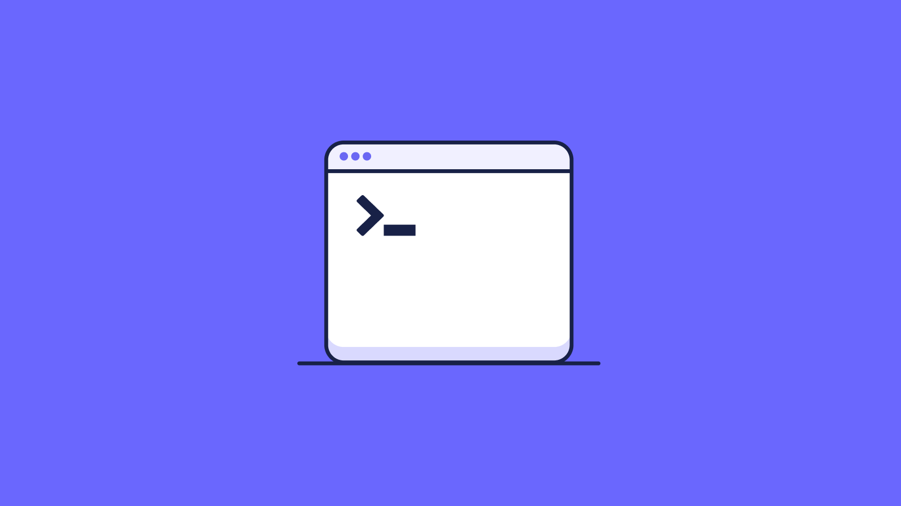

At Fleet, we strive to enhance the functionality of our platform, offering more power and flexibility to IT administrators and security teams. Today, we are thrilled to announce an addition to our toolkit - the ability to [execute a shell script](https://fleetdm.com/docs/using-fleet/scripts) via command line (CLI) and Fleet's API across macOS, Windows, and Linux.

This feature, available exclusively in Fleet, unlocks the potential to execute a script on a specific host, empowering professionals to remediate issues or collect logs quickly. Whether using shell scripts on Mac and Linux or PowerShell for Windows, this functionality offers a streamlined and efficient solution to tackle challenges head-on.

Whether you need to address a security vulnerability, investigate an anomaly, or gather information for analysis, this new capability puts the control in your hands right where you need it. Join us as we explore this feature in detail, looking at the requirements, usage, and unique advantages it brings to your device management landscape.

### Why cross-platform script execution matters

In the rapidly evolving world of IT, security, and device management, the demands placed on administrators and security engineers are continually increasing. The challenges of keeping systems up-to-date, secure, and efficiently managed require tools that are both powerful and adaptable.

The introduction of the cross-platform script execution feature in Fleet is a direct response to these needs. But why does this matter, and what makes this new capability so essential?

* **Enhanced efficiency and flexibility:** Running a script across multiple operating systems – macOS, Windows, and Linux – means that administrators no longer need to navigate different tools for different systems. Whether you are remediating an issue or collecting logs, this feature streamlines the process, saving time and effort.
* **Root-level security control:** The ability to execute scripts is not just handed out freely. It requires root access to the device, reflecting a carefully considered approach to security. This access level ensures that the powerful capabilities are matched with stringent safeguards, only enabling those with the proper permissions to utilize this feature.
* **Practical application in real-time remediation and investigation:** In a world where immediate response is often critical, the ability to run a script one-off per host provides IT professionals with the tools to act swiftly. Whether addressing vulnerabilities, conducting inquiries, or implementing standard compliance policies, this feature provides a practical solution tailored to the realities of today's technology landscape.
* **Alignment with Fleet's core values**: At Fleet, we are dedicated to making security and IT interoperable and easy to automate. This feature aligns with our commitment to clarity and trust through open-source software and fits seamlessly with our values of empathy, ownership, results, objectivity, and openness.

### Supported platforms

Fleet's new script execution supports macOS, Windows, and Linux systems. For macOS and Linux, the execution will utilize the device's default shell. On Windows, PowerShell scripts are supported, providing a flexible and robust range of options for IT administrators and security engineers.

### Prerequisites

Before leveraging the power of this feature, specific prerequisites must be met. Most crucially, it can only be enabled by someone with root access to the device. This access can be proven by pushing a new package, modifying a configuration file with root-only write access, or pushing an MDM profile. Fleet requires this level of access to provide a more convenient mechanism for script execution.

For macOS and Linux, the script is always executed in the device's (root) default shell (`/bin/sh`). Therefore, it's important to understand which shell is configured as the default on the target device.

### Security considerations

Recognizing the gravity of root, remote code execution, Fleet has implemented this feature with rigorous security considerations in mind. Script execution can only be enabled if explicitly enabled when the `fleetd` agent is generated or via an MDM profile. These measures are in place to fortify the system's integrity and provide a secure, controlled environment for script execution.

By outlining the threat model and ensuring only those with root access can enable this feature, Fleet maintains a conscientious balance between functionality and security. The careful design and clear prerequisites underscore Fleet's dedication to responsible, transparent IT management.

### Empowering admins

At Fleet, our focus is consistently centered around the needs of our users - the IT administrators and security engineers who tackle complex challenges daily. The introduction of cross-platform script execution represents our continued dedication to delivering solutions that genuinely empower our community.

Fleet's strategic design blends efficiency, security, and practicality. By providing the tools to execute scripts across macOS, Windows, and Linux, we have removed barriers that often hamper swift action. The careful integration of root-level security controls makes sure that this powerful functionality is handled with the necessary caution and integrity.

Whether you are a current Fleet Premium user or considering joining our community, this feature aims to elevate your ability to remediate issues, investigate anomalies, and maintain the highest IT security and device management standard.

In the ever-changing landscape of technology, the requirements and challenges continually shift. Fleet's commitment to agility, transparency, and alignment with the core values of empathy, ownership, results, objectivity, and openness ensures that we remain responsive and attuned to these needs.

Thank you for your trust and partnership as we continue this exciting journey together. If you have any questions or need assistance, please do not hesitate to [reach out](https://fleetdm.com/support). Your success is our success, and we are here to support you every step of the way.

<meta name="category" value="announcements">
<meta name="authorFullName" value="JD Strong">
<meta name="authorGitHubUsername" value="spokanemac">
<meta name="publishedOn" value="2023-10-17">
<meta name="articleTitle" value="Introducing cross-platform script execution">
<meta name="articleImageUrl" value="../website/assets/images/articles/introducing-cross-platform-script-execution-800x450@2x.png">
