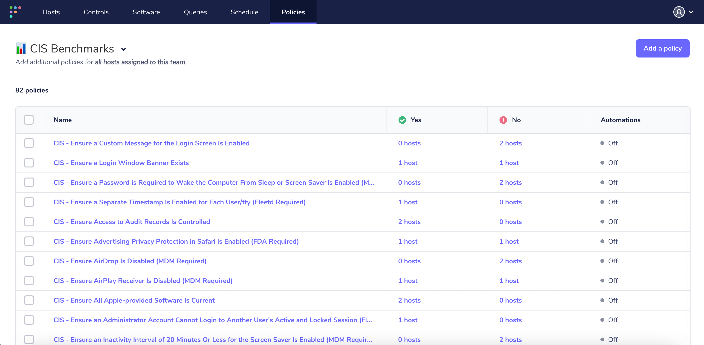
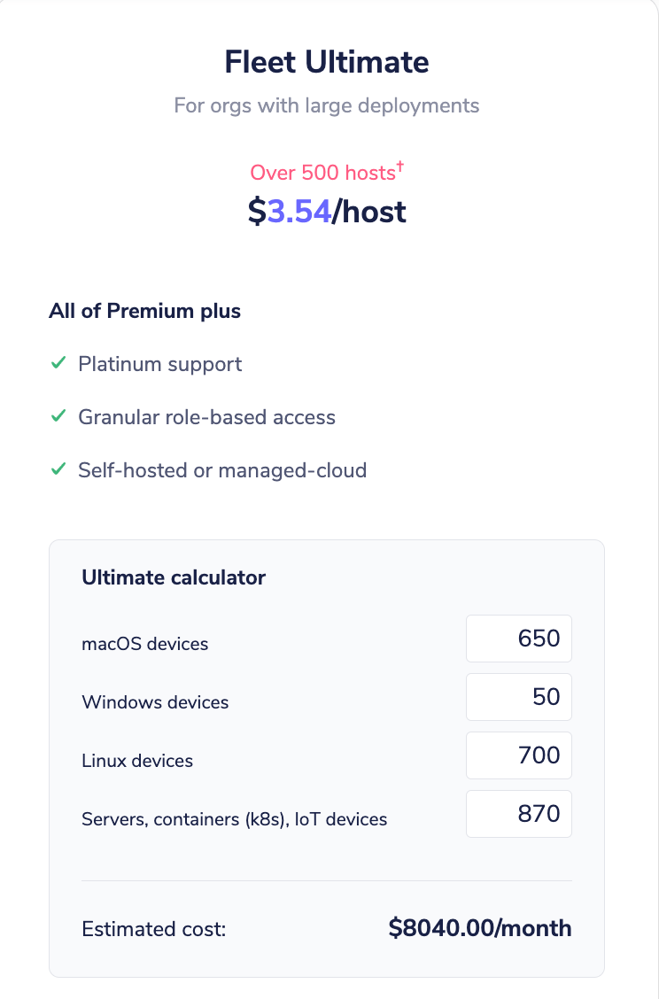

# Introducing CIS benchmarks, managed-cloud hosting and custom calculator in the new Fleet Ultimate plan.

At Fleet, we are always striving to keep up with our customers, and recently we have heard from many of you that you would like to get even more control from your Fleet Premium plan. In order to give you more control and better compliance postures we are announcing a new pricing tier, Fleet Ultimate.

First and foremost, Fleet Ultimate offers the same great features as Premium (Teams, Employee/Device mapping, and audit log destinations, to name a few) but for larger organizations that need even more customization. With Ultimate support, we can help you set up your automation of audit logs, setup your teams, and, in some cases, discuss what a custom dashboard would look like for your teams. However, in this latest release, there are changes coming to every pricing tier… here are a few.

## Compliance-ready queries for all macOS CIS benchmarks

As part of both Premium and Ultimate we will be offering companies the ability to schedule and run a complete set of CIS policies. As of today we have 100% coverage for all macOS CIS benchmarks that are automatable (the last CIS benchmarks need to be run manually). The Center for Internet Security (CIS) publishes benchmark documents that describe how computers should be configured in order for them to avoid vulnerabilities addressed therein. 

If you have upgraded to a premium Fleet plan you will have the ability to import these CIS benchmarks into your queries list where you can schedule or edit them. Once you import them you would see something like this:

To get started with CIS Queries you can find instructions to import them and use them here: https://fleetdm.com/docs/using-fleet/cis-benchmarks

## Custom Pricing for mac, Windows, Linux machines, servers and Kubernetes containers

In addition to some new options for our Fleet Ultimate customers, we wanted to give you better insight into the cost/host on a truly diverse array of machines. We know we have hundreds of customers using Fleet across their servers but not getting the complete set of premium features like Teams, audit logs and scheduled queries. By giving you the ability to enter your entire fleet we hope to unlock those premium Enterprise features for many more customers. Visit the [pricing page](https://fleetdm.com/pricing?utm_source=pricing+demo+top+premium) to play with the new calculator.

Lastly, we are making one substantial change to the Fleet Premium product, a flat rate of $3500/month for up to 500 hosts (after that we charge for extra hosts at an agreed upon contract price). This comes to $7 a host. We believe it is affordable given these queries save your Security team hundreds if not thousands of hours in maintenance and upkeep.

## Custom dashboards for vulnerability management

In addition to better control, many of our customers want to build better tooling around reporting. In order to showcase the ability to use the Fleet API to build your own automation and reporting, we created our own internal dashboard. Here is a preview:

If you’d like to discuss a dashboard like this for your team, feel free to [schedule time with our expert services team](https://calendly.com/fleetdm/demo?utm_source=pricing+demo+top+premium). 

## Fleet Community Edition - still free, free forever.

At our core, we are an open-source company. You can join our repos and commit just like our team. We value openness and transparency, so we will always have a community edition. We are constantly improving our community edition and hope you will [give it a try](https://fleetdm.com/try-fleet/register) if you are still on the fence about Fleet.

<meta name="category" value="announcements">
<meta name="authorGitHubUsername" value="jarodreyes">
<meta name="authorFullName" value="Jarod Reyes">
<meta name="publishedOn" value="2023-02-20">
<meta name="articleTitle" value="Introducing CIS benchmarks, managed-cloud hosting and custom calculator in the new Fleet Ultimate plan.">
<meta name="articleImageUrl" value="../website/assets/images/articles/happy-1st-anniversary-fleet-cover-800x450@2x.png">
