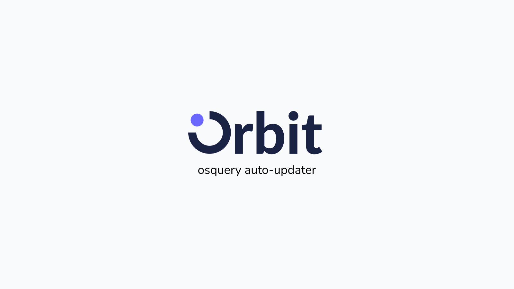

# Introducing Orbit, your Fleet agent manager

We’re pleased to announce that Orbit is out of beta and in v1!

Orbit is an agent manager. It installs and updates Fleet’s agents on your end-user hosts (currently osquery and Fleet Desktop). Rather than doing all that manually, you can rely on Orbit, which regularly checks your Fleet instance for the latest desired setup and changes the agents on the host to match your specification. With Orbit, you can stop juggling osquery vs. Fleet Desktop vs. some other agent in your head.

## How do I install Orbit on my hosts?

Orbit can be installed on your hosts with an installer package, which can be generated using the `fleetctl package` command. Once generated, run the installer on the host to start the install. The package can also be delivered at scale using an enterprise deployment tool like Munki. Read our doc on [adding hosts](https://fleetdm.com/docs/using-fleet/adding-hosts#osquery-installer) to learn more about generating the package and installing Orbit.

*Generate installer for osquery on macOS*

## What does Orbit do right now?

To start, at v1, Orbit will:
* Install the latest Fleet-compatible version of osquery and Fleet Desktop.
* Upgrade osquery and Fleet Desktop to the latest Fleet-compatible version.

Fleet maintains a [TUF server](https://theupdateframework.io/) that provides secure updates to your agents. Orbit will automatically update the agents to their latest version — no action needed on your part. You can even [pin the agent to a certain version](https://github.com/fleetdm/fleet/tree/main/orbit#update-channels) where needed. If you’re interested in managing your own version server, you can read our doc on [Fleetctl agent updates](https://fleetdm.com/docs/deploying/fleetctl-agent-updates#self-managed-agent-updates) to learn more about setting that up.

## Where will Orbit go from here?

We’re just at v1 and Orbit has a long way to go. We want Orbit to be Fleet’s representative on the end-user host. We already have a few features in the works, such as allowing Orbit to [update osquery’s command line flags](https://github.com/fleetdm/fleet/issues/6851) and [managing extensions for osquery](https://github.com/fleetdm/fleet/issues/6034).

Orbit will be the one-stop shop for all your agent needs in Fleet. Stay tuned as we deliver improvements to make that vision a reality.

If you have suggestions for Orbit, please share them with us in the osquery Slack [#fleet channel](https://fleetdm.com/slack) or open an issue in Github.

<meta name="category" value="announcements">
<meta name="authorFullName" value="Mo Zhu">
<meta name="authorGitHubUsername" value="zhumo">
<meta name="publishedOn" value="2022-08-18">
<meta name="articleTitle" value="Introducing Orbit, your Fleet agent manager">
<meta name="articleImageUrl" value="../website/assets/images/articles/fleet-4.17.0-1-1600x900@2x.jpg">
