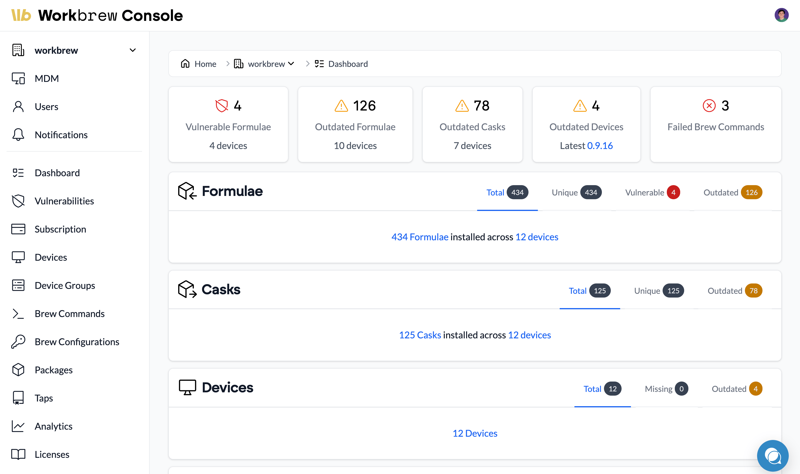

# Introducing Workbrew: bringing enterprise control to Homebrew deployments

[Workbrew recently](https://workbrew.com/) made waves with its [official launch](https://workbrew.com/blog/workbrew-1-0), highlighted in a [TechCrunch article](https://techcrunch.com/2024/11/19/workbrew-makes-open-source-package-manager-homebrew-enterprise-friendly/). Backed by $5 million in funding from developer-focused VC firms like Heavybit and Operator Collective, Workbrew is tackling a critical challenge: transforming Homebrew from a developer-centric tool into a secure, enterprise-ready solution.

## Workbrew’s mission: From single-player to multiplayer

Homebrew has become an essential part of the developer’s toolkit by simplifying the installation and maintenance of software packages. However, as organizations grow, managing Homebrew installations across an entire fleet of devices introduces complexity, security risks, and compliance challenges.

Enter Workbrew. Their platform provides a centralized way for IT and security teams to manage and deploy Homebrew across their organizations. With features like:

- **Fleet-wide dashboards** to monitor devices, packages, and licenses.
- **MDM integrations (including Fleet!)** for automated synchronization of device data.
- **Vulnerability detection** and policy enforcement to enhance security.
- **Remote management** to install, upgrade, and remove any of the tens of thousands of packages in the `brew` ecosystem with ease.

Workbrew enables companies to maintain the agility developers love while ensuring security and compliance standards are met.

As noted in the article, Workbrew brings a customizable solution to organizations struggling with “[shadow IT](https://techcrunch.com/2015/09/25/its-time-to-embrace-not-fear-shadow-it/)” risks. By offering a fleet dashboard, vulnerability detection, and deep integrations with tools like [Fleet](https://fleetdm.com/device-management), Workbrew helps companies maintain visibility and control over Homebrew deployments at scale. Whether it’s ensuring compliance in regulated industries or automating package installations for remote teams, Workbrew is paving the way for safer, smarter IT management.

At Fleet, we’re excited to support Workbrew’s efforts. Our [integration](https://fleetdm.com/integrations) ensures that Workbrew users can easily sync device data, enabling seamless management across teams. Workbrew’s approach resonates with our belief in open-source and transparent tools for IT and security.

## Why this matters for IT teams

Managing Homebrew deployments used to be a manual process fraught with unknowns. IT professionals often found themselves asking:
- What’s actually installed on our devices?
- Are there unpatched vulnerabilities in our software?
- How do we enforce security policies without stifling developer productivity?

With Workbrew, these questions have answers. And for organizations already using Fleet, the integration creates a powerful synergy that brings even more value to your existing workflows. Together, Fleet and Workbrew give you the tools to confidently oversee and manage every device, app, and package across your organization. It’s an essential step for any organization looking to balance developer flexibility with operational controls.

To learn more about how Workbrew and Fleet can work together, visit [Workbrew’s website](https://www.workbrew.com)

<meta name="authorGitHubUsername" value="drew-p-drawers">
<meta name="authorFullName" value="Drew Baker">
<meta name="publishedOn" value="2024-11-19">
<meta name="articleTitle" value="Introducing Workbrew: bringing enterprise control to Homebrew deployments">
<meta name="category" value="security">
<meta name="articleImageUrl" value="../website/assets/images/articles/fleet-and-workbrew-1600x900@2x.png">
