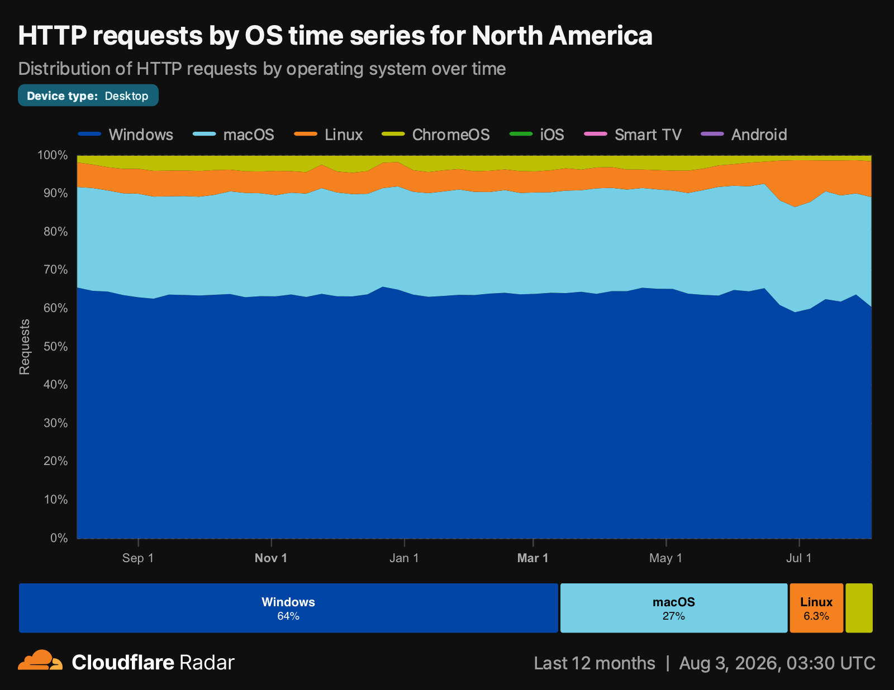

# Linux crossed 10% in North America, and your inventory might have missed it

*Linux desktop share doubled in a month. Most of that jump was measurement catching up to reality, which is exactly the problem IT teams have with Linux inside their own walls.*

## Key takeaways

- **Linux hit 10.65% of North American desktop traffic, and the jump was a counting fix.** Statcounter's regional number went double-digit for the first time in July 2026, up from 5.52% in June. An "Unknown" bucket worth 9.24% of June traffic shrank as those systems were finally identified correctly.
- **A second, independent source lands within a point of the first.** Cloudflare Radar puts Linux at 9.72% of North American desktop requests in July, against Statcounter's 10.65%.
- **Your asset inventory might have the same bug.** Tools that discover devices exclusively through Windows and Apple management channels file Linux hosts under "other" or miss them entirely, so the fleet you report on is smaller than the fleet you own.
- **Unmanaged Linux is not low-risk Linux.** These are developer and engineer workstations holding source code, cloud credentials, and production access, and they run unpatched packages and unencrypted disks like anything else.
- **Linux needs real management, not an inventory row.** Fleet managed Linux with the same breadth and depth as macOS and Windows including software installs, disk encryption with escrowed recovery keys, vulnerability detection against installed packages and kernels, remote script execution, and remote lock and wipe.
- **Cross-platform means one workflow, not three consoles.** The same reports, the same policies, and the same Git-reviewed configuration covers Linux, macOS, and Windows, so Linux stops being the exception you handle by yet another tool.

<a purpose="cta-button" href="https://fleetdm.com/linux-management">See Linux management in Fleet</a>

In July 2026, Statcounter recorded Linux at [10.65% of desktop traffic in North America](https://linuxiac.com/linux-desktop-market-share-surpasses-10-in-north-america/), the first time the region has shown double digits. Globally, Linux moved from 4.39% in June to 7.53% in July. Those are big numbers, and they arrived in a single month.

A single month is the tell. Nobody installs Ubuntu on five million machines in thirty days. What happened is more interesting, and more useful to anyone responsible for a multi-platform fleet.

## The jump was a counting fix

Statcounter's June data carried an "Unknown" category worth 9.24% of traffic. In July that bucket shrank and Linux grew. The most likely explanation, and the one Linuxiac raises directly, is better identification of traffic that was already Linux and had simply been filed somewhere else.

That does not make the 10.65% fake. It makes it a correction. Those machines were on the network in June, running the same distributions, browsing the same sites. The analytics platform could not name them, so they were rounded down into a category nobody looks at.

Real growth is underneath the correction, and it's well documented: Windows 10 reaching end of life, Valve's Proton making Linux gaming credible, hardware vendors shipping Linux preinstalled, and developers who were already living in a Linux terminal deciding to stop dual-booting. But the headline number moved because the measurement improved, and that distinction is the whole story for IT.

## A second source says the same thing

Statcounter samples page views across roughly a million websites. Cloudflare measures HTTP requests across its own global network. Different populations using different methods with no shared plumbing. If the July number were an artifact of one vendor's parser, the other would not see it.

*Source: [Cloudflare Radar](https://radar.cloudflare.com), captured August 3, 2026.*

Query Cloudflare for the same region, the same device type, and the same month, and Linux comes in at 9.72% of North American desktop requests for July 2026. Statcounter says 10.65%. Two unrelated measurement systems reporting data that is less than a percentage point apart.

The June comparison is the more interesting one. Cloudflare had Linux at 7.22% in June, while Statcounter was still reporting 5.52%. Statcounter was the low outlier, and its July correction closed the gap with a number Cloudflare had already been publishing. Underneath both, there is real growth. Cloudflare's own month-over-month move, from 7.22% to 9.72%, is a genuine rise rather than a reclassification.

That's the pattern to hold onto. Linux is harder to identify from the outside than a Mac or a PC. There's no enrollment record, no consistent vendor fingerprint, and a user agent string that can easily be spoofed. Every measurement of it is a floor, not a ceiling, and the same is true inside your own walls.

## The same blind spot lives in your asset inventory

Ask an IT director how many Linux desktops their organization has and you will usually get an estimate, delivered with a shrug, and it will be low.

That's not carelessness. It's an artifact of how most devices get counted. Discovery flows through the channels that exist: Apple's device enrollment, Windows domain join and Intune, an EDR agent that ships a Linux build as a checkbox feature. Each of those does an excellent job of finding the platform it was built for. A Fedora workstation that a staff engineer imaged themselves has no enrollment record to inherit, no directory object anyone reconciles, and often no agent. It shows up as an unfamiliar MAC address on the network, or as nothing at all.

So the organization ends up with two Linux populations. The one on the spreadsheet, and the real one. Statcounter published its correction in July. Most IT teams have not run theirs.

The first useful move here is not procurement. It's counting. Pull DHCP leases, SSO device signals, VPN logs, and your network access control data, and reconcile them against your managed-device list. The gap is your Linux estate.

## The machines you're not counting are the ones you'd least like to lose

There's a comfortable assumption that unmanaged Linux is a rounding error, so the risk is proportional. It isn't, because of who runs it.

Linux desktops in a company cluster in engineering. They hold source code, SSH keys, cloud provider credentials, kubeconfig files, database clients pointed at production, and browser sessions for the admin consoles that run the business. A stolen laptop from that population is a materially worse day than a stolen laptop from almost anywhere else in the org.

And "runs Linux" is not a security control. An Ubuntu 22.04 workstation that hasn't taken updates in eight months is carrying known-exploited CVEs in its installed packages and its kernel. Full-disk encryption is a checkbox during install that plenty of people skip. A host nobody manages is a host nobody patches, and nobody can prove was encrypted when it went missing.

The uncomfortable version: if you can't produce a list of your Linux hosts, you also can't answer an auditor asking which of them are encrypted, or answer an incident responder asking whether the machine that showed up in a suspicious login was one of yours.

## Managing Linux means more than seeing it

Visibility is the first step. Once you can see the hosts, the question is whether your tooling can do anything to them, and this is where a lot of platforms stop. Linux support in mainstream device management often means an inventory row and a health check, which leaves your team maintaining a parallel stack of Ansible playbooks, shell scripts, and tribal knowledge for the one platform that got shortchanged.

Fleet treats Linux as a first-class platform. Concretely, on Linux hosts Fleet can:

- Report live state. Installed packages, kernel version, running processes, open ports, and users, queried ad hoc during an incident or on a schedule, using the same syntax you use on macOS and Windows.
- Install and manage software. Deploy `.deb` and `.rpm` packages on Debian-based and RPM-based systems, or use script-only packages for configuration changes that aren't software at all.
- Enforce LUKS2 disk encryption. On Ubuntu, Kubuntu, and Fedora, with recovery keys escrowed automatically and available to admins in Fleet.
- Detect vulnerabilities. Match installed packages and kernels against known vulnerability data, including CISA's Known Exploited Vulnerabilities catalog, so you can prioritize by exploit likelihood rather than by CVSS alone.
- Run scripts remotely, and lock or wipe. Shell and Python scripts on one host or in bulk, plus remote lock and wipe when a device goes missing.
- Offer self-service. End users install approved software from Fleet Desktop instead of filing a ticket, which matters more than usual for a population that will otherwise route around you.

## One workflow beats a third console

Adding a Linux-only tool solves the coverage problem and creates a worse one. Three consoles means three policy definitions that drift, three sets of credentials, three audit exports to reconcile, and a compliance answer that requires someone to manually merge spreadsheets.

The alternative is one platform where Linux is a platform, not a plugin. In Fleet, hosts group into fleets and dynamic labels by business function rather than by operating system, so "engineering workstations with production access" is one group containing Macs and Linux boxes together. Policies evaluate continuously and can trigger a script or an install when a host fails. Configuration can live in Git, reviewed in a pull request and deployed through CI, which means your Linux baseline is auditable and reversible. One API covers every OS for the SIEM export and the ticketing integration.

That's the part worth internalizing. The reason Linux gets skipped is rarely that someone decided it didn't matter. It's that managing it properly used to require a separate stack, and separate stacks lose budget fights. When Linux runs through the same workflow as everything else, the argument for skipping it disappears.

## Count first

Statcounter's July number will get argued about, and it should be. The honest read is that two independent sources now put Linux desktop share in North America near 10%, that it was underreported before the measurement caught up, and that it is still rising.

Your fleet is in the same position. The Linux hosts are already there, already holding your most sensitive credentials, and already invisible to the reports you show your auditors. The market took one month to correct its count. You can do yours this week, and then decide what to do about what you find.

## See it live

- **[Enroll a Linux device](https://fleetdm.com/guides/enrolling-linux-devices-for-fleet-management)** and see what Fleet reports back in under an hour.
- **Get a demo** → [fleetdm.com/contact](https://fleetdm.com/contact)
- **Join a GitOps training session** → [fleetdm.com/gitops-workshop](https://fleetdm.com/gitops-workshop)

## Sources

- Statcounter desktop OS market share for North America, July 2026, as reported by [Linuxiac](https://linuxiac.com/linux-desktop-market-share-surpasses-10-in-north-america/). Underlying data: [Statcounter GlobalStats](https://gs.statcounter.com/os-market-share/desktop/north-america).
- Desktop HTTP requests by operating system, North America, filtered to desktop device type: [Cloudflare Radar Data Explorer](https://radar.cloudflare.com/explorer), captured August 3, 2026. July 2026: Windows 61.45%, macOS 27.58%, Linux 9.72%, ChromeOS 1.25%. June 2026: Windows 63.75%, macOS 27.31%, Linux 7.22%, ChromeOS 1.72%.

---

*Want the longer argument? Start with [why enterprise Linux is important in 2026](https://fleetdm.com/articles/why-enterprise-linux-is-important-in-2026), or go straight to [Linux desktop inventory and visibility](https://fleetdm.com/articles/linux-desktop-inventory-and-visibility).*

<meta name="articleTitle" value="Linux crossed 10% in North America, and your inventory might have missed it">
<meta name="authorFullName" value="Allen Houchins">
<meta name="authorGitHubUsername" value="allenhouchins">
<meta name="category" value="articles">
<meta name="publishedOn" value="2026-08-03">
<meta name="description" value="Two independent sources now put Linux near 10% of North American desktops. Your asset inventory has the same blind spot the web analytics did.">
