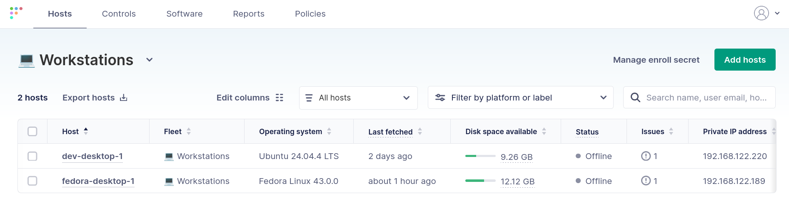
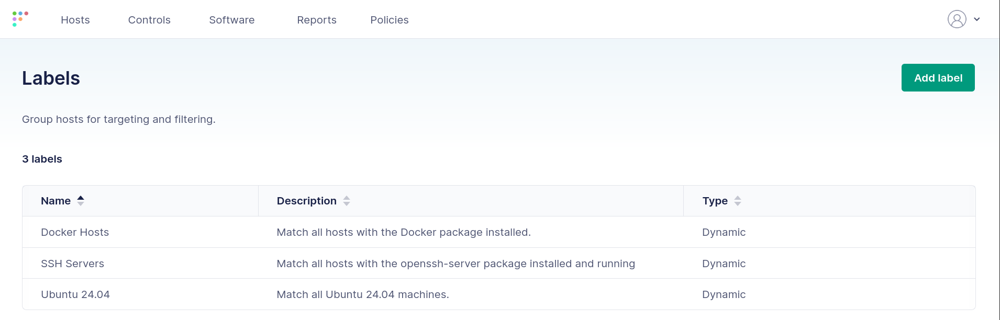
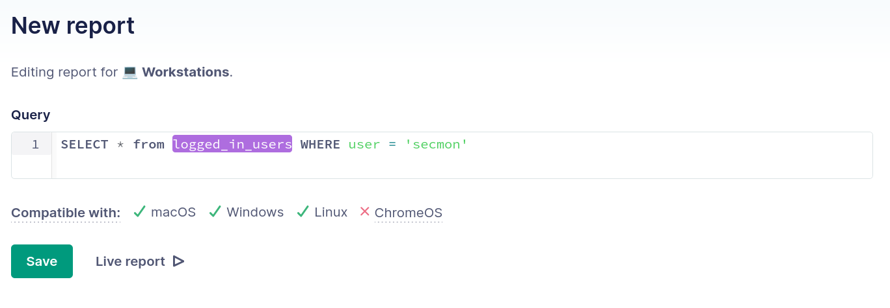
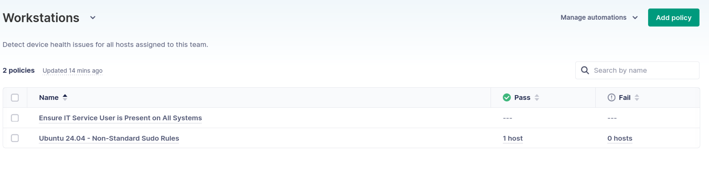
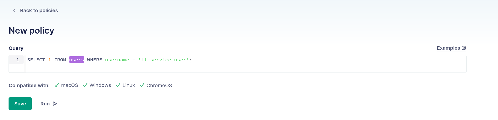

# Linux desktop inventory and visibility

The first step in any desktop management strategy is to understand your infrastructure. What hosts do you have? What operating systems and software versions are they running? How are they currently configured, and how does this compare with your organization's policies and rules?

Taking stock of your current environment isn't easy. Modern environments are heterogeneous and dynamic. This is especially true in the Linux desktop ecosystem, where choices result in a growing management burden.

In this article, we will discuss the importance of inventory and visibility when managing Linux desktops. Inventory and visibility involve more than simply keeping track of your hosts. Modern environments are dynamic, and they come with unique management challenges.

## Background

You can't manage any type of infrastructure without an accurate picture of your environment. Developing policy, identifying drift, remediating misconfigurations, and enforcing security controls all rely on continuous visibility.

Managing Linux devices adds unique challenges to your device management approach. The heterogeneous nature of Linux devices means that you must deal with different kernels, distributions, and configurations. To do this, you must consider how to track and gain visibility into your hosts.

## Tracking inventory

Modern environments are dynamic. Users switch roles, IT policies change, and devices aren't always connected to your network. An MDM platform must maintain an accurate host inventory despite constant change.

An ideal Linux desktop MDM will also track all of your devices (not just a subset) in one location. IT administrators don't need another tool to log into. They need a unified experience that provides visibility into their Windows, Mac, and Linux hosts from one location. They also need a common language to query devices across this heterogeneous desktop ecosystem.

A desktop management solution must also group and label hosts for visibility and management. For example, some hosts may have restrictive security requirements based on the data they access. Grouping and labeling hosts should be based on dynamic, continuously updated device state. This helps the MDM respond to the constantly changing environment that IT teams are expected to support.

Consider the following questions when evaluating a solution to see if it meets your MDM needs:

1. Can you manage all devices (Windows, Mac, and Linux) from a single location, or do you need to use multiple tools?
2. Does the tool support devices, such as end-user workstations, that often disconnect and reconnect to the network?
3. Can you group hosts or label them in ways that make sense for your organization? Does the system impose rigid restrictions around these groupings?
4. How difficult is it to add a new host to the system? Can this be easily automated?

## Visibility

Once you have an accurate inventory of your environment, you need visibility into host configuration and state. This visibility must be comprehensive. It should include static and configured information about a system. This includes OS versions, installed packages, and configured users. However, it must also include dynamic information about a system, such as running processes and open ports.

A good management platform must let you query your environment on a scheduled and as-needed basis. Not every aspect of your environment needs to be continuously monitored. Sometimes, you have a specific question that you only need answered once or on a scheduled basis. Ad-hoc and scheduled reporting give you this ability.

A common example is a newly discovered software vulnerability. You need to query your environment, find vulnerable hosts, and take action. You must be able to execute an ad-hoc query across your entire environment.

Similarly, you likely have occasional reporting needs. For example, you may want to determine free disk space across your environment every month. You may use this data to identify hosts with low disk space and proactively upgrade them.

Policy-based requirements require regular visibility into systems to ensure they are meeting external or organizational policies. For example, you may have a security requirement that forbids any workstation from running a listening service on ports 80 or 443. Your management system should ensure this policy is met and provide you with information about hosts failing the policy. A highly capable platform will also enable automatic remediation. Unlike ad-hoc or scheduled reports, policy-based requirements must be continuously monitored to ensure compliance.

Consider the following questions when evaluating the visibility features of an MDM solution:

1. Can the system provide visibility into static characteristics, configuration, and dynamic elements of your hosts?
2. Does the system support continuous policy evaluation, ad-hoc, and scheduled reports? Can these be configured using consistent tooling, or do they each require very different approaches?
3. Can you query heterogeneous systems, such as Windows, Mac, and different Linux distributions, using a consistent language and framework?

## Using osquery

The osquery utility is a cross-platform tool that exposes information about your systems as a SQL database. This provides a common, consistent language for inventory and visibility into the devices in your environment. It has a rich schema that exposes hundreds of tables and thousands of attributes about your devices.

For example, the query below looks for any users named "docker" on a system. It works equally well across Windows, Mac, and Linux.

```sql
SELECT uid, uuid, gid, username FROM users WHERE username = 'docker';
```

Using osquery is uniquely appropriate for visibility in heterogeneous environments. It uses platform-agnostic SQL query syntax to provide a consistent interface for querying your devices. This avoids the need to learn multiple tools for different platforms. It features an extensive set of data tables, many of which are cross-platform. This allows you to determine virtually anything about the hosts in your environment.

The osquery project has been around for over a decade. It is a mature, actively maintained, open-source project with over 23,000 stars on GitHub. The osquery binary runs in a very lightweight footprint on your hosts and imposes minimal overhead. However, osquery enables you to get information about one host at a time.

## Inventory and visibility in Fleet

### Host inventory

Fleet makes it easy to track host inventory over time and across tens, hundreds, or thousands of hosts. The Fleet agent, which includes osquery, is a lightweight software package that is installed on every device in your environment. Fleet provides packages for Windows, Mac, and Linux. The agent has a very small footprint, and it communicates with your Fleet server over TLS.

Once a host is connected with your Fleet environment, you can begin managing it. Fleet provides two key features for tracking host inventory: Fleets and Labels. Let's take a closer look at each.

#### Fleets

Fleets allow you to organize hosts into groups that you can report on, apply policies to, and configure. Fleets are tailored to your organization's specific tasks and compliance requirements. Since Fleet is cross-platform, you can manage Windows, Mac, and Linux workstations within a single fleet.

This approach allows you to define fleets based on business logic rather than arbitrary technical requirements. For example, you can have a fleet for all your workstations, another fleet for employee-owned devices, and a third fleet for company-issued mobile devices.

This contrasts with other tools that may require you to separate devices based on their operating system. This approach leads to duplication of effort and configuration drift. Fleet lets you manage all of your systems in one place.

Manage fleets by clicking on your user icon in the top-right corner and navigating to **Settings > Fleets**. New hosts can be added to a fleet automatically based on their enrollment secret, or you can manually move hosts between fleets by clicking the host and selecting **Actions > Transfer**. Move multiple hosts between fleets by navigating to the **Hosts** page, selecting all the desired hosts, and clicking **Transfer**.


*Hosts in a Workstations team*

#### Labels

Fleet also provides a mechanism for labeling hosts. Labels provide a method for targeted reporting and policy enforcement. For example, you can apply a "Docker" label to all of your workstations with Docker installed on them. This label can be used to target reports or policies (e.g., Ensure that all workstations running Docker have the latest version from your internal repositories).

Administrators can statically apply labels to a host, but their true power lies in dynamic labeling. Labels can be automatically applied based on reports. Since Fleet is built on osquery, you can easily apply labels based on virtually any system characteristic. For example, you could automatically label hosts with SSH enabled and running.

You create new labels by clicking on your user icon in the top-right corner and navigating to **Labels**. Click **Add label** to add a new label. Labels can be dynamic based on reports or IdP group, or they can be manual. A manual group allows you to add specific hosts, while dynamic groups provide the flexibility of report-based labeling.


*Labels can be dynamically applied to hosts based on reports*

### Reports and policies

#### Reports

Fleet's reporting capabilities are built on osquery. They allow you to quickly query your environment using a common language. Fleet lets you define reports to run on an as-needed or scheduled basis. You can also run ad-hoc reports directly against your environment without saving the reports for later use.

Since Fleet is built on osquery, you can easily write reports to learn virtually anything about your environment. These reports can target static system information, such as the operating system version. They can also target dynamic runtime information, such as running processes or open ports.

Since osquery is cross-platform, you can write reports that work across your Windows, Mac, and Linux devices. This reduces the cognitive burden of managing a heterogeneous environment. It also lets you build standardized reports across different systems.

Navigate to **Reports > Add report** to define a new report. The **New report** window prompts you for a report to run against your environment. It contains a helpful reference for osquery table information and will automatically check your report for operating system compatibility.



You can **Save** the report for later use. The **Save report** window allows you to specify an interval to run the report on a scheduled basis. You can specify **Never** to prevent the report from executing automatically. This is useful for reports that you want to manually run. You can always select and run a saved report from the **Reports** page. Click on its Name and choose **Live report**.

You don't have to save the report for later use. You can use a **Live report** to immediately execute your report against your environment without saving it. This is useful for exploratory or ad-hoc reports that you don't plan on reusing.

#### Policies

Policies are similar to reports (they both use osquery), but they are designed to answer "yes" or "no" questions about your environment. A regular report returns detailed information, but a Policy returns True or False. This allows you to define organizational policies and identify when hosts are failing those policies.

Fleet continuously monitors policy compliance and can take action if a violation occurs. For example, Fleet can run a script, install software, block single-sign-on, or trigger a webhook when a Policy violation is detected.


*Fleet policies allow you to monitor compliance with organizational rules*

Defining a policy is similar to defining a report. Navigate to **Policies > Add policy**. The **New policy** window is nearly identical to the **New report** window. It allows you to define a report for the policy that you want to enforce.

Reports for policies are treated differently from regular reports. If a policy report returns any result, then the policy is considered passing. If the report doesn't return a result, then the policy is considered failing. You will often see policy reports start with `SELECT 1…` to ensure they return a result if the report is successful.



Once you have refined your report, you can **Save** the policy. The **Save Policy** window prompts you for a policy name, description, and resolution. The description and resolution are helpful information for someone who is investigating a policy compliance issue. You can even use Fleet's AI capabilities to automatically generate a description and resolution based on the defined report.

The **Save Policy** window is also where you specify the hosts that the policy applies to. Fleet combines inventory and visibility, allowing you to target policies at hosts based on their operating system or dynamic labels.

Policies are a versatile concept in Fleet. You can use policies to automatically take actions, such as running a script or triggering a webhook, based on compliance. This allows your IT teams to automate common management workflows and quickly address noncompliance with organizational rules.

## Wrapping up

The very first step in managing an environment is understanding it. Nowhere is this more true than in Linux desktop management, where a heterogeneous environment introduces unique challenges.

Robust Linux desktop management requires a complete inventory of your hosts and visibility into their current state. You must be able to report on a variety of system characteristics and determine when your hosts aren't meeting your organization's policies. Ideally, you need to do this using a common language and framework that doesn't force your IT teams to learn another tool.

Fleet provides a cross-platform approach, built on osquery, that enables deep insight into your hosts. Inventory and visibility are only the first step in a complete Linux management strategy. The following chapters will build on these foundational concepts to enable drift management, automated software installation, and automatic remediation.

To learn more about Fleet or to get a demo [contact us](https://fleetdm.com/contact?utm_source=Fleet&utm_medium=OS&utm_campaign=2026_05-OS-Linux_desktop).

<meta name="articleTitle" value="Linux desktop inventory and visibility">
<meta name="authorFullName" value="Anthony Critelli">
<meta name="authorGitHubUsername" value="acritelli">
<meta name="category" value="articles">
<meta name="publishedOn" value="2026-05-18">
<meta name="description" value="Discover how to track and query Linux desktops at scale using Fleet and osquery: covering fleets, labels, ad-hoc reports, and compliance policies.">
