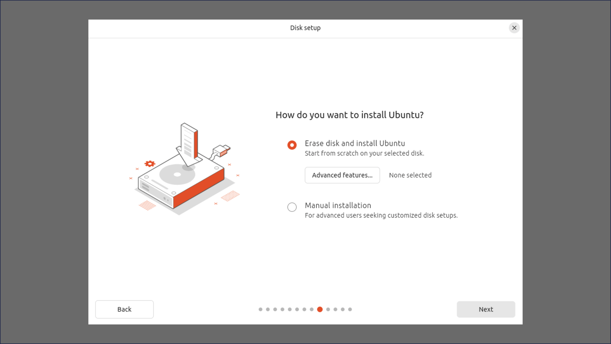
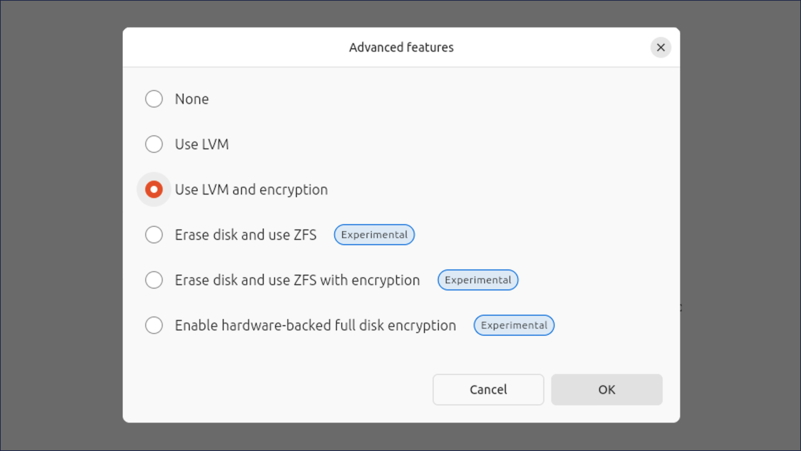
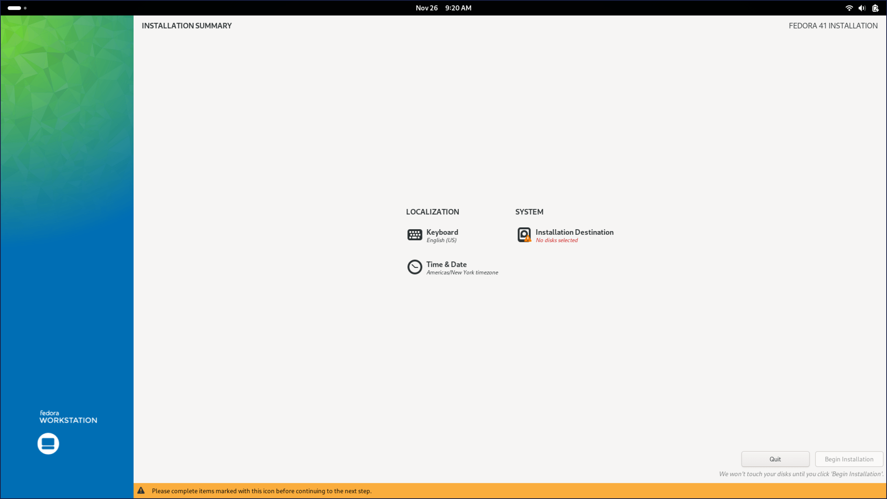
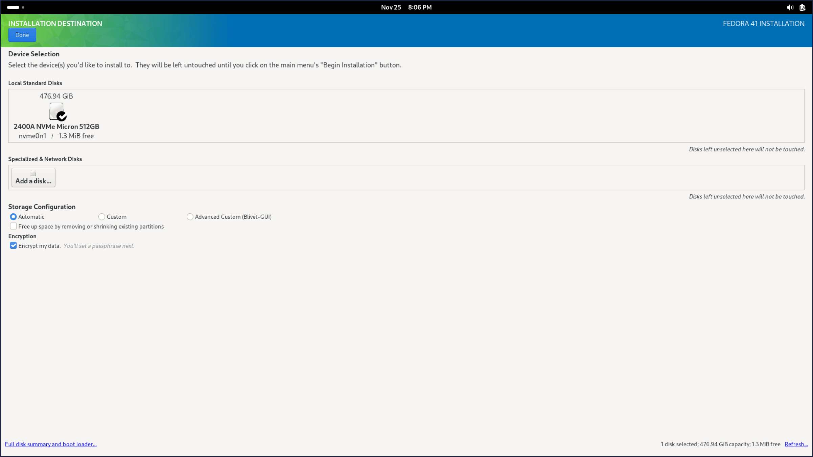

# Encrypt your Fleet-managed Linux device

> This guide is intended for new device setup. If the operating system has already been installed without enabling disk encryption, you will need to re-install in order to turn on full disk encryption.

LUKS (Linux Unified Key Setup) is a standard tool for encrypting Linux disks. It uses a "volume key" to encrypt your data, and this key is protected by passphrases. LUKS supports multiple passphrases, allowing you to securely share access or recover encrypted data. Fleet uses LUKS to ensure that only authorized users can access the data on your work computer. Fleet supports Linux Unified Key Setup version 2 (LUKS2).

Fleet securely stores a passphrase to ensure that the data on your work computer is always recoverable. To get your computer set up for key escrow, you will first need to enable disk encryption on your end, then provide your encryption passphrase to Fleet.

Currently, Fleet does not support escrowing Linux disk encryption keys on hosts that have multiple user accounts. For Linux hosts that need to have multiple user accounts, the best practice is to create and escrow the disk encryption before creating additional user accounts on the host.

Follow the steps below to get set up.


## 1. Enable encryption during installation

  #### Ubuntu Linux

  - When installing Ubuntu, choose the option to "Use LVM with encryption."
  - Set a strong passphrase when prompted. This passphrase will be used to encrypt your disk and is separate from your login password.

  
  
  

  #### Fedora Linux

  - During Fedora installation, under **Installation destination** > **Encryption** select the "Encrypt my data" checkbox.
  - Enter a secure passphrase when prompted.

  
  

## 2. Verify encryption

  - Once installation is complete, verify that your disk is encrypted by running:
    ```bash
      lsblk -o NAME,MOUNTPOINT,TYPE,SIZE,FSUSED,FSTYPE | grep -E 'crypt|LUKS'
    ```
  - **Ubuntu Linux**: Look for the root (`/`) partition, and confirm it is marked as encrypted.
  - **Fedora Linux**: Ensure the `/` (root) and `/home` partitions are encrypted.

## 3. Escrow your key with Fleet

> LUKS allows multiple passphrases for decrypting the volume. The original passphrase remains active along with the escrowed passphrase created by Fleet.

  - Open Fleet Desktop. If your device is encrypted, you'll see a banner prompting you to escrow the key.
  - Click **Create key**. Enter your existing encryption passphrase when prompted. Your passphrase is only used locally for authentication purposes during the next step and is not stored or sent to Fleet. 
  - Fleet will generate and securely store a new passphrase for recovery. This may take several minutes. A popup will appear when Fleet is done.

Now, your encryption status will update to "verified" in Fleet Desktop, meaning that the newly created recovery key has been successfully stored.

## Trigger the prompt programmatically

IT admins can trigger the escrow prompt on a host without waiting for the end user to open Fleet Desktop. The script below reads the host's [Fleet Desktop token](https://fleetdm.com/guides/fleet-desktop#secure-fleet-desktop) from `/opt/orbit/identifier` and calls the [Trigger Linux disk encryption escrow](https://fleetdm.com/docs/rest-api/rest-api#trigger-linux-disk-encryption-escrow-by-fleet-desktop-token) API endpoint. Fleet then shows the end user the same passphrase prompt they'd get by clicking **Create key** in Fleet Desktop.

Set `fleet_url` to your Fleet server's URL before running it.

```bash
#!/bin/bash
# Trigger Fleet's Linux disk encryption key escrow prompt on this host.
set -uo pipefail

fleet_url="https://fleet.example.com"
identifier_file="/opt/orbit/identifier"

if [[ ! -r "$identifier_file" ]]; then
  echo "Missing or unreadable Fleet Desktop token file: $identifier_file" >&2
  exit 1
fi

token="$(tr -d '[:space:]' < "$identifier_file")"
if [[ -z "$token" ]]; then
  echo "Fleet Desktop token is empty." >&2
  exit 1
fi

url="$fleet_url/api/v1/fleet/device/$token/mdm/linux/trigger_escrow"
response="$(mktemp)"
trap 'rm -f "$response"' EXIT

# Ubuntu Desktop doesn't include curl by default, so fall back to wget.
if command -v curl > /dev/null; then
  status="$(curl -s -o "$response" -w '%{http_code}' --connect-timeout 5 --max-time 20 -X POST "$url")"
elif command -v wget > /dev/null; then
  status="$(wget -O "$response" --content-on-error --timeout=20 --tries=1 --method=POST -S "$url" 2>&1 \
    | awk '/^  HTTP\//{code=$2} END{print code}')"
else
  echo "Neither curl nor wget is installed." >&2
  exit 1
fi

case "$status" in
  204)
    echo "Escrow prompt triggered."
    exit 0
    ;;
  409)
    echo "An escrow prompt is already in progress on this host."
    exit 0
    ;;
esac

if grep -q "already been escrowed" "$response"; then
  echo "A disk encryption key is already escrowed for this host. Nothing to do."
  exit 0
fi

echo "Failed to trigger escrow (HTTP $status): $(cat "$response")" >&2
exit 1
```

The script uses `curl`, or `wget` if `curl` isn't installed (Ubuntu Desktop doesn't include `curl` by default). It exits `0` when the prompt was triggered, when a prompt is already showing, or when Fleet already has a key for the host, so it's safe to run more than once. It exits `1` when Fleet rejects the request (for example, the disk isn't encrypted, disk encryption isn't turned on for the host's fleet, or fleetd is too old), and prints Fleet's reason.

> The escrow prompt will pop up on the host without warning. Let end users know ahead of time so it isn't unexpected. Someone has to be logged in to the desktop to enter the passphrase.

> The prompt closes after 60 seconds if the end user doesn't respond. On GNOME desktops (Ubuntu, Fedora) it can open behind other windows. If it times out, run the script again.
>
> After the end user enters their passphrase, it can take a few minutes for the key to show up in Fleet, especially on VMs. Don't run the script again while escrow is in progress.

## Trigger the prompt on all hosts in a fleet

To roll escrow out to every Linux host in a fleet, pair a policy that finds hosts without an escrowed key with a [policy automation](https://fleetdm.com/guides/policy-automation-run-script) that runs the script above.

1. **Add the script**: Go to **Controls** > **Scripts**, select the fleet, and upload the script above (with `fleet_url` set).
2. **Add the policy**: Go to **Policies**, select the fleet, and click **Add policy** > **Custom policy**. Use the query below, set the target to Linux, and save it.

    ```sql
    SELECT 1 WHERE NOT EXISTS (
      SELECT b.name
      FROM block_devices b
      JOIN cryptsetup_luks_salt c ON c.device = b.name
      WHERE b.type = 'crypto_LUKS'
      GROUP BY b.name
      HAVING COUNT(*) < 2
    );
    ```

    The policy fails on hosts where an encrypted disk has only one LUKS passphrase: the end user's. After escrow, Fleet's passphrase lives in a second key slot and the host passes. Hosts without disk encryption also pass, so the script isn't sent to hosts that can't escrow yet.

3. **Turn on the automation**: On the **Policies** page, click **Manage automations** > **Run script**, check the new policy, select the script, and click **Save**.

Fleet runs the script the first time a host fails the policy. If the end user closes the prompt without entering their passphrase, the host keeps failing, but Fleet won't run the script again. To keep prompting until the key is escrowed, set `continuous_automations_enabled: true` on the policy (Fleet Premium). Fleet then runs the script each time the host reports a failing result, which is hourly by default.

Track progress under **Controls** > **OS settings** > **Disk encryption**. Hosts move from "Action required" to "Verified" as keys are escrowed.

> If an end user has added their own extra LUKS passphrase, the host will pass the policy without an escrowed key. Check **Controls** > **OS settings** > **Disk encryption** for any hosts left in "Action required".


<meta name="articleTitle" value="Encrypt your Fleet-managed Linux device">
<meta name="authorFullName" value="Rachael Shaw">
<meta name="authorGitHubUsername" value="rachaelshaw">
<meta name="category" value="guides">
<meta name="publishedOn" value="2024-11-25">
<meta name="description" value="Instructions for end users to encrypt Linux devices enrolled in Fleet.">
<meta name="keywords" value="Linux MDM, Linux device management, open source MDM, Linux management, Linux disk encryption, Linux key escrow" />
