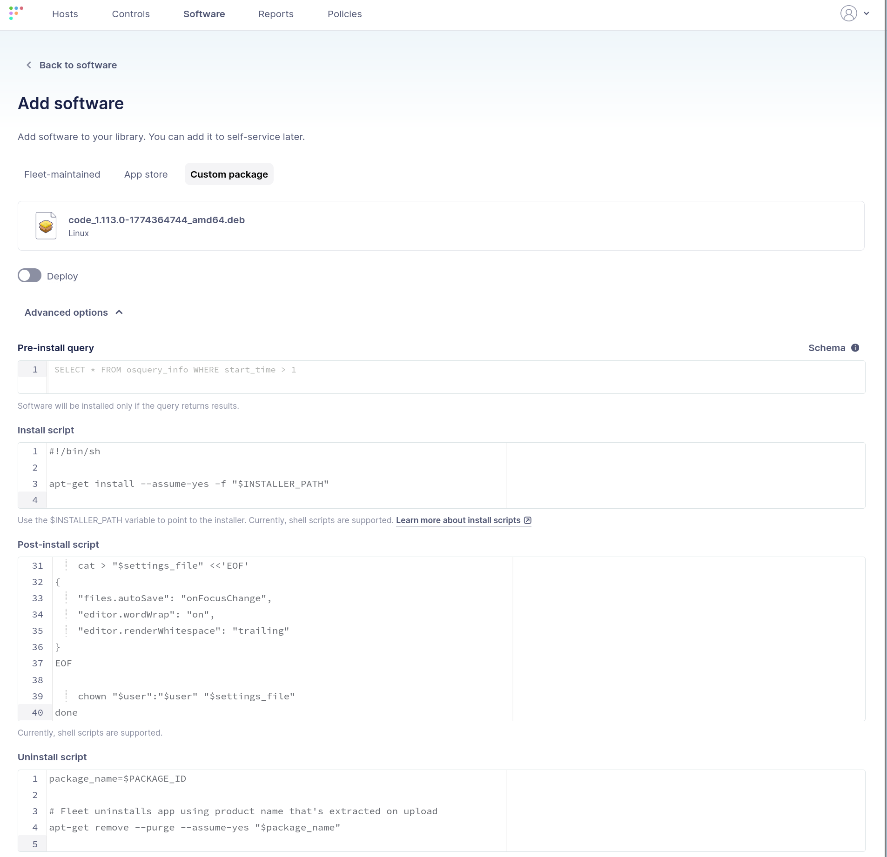
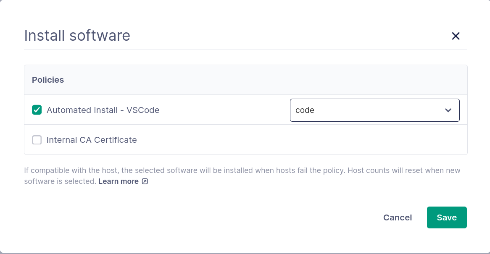
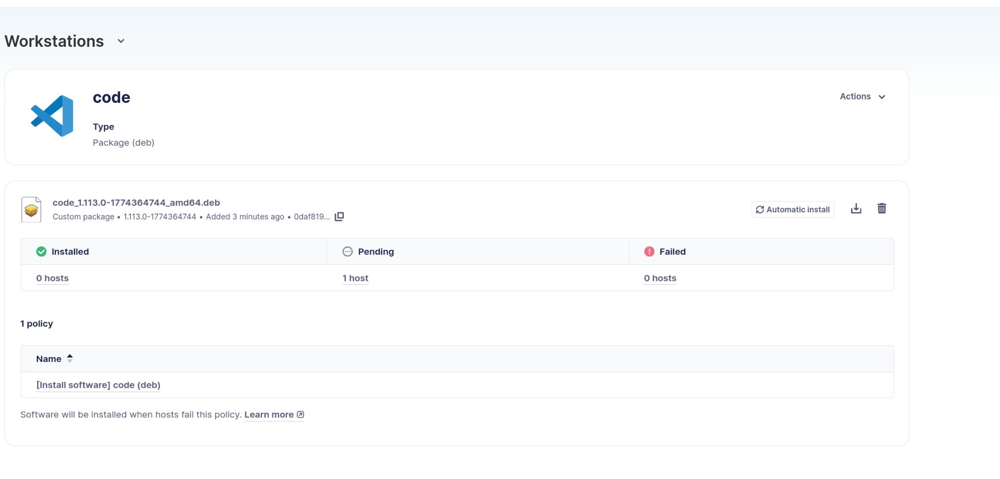
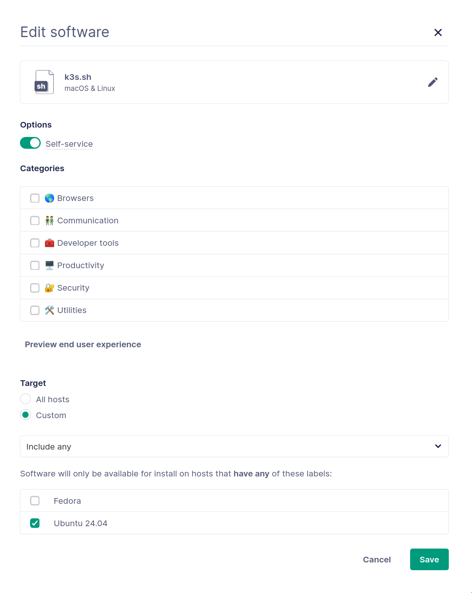
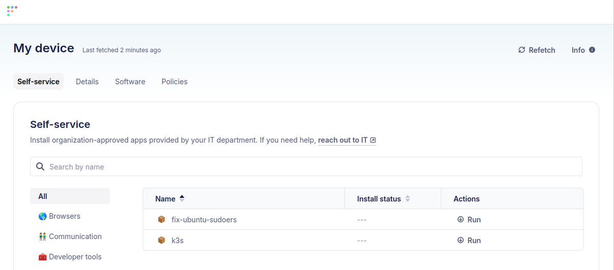

# Automated software provisioning and self-service for Linux desktops

If you ask most organizations to describe their Linux desktop user experience, they will probably describe it as slow and tedious. Many organizations don't provide any official support for Linux workstations. Those who support Linux frequently lack robust tools and processes for managing these devices. They are happy to have simple visibility into their Linux desktop hosts.

Setting up and maintaining a Linux workstation is a substantial burden for end-users and IT teams. Windows and Mac users have the opposite experience. They begin working immediately on systems that are properly configured for their role. Ongoing management is provided via self-service, not slow and manual processes.

It's time for organizations to change their approach, especially as Linux desktop adoption increases. Fixing the slow and error-prone approach to Linux desktop management isn't just about feature parity with Windows and Mac. It's about truly enabling the highly technical end-users of these systems to do their best work, as quickly as possible.

## The challenges of Linux desktop management

Setting up a Linux workstation can be challenging and time-consuming, especially for IT teams with limited Linux experience. This burden is shouldered by the desktop management team or, in many cases, the end-users themselves.

IT departments usually have mature processes in place for bootstrapping Windows and Mac workstations. However, the heterogeneous nature of the Linux ecosystem, combined with the personal preferences of Linux desktop users, makes it difficult to onboard Linux workstations. Linux has traditionally lacked a robust MDM platform.

Server administration tools, such as Ansible or Puppet, address standardization in the Linux server realm. However, they aren't easily applicable to Linux desktops. Server management paradigms assume a "cattle vs. pets" philosophy, where an environment is homogeneous. The desktop ecosystem, where users are expected to customize their own workstations to meet their needs, does not fit neatly into the philosophy of these tools.

A mature Linux desktop management approach does more than reduce the visibility blind spot of Linux devices. It acts as a true force multiplier for end users. By adopting tools and processes that increase end-user velocity, IT teams can help those users work faster and more efficiently. When done correctly, this approach also reduces the burden for the IT teams themselves.

## Linux desktop user capabilities

Linux users are usually very technical, but they aren't always skilled with Linux desktop management. Managing a personal Linux device, managing a Linux server, and managing a device in an enterprise setting are all very different. Similarly, writing code that runs on a Linux server is vastly different from maintaining a Linux desktop, even if abstractions such as containers have made this easier.

Most organizations lack robust tooling to handle Linux desktops. The configuration burden is pushed onto end-users because the organization assumes they are technically proficient enough to manage their own systems. Without an MDM, these users end up spending valuable time setting up and troubleshooting their workstations.

Allowing end-users to "figure it out themselves" also introduces security problems. Will the user install the correct versions of the packages they need? Will they install software that is secure and trusted from a company-approved repository? Will they be able to configure the software correctly, or will they end up with a configuration that leaves their workstation more vulnerable to attack?

Organizations must provide their users with automated configuration and self-service capabilities. This tooling should provide known-good configurations and software installations to reduce the toil and misconfiguration associated with Linux desktop management. Windows and Mac administrators have done this for years. It's time to apply the same approach to Linux desktops.

## User software needs

Every user must have a workstation that is configured correctly, securely, and with the tools they need to do their job. Windows and Mac have largely solved this problem. Desktop administrators can automatically onboard and configure a device as soon as it is turned on.

A new user sits down at a computer with everything installed and configured. When they need another tool, they use a software catalog to install and configure the correct version securely. This vividly contrasts with the Linux desktop user's experience at most organizations.

Initial configuration and ongoing "self-service" are often provided by loosely maintained documentation and scripts. These are rarely supported by official sources. They may even be written by other Linux desktop users based on experience instead of organizational best practices.

### Feature parity for Linux users

Organizations must provide their Linux desktop users with an experience that rivals their Windows and Mac counterparts. Employees should be able to focus on their actual job, and not on setting up, configuring, and securing their workstation. As their jobs change and they need additional software, employees should be able to easily update their systems. By enabling this experience, IT teams will increase end-user velocity and allow users to focus on getting the right work done.

A Linux desktop management strategy must consider two aspects of software installation and system configuration:

- Automated software provisioning and system configuration for new systems
- Ongoing self-service for existing workstations

### Automated provisioning

Automated provisioning isn't simply imaging a new system. Installing the operating system is only the first step. Software must be installed and configured to meet your organization's goals and desired configurations.

Bash scripts, installation packages, Ansible playbooks, and other tools can all be used to automate software deployment on Linux. Many organizations have a collection of scripts to help Linux users. However, they aren't usually deployed in a consistent and approachable manner.

These tools must provide an end-to-end experience for a new Linux desktop user. A new developer shouldn't have to reference internal wiki articles, run random Bash scripts, and troubleshoot failed package installations. Rather, the organization should provide them with a seamless experience that configures their workstation correctly as soon as they start using it.

### Self-service

Users' needs change over time. New software projects require different tools, a developer may want to try out a new database technology, and your security team might deploy a new VPN for remote workers. Can your organization respond to these changes for Linux desktops without manual effort?

Windows and Mac administrators provide their users with a self-service catalog of software and configurations. The user experience involves selecting the needed software and clicking the "Install" button. Automation handles the rest.

This experience should be the same for Linux desktop users. A robust self-service platform eliminates reliance on outdated documentation and institutional knowledge. It empowers users to configure their workstations on demand with assurance that the configuration is vetted and safe.

## Software management and self-service with Fleet

Fleet provides mature capabilities for automated software provisioning and self-service for Windows, Mac, and Linux. Fleet leverages osquery, a best-in-class tool to query information across your hosts. This allows you to carefully scope automated software installations and access to self-service capabilities.

Fleet's mature capabilities grant Linux users feature parity with Windows and Mac users. This shifts Linux from an exception-based management model to an approach that mirrors Windows and Mac desktop management. Ultimately, this allows Linux users to be faster and more productive.

### Software management

Every organization has a set of tools that new employees need on their workstations. Ideally, this complement of tools reduces onboarding time for a new employee and allows them to start contributing immediately. Let's consider a simple example that every developer needs: an Integrated Development Environment (IDE).

Every new developer needs an IDE installed and configured before they can write any code. Visual Studio Code is a popular choice across Windows, Mac, and Linux. Installing Visual Studio Code is theoretically very easy: just download the package and run the installation.

This simplicity masks the toil that is involved for an end user. Installing and configuring an IDE actually consists of several steps:

1. Find the appropriate package.
2. Manually install additional packages, such as Git, that are used in the development workflow.
3. Install the IDE.
4. Configure the IDE, usually by referencing code snippets or Wiki documentation that may not be updated regularly. For example, an organization may require a specific linter configuration.

The current approach relies on institutional knowledge and manual effort. It's brittle, prone to misconfiguration, and slow for an end-user.

Let's see how we can expedite this process with Fleet to deploy a fully-functional IDE without any manual effort. The example used here is Visual Studio Code with a sample configuration, but this process is equally applicable to any software that your organization uses.

First, we need to download the appropriate package for our Linux distribution. This guide uses a `.deb` file for Ubuntu and Debian-based distributions, but the steps are the same for other distributions.

Next, navigate to **Software > Add software > Custom package** and upload the `.deb` file.

We can use a post-install script to configure the newly installed IDE with a basic `settings.json` file with our organizational preferences. The example script below iterates over user home directories, briefly launches Visual Studio Code to bootstrap Code's directory structure, and then places a basic `settings.json` file into Code's configuration directory. Add this script by expanding **Advanced options**.

```bash
#!/bin/bash

for homedir in /home/*; do
  # Skip non-directories
  [ -d "$homedir" ] || continue

  user="$(basename "$homedir")"
  code_dir="$homedir/.config/Code"
  user_dir="$code_dir/User"
  settings_file="$user_dir/settings.json"

  # If Code/User does not exist, create it by running VS Code once
  if [ ! -d "$user_dir" ]; then
    echo "Code/User not found for $user -- creating via 'code -s'"

    # Run VS Code as the user (non-interactive, creates config dirs)
    sudo -u "$user" code -s >/dev/null 2>&1

    # VS Code may take a moment to create directories
    sleep 1
  fi

  # Now check again; if still missing, create directories manually
  if [ ! -d "$user_dir" ]; then
    mkdir -p "$user_dir"
    chown -R "$user":"$user" "$code_dir"
  fi

  echo "Writing settings.json for $user"

  cat > "$settings_file" <<'EOF'
{
  "files.autoSave": "onFocusChange",
  "editor.wordWrap": "on",
  "editor.renderWhitespace": "trailing"
}
EOF

  chown "$user":"$user" "$settings_file"
done
```

The final configuration is shown below. Click **Add software** to upload the package.



Next, we need to create a policy to install the software. To create a policy:

1. Navigate to **Policies > Add policy**
2. Specify a query to evaluate the installation status of Visual Studio Code: `SELECT 1 FROM deb_packages WHERE name = 'code'`
3. Click **Save**
4. Provide a **Name**, **Description**, and **Resolution** for the policy
5. Adjust the **Target** for the policy to the appropriate hosts in your environment. For example, the policy should target Linux. You may also choose to target specific hosts based on labels.
6. Click **Save**

Fleet must be configured to automatically install the Visual Studio Code package if the policy evaluation fails. To configure this automation:

1. Navigate to **Policies > Manage automations > Software**
2. Select the policy created in the previous step
3. Adjust the package installation to use `code`
4. Click **Save**



Fleet will automatically install the package on any hosts that fail this policy evaluation. Newly imaged hosts that are connected to Fleet will not have Visual Studio Code installed. They will fail the policy, and Fleet will automatically install the package and configuration without user intervention.

This approach saves your users hours by automatically installing the software they need to start being productive. Because software is targeted using Fleet policies, you can target systems based on nearly any piece of information that you can imagine.

Fleet also provides visibility into the package's installation status. This allows you to monitor compliance and is particularly useful for mandatory tools, such as endpoint protection software. Navigate to **Software** and click on the software to view its installation status.



### Desktop self-service

Performing initial system setup is only one aspect of a desktop management strategy. Users change teams, they begin working with different technologies, and their software needs change. You must be able to respond to these changes by providing self-service capabilities.

Consider a common piece of software that is used for developing in Kubernetes environments: K3s. K3s is a lightweight Kubernetes distribution. Installing K3s only involves running an installation script, but there can be nuances to its installation.

The most obvious challenge with any software is versioning. You want to make sure your users are all using a supported version of a tool. For Kubernetes, you may even want all developers to develop against the same version.

If you let an end-user run the installation without any guidance, then their desktop environment is unlikely to resemble the desired configuration. Let's see how we can make this process easier using Fleet.

First, we need to wrap the K3s installation script in a Bash script that we can upload to Fleet:

```bash
#!/bin/bash
set -euo pipefail

wget -qO - https://get.k3s.io | INSTALL_K3S_VERSION=v1.34.6+k3s1 sh -

exit 0
```

With Fleet, you can treat a script like any other software package. To upload the script:

1. Navigate to **Software > Add software > Custom package**
2. Upload the script from your computer
3. Click **Add software**

You will be automatically redirected to the software's main page. Next, we need to enable self-service for the software. To enable self-service:

1. Click **Actions > Edit software**
2. Enable the toggle next to **Self-service**
3. Adjust the **Target** to make the software available only on hosts that match a particular label.
4. Click **Save**

The final configuration is shown below:



End-users can install K3s on their workstation by selecting **Self-service** from the Fleet icon in their taskbar. This launches the Fleet Desktop Self-service page and allows users to search for and install approved packages:



## Wrapping up

Desktop management isn't just about monitoring and compliance. It's about enabling users with a fast and seamless work experience. Linux users have spent years fending for themselves with brittle processes and configurations that lacked true IT support. IT teams have similarly been challenged by extensive manual effort to support these users.

Providing automated provisioning and self-service reduces toil for both users and IT teams. Users get the experience of a fully-configured work environment that's ready to go on their first day. They can easily install new software or configure their workstation through self-service by using IT-approved scripts and installation packages. IT teams no longer have to handle these requests through slow and error-prone manual processes.

Fleet offers software management capabilities for Windows, Mac, and Linux hosts. Its automated provisioning capabilities enable your users to be immediately productive, and the self-service Fleet Desktop portal lets them adapt as their software needs change.

To learn more about Fleet or to get a demo [contact us](https://fleetdm.com/contact).

<meta name="articleTitle" value="Automated software provisioning and self-service for Linux desktops">
<meta name="authorFullName" value="Anthony Critelli">
<meta name="authorGitHubUsername" value="acritelli">
<meta name="category" value="articles">
<meta name="publishedOn" value="2026-05-18">
<meta name="description" value="Give Linux desktop users the same automated provisioning and self-service experience as Windows and Mac, powered by Fleet.">
