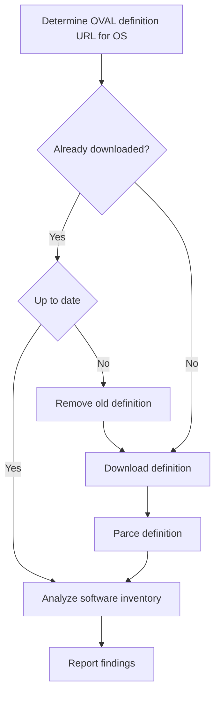

# Linux vulnerability detection with OVAL and Fleet

Basically, vulnerability detection is just checking for particular vulnerable states on a system. For example, if a host has FooBar 2.0.1 or earlier installed and the contents of `/ect/foobar.config matches isSecure=false`, then we can say the host is susceptible to CVE-1 and CVE-2. If we had a dataset matching known vulnerabilities to declarative statements about the system state, we could use the data collected from osquery to perform linux vulnerability assessment and enter OVAL®.

Open Vulnerability and Assessment Language (OVAL) is an international information security community standard to promote open security content and to standardize the transfer of this information across the entire spectrum of security tools and services. You can read more about it on OVAL's site. The main thing to know is that the OVAL standard provides a way to define the system state in a structured manner. We refer to this structured artifact as an OVAL definition.

OVAL expresses definitions using the XML format. Definitions sit at the top of the XML file. Each definition is composed of one or more criteria, one or more vulnerabilities, and other metadata. Each piece of criteria references a test. The criteria can have other nested criteria, forming a logic tree. If the criteria logic tree contained in a definition evaluates to true, then we say that the system in question is susceptible to the vulnerabilities contained in the definition.

OVAL tests can target a wide range of system states, from network interface configuration to contents of files. But since we’re focusing on vulnerabilities related to the software inventory of a host, we only need to parse and evaluate a subset of those tests. Each software inventory test is defined as an assertion about a software object, like a package name, and one or more assertions about that object state, which are mostly related to the software version. To keep things simple, we’ll say that software tests are written in terms of names and versions.

The availability of OVAL definitions varies depending on the target OS. Still, looking at the official OVAL repository, we can see that the security teams of Canonical and RedHat provide and maintain OVAL definitions for many of their releases. They parse and process these definitions to let us perform linux vulnerability detection on any Ubuntu or RedHat-based distros. 

We’ll go into more detail about how we use OVAL for detecting software vulnerabilities on the most popular distros (Ubuntu, CentOS, Fedora, and RedHat). But first, let’s look at the vulnerability detection pipeline from a bird’s-eye view.

## Determining what OVAL definitions to download

All OVAL definitions are tied to a particular OS version. This means the first step in our vulnerability detection pipeline is to check which OS versions exist in the fleet. Then we map that to one or more OVAL definitions. After determining the name, the major version, and the minor version of the OS of each host, we use this map to get the URL of the proper OVAL definitions.

It takes a little more work to determine which OVAL definitions to download for RHEL-based distros. If we look at Fedora, there is no one-to-one relationship between RHEL versions and Fedora versions. The following table shows the translations we use for RHEL-based distros.

| Source | Target RHEL version |
|:--------|:--------|
| Amazon Linux 2.0.0 | RHEL 7 |
| Fedora 12 - 18 | RHEL 6 |
| Fedora 19 - 27 | RHEL 7 |
| Fedora 28 - 33 | RHEL 8 |
| Fedora 34 - 36 | RHEL 0 |

When the Fleet server downloads the OVAL definitions in a previous run, we need to confirm the existing definitions are up to date. Ideally, we only want to download and process the definitions if and when they’re updated. We’re working on improving this process, but to keep the implementation simple, we mark any definitions older than one day as stale, remove stale definitions, and download a fresh copy.

## Parsing OVAL definitions

Depending on the target OS platform, the OVAL standard defines different elements. In the context of software inventory tests for RHEL-based systems, we have the `therpminfo_test` element. For Debian-based systems, we have the `dpkginfo_test` element.

As we said earlier, all software inventory tests are defined in terms of names and versions. So, it makes sense to standardize the different variations into some common data structure. Since we expect the linux vulnerability detection process to run multiple times per day, one of the goals when designing all this was to make the whole process as lightweight as possible. That’s why we decided to parse the XML OVAL definitions into a lighter format. 

We also need to make sure that any produced artifacts can be easily introspected by anyone, so we decided to output the parsed XML files as JSON. Here’s a table comparing the original file size of the OVAL definitions to the produced JSON artifacts at the time of this writing.

| Platform | XML file size (approx) | Artifact size (approx) |
|:--------|:--------|:--------|
| Ubuntu 14.04 | 9.1 MB | 971 KB |  
| Ubuntu 16.04 | 9.8 MB | 985 KB |
| Ubuntu 18.04 | 9.1 MB | 971 KB |
| Ubuntu 19.10 | 16 MB | 1.6 MB |
| Ubuntu 20.04 | 5.0 MB | 465 KB |
| Ubuntu 21.04 | 926 KB | 199 KB |
| Ubuntu 21.10 | 1.4 MB | 146 KB |
| Ubuntu 22.04 | 514 KB | 43 KB |
| RHEL 6 | 15 MB | 3.7 MB |
| RHEL 7 | 19 MB | 4.8 MB |
| RHEL 8 | 14 MB | 4.0 MB |
| RHEL 9 | 431 KB | 121 KB |

## Analyzing software inventory

Once we’ve downloaded and parsed the required OVAL definitions, the next step in our pipeline is to look at the software inventory of each host and use that to evaluate the tests in the OVAL definitions. 

Earlier we said that software tests are written in terms of assertions about names and versions. The name portion of a test is expressed as one or more string literals, and the version portion allows for more variation but is usually expressed in terms of an EVR string. (Learn more about how to compare EVR strings.) We say that a software test evaluates to true if both the assertions about its name and version are true.

After we’ve evaluated all software tests, we look at all the definitions. For each definition, we substitute the test result on the related criteria and evaluate the logic tree defined by the criteria. If it evaluates to true, then we say the host is susceptible to the vulnerabilities contained in the definition.

Once all vulnerabilities are collected, we synchronize the results with what we’ve already stored in the database. Patched vulnerabilities are removed (vulnerabilities that are not present in the result set but exist in the database), and new vulnerabilities are stored (vulnerabilities that are present in the results set but not in the database). If webhooks' automations are enabled, then any newly discovered vulnerability is sent to any configured webhook.

<meta name="category" value="engineering">
<meta name="authorGitHubUsername" value="juan-fdz-hawa">
<meta name="authorFullName" value="Juan Fernandes">
<meta name="publishedOn" value="2022-07-29">
<meta name="articleTitle" value="Linux vulnerability detection with OVAL and Fleet">
<meta name="articleImageUrl" value="../website/assets/images/articles/linux-vulnerability-detection-with-oval-and-fleet-1600x900@2x.jpg">
