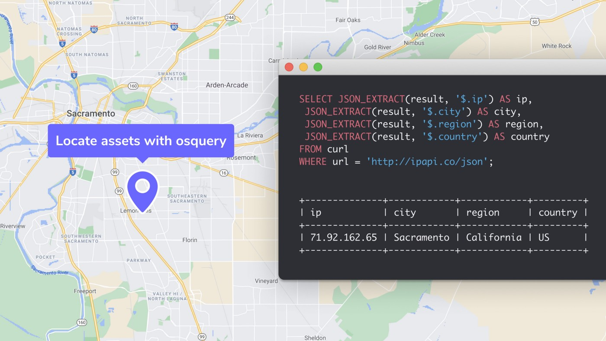

# Locate device assets in the event of an emergency.

## A simple query for IP-Geolocation



In the event of an emergency or public safety concern, osquery can be easily used to identify employees the direct vicinity, so that teams can push warnings or safety precautions to their staff.

This simple strategy for obtaining the location of an osquery device utilizes the [ipapi.co](https://ipapi.co/) API to retrieve the IP geolocation of the device. Note that the device must be able to connect to the internet over HTTP, and the calculated location may be skewed by VPN, proxies, etc.

**Query:**

```
SELECT JSON_EXTRACT(result, '$.ip') AS ip,
 JSON_EXTRACT(result, '$.city') AS city,
 JSON_EXTRACT(result, '$.region') AS region,
 JSON_EXTRACT(result, '$.country') AS country
FROM curl
WHERE url = 'http://ipapi.co/json';
```

**Sample result:**

```
+--------------+------------+------------+---------+
| ip           | city       | region     | country |
+--------------+------------+------------+---------+
| 71.92.162.65 | Sacramento | California | US      |
+--------------+------------+------------+---------+
```

Other techniques
A common technique for geolocation of macOS devices with osquery is to use the `wifi_survey` table in combination with the [Google Geolocation API](https://developers.google.com/maps/documentation/geolocation/intro#wifi_access_point_object). This strategy has become more difficult to use due to security controls introduced in macOS 10.15, and poses privacy concerns due to the precision of the location data returned by the API.

<meta name="category" value="guides">
<meta name="authorGitHubUsername" value="zwass">
<meta name="authorFullName" value="Zach Wasserman">
<meta name="publishedOn" value="2021-05-11">
<meta name="articleTitle" value="Locate device assets in the event of an emergency.">
<meta name="articleImageUrl" value="../website/assets/images/articles/locate-assets-with-osquery-cover-700x393@2x.jpeg">
