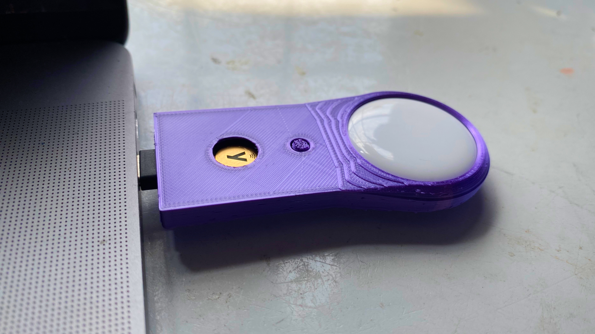
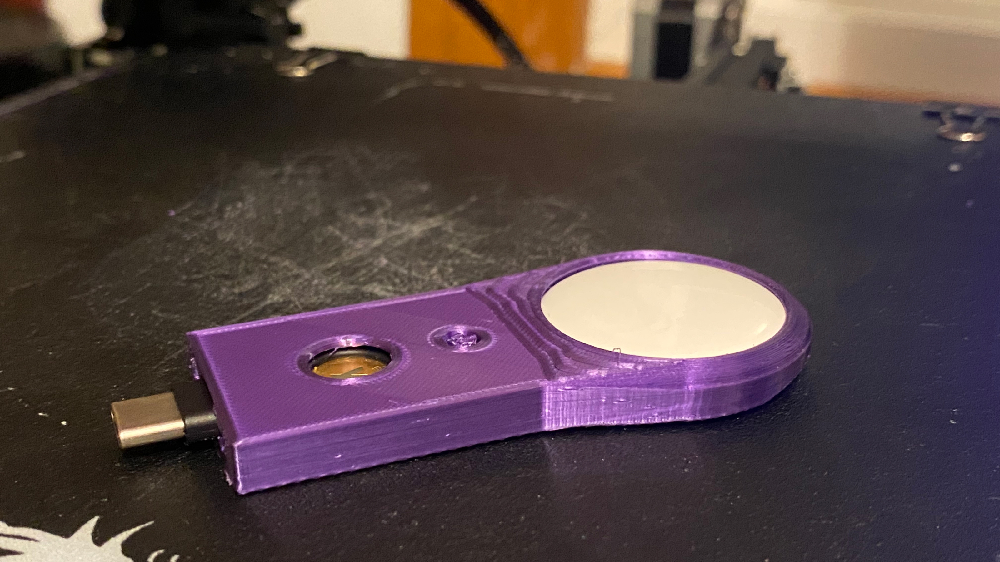

# Lossless YubiKeys with Yubitrak and AirTag

As a long-time fan of the [FIDO Alliance](https://fidoalliance.org/), I have built quite a collection of hardware security keys over the years.

I can currently count four on my desk, five if my [Flipper](https://flipperzero.one/) counts.

I used to need multiple keys not just for backup purposes but also to access accounts from different devices. USB-A, USB-C, Bluetooth, NFC, you name it. Thanks to the adoption of USB-C and NFC, I could finally get rid of most of the keys and standardize on one model: the [YubiKey 5C NFC](https://www.yubico.com/ca/product/yubikey-5c-nfc/). 

It works on my Mac and iPad Pro via USB-C and my phone via NFC. So now that I only need two keys for backup purposes, I can finally get rid of an extensive note in my password manager that tracked which key is connected to which account. 

That left me with one problem: these keys are relatively small, and I always lose stuff. As someone using the Apple ecosystem, I thought, wouldn't it be great if Yubico made YubiKeys with *Find My* integration? It would require a battery in the key, but seeing as it's plugged in so often, that could work. 

Unfortunately, hoping a company creates a niche product is not a winning strategy, so I decided to
do something about it. Why not 3D print a case that could hold my YubiKey securely, along with an
AirTag?

Many would say: why don't you just put it on your keychain? Then put the AirTag on the same keychain! While that works, I use Yubikeys many times a day to sign in to different sites and to sign [git commits](https://developers.yubico.com/PGP/Git_signing.html). I definitely wouldn't want my actual keys stuck to my laptop all day. The real reason, however, is that this is way more *fun*.

I have zero 3D design skills, so I got in touch with [Alexander Surdu](https://github.com/surdoozaphonics), who has the skills and the equipment. I highly recommend [contacting him](https://www.surdoozaphonics.com/3d-modeling) if you need help designing such a gadget.

We brainstormed a few ideas, but it quickly became apparent that we could not stack the AirTag on top of the YubiKey. The thickness of both devices would not allow us to connect the pair to a USB-C port. Instead, we decided to put the AirTag behind the YubiKey.

Then, we needed to find a way to keep the key secure. Fortunately, the key already has a keychain hole, so Alex suggested adding a pin to completely secure the key to the top and bottom parts of this contraption.

The increased size will help me not lose the key in my office, so I expect I'll have to use the AirTag functionality rarely. 

You can find the 3D models (STL files), more photos, and some printing instructions in the [Yubitrak](https://github.com/GuillaumeRoss/yubitrak/) repository.

If you do end up printing and using one, I would love for you to Tweet photos of them to [@fleetctl](https://twitter.com/fleetctl).

If you think this could be a good idea as conference swag, let us know in the [#Fleet](http://fleetdm.com/slack), and I might bring a few to our [DEF CON workshop](https://forum.defcon.org/node/241778)!

<meta name="category" value="security">
<meta name="authorGitHubUsername" value="GuillaumeRoss">
<meta name="authorFullName" value="Guillaume Ross">
<meta name="publishedOn" value="2022-06-16">
<meta name="articleTitle" value="Lossless YubiKeys with Yubitrak and AirTag">
<meta name="articleImageUrl" value="../website/assets/images/articles/lossless-yubikeys-with-yubitrak-and-airtag-cover-1600x900@2x.jpg">
