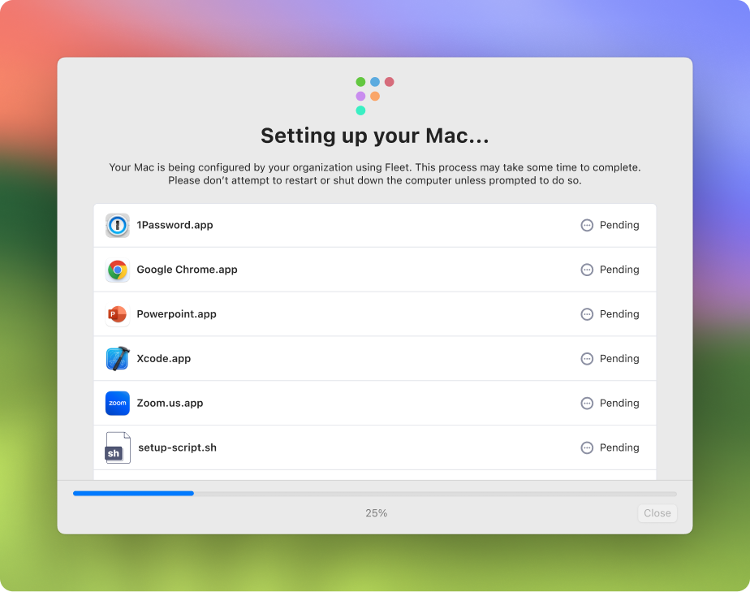

# macOS setup experience

_Available in Fleet Premium_

In Fleet, you can customize the out-of-the-box macOS Setup Assistant with Remote Management and Automated Device Enrollment (ADE) for end users:

* Require end users to authenticate with your identity provider (IdP) and agree to an end user license agreement (EULA) before they can use their new Mac.

* Customize the macOS Setup Assistant by choosing to show or hide specific panes.

* Install a bootstrap package to gain full control over the setup experience by installing tools like Puppet, Munki, DEP notify, custom scripts, and more.

* Install software (App Store apps, custom packages, and Fleet-maintained apps).

* Run a script.

In addition to the customization above, Fleet automatically installs the fleetd agent during out-of-the-box macOS setup. This agent is responsible for reporting host vitals to Fleet and presenting Fleet Desktop to the end user.

macOS setup features require connecting Fleet to Apple Business Manager (ABM). Learn how [here](https://fleetdm.com/guides/macos-mdm-setup#apple-business-manager-abm).

## End user authentication and EULA

Using Fleet, you can require end users to authenticate with your identity provider (IdP) and agree to an end user license agreement (EULA) before they can use their new Mac.

### End user authentication

To require end user authentication, first configure your MDM IdP integration by heading to
**Settings > Mobile device management (MDM) > End user authentication**. Then, enable end user
authentication by heading to to **Controls > Setup experience > End user authentication**.
Alternatively, you can use [Fleet's GitOps workflow](https://github.com/fleetdm/fleet-gitops) to configure your MDM IdP integration and enable end user authentication.

If you've already configured your MDM IdP integration in Fleet, create a new SAML app in your IdP. In your new app, use `https://<your_fleet_url>/api/v1/fleet/mdm/sso/callback` for the SSO URL.

In your IdP, make sure your end users' full names are set to one of the following attributes (depends on IdP): `name`, `displayname`, `cn`, `urn:oid:2.5.4.3`, or `http://schemas.xmlsoap.org/ws/2005/05/identity/claims/name`. Fleet will automatically populate and lock the macOS local account **Full Name** with any of these.

In your IdP, set **Name ID** to email. Fleet will trim this email and use it to populate and lock the macOS local account **Account Name**. For example, a "johndoe@example.com" email turn into a "johndoe" account name.

### EULA

To require a EULA, in Fleet, head to **Settings > Integrations > Automatic enrollment > End user license agreement (EULA)** or use the [Fleet API](https://fleetdm.com/docs/rest-api/rest-api#upload-an-eula-file).

## Bootstrap package

Fleet supports installing a bootstrap package on macOS hosts that automatically enroll to Fleet.

This enables installing tools like [Puppet](https://www.puppet.com/), [Munki](https://www.munki.org/munki/), or [Chef](https://www.chef.io/products/chef-infra) for configuration management and/or running custom scripts and installing tools like [DEP notify](https://gitlab.com/Mactroll/DEPNotify) to customize the setup experience for your end users.

The following are examples of what some organizations deploy using a bootstrap package:

* Munki client to install and keep software up to date on your Macs

* Puppet agent to run custom scripts on your Macs

* Custom scripts and several packages bundled into one bootstrap package using a tool like [InstallApplications](https://github.com/macadmins/installapplications) to install a base set of applications, set the Mac's background, and install the latest macOS update for the end user.

To add a bootstrap package to Fleet, we will do the following steps:

1. Download or generate a package
2. Sign the package
3. Upload the package to Fleet
4. Confirm package is uploaded

### Step 1: download or generate a package

Whether you have to download or generate a package depends on what you want to deploy using your bootstrap package:

* A single client or agent, like Munki or Puppet, can usually be downloaded from the tool's GitHub repository or website. For example, you can download Munki, the Munki client on their [releases page on GitHub](https://github.com/munki/munki/releases).

* To deploy custom scripts, you need to generate a package. The [munkipkg tool](https://github.com/munki/munki-pkg) is a popular tool for generating packages.

Apple requires that your package is a distribution package. Verify that the package is a distribution package:

1. Run the following commands to expand your package and look at the files in the expanded folder:

  ```bash
  $ pkgutil --expand package.pkg expanded-package
  $ ls expanded-package
  ```

  If your package is a distribution package you should see a `Distribution` file.

2. If you don't see a `Distribution` file, run the following command to convert your package into a distribution package.

  ```bash
  $ productbuild --package package.pkg distrbution-package.pkg
  ```

  Make sure your package is a `.pkg` file.

### Step 2: sign the package

To sign the package we need a valid Developer ID Installer certificate:

1. Login to your [Apple Developer account](https://developer.apple.com/account).
2. Follow Apple's instructions to create a Developer ID Installer certificate [here](https://developer.apple.com/help/account/create-certificates/create-developer-id-certificates).

  > During step 3 in Apple's instructions, make sure you choose "Developer ID Installer." You'll need this kind of certificate to sign the package.

  Confirm that certificate is installed on your Mac by opening the **Keychain Access** application. You should see your certificate in the **Certificates** tab.

3. Run the following command in the **Terminal** application to sign your package with your Developer ID certificate:

  ```bash
  $ productsign --sign "Developer ID Installer: Your name (Serial number)" /path/to/package.pkg /path/to/signed-package.pkg
  ```

  You might be prompted to enter the password for your local account.

  Confirm that your package is signed by running the following command:

  ```bash
  $ pkgutil --check-signature /path/to/signed-package.pkg
  ```

  In the output you should see that your package has a "signed" status.

### Step 3: upload the package to Fleet

1. Head to the **Controls > Setup experience > Bootstrap package** page.

2. Choose which team you want to add the bootstrap package to by selecting the desired team in the teams dropdown in the upper left corner.

3. Select **Upload** and choose your bootstrap package.

## macOS Setup Assistant

When an end user unboxes their new Mac, or starts up a freshly wiped Mac, they're presented with the macOS Setup Assistant. Here they see panes that allow them to configure accessibility, appearance, and more.

In Fleet, you can customize the macOS Setup Assistant by using an automatic enrollment profile.

To customize the macOS Setup Assistant, we will do the following steps:

1. Create an automatic enrollment profile
2. Upload the profile to Fleet
3. Test the custom macOS Setup Assistant

### Step 1: create an automatic enrollment profile

1. Download Fleet's example automatic enrollment profile by navigating to the example [here](https://fleetdm.com/example-dep-profile) and clicking the download icon.

2. Open the automatic enrollment profile and replace the `profile_name` key with your organization's name.

3. View the the list of macOS Setup Assistant properties (panes) [here in Apple's Device Management documentation](https://developer.apple.com/documentation/devicemanagement/skipkeys) and choose which panes to hide from your end users.

4. In your automatic enrollment profile, edit the `skip_setup_items` array so that it includes the panes you want to hide.

  > You can modify properties other than `skip_setup_items`. These are documented by Apple [here](https://developer.apple.com/documentation/devicemanagement/profile).

### Step 2: upload the profile to Fleet

1. Head to the **Controls > Setup experience > Setup assistant** page.

2. Choose which team you want to add the profile to by selecting the desired team in the teams dropdown in the upper left corner.

3. Select **Add profile** and choose your profile package.

### Step 3: test the custom macOS Setup Assistant

Testing requires a test Mac that is present in your Apple Business Manager (ABM) account. We will wipe this Mac and use it to test the custom macOS Setup Assistant.

1. Wipe the test Mac by selecting the Apple icon in top left corner of the screen, selecting **System Settings** or **System Preference**, and searching for "Erase all content and settings." Select **Erase All Content and Settings**.

2. In Fleet, navigate to the Hosts page and find your Mac. Make sure that the host's **MDM status** is set to "Pending."

  > New Macs purchased through Apple Business Manager appear in Fleet with MDM status set to "Pending." Learn more about these hosts [here](https://fleetdm.com/guides/macos-mdm-setup#apple-business-manager-abm).

3. Transfer this host to the "Workstations (canary)" team by selecting the checkbox to the left of the host and selecting **Transfer** at the top of the table. In the modal, choose the Workstations (canary) team and select **Transfer**.

4. Boot up your test Mac and complete the custom out-of-the-box setup experience.

## Software and script

You can configure software installations and a script to be executed during Setup Assistant. This capability allows you to configure your end users' machines during the unboxing experience, speeding up their onboarding and reducing setup time.

If you configure software and/or a script for setup experience, users will see a window like this pop open after their device enrolls in MDM via ADE:



This window shows the status of the software installations as well as the script exectution. Once all steps have completed, the window can be closed and Setup Assistant will proceed as usual.

### Install software

To configure software to be installed during setup experience:

1. Click on the "Controls" tab in the main navigation bar. Click on "Setup experience", and then on "4. Install software".

2. Click the "Add software" button. In the modal, select the software that you want to have installed during the setup experience. You can search the list of software by using the search bar in the modal. Click "Save" to save your selection and close the modal. 

### Run script

To configure a script to run during setup experience:

1. Click on the "Controls" tab in the main navigation bar. Click on "Setup experience", and then on "5. Run script".

2. Click "Upload" and select a script (.sh file) from the file picker modal. Once the script is uploaded, you can use the buttons on the script in the web UI to download or delete the script.

### Configuring via REST API

Fleet also provides a REST API for managing setup experience software and scripts programmatically. Learn more about Fleet's [REST API](https://fleetdm.com/docs/rest-api/rest-api).

### Configuring via GitOps

To manage setup experience software and script using Fleet's best practice GitOps, check out the `macos_setup` key in the GitOps reference documentation [here](https://fleetdm.com/docs/configuration/yaml-files#macos-setup)

<meta name="category" value="guides">
<meta name="authorGitHubUsername" value="noahtalerman">
<meta name="authorFullName" value="Noah Talerman">
<meta name="publishedOn" value="2024-07-03">
<meta name="articleTitle" value="macOS setup experience">
<meta name="description" value="Customize your macOS setup experience with Fleet Premium by managing user authentication, Setup Assistant panes, and installing bootstrap packages.">
