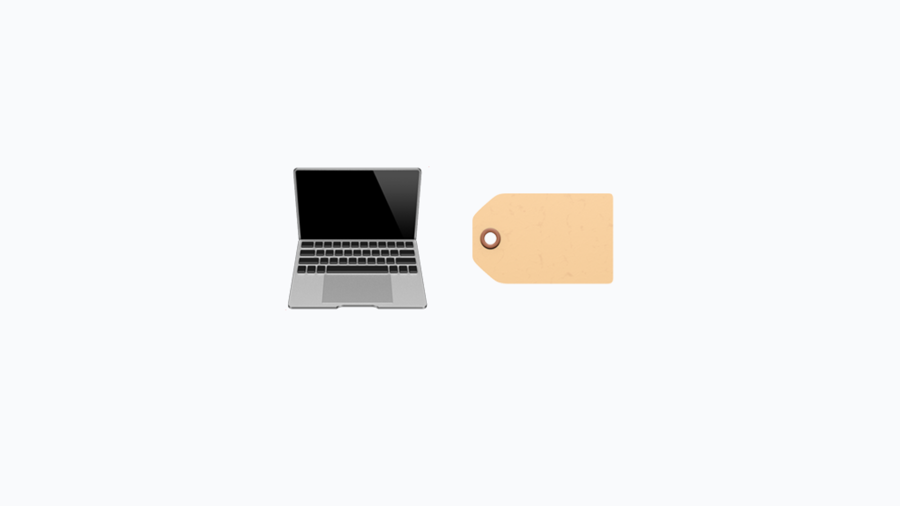

# Labels




Labels in Fleet provide a powerful way to scope profiles to specific hosts. This guide will walk you through managing labels using the Fleet web UI. Labels can be created dynamically using queries or manually by selecting specific hosts. Dynamic labels are applied to hosts that match the query criteria, while manual labels are assigned to hosts you select.


### Accessing labels

To access and manage labels in Fleet:

1. **Navigate to the Hosts page**: Click on the "Hosts" tab in the main navigation menu.

2. **Filter by labels**: In the "Filter by platform or label" drop-down menu, you will see options for "Platforms" (e.g., macOS, Windows, Linux) and "Labels." 

You can add a new label, filter existing labels by name, or select a label from the list. Selecting a label filters the view only to show hosts with that label.


### Adding a label

To add a new label:


1. **Navigate to the Hosts page**: Click on the "Hosts" tab in the main navigation menu.
2. **Access labels**: Click the "Filter by platform or label" drop-down.
3. **Select "Add Label +"**: This option allows you to create a new label.
4. **Choose label Type**: You will be prompted to choose between a "Dynamic" or "Manual" label.
    1. **Dynamic**: Enter a name and description, then build your query and select the platforms to which this label applies.
    2. **Manual**: Enter a name and description, then select the hosts to which you want to apply this label.
5. **Save the label**: Click the "Save" button to create your label.


### Editing a label

To edit an existing label:


1. **Locate the label**: Find the label you want to edit in the list.
2. **Click the pencil icon**: A pencil icon will appear next to the label. Clicking this icon allows you to edit the label.
3. **Edit details**: For manually applied labels, you can change the name, description, and selected hosts. For dynamically applied labels, you can view the query.
4. **Update restrictions**: To change the query or platforms a dynamic label targets, you must delete the existing label and create a new one. Once set, label queries and platforms are immutable.


### Using the REST API for Labels

Fleet also provides a REST API to manage labels programmatically. The API allows you to add, update, retrieve, list, and delete labels. Find detailed documentation on Fleet's [REST API here](https://fleetdm.com/docs/rest-api/rest-api#labels).


### Managing labels with `fleetctl`

Fleet's command line tool, `fleetctl` will also allow you to list and manage labels. While managing labels with `fleetctl` is beyond the scope of this guide, you can list all labels using the following command:

```bash

fleetctl get labels

```

> Learn more about [`fleetctl` CLI](https://fleetdm.com/docs/using-fleet/fleetctl-cli).


#### Additional Information


* **Targeting extensions with labels**: Labels can also target extensions to specific hosts. You can find more details on this functionality [here](https://fleetdm.com/docs/configuration/agent-configuration#targeting-extensions-with-labels).


### Conclusion

Using labels in Fleet enhances your ability to effectively manage and scope profiles to specific hosts. Whether you prefer to manage labels through the web UI or programmatically via the REST API, Fleet provides the flexibility and control you need. For more information on using Fleet, please refer to the [Fleet documentation](https://fleetdm.com/docs) and [guides](https://fleetdm.com/guides).


<meta name="articleTitle" value="Managing labels in Fleet">
<meta name="authorFullName" value="JD Strong">
<meta name="authorGitHubUsername" value="spokanemac">
<meta name="category" value="guides">
<meta name="publishedOn" value="2024-07-18">
<meta name="articleImageUrl" value="../website/assets/images/articles/managing-labels-in-fleet-1600x900@2x.png">
<meta name="description" value="This guide will walk you through managing labels using the Fleet web UI.">
