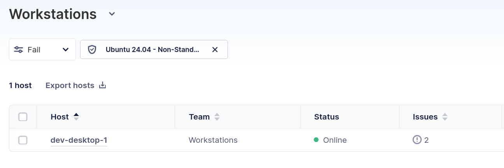
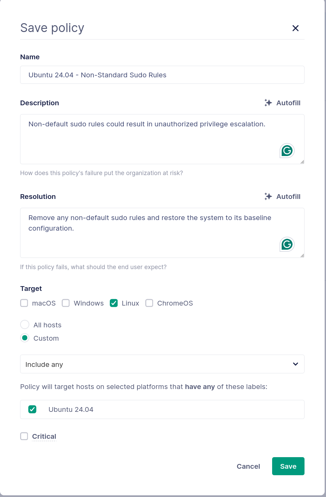
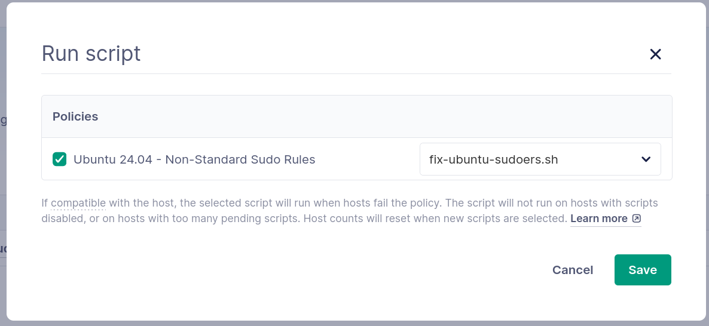
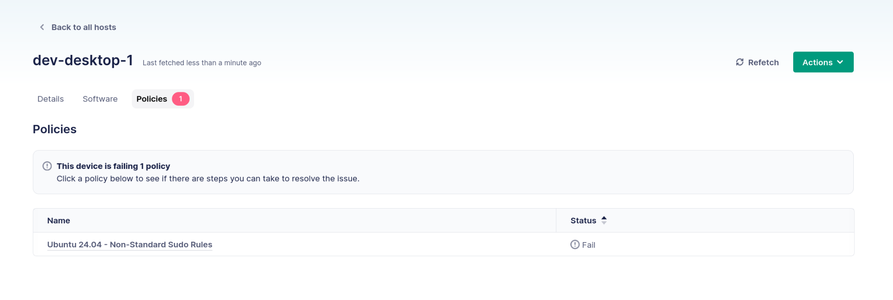

# How to detect and remediate Linux desktop drift with Fleet

Configuration drift is a familiar concept to many server administrators and DevOps engineers. Put simply, drift is the difference between the desired state of a system and the actual state of that system. The desired state of a system is often expressed using infrastructure as code (IaC) in the Linux server world. Linux desktop environments have traditionally lacked this capability, so they have relied on configuration via a central management console.

Systems can drift in many ways:

- Overly permissive security rules may allow an administrator to manually install packages or override configuration.
- A misconfigured config management system may fail to update a host.
- A security event may allow an attacker to perform an unauthorized configuration.

All of these scenarios result in a system that does not match the desired state for an organization. Over time, this state diverges further from the desired state. This can introduce security, performance, and stability problems.

## Drift in Linux desktop environments

Drift is even more challenging in desktop environments where users have control over their workstations. Desktops are not servers; it is expected that end-users will configure and customize them to meet their individual needs. However, IT admins still need to maintain control over configuration, especially when security is a concern.

### Drift and the Linux desktop ecosystem

Managing Windows and Mac desktops is challenging, but IT administrators benefit from ecosystem consistency. Configuration changes are made in standardized locations, software is packaged in a consistent format, and imaging solutions enable initial deployments.

Linux desktop management is a vast departure from this consistent landscape. Each distribution provides its own set of software packages for everything from the GUI to the network management system. Each software subsystem can be individually customized, often in multiple ways. User-level configuration files may override system defaults. Even logging can be inconsistent across different software.

Linux software management introduces additional challenges. Each distribution uses its preferred package format. Distribution-agnostic formats, such as Snap, AppImage, and Flatpak, introduce more ways to install software. Users are even free to manually compile and install software. The simple task of tracking software installed across your environment can be complex in Linux.

This variation makes it even harder for IT teams to detect configuration drift. Administrators need a way to tame this large and diverse ecosystem without depriving Linux users of its many benefits. A robust Linux desktop management solution will provide a consistent way to detect and mitigate drift across a heterogeneous ecosystem.

### Drift and Linux desktop security

Drift management is even more important in Linux. Linux users often have a higher degree of control over their workstations. They may even have root access. This access is often necessary for Linux users to effectively do their jobs. However, this makes it easier for Linux desktop configurations to drift from your organization's desired policies.

These security concerns are exacerbated by the heterogeneous nature of the Linux ecosystem. How can you easily answer policy questions about your hosts if each host uses an entirely different software stack?

An effective Linux MDM tool must enforce organizational policy without imposing overbearing security restraints. Linux desktop users love the flexibility, customizability, and adaptability of Linux and its many distributions. Trying to impose overly restrictive and opaque security requirements will deprive Linux users of productivity benefits. A robust Linux MDM will allow an organization to balance these goals according to its security needs.

## A Linux drift example

To better understand drift, let's take a look at a common example that can result in serious security problems for Linux workstations: management of workstation sudo rules. Sudo rules define constraints around executing privileged commands. They grant or restrict the ability for regular users to run certain commands with elevated privileges.

Most organizations have a defined policy around sudo rules. For example, your organization's policy may state that no user can run commands without entering a password (no passwordless sudo).

These policies are usually enforced when a new workstation is created. However, most Linux users have elevated permissions on their workstations. It is trivial for them to manually change the sudo rules on their devices.

This results in dangerous drift between the desired and actual state of a user's system. Organizational policy defines a specific set of rules, and the system is properly configured to meet these requirements. Over time, the configuration drifts due to manual user changes.

To remediate this problem, an organization must implement a Linux desktop management solution to enforce policy. This system should:

- Allow administrators to express policy in a consistent language across different Linux distributions
- Provide visibility into systems that are failing or passing a policy check
- Enable automatic remediation by running scripts and utilities to bring a system back into compliance

Fleet's drift management capabilities allow you to define and enforce policies. Using Fleet's drift management features, you can:

- Understand your systems using osquery
- Define the desired state of your environment using policies
- Automatically remediate drift using scripted controls

The screenshot below shows hosts that are failing a policy check. Fleet will automatically remediate this policy violation by running a script to bring the system back into compliance.



## Remediating Linux drift with Fleet

Configuring Fleet to detect and remediate drift is simple and consists of five steps:

1. Determine a system baseline
2. Define a label to automatically group hosts
3. Define a policy
4. Define a control
5. Connect the policy with the control

Let's take a look at each step below.

### Determine a system baseline

First, we need to understand the default sudo rules on a fresh Ubuntu 24.04 installation. This establishes a baseline we can use to write a policy. Fleet uses osquery to write policies, so we can start by querying a freshly installed system.

The [sudoers](https://osquery.io/schema/5.22.1/#sudoers) table in osquery provides information about sudo rules on a system:

| Column | Type | Description |
|--------|------|-------------|
| source | TEXT | Source file containing the given rule |
| header | TEXT | Symbol for given rule |
| rule_details | TEXT | Rule definition |

The easiest way to query this table is with an live report from the Fleet dashboard:

1. Navigate to **Hosts**
2. Click into the host that you want to query
3. Select **Actions > Live report**
4. Click **Create your own report**
5. Provide the query and click **Live report**
    * To determine a baseline sudo configuration, query the entire table: `SELECT * FROM sudoers`
6. Select **All hosts**
7. **Run** the report

The results of this report provide a baseline of the sudo rules and include the following on Ubuntu 24.04:

| header | rule_details | source |
|--------|-------------|--------|
| @includedir | /etc/sudoers.d | /etc/sudoers |
| %sudo | ALL=(ALL:ALL) ALL | /etc/sudoers |
| %admin | ALL=(ALL) ALL | /etc/sudoers |
| root | ALL=(ALL:ALL) ALL | /etc/sudoers |
| Defaults | use_pty | /etc/sudoers |
| Defaults | secure_path="/usr/local/sbin:/usr/local/bin:/usr/sbin:/usr/bin:/sbin:/bin:/snap/bin" | /etc/sudoers |
| Defaults | mail_badpass | /etc/sudoers |
| Defaults | env_reset | /etc/sudoers |

We are primarily interested in the "header" and "rule_details" columns, as they define the content of the rule itself. We can use this default set of rules as a system baseline. Then, we can write a policy to detect drift from this desired configuration.

### Define an Ubuntu 24.04 label

Now that we know the default set of rules, we can develop policies and remediation steps to ensure compliance. First, we need a way to target Ubuntu 24.04 hosts, since other releases and distributions may have their own sudo rules.

Fleet labels group hosts together. You can statically assign labels by manually adding a label to hosts, or you can dynamically group them using queries. We can define a query to match Ubuntu 24.04 hosts and automatically add a label to them.

1. Click on your account image in the upper-right corner and navigate to **Labels > Add label**.

2. Define a new label with the following parameters:
    - **Name:** Ubuntu 24.04
    - **Description:** Match all Ubuntu 24.04 machines.
    - **Type:** Dynamic
    - **Query:** `SELECT 1 FROM os_version WHERE major = 24 AND minor = 4;`
    - **Platform:** Ubuntu

This label will match any Ubuntu hosts with a major version of 24 and a minor version of 4. Fleet will automatically add the "Ubuntu 24.04" label to these hosts. This allows us to target the hosts with a policy.

### Define a policy

Fleet policies provide a way to monitor devices by asking "yes or no" questions about them. A Fleet policy is simply a query. If the query returns data, then it evaluates to "Passing". Otherwise, it evaluates to "Failing".

1. It's helpful to write out a policy in plain language before trying to write a query: 
    
    "Evaluate to true if a host does not contain any rules that are not in the default list of rules".

2. We can then define this using a query:

```sql
SELECT 1
FROM sudoers
WHERE NOT EXISTS (
  SELECT 1
  FROM sudoers
  WHERE (header, rule_details) NOT IN (
    ('Defaults', 'env_reset'),
    ('Defaults', 'mail_badpass'),
    ('Defaults', 'secure_path="/usr/local/sbin:/usr/local/bin:/usr/sbin:/usr/bin:/sbin:/bin:/snap/bin"'),
    ('Defaults', 'use_pty'),
    ('root', 'ALL=(ALL:ALL) ALL'),
    ('%admin', 'ALL=(ALL) ALL'),
    ('%sudo', 'ALL=(ALL:ALL) ALL'),
    ('@includedir', '/etc/sudoers.d')
  )
)
LIMIT 1;
```

This is a large query, so let's break down each element. It's helpful to work from the "inside out" when looking at SQL queries. We will start with the inner `SELECT` statement:

```sql
  SELECT 1
  FROM sudoers
  WHERE (header, rule_details) NOT IN (
    ('Defaults', 'env_reset'),
    ('Defaults', 'mail_badpass'),
    ('Defaults', 'secure_path="/usr/local/sbin:/usr/local/bin:/usr/sbin:/usr/bin:/sbin:/bin:/snap/bin"'),
    ('Defaults', 'use_pty'),
    ('root', 'ALL=(ALL:ALL) ALL'),
    ('%admin', 'ALL=(ALL) ALL'),
    ('%sudo', 'ALL=(ALL:ALL) ALL'),
    ('@includedir', '/etc/sudoers.d')
  )
```

This statement returns "1" if there is a sudoer rule that falls outside of the list of default rules. This will return nothing if a rule is within the default rule list.

Next, let's look at the outer `SELECT` statement:

```sql
SELECT 1
FROM sudoers
WHERE NOT EXISTS (
  ...
)
LIMIT 1;
```

This statement effectively inverts the result of the inner `SELECT` statement. It returns "1" if there are no non-default sudo rules. It returns nothing if there are any non-default sudo rules.

This is the desired behavior. We want the SQL statement to return a result if there are no offending rules. This causes the policy to pass. Otherwise, we want the statement to return nothing, which causes the policy to fail.

3. Define the query by:
    * navigating to **Policies > Add Policy** and, if you have the Fleet Premium tier, selecting the fleet that you want the Policy to apply to.
    * Provide the complete query from above as the value in the **Query** dialog box
    * Click **Save**.

4. The **Save policy** dialog box will appear.
    * Provide a **name, description**, and **resolution** for the policy.
    * Configure the policy to target only hosts Linux hosts by specifying “Linux” under the **Target** section. If you have the Fleet Premium tier and want to be OS specific, select **Custom** and then the “Ubuntu 24.04” label we created earlier.
    * Then click **Save**.



### Define a control

Identifying policy violations is the first step in managing drift. For some policies, this may be sufficient. IT teams may want to manually remediate issues instead of relying on automation. However, most organizations want to automatically remediate drift.

Fleet uses controls to take actions against hosts. Controls support custom scripts that can be run against hosts or automatically triggered as part of a policy failure.

First, create a script that will automatically remediate any issues with the sudo rules on a system. The script below is a good start. It will automatically write the default contents to `/etc/sudoers` and remove any files (except the README) in `/etc/sudoers.d`:

```bash
#!/bin/bash

set -euo pipefail

TMPFILE=$(mktemp)

# Write sudoers content to temp file
cat << 'EOF' > "$TMPFILE"
#
# This file MUST be edited with the 'visudo' command as root.
#
# Please consider adding local content in /etc/sudoers.d/ instead of
# directly modifying this file.
#
# See the man page for details on how to write a sudoers file.
#
Defaults env_reset
Defaults mail_badpass
Defaults secure_path="/usr/local/sbin:/usr/local/bin:/usr/sbin:/usr/bin:/sbin:/bin:/snap/bin"

# This fixes CVE-2005-4890 and possibly breaks some versions of kdesu
Defaults use_pty

# User privilege specification
root ALL=(ALL:ALL) ALL

# Members of the admin group may gain root privileges
%admin ALL=(ALL) ALL

# Allow members of group sudo to execute any command
%sudo ALL=(ALL:ALL) ALL

@includedir /etc/sudoers.d
EOF

# Set correct permissions before validation
chmod 0440 "$TMPFILE"

echo "Validating sudoers file..."

if visudo -c -f "$TMPFILE"; then
  echo "Validation successful. Installing new sudoers file..."

  cp "$TMPFILE" /etc/sudoers
  chmod 0440 /etc/sudoers

  echo "Cleaning /etc/sudoers.d (preserving README)..."

  find /etc/sudoers.d -type f ! -name "README" -exec rm -f {} +

  echo "Done."
else
  echo "Validation failed! Not modifying /etc/sudoers."
  rm -f "$TMPFILE"
  exit 1
fi

# Cleanup
rm -f "$TMPFILE"
```

Save this script as a file on your local system, and upload it by navigating to **Controls > Scripts > Add script**.

### Connect the policy with the control

Finally, tie the Policy and Control together by navigating to **Policies > Manage automations > Scripts** and specifying the script as the resolution for the previously created Policy:



Everything is now in place to detect and remediate sudo rule drift in Ubuntu 24.04 hosts. New Ubuntu 24.04 hosts will automatically be labeled appropriately. A policy will run against these labeled hosts to detect violations. If a violation is encountered, then a script will automatically bring the host back into compliance.

### Testing the policy and remediation

It's always a good idea to test a new policy and control. We can test this particular policy by adding an unauthorized sudo rule on a host, triggering a Policy refresh, and confirming that the remediation action worked.

First, add an unauthorized sudo rule on a host:

```bash
root@dev-desktop-1:~# echo "docker ALL=(ALL) NOPASSWD:ALL" > /etc/sudoers.d/docker
```

Fleet performs hourly policy evaluations. However, we can manually trigger a policy refresh for a host. Navigate to **Hosts**, select the host, and click **Refetch**. Fleet will refresh information about the host and evaluate any policies applied to it.

The host will now show as failing a policy once the refetch completes:



Fleet will automatically trigger the remediation script. Wait a few minutes and re-check the host. Notice that the previously added sudo file has been removed by the script:

```bash
root@dev-desktop-1:~# ls /etc/sudoers.d/
README
```

You can now trigger another refetch for the host, or wait until the hourly processing interval passes. You should see that the policy is now passing.

## Wrapping up

Detecting and automatically remediating drift is an important part of a secure, well-managed desktop environment. The Linux ecosystem has classically lacked a robust way to perform drift management. Linux devices have often been handled without visibility or automation to remediate policy violations.

Fleet changes this by introducing drift management features to automatically detect policy violations and trigger remediation controls. This gives you confidence that Linux devices are correctly configured, even if end-users have root access. You can save time, improve your security posture, and treat Linux as a first-class citizen in your desktop environment with Fleet.

To learn more about Fleet or to get a demo [contact us](https://fleetdm.com/contact)

<meta name="articleTitle" value="How to detect and remediate Linux desktop drift with Fleet">
<meta name="authorFullName" value="Anthony Critelli">
<meta name="authorGitHubUsername" value="acritelli">
<meta name="category" value="articles">
<meta name="publishedOn" value="2026-05-19">
<meta name="description" value="Discover how to detect and automatically remediate Linux desktop configuration drift using Fleet policies, osquery, and scripted controls.">
