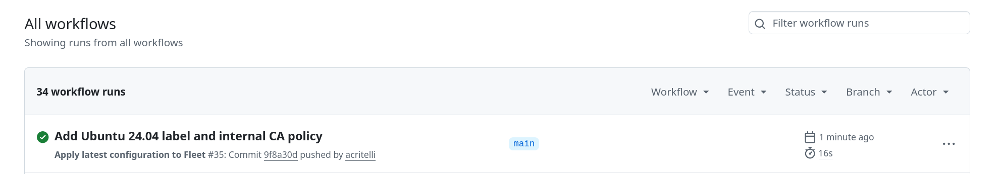
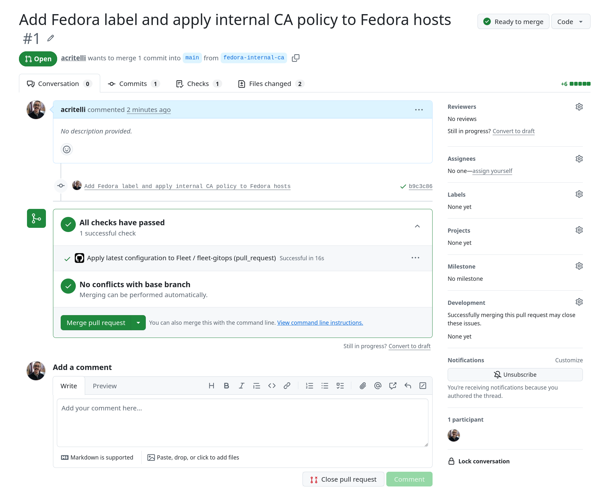

# Managing Linux desktops with GitOps

GitOps brings development best practices to infrastructure management. Server administrators, DevOps teams, and site reliability engineers have adopted GitOps practices due to its numerous benefits. These include faster work cycles, consistent environment state, and infrastructure resiliency.

While there isn't a single definition of GitOps, there are some generally accepted characteristics:

- Infrastructure and Configuration as Code (IaC)
- Code versioning, using a system like Git
- Code review through pull or merge requests
- Automated linting, testing, and deployment

These practices have been standard in the development world for many years, but they have only recently gained traction in the infrastructure space. Infrastructure teams are adopting GitOps to provide real benefits for their internal customers and the infrastructure engineers themselves.

## Why GitOps

Infrastructure has traditionally been managed through graphical interfaces, such as the web console of a cloud provider or virtualization platform. This is often referred to as "ClickOps", because it involves clicking through a UI. Command-line interfaces have improved this experience, but they usually still require a human operator to manually run commands.

GitOps allows engineers to apply development best practices to infrastructure management. Adopting these practices brings tangible benefits to infrastructure management:

- **GitOps allows infrastructure teams to respond faster** — By codifying infrastructure using repeatable best practices, building new infrastructure is only a matter of adjusting code. This contrasts with traditional practices that use manual steps in a UI or CLI, commonly called "ClickOps".
- **GitOps reduces errors** — Code can be automatically checked as part of a CI/CD pipeline, using code linters and test suites. Changes can be further reviewed by other engineers during the pull request process. Since traditional manual changes are not subject to this level of rigorous review, GitOps reduces the chances of configuration mistakes.
- **GitOps reduces drift** — Drift is an enemy of resilient infrastructure, and it's easy to introduce in complex environments. GitOps avoids unapproved changes. The code repository is the single source of truth. Continuous deployment ensures that the environment state always matches the desired state expressed in code.
- **GitOps provides historical context** — Infrastructure and configuration change over time. Traditional ticketing systems and change management workflows fail to provide context and rich change history. Most importantly, they don't provide a way to revert bad changes. Versioned code maintains a history. The discussion around changes, preserved in pull requests, provides context for those changes. Changes can be rolled back to a previous version if they fail.

## MDM and GitOps

MDM workflows have traditionally been ClickOps-focused. IT teams track inventory, enforce policy, and deploy software by clicking buttons in a graphical interface. This isn't due to a lack of technical expertise. Desktop management teams are adept at writing scripts and developing utilities. Rather, the ClickOps approach is a limitation of the available tools.

Existing MDM tooling provides a user-friendly approach through helpful graphical interfaces. However, this management model introduces its own challenges:

- There may be no oversight, review, or discussion about a change. An engineer can simply log into a UI and make changes. This makes it difficult to track the historical development of MDM configuration. The "why" behind a change is difficult to find or entirely lost.
- Rolling back changes is difficult. A platform may track changes, but it may not provide enough data to revert a change. Changes are not versioned, and the only rollback information may be in a helpdesk ticket or change request.
- Audit logging lacks context. Most audit logs provide a list of changes and the responsible user. However, they don't provide context about the change.
- Making changes, especially multiple or frequent changes, is very slow. It involves clicking through several pages in a UI. This also introduces the risk of increased human error.

### A GitOps workflow

Implementing GitOps for MDM solves the challenges of traditional ClickOps. It also brings the benefits of GitOps discussed earlier. A GitOps workflow for MDM will look something like this:

1. An engineer implements their change as code. Their change may even build on existing code or reuse components that codify organizational best practices.
2. The engineer submits these changes for review in a pull request. Automated tools check for correctness, conformance to best practices, and security violations.
3. Other engineers discuss the change in the pull request. This provides a permanent record of the change's context.
4. The change is merged and automatically deployed to the MDM platform. There is less risk of human error because the code has been carefully reviewed. A human doesn't have to click through multiple UI pages to implement their change.
5. All managed devices pull the changes and implement them. This contrasts with a ClickOps approach, where an administrator may have to click each host in the UI to apply a change.

It's easy to see how this approach solves many of the challenges with traditional ClickOps MDM workflows:

- Writing code is faster than clicking through a UI, especially when code can be modularized and reused.
- The pull request approach automatically checks code for correctness and preserves a history of change context.
- The deployment process removes a human operator from the loop and quickly deploys changes. It's easy to roll back this change if anything goes wrong: simply revert the pull request.

These benefits, long enjoyed by software developers and infrastructure teams, can also be realized by workstation management teams. But first, you must select tools and approaches that enable a GitOps approach.

## GitOps workflows in Fleet

Fleet has a friendly UI and CLI to support traditional MDM workflows. Both of these interfaces build on Fleet's REST API. Many platforms have an API or CLI. However, Fleet's unique combination of features makes it the only platform with native GitOps capabilities:

- **Declarative YAML configuration** — Every aspect of Fleet's configuration can be declaratively expressed as YAML. Fleet reconciles its current configuration to match this codified configuration. Defined resources are created, and undefined resources are removed or reset to default values.
- **Vendor-agnostic workflow tooling** — The `fleetctl gitops` command deploys configuration to the Fleet instance. Since this is a native CLI command, this approach is supported on any CI/CD tool or workflow engine. The `fleetctl gitops` command also provides a dry-run option for pull or merge requests.
- **Starter GitOps repository with CI/CD pipelines** — Fleet provides [a GitOps template repository](https://github.com/fleetdm/fleet-gitops) with everything that you need to get started. The repository contains the necessary CI/CD scripts for GitHub Actions and GitLab CI/CD pipelines. It also ships with a recommended directory structure to enable organized and reusable code. This lets you get started quickly with GitOps best practices.
- **Dedicated GitOps user role** — Fleet has a purpose-built GitOps role for API-only users. This role has specific authorization rules that enable configuration management. However, it can't access the Fleet UI. This ensures separation of concerns between human operators and automation.
- **GitOps Mode** — One of the biggest challenges with GitOps is avoiding configuration drift or manual changes. Fleet's UI can be placed into read-only mode to prevent any changes that don't go through your code repository.
- **Migration tooling** — The `fleetctl generate-gitops` command exports your current configuration into GitOps-ready YAML files. This allows you to quickly adopt GitOps without redefining your entire configuration. Migrating an existing Fleet environment involves running a single command.
- **Environment variable and secret support** — Fleet's YAML configuration supports environment variable interpolation. You can store sensitive values as CI/CD secrets, and they will be applied to your configuration without extra effort.

Let's take a look at a concrete example of using GitOps to manage hosts in your environment.

## A practical example

> **Warning:** The steps below will reconfigure your Fleet environment using GitOps. This may delete or overwrite existing configuration. Be sure to start on a fresh Fleet environment and know the impact of any changes.

In the previous article, we saw how Fleet can manage configuration drift. While this configuration was easy to implement, it was still ClickOps. Implementing drift management involves the following steps:

1. Create labels
2. Create a remediation script
3. Create a policy
4. Connect the policy with the remediation script

Each of these steps requires several changes in the graphical interface. Each click introduces all of the challenges associated with a ClickOps-focused process.

Let's implement a new policy using GitOps practices to mitigate these problems. Imagine that your organization requires an internal certificate on every host. A policy and control can be used to ensure compliance. Instead of clicking through the UI, we can do this with GitOps in a few steps:

1. Set up the repository
2. Implement the labels, policy, and script as code
3. Push the policy to the repo and allow GitOps to apply the changes

The steps below assume that you are using GitHub, but the process is largely the same for GitLab. You can also adjust the process to accommodate other CI/CD or workflow platforms. The scripts in `.github/` and `.gitlab-ci.yml` are a good starting point.

### Set up the repository

A key tenet of IaC best practices is a central code repository. This acts as the "single source of truth" for infrastructure configuration. The automation run within this repository must also have access to your Fleet environment. Let's start with this initial configuration, which you only need to do once.

Fleet provides a starter repository with a directory structure and automation scripts. Clone this repository:

```bash
git clone git@github.com:fleetdm/fleet-gitops.git
```

Create a new repository in your GitHub account and update the Git origin to point at your repository:

```bash
cd fleet-gitops
git remote set-url origin git@github.com:my-organization/fleet-test.git
```

Create a service account user to access the Fleet API. The service account user can have global access, or you can scope access to a specific fleet. Both options are shown below:

```bash
# Global admin
fleetctl user create --name 'API User' --email 'api@example.com' --password 'temp@pass123' --api-only --global-role 'admin'

# Service account with the GitOps role on Fleet with ID 4 (Fleet Premium only)
fleetctl user create --name 'API User' --email 'api@example.com' --password 'temp@pass123' --api-only --fleet 4:gitops
```

The GitHub Action must have environment information and credentials to make API calls to Fleet. Create the necessary environment variables:

1. Navigate to the main page for the repository, such as `https://github.com/my-organization/fleet-config`
2. Navigate to **Settings > Secrets and variables > Actions**
3. Define the `FLEET_URL` and `FLEET_API_TOKEN`
   * Set `FLEET_URL` to the URL of your Fleet instance. For example, `https://fleet.example.com`
   * Set `FLEET_API_TOKEN` to the API token for the service account user

This configuration provides everything needed for a basic GitOps configuration. The template repository provides two default fleets: "Personal mobile devices" and "Workstations". These are defined in `fleets/personal-mobile-devices.yml` and `fleets/workstations.yml`. You can keep these or create your own fleets according to your naming conventions.

The template repository also provides an initial directory structure for configuration. The `lib/` directory tree provides a solid foundation for developing modular configuration as code. Fleet supports referencing YAML files by path. This enables clean code that can be reused across fleets:

```yaml
# Partial code snippet from fleets/workstations.yml
...
controls:
  scripts:
    - path: ../lib/linux/scripts/fix-sudoers.sh
```

Next, we will build on this structure to deploy changes to Fleet.

### Implement the configuration

Implementing this policy requires labels, a policy definition, and a control. Each of these items can be implemented as code.

Add or modify each of the files below to implement the policy:

- `default.yml` — This file contains default settings that apply across fleets. This is where we define labels.
- `fleets/workstations.yml` — This file contains configuration for the "Workstations" fleet. This is where we reference the policy and the control script. We can reference these from the `lib/` directory, which allows us to develop clean, reusable code. This code can be reused in other fleets.
- `lib/linux/policies/internal-certificate.yml` — This file contains the policy definition and supporting query. The YAML keys will look familiar, since they are nearly identical to the fields in the web interface.
- `lib/linux/scripts/install-internal-ca.sh` — This is a simple, distribution-agnostic script to remediate policy violations. It deploys the certificate on a host and updates the host's certificate store.

Each configuration file is shown below.

**default.yml**

```yaml
# default.yml

policies:
reports:
agent_options:
controls:
org_settings:
  server_settings:
    server_url: $FLEET_URL
  org_info:
    org_name: Example Organization
labels:
  - name: Ubuntu 24.04
    platform: ubuntu
    description: Hosts running Ubuntu 24.04
    query: "SELECT 1 FROM os_version WHERE major = 24 AND minor = 4"
    label_membership_type: dynamic
```

**fleets/workstations.yml**

```yaml
# fleets/workstations.yml
name: "💻 Workstations"
policies:
  - path: ../lib/linux/policies/internal-certificate.yml
reports:
agent_options:
controls:
  scripts:
    - path: ../lib/linux/scripts/install-internal-ca.sh
software:
team_settings:
```

**lib/linux/policies/internal-certificate.yml**

```yaml
# lib/linux/policies/internal-certificate.yml
- name: Internal CA Certificate
  description: This policy checks if the internal CA certificate is present on hosts using the SHA1 of the certificate.
  resolution: The issue should be automatically remediated. Contact the IT helpdesk if you continue to have issues.
  query: SELECT 1 FROM certificates WHERE sha1 = '28752f8e3f499d852dc5d86f1caca0d8'
  platform: linux
  critical: false
  calendar_events_enabled: false
  conditional_access_enabled: false
  run_script:
    path: ../scripts/install-internal-ca.sh
  labels_include_any:
    - Ubuntu 24.04
```

> **Warning:** This configuration installs a specific root CA. Only use this in a lab environment. Never install a CA certificate from the internet onto a production machine unless you own the private key and understand the trust implications.

**lib/linux/scripts/install-internal-ca.sh**

```bash
#!/bin/bash
# lib/linux/scripts/install-internal-ca.sh
set -euo pipefail

CERT_NAME="internal-ca"
TMP_CERT="/tmp/${CERT_NAME}.crt"

# Write cert to a temp location first
cat > "${TMP_CERT}" <<'EOF'
-----BEGIN CERTIFICATE-----
MIIDNzCCAh+gAwIBAgIUNscOLUs2SBXs8kks3zuU/QPm4V8wDQYJKoZIhvcNAQEL
BQAwHDEaMBgGA1UEAwwRZmxlZXQuZXhhbXBsZS5jb20wHhcNMjYwMzE2MDAwODM0
WhcNMjcwMzE2MDAwODM0WjAcMRowGAYDVQQDDBFmbGVldC5leGFtcGxlLmNvbTCC
ASIwDQYJKoZIhvcNAQEBBQADggEPADCCAQoCggEBAMFdzxBVqKLxOr8BczrmCjYd
B4va2kbsWG741n4tyHi11avU+RQNoCW+dS0yf8Xcb4XNAo36t5u3Ifq97eaifCZ9
n3O9L6BP26ggmLNLsKSwv6GM5f3mPodoh8GKy9M6bTz1pFMHYj5df7TwVcjFfSAD
2ny2AMknB2uWZA1uwFc161YFn/ZZP7mair/4PkPgGqTyGEM30wFpvmsuuC68srab
BltojbMlPrvW5chZP3UiLMQj/l859ahErgzYQuAkAMngOBucufRjCLtMmtX+2zjm
mUee75HY87kn+0fjTqKUVmJsz/G2WFx0AbzJZP04LjX4B0J6/C/VeyJoYfNF+BcC
AwEAAaNxMG8wHQYDVR0OBBYEFAHVHJGt0XdzFBVblpq4f4I2OmadMB8GA1UdIwQY
MBaAFAHVHJGt0XdzFBVblpq4f4I2OmadMA8GA1UdEwEB/wQFMAMBAf8wHAYDVR0R
BBUwE4IRZmxlZXQuZXhhbXBsZS5jb20wDQYJKoZIhvcNAQELBQADggEBAJFqMESw
OazLUQieEK2G89sIN1eJgTY+LsWyCHL+4VqOvjqddpqAntvWp6sPpFQMBKfWElt0
rub/SgRI+jhqqsmHVgNJJH5uKg4AjrSTr+NKSWUCteJHhK8EN8Mr2oRsuDG4pShF
FOffZxSggUimqPc8JC9t1B8H8uzMPSHDU39LpomGfKLRMe2W0Od8GNwL8nd5GW0k
cZ5xoBUaAe7FDadJoQKD3uVLYvVWROEKR3l2nXInRcxy1H3RgXs7fcgf3SJDgQlm
wyQ3nsfId2U+Go//nhEPZVNMHUGbHvR9D4zQ75eqTIgkawf+UvSJmps9zGkO4Etz
66sWFkE+I46Gfyw=
-----END CERTIFICATE-----
EOF

if command -v update-ca-certificates >/dev/null 2>&1; then
   # Debian/Ubuntu
   DEST="/usr/local/share/ca-certificates/${CERT_NAME}.crt"
   cp "${TMP_CERT}" "${DEST}"
   update-ca-certificates
   echo "Installed certificate on Debian/Ubuntu at ${DEST}"

elif command -v update-ca-trust >/dev/null 2>&1; then
   # Fedora/RHEL
   DEST="/etc/pki/ca-trust/source/anchors/${CERT_NAME}.crt"
   cp "${TMP_CERT}" "${DEST}"
   update-ca-trust extract
   echo "Installed certificate on Fedora/RHEL at ${DEST}"

else
   echo "Unsupported distribution: no known CA trust update tool found" >&2
   rm -f "${TMP_CERT}"
   exit 1
fi

# Cleanup
rm -f "${TMP_CERT}"
```

### Apply the changes

The policy and all of its supporting constructs have been implemented as code. Now, it's time to deploy these changes to Fleet.

Add the files to the git index and commit them with an appropriate change message:

```bash
git add .
git commit -m "Add Ubuntu 24.04 label and internal CA policy"
```

Finally, push the changes to the remote repository. This will automatically trigger a run of Fleet's GitHub action to deploy the changes:

```bash
git push -u origin main
```

You can monitor the progress of the workflow by navigating to the repository's Actions page. The GitHub action runs and deploys the changes to Fleet. You should see a workflow success message after a few minutes. You can also review the workflow's logs.



## Managing change

Environments change, and organizations need a way to respond quickly. Traditional ClickOps workflows are slow, inefficient, and error-prone. Managing infrastructure with GitOps allows IT teams to quickly respond to change while avoiding the pitfalls of legacy ClickOps practices.

Let's see what this looks like with a practical change to the previous example. Currently, the policy only applies to Ubuntu 24.04 hosts. Imagine that your organization wants to start supporting Fedora. You need to extend this policy to work with these new hosts. This requires a few steps:

1. Add a new label to match Fedora hosts
2. Apply this label to the existing policy

Each of these steps requires several clicks throughout the user interface. Those clicks are slow, and each introduces the challenges associated with ClickOps. Let's see what this looks like using GitOps.

First, create a new branch for the change:

```bash
git checkout -b fedora-internal-ca
```

Implement the change by adding a new label and adjusting the policy target:

```yaml
# default.yml

policies:
reports:
agent_options:
controls:
org_settings:
  server_settings:
    server_url: $FLEET_URL
  org_info:
    org_name: Example Organization
labels:
  - name: Ubuntu 24.04
    platform: ubuntu
    description: Hosts running Ubuntu 24.04
    query: "SELECT 1 FROM os_version WHERE major = 24 AND minor = 4"
    label_membership_type: dynamic
  - name: Fedora
    platform: linux
    description: Hosts running Fedora
    query: SELECT 1 FROM os_version WHERE name LIKE "%Fedora%"
    label_membership_type: dynamic
```

```yaml
# lib/linux/policies/internal-certificate.yml
- name: Internal CA Certificate
  description: This policy checks if the internal CA certificate is present on hosts using the SHA1 of the certificate.
  resolution: The issue should be automatically remediated. Contact the IT helpdesk if you continue to have issues.
  query: SELECT 1 FROM certificates WHERE sha1 = '28752f8e3f499d852dc5d86f1caca0d8'
  platform: linux
  critical: false
  calendar_events_enabled: false
  conditional_access_enabled: false
  run_script:
    path: ../scripts/install-internal-ca.sh
  labels_include_any:
    - Ubuntu 24.04
    - Fedora
```

Push the changes in the updated branch:

```bash
git add .
git commit -m "Add Fedora label and apply internal CA policy to Fedora"
git push -u origin fedora-internal-ca
```

Create a GitHub pull request by following the link provided when pushing your changes. Fleet will automatically perform a dry run for your proposed changes:



The pull request workflow allows other engineers to review and comment on your changes. These team members can review Fleet's dry run output for problems before the changes are implemented. This provides confidence in your changes.

The pull request also maintains a history of the change and its context. You can easily revert the change if something goes wrong. Additionally, the contextual history is useful for understanding decisions.

Once you are satisfied with the PR, merge it by clicking **Merge pull request**. Fleet's GitHub action automatically runs and applies the changes to your Fleet environment.

## Next steps

You now have the basic building blocks of a GitOps workflow. This is a solid foundation, but you likely want to make some changes before fully using GitOps in production. Every organization has its own requirements, but there are some common things that you should consider:

- Set up branch protection and review rules for your main branch. This ensures that changes can't be merged to the main branch and deployed without a review process. For GitHub, you can configure these rules from the **Settings > Branches** page.
- Set up automation to regularly run Fleet's GitOps workflow. This avoids configuration drift and ensures the Fleet environment always matches your desired state. For Github, you can use a scheduled job to regularly execute a job.
- Make the Fleet UI read-only to avoid changes that bypass the GitOps process. Navigate to **Settings > Integrations > Change management** and check the box next to **Enable GitOps mode**.

## Wrapping up

Legacy ClickOps workflows are no longer sufficient for managing devices. They are slow, error-prone, and difficult to revert when something goes wrong. GitOps solves these problems by maintaining a single source of truth about the desired environment state.

GitOps provides a management interface that is familiar to Linux teams. Linux server administrators frequently manage configuration as code. Their automation systems are based on a repository as the single source of truth. Linux end-users are also well-versed in many GitOps approaches, from file-based configuration to source code management.

Fleet is the only MDM platform with native GitOps capabilities. Fleet provides capabilities beyond an API or CLI. It provides an entire suite of features to fast-track your adoption of GitOps. This includes declarative configuration, a suite of automation and migration tools, dedicated API-only users, and the ability to prevent configuration drift with a read-only UI. These capabilities provide a complete GitOps experience that exceeds simple API calls or command-line scripts.

GitOps best practices have long been accepted by development and server infrastructure teams. Now, IT management teams can enjoy these same benefits when managing end-user devices with Fleet.

To learn more about Fleet or to get a demo [contact us](https://fleetdm.com/contact).

## Additional resources

- [Fleet starter repository](https://github.com/fleetdm/fleet-gitops)
- [GitOps landing page](https://fleetdm.com/infrastructure-as-code)
- [GitOps YAML file documentation](https://fleetdm.com/docs/configuration/yaml-files)

<meta name="articleTitle" value="Managing Linux desktops with GitOps">
<meta name="authorFullName" value="Anthony Critelli">
<meta name="authorGitHubUsername" value="acritelli">
<meta name="category" value="articles">
<meta name="publishedOn" value="2026-05-20">
<meta name="description" value="Bring GitOps to Linux desktop management with Fleet. Declarative YAML, CI/CD pipelines, and version control replace slow, error-prone ClickOps.">
