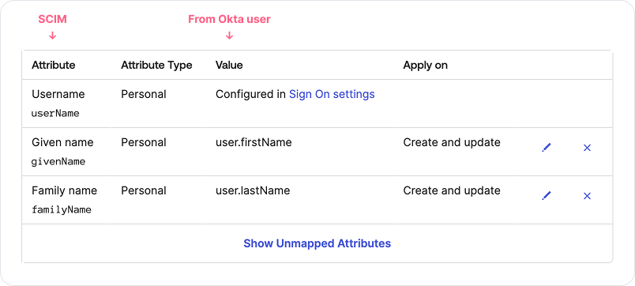

# Map end user's information from identity provider (IdP) to host

_Available in Fleet Premium._

Learn how to connect your identity provider (IdP) to retrieve end-user information and map it to a
host. This simplifies the process of identifying which employee is assigned to each host.
Fleet uses System for Cross-domain Identity Management (SCIM) protocol to retreive users from IdP. This feature is available in Fleet [v4.67.0](https://github.com/fleetdm/fleet/releases/tag/fleet-v4.67.0).

Currently, Fleet supports only Okta.

## Connect Okta

To connect Okta to Fleet, follow these steps:

1. Head to Okta admin dashboard
2. Select **Applications > Applications** in the main menu, then select **Create App Integration**.
3. Select **SAML 2.0** option and select **Next**.
4. On **General Settings** page, add friendly **App name** (e.g Fleet SCIM), and select **Next**.
5. On **SAML Settings** page, add any URL to **Single sign-on URL** and **Audience URI (SP Entity ID)** fields, and select **Next**.
>Okta requires to setup SAML settings in order to setup SCIM integration. Since we don't need SSO, URL can be anything.
6. On **Feedback** page, provide feedback if you want, and select **Finish**.
7. Select **General** tab of the newly created app, then select **Edit** in **App Settings**.
8. For **Provisioning**, select **SCIM**, and select **Save**.
9. Select **Provisioning** tab, then in **SCIM Connection**, select **Edit**.
10. In **SCIM connector base URL**, enter `https://<your_fleet_server_url>/api/v1/fleet/scim`.
11. In **Unique identifier field for users**, enter `userName`.
12. For **Supported provisioning actions**, select **Push New Users**, **Push Profile Updates**, and **Push Groups**.
13. For **Authentication Mode** select **HTTP Header**.
14. Create Fleet API-only user with maintainer permissions, copy API token for that user, and paste it to Okta, in **Authorization** field.
15. Select **Test Connector Configuration** button. You should see success message in Okta.
16. Head to Fleet, select **Settings > Integrations > Identity provider** and verify that Fleet successfully received the request from IdP.
17. Back in Okta, select **Save**
18. Under **Provisioning** tab, select **To App**, then select **Edit** in **Provisioning to App** section. Enable **Create Users**, **Update User Attributes**, and **Deactivate Users**, then select **Save**.
19. On the same page, make sure that `givenName` and `familyName` have Okta value assigned to it. Currently, Fleet will use `userName`, `givenName`, and `familyName`.

### Assign users and groups to Fleet

To send users and groups information to Fleet, you have to assign them to SCIM app that you created previously.

1. Select **Directory > Groups** in the main menu, then select **Add group**. Type name so you know that users from this group will be provisioned to Fleet (e.g "Fleet_SCIM").
2. On the same page, select **Rules** tab. Create rule that will assign users from groups that you want to provision to Fleet to newly created "Fleet_SCIM" group.

3. Select **Applications > Applications** in the main menu, select app that you created previously, then select **Assignements** tab.
4. Select **Assign > Assign to Groups**, then click **Assign** next to the "Fleet_SCIM" group, then select **Done**. Now all users that you assigned to "Fleet_SCIM" group via rule will be provisioned to Fleet. It may take a while if you have many users.
2. On the same page, select **Push Groups** tab, then select **Push Groups > Find groups by name**, and add all groups that you assigned via rule to "Fleet_SCIM" group previously (make sure that **Push group memberships immediately** is selected). This way you'll push all users and groups to Fleet, so Fleet will be able to map users to groups.

Now, you should be able to see requests being sent in Fleet if you navigate to **Settings > Integrations > Identity provider**. Go to host that has IdP email assigned to it, to verify that Full Name and IdP Groups are mapped correctly.

<meta name="authorGitHubUsername" value="marko-lisica">
<meta name="authorFullName" value="Marko Lisica">
<meta name="publishedOn" value="2025-03-20">
<meta name="articleTitle" value="Map end user's information from identity provider (IdP) to host">
<meta name="category" value="guides">

