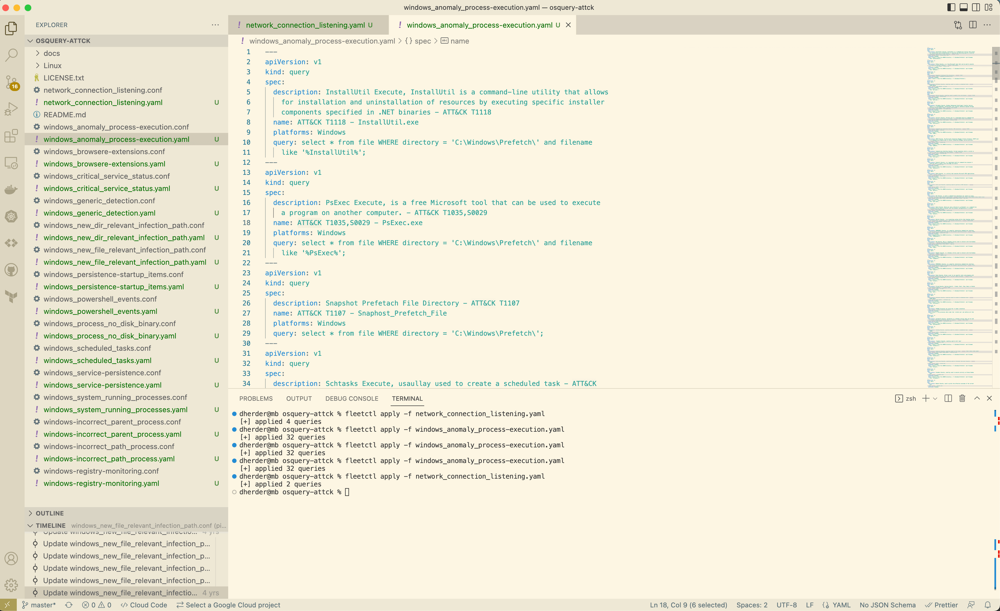
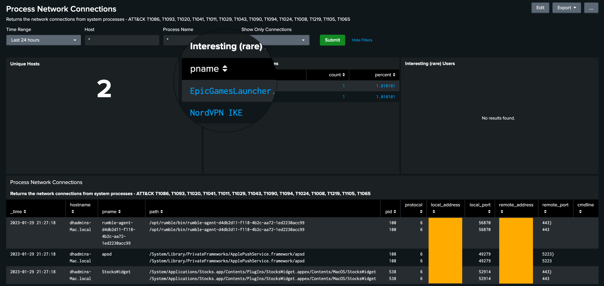

# Mapping Fleet and osquery results to the MITRE ATT&CK® framework via Splunk


## What is the MITRE ATT&CK® Framework and what role does Fleet and osquery play?
From the [MITRE ATT&CK® site](https://attack.mitre.org):"MITRE ATT&CK® is a globally-accessible 
knowledge base of adversary tactics and techniques based on real-world observations." Essentially, Fleet and osquery bring the "real-world observations" to the table when you are looking to adopt the MITRE ATT&CK® framework. 

## Overview
While osquery is capable of gathering an extremely diverse set of data from macOS, Windows, and Linux hosts, it can be difficult understanding how to use that data. In this article we will translate the techniques and tactics defined by ATT&CK® into queries that we can execute using Fleet. Then we  will provide an example aggregating our logs from Fleet into Splunk Cloud to construct a dashboard of our real-world observations. The intent of this article is to provide a starting point in correlating osquery related observations from host endpoints, using query packs already out in the wild. 


## Setting up Fleet and osquery
First, we’re going to map osquery observations to ATT&CK®. Initially, I began combing through the current 273 tables that I have access to in my fleet instance. I quickly realized that this effort would be quite daunting. Surely, I wasn't the first one that was looking to do this, right? This is when I came across @teoseller's repo
[osquery-attck](https://github.com/teoseller/osquery-attck). In addition to the awesome library of
queries, there is a [mapping of each query](https://github.com/teoseller/osquery-attck#attck-mapping) to the
[techniques](https://attack.mitre.org/techniques/enterprise/) within the ATT&CK® Framework. 

The first thing that we need to do is clone the repo so we can begin to convert the .conf files to
.yaml via `fleetctl`.
```
gh repo clone teoseller/osquery-attck
```
Using `fleetctl`, we can convert to .yaml in the following way:
```
fleetctl convert -f network_connection_listening.conf > network_connection_listening.yaml
```
Now that you have the nice .yaml, you can `apply` to your fleet server:
```
fleetctl apply network_connection_listening.yaml
```
There are a bunch to convert and apply:


In the Queries list within fleet, you will now have:


For brevity, we are going to focus on the "Process Network Connection" query that maps to several
ATT&CK® Techniques.


Next, we will add it as a scheduled query with a daily interval. In order to get data quickly into
your osquery results log, you may want to temporarily set the schedule duration to 15 minutes. Don't
forget to set it back to "Daily" ;).


### Logging pipeline
My existing deployment is done via AWS Terraform. Please check out the [existing deployment guide](https://fleetdm.com/deploy/deploying-fleet-on-aws-with-terraform) for instructions on how to set this up. With this configuration, the logging pipeline is set to send
logs to [Amazon Kinesis Data Firehose](https://fleetdm.com/docs/using-fleet/log-destinations#amazon-kinesis-data-firehose), terminating in an AWS S3 bucket. See additional documentation around configuration of [log destinations](https://fleetdm.com/docs/using-fleet/log-destinations).
Since the final destination of the osquery results data is a Splunk Cloud search head, we will need
some way to tell Splunk to index this data. At first I thought setting up a Splunk Forwarder might
be a good idea and quickly abandoned that idea, since my deployment of Fleet is all managed through
AWS ECS rather than an EC2 instance, where installing a forwarder would actually be an option.
Luckily, Splunk has the [Splunk Add-on for AWS](https://splunkbase.splunk.com/app/1876). For
instructions on configuring this Add-on, please see the [Splunk Add-on for AWS
Documentation](https://docs.splunk.com/Documentation/AddOns/released/AWS/Description)
Once you have configured your AWS account in the Add-on (need to add the AccountID and RoleARN to
access your S3 bucket), you will need to configure an input to populate your Splunk index. First, in
the Splunk Cloud> Settings> indexes, create a new index called "osquery_results". For my purposes,
I'm setting retention to 90 days at max size of 500MB.

Next, create a new input:

If everything with the account config works, you should be able to immediately see the results of a
global index search:

Now comes the tough part, or at least it was a bit challenging for me, since I'm no Splunk expert. We’re going to build some SPL (Search Processing Language) to translate the observations we've uncovered via osquery into search results in Splunk. After that, we can drop the search results into a dashboard or even build an alert. That being said though, if this was an alerting use case, I would recommend using the built-in Policies from Fleet to trigger alerts via webhooks. Here's what the first query looks like to get the Process Connections from our Fleet scheduled query and push it to a table in Splunk:
```
index="osquery_results" name="pack/Global/ATT&CK® - Process_Network_Conn" | 
dedup _time, hostname | 
spath output=data path=snapshot{} | 
mvexpand data | 
rename data as _raw | 
extract pairdelim="," kvdelim=":" | 
eval pname=mvindex(name,1) | 
table _time, hostname, pname, path, pid, protocol, local_address, local_port, remote_address, remote_port, cmdline
```

Next, you may want to add more panels and dynamic filters in order to create a dashboard that allows
you to slice and dice the data to solve for data interrogation, getting at the root of the ATT&CK®
Tactic / Technique you are examining.



## Lessons learned
This is just the beginning. There are many more Tactics and Techniques that can be mapped to queries and there are plenty of queries already pre-built for MITRE ATT&CK®. The next step is to continue to build out these mappings and publish the queries that map from Fleet to MITRE ATT&CK®. 
In order to get a sense for coverage, please check out the [MITRE ATT&CK® Heatmap by
alatif113](https://github.com/alatif113/mitre_attck_heatmap).
If you want to chat more about this blog post, or just collaborate on another integration, feel free to message me on twitter at ‘@fleetctl’.

<meta name="category" value="security">
<meta name="authorFullName" value="Dave Herder">
<meta name="authorGitHubUsername" value="dherder">
<meta name="publishedOn" value="2023-01-30">
<meta name="articleTitle" value="Mapping Fleet and osquery results to the MITRE ATT&CK® framework via Splunk">
<meta name="articleImageUrl" value="../website/assets/images/articles/mapping-fleet-and-osquery-results-to-the-mitre-attck-framework-via-splunk-1600x900@2x.png">
