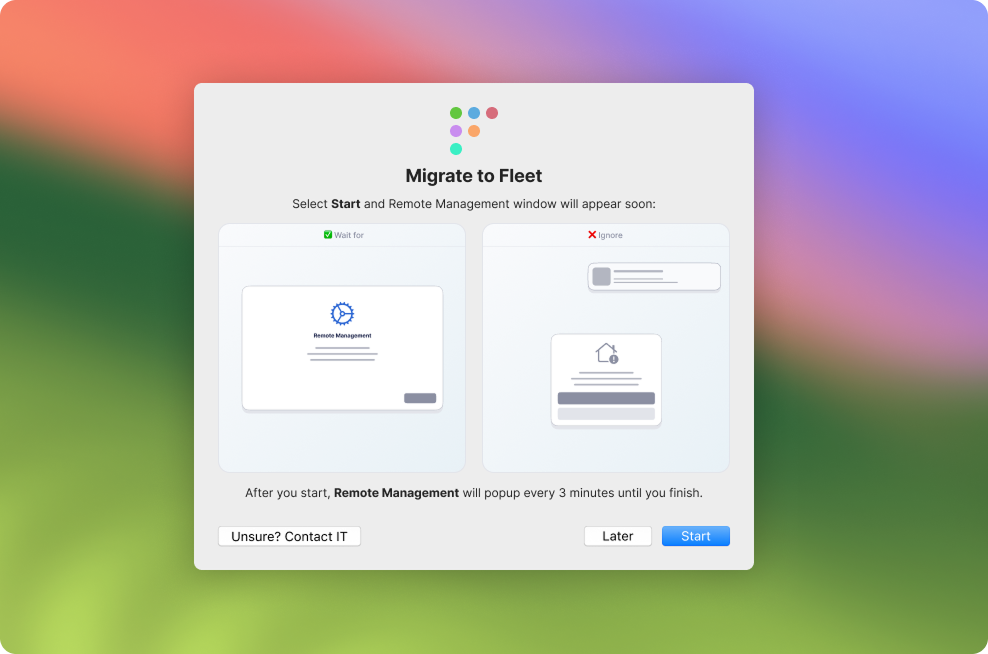

# macOS MDM migration

This guide provides instructions for migrating devices from your current MDM solution to Fleet. There are two different workflows to migrate your devices.

> For Apple's native MDM migration support for AB-registered devices running macOS, iOS or iPadOS 26, [consult Apple's documentation](https://support.apple.com/guide/deployment/migrate-managed-devices-dep4acb2aa44/web)

## Requirements

- A [deployed Fleet instance](https://fleetdm.com/docs/deploy/deploy-fleet)
- Fleet is connected to Apple Push Notification service (APNs) and Apple Business (AB). [See macOS MDM setup](https://fleetdm.com/guides/macos-mdm-setup)
- For the end-user workflow: A service is required that can receive a webhook to send an unenroll request to the existing MDM server. See [this example](https://victoronsoftware.com/posts/webhook-flow-with-tines/) using Fleet webhooks with Tines.

> **Important:** Apple MDM enrollment relies on a Safari-based system web view. If Safari is blocked or restricted, enrollment can fail.

## Migrate hosts

To migrate hosts, we will do the following steps:

1. Enroll hosts to Fleet
2. Assign hosts in Apple Business (AB) to Fleet
3. Choose migration workflow and migrate hosts

### Step 1: Enroll hosts to Fleet

First, [enroll your hosts](https://fleetdm.com/guides/enroll-hosts) to Fleet by installing Fleet's agent (fleetd).

### Step 2: Assign hosts in Apple Business (AB) to Fleet

1. In AB, unassign your hosts from your current MDM solution by selecting **Inventory** > **Devices** then **Select** and then selecting **Select All**. Then, select **Actions** > **Unassign device management**.

2. Assign these hosts to Fleet: select **Inventory** > **Devices** then **Select** and then selecting **Select All**. Then, select **Actions** > **Assign device management** and select your Fleet server in the dropdown.

### Step 3: Choose migration workflow and migrate hosts

There are three migration workflows in Fleet: 
- Default: Requires that the IT admin unenrolls hosts from the old MDM solution before the end user can complete migration. This will result in a gap in MDM coverage until the end user completes migration.
- End user: Allows the user to kick off migration by unenrolling from the old MDM solution on their own. Once the user is unenrolled, they're prompted to turn on MDM features in Fleet, reducing the gap in MDM coverage.
- [macOS Tahoe](https://fleetdm.com/announcements/fleet-supports-macos-26-tahoe-ios-26-and-ipados-26#mdm-migration-with-apple-business-ab)

Both the default and end user migration workflows require end users to have access to an admin account on their Mac. macOS asks for an admin username and password before installing the enrollment profile. The macOS Tahoe workflow supports admin and standard users.

#### Default workflow

End user experience:

- After a host is unenrolled from your current MDM solution, the end user is prompted with Apple’s Remote Management full-screen pop-up, typically within two hours, if the host is assigned to Fleet in AB.

> **Note:** After Fleet begins prompting end users to enroll, it will continue to prompt them every few minutes.


- If the host is not assigned to Fleet in AB (manual enrollment), the end user will be given the option to download the MDM enrollment profile on their **My device** page.


Configuration:

- To kick off the default workflow, unenroll the hosts to be migrated in your current MDM solution. macOS does not allow a host to be connected to multiple MDM solutions at once.

#### End user workflow

> Available in Fleet Premium

Fleet's agents must have [updates enabled](https://fleetdm.com/guides/fleetd-updates) (default), for the end user migration workflow to work.

Fleet uses [swiftDialog](https://github.com/swiftDialog/swiftDialog) to instruct end users to enroll. swiftDialog is only installed on macOS hosts when the end user migration workflow starts. When the workflow is disabled, swiftDialog stays installed. swiftDialog is also installed for macOS [setup experience](https://fleetdm.com/guides/setup-experience#swiftdialog).



End user experience:

- To watch an animation of the end user experience during the migration workflow, head to **Settings > Integrations > MDM** in the Fleet UI, and scroll down to the **End user migration workflow** section.

> **Note:** After Fleet begins prompting end users to enroll, it will continue to prompt them every few minutes.

Configuration:

- In Fleet, you can configure the end user workflow using the Fleet UI, Fleet API, or Fleet's GitOps workflow.

- After configuring the end user workflow, instruct your end users to select the Fleet icon in their menu bar, select **Migrate to Fleet** and follow the on-screen instructions to migrate to Fleet.

Fleet UI:
1. Select the avatar on the right side of the top navigation and select **Settings > Integrations > MDM**.
2. Scroll down to the **End user migration workflow** section and select the toggle to enable the workflow.
3. Under **Mode**, choose a mode, enter the webhook URL for your automation tool (e.g., Tines) under **Webhook URL**, and select **Save**.
4. During the end user migration workflow, an end user's device will have its selected system theme (light or dark) applied. If your logo is not easy to see on both light and dark backgrounds, you can optionally set a logo for each theme:
Head to **Settings** > **Organization settings** > **Organization info**, add URLs to your logos in the **Organization avatar URL (for dark backgrounds)** and **Organization avatar URL (for light backgrounds)** fields, and select **Save**. See [configuration docs](https://fleetdm.com/docs/configuration/yaml-files#org-info) for recommended sizes for logos.
5. During migration, end users will see a button that says "Unsure? Contact IT". Head to **Settings** > **Organization settings** > **Organization info** > **Organization support URL** to direct users to your help desk if they have any questions. 

Fleet API: MDM migration settings are configured via the [`mdm.macos_migration`](https://fleetdm.com/docs/rest-api/rest-api#mdm-macos-migration) field on the [Modify configuration API endpoint](https://fleetdm.com/docs/rest-api/rest-api#modify-configuration).

GitOps:
  - To manage macOS MDM migration configuration using Fleet's best practice GitOps, check out the `macos_migration` key in the [GitOps reference documentation](https://fleetdm.com/docs/configuration/yaml-files#macos-migration).
  - To manage your organization's logo for dark and light backgrounds using Fleet's best practice GitOps, check out the `org_info` key in the [GitOps reference documentation](https://fleetdm.com/docs/configuration/yaml-files#org-info).

## Check migration progress

To see a report of which hosts have successfully migrated to Fleet, have MDM features off, or are still enrolled to your old MDM solution head to the **Dashboard** page by clicking the icon on the left side of the top navigation bar.

Then, scroll down to the **Mobile device management (MDM)** section of the Dashboard. You'll see a breakdown of which hosts have successfully migrated to Fleet, which have MDM features disabled, and which are still enrolled in the previous MDM solution.

## FileVault recovery keys

_Available in Fleet Premium_

When migrating hosts via manual enrollment profile, end users must log out of their device to escrow FileVault keys to Fleet. The **My device** page in Fleet Desktop will present users with instructions on how to reset their key.

To start, [enforce FileVault disk encryption](https://fleetdm.com/guides/enforce-disk-encryption) in Fleet.

After turning on disk encryption in Fleet, share [these guided instructions](#how-to-turn-on-disk-encryption) with your end users.

For hosts that enroll via Apple Business, end users don't need to take action. Fleet automatically escrows the FileVault key on the next host vitals refetch.

### How to turn on disk encryption

1. Select the Fleet icon in your menu bar and select **My device**.


2. On your **My device** page, follow the disk encryption instructions in the yellow banner.
  - If you don’t see the yellow banner, select the purple **Refetch** button at the top of the page.
  - If you still don't see the yellow banner after a couple minutes or if the **My device** page presents you with an error, please contact your IT administrator.


## Activation Lock

In Fleet, [Activation Lock](https://support.apple.com/en-us/HT208987) is disabled by default for automatically enrolled (ADE) hosts. Apple disallows Activation Lock on supervised devices unless an MDM solution explicitly allows it.

In 2024, Apple added the ability to manage Activation Lock in Apple Business (AB). For devices that are owned by the business and available in AB, you can [turn off Activation Lock remotely](https://support.apple.com/en-ca/guide/business/welcome/web). This is the recommended path.

If a device isn't available in AB and has Activation Lock enabled, ask the end user to [turn it off](https://support.apple.com/en-us/HT208987) before migrating the device to Fleet.

### Why migrating Macs is a problem

For a Mac running macOS 11 or later that's supervised through Device Enrollment, you can't manage Activation Lock until the device is enrolled in an MDM solution. Activation Lock may already be enabled by the time the Mac enrolls in Fleet. In that case you can't turn it off from Fleet, and macOS can't disallow it by default until the user turns it off. See Apple's [Activation Lock on Apple devices](https://support.apple.com/guide/deployment/activation-lock-depf4ab94ef1/web).

Bypass codes are also time-limited. On iPhone and iPad, the code is retrievable for up to 15 days after the device is first supervised, or until an MDM solution retrieves and then explicitly clears it. After that, it can't be retrieved. This means that when migrating from your old MDM solution, you'll often be unable to retrieve the bypass code at all.

### Get the bypass code

Fleet doesn't escrow Activation Lock bypass codes today. To retrieve the device-generated code, send the [Activation Lock bypass code](https://fleetdm.com/mdm-commands/apple-activation-lock-bypass-code) MDM command. The payload XML is on that page.

```bash
fleetctl mdm run-command --hosts=<HOSTNAME> --payload=./activation-lock-bypass-code.xml
fleetctl get mdm-commands --host=<HOSTNAME>
fleetctl get mdm-command-results --id=<COMMAND-UUID>
```

The code is in the returned payload XML.

### Use the bypass code

With physical possession of the device:

- **iPhone or iPad:** enter the bypass code in the Apple Account password field on the Activation Lock screen, and leave the user name field blank.
- **Mac:** select **Recovery Assistant** in the menu bar, then select **Activate with MDM key**. The standard Activation Lock screen won't accept the code.

<meta name="category" value="guides">
<meta name="authorGitHubUsername" value="zhumo">
<meta name="authorFullName" value="Mo Zhu">
<meta name="publishedOn" value="2024-08-14">
<meta name="articleTitle" value="macOS MDM migration">
<meta name="description" value="Instructions for migrating macOS hosts away from an old MDM solution to Fleet.">
