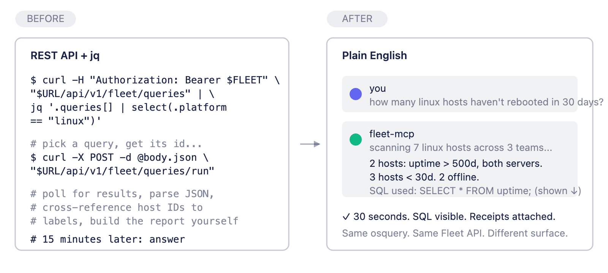
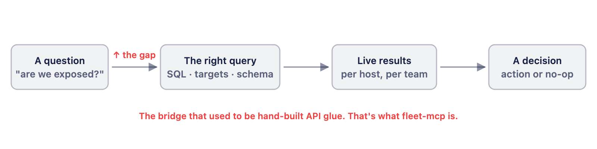
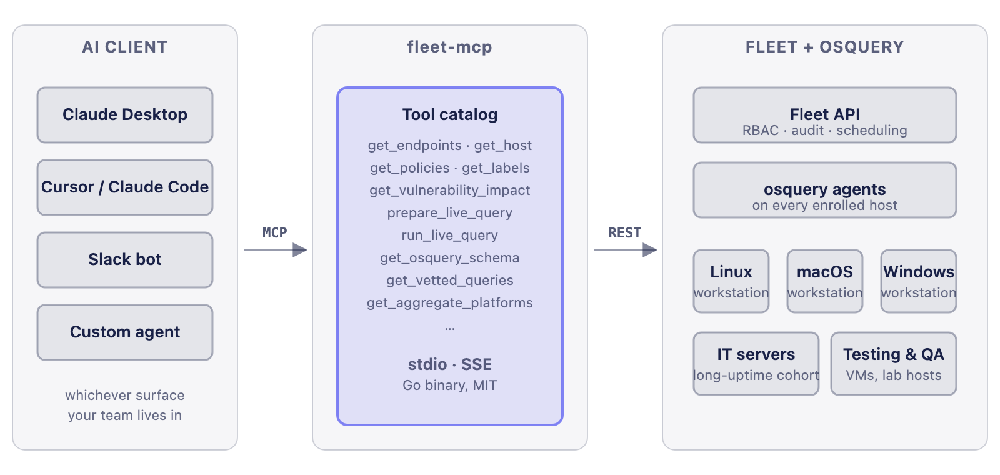
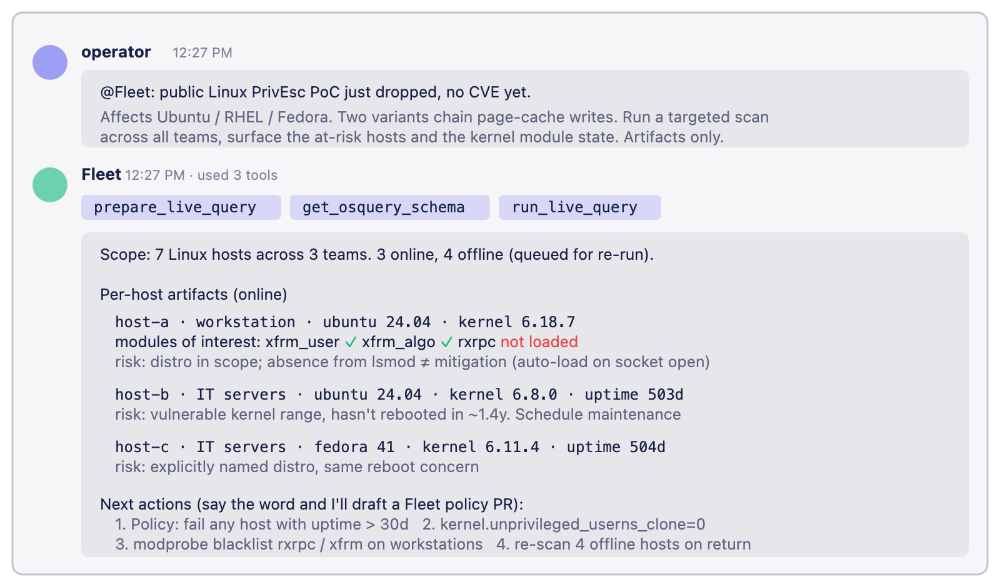
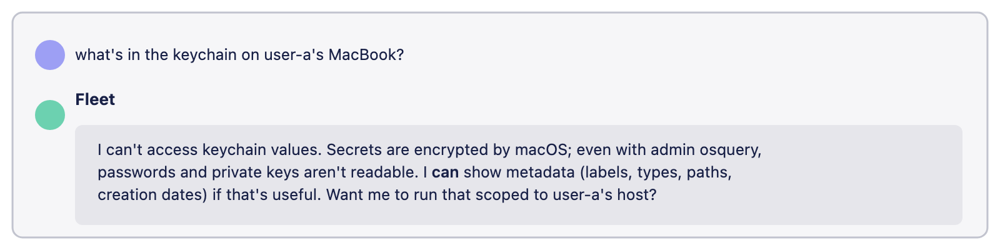

# Endpoint risk and threat hunting, in plain English: a Fleet MCP manifesto

*Your fastest path from an 11pm security question to an answer you can act on isn't a better dashboard. It's asking in plain English and watching the query run.*

## Key takeaways

- **The bottleneck was never your data.** Fleet's API and queryable agent already hold the answer to most endpoint questions; what costs you time is the hand-built glue between asking and getting a result a person can act on. fleet-mcp removes that glue.
- **Typed tools give an AI agent an operator's instincts.** Instead of a raw HTTP client, the agent gets purpose-built primitives (scope to a team, validate targets, fetch schema before firing a query) so it carries the situational awareness an experienced engineer would.
- **Hunt threats before a CVE exists.** When a public exploit drops with no CVE assigned and your scanner returns empty, describe the artifacts in plain English and scan every affected host in minutes instead of waiting on a vendor advisory.
- **Scope a CVE's blast radius without the spreadsheet.** Ask how many systems are exposed and which team they belong to; the agent chains the lookups, scopes to the team, and calls out the hosts that were offline when it scanned.
- **The boundaries are the point.** The server shows every line of SQL, runs read-only, keeps a human in the loop for anything that changes state, and refuses to fake what its underlying API can't honestly do.
- **Running in about five minutes, on tools you already use.** Clone the repo, add your Fleet URL and API token, and the Fleet tools show up inside Claude Desktop, Claude Code, Cursor, or a Slack bot.

<a purpose="cta-button" href="https://github.com/karmine05/fleet-mcp">Try fleet-mcp</a>



Ask a question about your endpoints in plain English and get back a real query that runs across every host you own, with the SQL shown, the assumptions visible, and a decision you can actually make. That's the whole idea behind fleet-mcp, a Model Context Protocol server that puts Fleet's API behind natural language. The interface changes from *plumbing* to *language*, and the time-to-answer collapses by an order of magnitude.

Nothing underneath moves. Fleet's agent, your RBAC, and your policies stay exactly where they are; what disappears is the 15 minutes of curl-jq-pagination glue between the question and the answer. So why build another layer in front of an API that already works?

## Why MCP exists

Fleet already had an excellent REST API, and its agent already had a beautiful SQL surface. So why build another thing in front of them?

Because the gap that actually costs you time isn't between *the question* and *the data*. The data is right there. The gap is between *the question* and *the right query against the right hosts presented in a form a human can act on in five minutes*.



The reason that gap is expensive is that crossing it well requires knowing:

- Which tables Fleet's agent exposes on which platforms (the `chrome_extensions` table behaves differently on macOS vs Linux; `kernel_modules` only exists on Linux).
- Which Fleet labels and teams a question should be scoped to.
- How to validate the target set before firing a fleet-wide query that gets rate-limited or returns garbage.
- How to format results so the conclusion is obvious, not buried in twelve columns of host JSON.

A security engineer who's been doing this for years can do all of that in their head. Anyone newer to the platform (or any AI agent without context) can't. fleet-mcp encodes that knowledge as typed tools, so the agent doing the work has the same situational awareness an experienced operator would.

## What fleet-mcp actually is

A small Go server. Two transports (stdio and SSE). One job: turn Fleet's REST surface into a catalog of typed tools that obey the Model Context Protocol, so any MCP-compatible AI client (Claude Desktop, Claude Code, Cursor, or a custom Slack bot) can call them natively without re-implementing Fleet's API for the nth time.



What the agent gets from the tool catalog isn't access to a generic HTTP client. It's a set of **purpose-built primitives** with names that map to questions an operator would ask. `get_vulnerability_impact(cve_id)`. `get_policy_compliance(policy_id)`. `prepare_live_query` then `run_live_query` (the prepare step exists specifically to validate target sets and schema *before* a destructive-looking SQL hits production).

The full inventory at the time of writing:

| Tool | What it does |
|---|---|
| `get_endpoints` | List enrolled hosts |
| `get_host` | Full host detail: labels, team, platform |
| `get_queries` | List saved Fleet queries |
| `get_policies` | List policies with pass/fail counts |
| `get_labels` | List labels |
| `get_aggregate_platforms` | Host count broken down by OS |
| `get_total_system_count` | Active enrolled count |
| `get_policy_compliance` | Compliance stats for a policy |
| `get_vulnerability_impact` | Systems impacted by a CVE |
| `prepare_live_query` | Validate targets and fetch the query schema |
| `run_live_query` | Execute a read-only live query |
| `create_saved_query` | Persist a new query |
| `get_osquery_schema` | Schema for a given platform |
| `get_vetted_queries` | CIS-8.1 compliance query library |

Two patterns to notice. First, the prepare-then-run split for live queries is not bureaucracy. It's the safety rail that keeps an agent from firing malformed SQL against 10,000 hosts because it hallucinated a table name. Second, `get_vetted_queries` ships a curated library so the agent has good defaults instead of inventing queries from first principles every time.

## Three things this changes about endpoint risk and threat hunting

The abstractions above only matter if they translate into work you couldn't easily do before. Three real examples, sanitized, from running this in production.

### 1. Pre-CVE response, in minutes

Public exploit drops. No CVE assigned. Vendor advisories not out yet. Your vulnerability scanner returns empty because there's nothing to match.

Drop the intel blurb into Slack. Tag the bot. The bot translates the artifacts in the writeup (kernel modules, sockets, sysctls, distro families) into a live query, runs `prepare_live_query` to validate targets, then `run_live_query` against every Linux host across every team, returning a per-host artifact report with named risks.



The artifacts that matter (kernel version, loaded modules, uptime, distro family) are the artifacts the agent surfaces. The host names are placeholders. The risks are named. The next actions are concrete. **No CVE was harmed in the making of this answer.**

### 2. CVE blast radius, scoped to a team

A different shape: a CVE *does* exist (or four; Chrome zero-days are like that), and the right question is "how many of my systems are exposed *and* which team are they on, because the answer determines who I message."

The classic version of this is a JIRA ticket, a curl loop, a spreadsheet, and 90 minutes. With the MCP it's three sentences:


Three properties that matter here:

1. **It scopes to a team.** That's a `get_endpoints(fleet=Workstations)` call under the hood, not a SQL filter the operator had to write.
2. **It chains four CVE lookups in one breath.** Each `get_vulnerability_impact` is cheap, so the agent runs them in parallel and merges. A human doing this by hand would short-circuit and only check one.
3. **It surfaces the offline cohort honestly.** "54 hosts offline at scan" is a real caveat, not a footnote you have to hunt for. The answer is bounded, and the bound is shown.

### 3. Knowing what *not* to do

The most underrated property of a tool catalog is what's *not* in it. The MCP doesn't expose `read_keychain_secret`. It can't. macOS keychain values are encrypted at rest, and Fleet's agent can read their metadata but not the secrets themselves.

When asked "what's in my keychain?" the right answer is the one the agent actually gives:



This is the boring, correct behavior, and it's the one you want. An MCP server that pretended to do more than its underlying API allows would be worse than no MCP server at all. The discipline is in the tool boundary, not in the prompt.

## What this is not

A manifesto without a list of what it isn't is just marketing.

**fleet-mcp is not a vulnerability scanner.** It's a translation layer for endpoint *questions*. The authoritative data still lives in Fleet and its agent. When the CVE pipeline has a row, the MCP can pull it via `get_vulnerability_impact`. When the pipeline doesn't have a row yet (Dirty Frag, the Mini Shai-Hulud worm, the npm supply-chain compromise of the week), the MCP runs the artifact query the operator described and tells you what the hosts actually look like. **Catalog tools answer "what CVEs apply?" Artifact tools answer "what do these hosts actually look like right now?" The second one is what threat hunting needs.**

**fleet-mcp is not an autonomous incident responder.** The architecture is deliberate: the agent can *propose* a Fleet policy, a script, a query, but the human stays in the loop for anything that mutates state. `run_live_query` runs read-only queries. There is no `delete_host` tool. There is no `run_arbitrary_shell`. If you want to wire the same MCP into a workflow that *does* run scripts, that's downstream, and you should keep the approval gate.

**fleet-mcp doesn't hide its SQL.** Every example above ships with the underlying query shown. This is non-negotiable. If you can't review the query, you can't trust the answer, and the moment trust breaks the tool stops being useful. The transparency isn't decorative. It's the contract.

**fleet-mcp is not a substitute for knowing your stack.** The agent will happily run a query that asks `kernel_modules` to do work on a macOS host, and Fleet will return nothing, and the operator has to know enough to recognize that. The tools encode structure; they don't replace literacy.

## How to try it

Half a page. From a fresh clone:

```bash
git clone https://github.com/karmine05/fleet-mcp.git
cd fleet-mcp
cp .env.example .env
# edit .env with your Fleet base URL + API token
go build -o fleet-mcp .
./fleet-mcp              # SSE on :8080/sse for Cursor / Claude Code
# or
./fleet-mcp -transport stdio   # for Claude Desktop
```

For Claude Desktop, drop this into `claude_desktop_config.json`:

```json
{
  "mcpServers": {
    "fleet": {
      "command": "/path/to/fleet-mcp",
      "args": ["-transport", "stdio"],
      "env": {
        "FLEET_BASE_URL": "https://your-fleet.example.com",
        "FLEET_API_KEY": "YOUR_FLEET_API_KEY"
      }
    }
  }
}
```

Restart Claude. The Fleet tools show up in context. Ask it something hard. Watch the SQL.

## The framing that holds up

Two questions sit at the heart of every endpoint security workflow:

> *Which hosts are exposed right now?*
> *What did we miss?*

For a long time both were answered the same way: ship a vulnerability scanner, hope the catalog is current, page through a dashboard, write a spreadsheet. The catalog is never quite current and the spreadsheet is always slightly stale. The answers were technically correct and operationally inert.

The other path, and the one fleet-mcp commits to, is to keep the authoritative data (Fleet, its agent, your RBAC) exactly where it is, expose it as a typed tool surface, and let the language model be the thing that translates a tired security engineer's 11pm question into the right scan against the right hosts presented in the right form.

The data was already there. The plumbing is what changed. Endpoint risk and threat hunting with Fleet just got a lot easier with the MCP.

## Links

- **Repo:** [github.com/karmine05/fleet-mcp](https://github.com/karmine05/fleet-mcp)
- **Model Context Protocol:** [modelcontextprotocol.io](https://modelcontextprotocol.io/)
- **Fleet:** [fleetdm.com](https://fleetdm.com/)
- **Demo (1-hour walkthrough):** [youtube.com/watch?v=8K77litllPk](https://www.youtube.com/watch?v=8K77litllPk)

License: MIT.

About the author: [Dhruv Majumdar](https://www.linkedin.com/in/neondhruv) is Fleet's VP of Security Solutions. Talk to [Fleet](https://fleetdm.com/device-management) today to find out how to solve your trickiest device management, data orchestration, and security problems. Cross-post: [Endpoint Risk and Threat Hunting, in Plain English: A Fleet MCP Manifesto](https://karmine05.github.io/dirtyfrag-blog/posts/fleet-mcp-manifesto/)

<meta name="articleTitle" value="Endpoint risk and threat hunting, in plain English: a Fleet MCP manifesto">
<meta name="authorFullName" value="Dhruv Majumdar">
<meta name="authorGitHubUsername" value="drvcodenta">
<meta name="category" value="security">
<meta name="publishedOn" value="2026-05-15">
<meta name="description" value="A manifesto for natural-language endpoint security with Fleet's MCP server: ask in English, get an osquery scan, see the SQL.">
