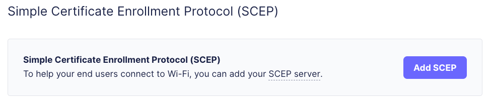
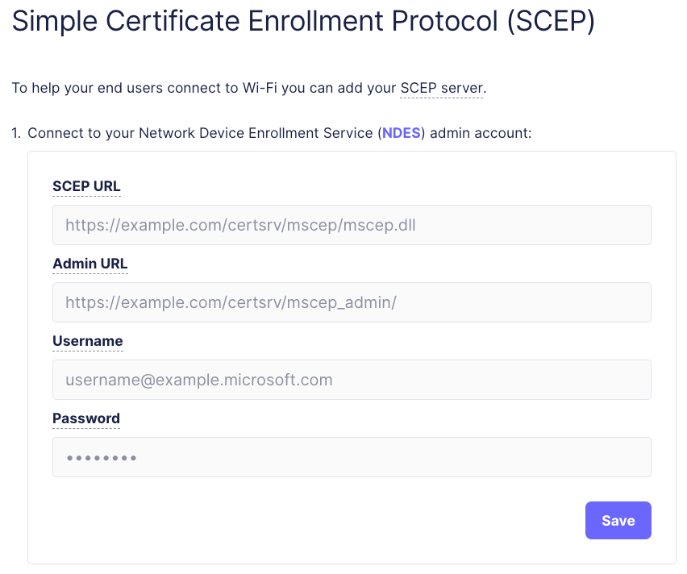
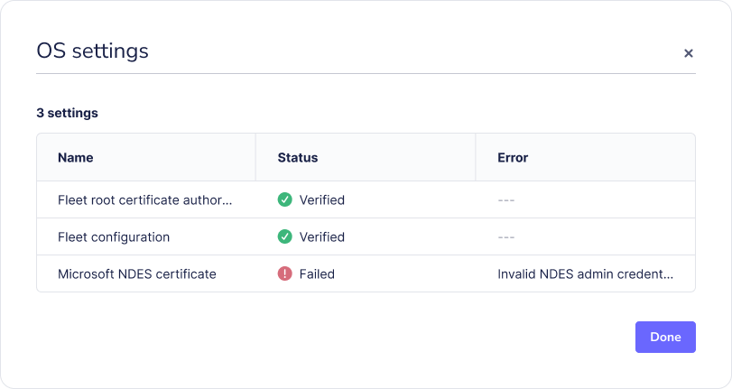

# Connect end users to Wi-Fi with Simple Certificate Enrollment Protocol (SCEP)

Fleet [v4.59.0](https://github.com/fleetdm/fleet/releases/tag/fleet-v4.59.0) introduces support for helping your end users connect to Wi-Fi by adding your SCEP server. Fleet currently supports Microsoft's Network Device Enrollment Service (NDES) as a SCEP server.

This guide will walk you through configuring and using NDES with Fleet acting as a SCEP proxy.

## Prerequisites

* Fleet Premium with admin permissions.
* Fleet [v4.59.0](https://github.com/fleetdm/fleet/releases/tag/fleet-v4.59.0) or greater.
* Apple MDM enabled.
* A Windows Server with AD CS (Active Directory Certificate Services) and NDES installed and configured, including the certificate templates for the certificates you want to enroll for.
  * The default password cache size for NDES is five passwords. Increase this value to account for the number of devices you expect to enroll simultaneously, including devices that may be offline and need to enroll when they come online.

## Step-by-step instructions

### 1. Add SCEP in Fleet

Go to the Fleet web interface, navigate to `Settings`, go to the `Integrations` tab, and click `Mobile device management (MDM)`. Scroll down to `Simple Certificate Enrollment Protocol (SCEP)` and click `Add SCEP`.



### 2. Configure NDES SCEP settings

You will need to provide the SCEP URL that accepts the SCEP protocol. You'll also need to give the admin URL with the associated username and password to get the one-time challenge passwords for SCEP enrollment.



Note:
* The example paths end with `/certsrv/mscep/mscep.dll` and `/certsrv/mscep_admin/` respectively. These path suffixes are the default paths for NDES on Windows Server 2022 and should only be changed if you have customized the paths on your server.
* When saving the configuration, Fleet will attempt to connect to the SCEP server to verify the connection, including retrieving a one-time challenge password. This validation also occurs when adding a new SCEP configuration or updating an existing one via API and GitOps, including dry runs. Please ensure the NDES password cache size is large enough to accommodate this validation.

### 3. Create a SCEP configuration profile

Create a configuration profile in Fleet that includes the SCEP payload. In the profile, you will need to set `$FLEET_VAR_NDES_SCEP_CHALLENGE` as the `Challenge` and `$FLEET_VAR_NDES_SCEP_PROXY_URL` as the `URL`.

Adjust the `Subject` values according to your organization's needs. You may set `$FLEET_VAR_HOST_END_USER_EMAIL_IDP` if the hosts were enrolled into Fleet MDM using an IdP (Identity Provider). You can also use any of the [Apple profile variables](https://support.apple.com/en-my/guide/deployment/dep04666af94/1/web/1.0) to uniquely identify your device.

Example profile:

```xml
<?xml version="1.0" encoding="UTF-8"?>
<!DOCTYPE plist PUBLIC "-//Apple//DTD PLIST 1.0//EN" "http://www.apple.com/DTDs/PropertyList-1.0.dtd">
<plist version="1.0">
<dict>
    <key>PayloadContent</key>
    <array>
       <dict>
          <key>PayloadContent</key>
          <dict>
             <key>Challenge</key>
             <string>$FLEET_VAR_NDES_SCEP_CHALLENGE</string>
             <key>Key Type</key>
             <string>RSA</string>
             <key>Key Usage</key>
             <integer>5</integer>
             <key>Keysize</key>
             <integer>2048</integer>
             <key>Subject</key>
                    <array>
                        <array>
                          <array>
                            <string>CN</string>
                            <string>%SerialNumber% WIFI $FLEET_VAR_HOST_END_USER_EMAIL_IDP</string>
                          </array>
                        </array>
                        <array>
                          <array>
                            <string>OU</string>
                            <string>FLEET DEVICE MANAGEMENT</string>
                          </array>
                        </array>
                    </array>
             <key>URL</key>
             <string>$FLEET_VAR_NDES_SCEP_PROXY_URL</string>
          </dict>
          <key>PayloadDisplayName</key>
          <string>WIFI SCEP</string>
          <key>PayloadIdentifier</key>
          <string>com.apple.security.scep.9DCC35A5-72F9-42B7-9A98-7AD9A9CCA3AC</string>
          <key>PayloadType</key>
          <string>com.apple.security.scep</string>
          <key>PayloadUUID</key>
          <string>9DCC35A5-72F9-42B7-9A98-7AD9A9CCA3AC</string>
          <key>PayloadVersion</key>
          <integer>1</integer>
       </dict>
    </array>
    <key>PayloadDisplayName</key>
    <string>SCEP proxy cert</string>
    <key>PayloadIdentifier</key>
    <string>Fleet.WiFi</string>
    <key>PayloadType</key>
    <string>Configuration</string>
    <key>PayloadUUID</key>
    <string>4CD1BD65-1D2C-4E9E-9E18-9BCD400CDEDC</string>
    <key>PayloadVersion</key>
    <integer>1</integer>
</dict>
</plist>
```

Upload the profile to Fleet in **Controls** > **OS Settings** > **Custom settings**.

When sending the profile to hosts, Fleet will replace the `$FLEET_VAR_NDES_SCEP_CHALLENGE`, `$FLEET_VAR_NDES_SCEP_PROXY_URL`, and `$FLEET_VAR_HOST_END_USER_EMAIL_IDP` variables with the proper values. Any errors will appear as a `Failed` status in the host's `OS settings`.



> Note: If the uploaded profile is signed, Fleet will replace the variables and invalidate the signature.

## How does it work?

The SCEP proxy in Fleet acts as a middleman between the device and the NDES server. When a device requests a certificate, the SCEP proxy forwards the request to the NDES server, retrieves the certificate, and sends it back to the device. In addition, the SCEP proxy:

- Retrieves the one-time challenge password from the NDES server.
  The NDES admin password is encrypted in Fleet's database by the [server private key](https://fleetdm.com/docs/configuration/fleet-server-configuration#server-private-key). It cannot be retrieved via the API or the web interface.
  Retrieving passwords for many devices may cause a bottleneck. To avoid long wait times, we recommend a gradual rollout of SCEP profiles.
  - Restarting the NDES service will clear the password cache and may cause outstanding SCEP profiles to fail.
- Resend the profile to the device if the one-time challenge password has expired.
  - If the device has been offline and the one-time challenge password is more than 60 minutes old, the SCEP proxy assumes the password has expired and will resend the profile to the device with a new one-time challenge password.

The issued certificate will appear in the System Keychain on macOS. During the profile installation, the OS generates several temporary certificates needed for the SCEP protocol. These certificates may be briefly visible in the Keychain Access app on macOS. The CA certificate must also be installed and marked as trusted on the device for the issued certificate to appear as trusted. The IT admin can send the CA certificate in a separate [CertificateRoot profile](https://developer.apple.com/documentation/devicemanagement/certificateroot?language=objc).

## Use case: connecting to a corporate WiFi network

A common use case for SCEP is connecting devices to a corporate WiFi network. This involves creating a profile with SCEP and WiFi payloads and linking them together. Here's how you can use Fleet's SCEP proxy to achieve this:

1. Send the root CA certificate to the device using a [CertificateRoot profile](https://developer.apple.com/documentation/devicemanagement/certificateroot?language=objc).
2. Create a profile with a SCEP payload and a [WiFi payload](https://developer.apple.com/documentation/devicemanagement/wifi?language=objc), and send it to the device.
  - The `PayloadCertificateUUID` in the WiFi payload should reference the `PayloadUUID` of the SCEP payload.
  - For more information on connecting your Apple devices to 802.1X networks, see [this guide from Apple](https://support.apple.com/en-my/guide/deployment/depabc994b84/web).

## Assumptions and limitations
* NDES SCEP proxy is currently supported for macOS devices via Apple config profiles. Support for DDM (Declarative Device Management) is coming soon, as is support for iOS, iPadOS, Windows, and Linux.
* Certificate renewal is coming soon.
* Fleet server assumes a one-time challenge password expiration time of 60 minutes.

## Conclusion

Fleet's NDES SCEP proxy feature allows your devices to receive certificates from your certificate authority's NDES service. This feature simplifies managing certificates on your devices and enables a secure and efficient way to connect them to your corporate network.

<meta name="articleTitle" value="Connect end users to Wi-Fi with Simple Certificate Enrollment Protocol (SCEP)">
<meta name="authorFullName" value="Victor Lyuboslavsky">
<meta name="authorGitHubUsername" value="getvictor">
<meta name="category" value="guides">
<meta name="publishedOn" value="2024-10-30">
<meta name="description" value="Learn how to help your end users connect to Wi-Fi by adding your SCEP server">
