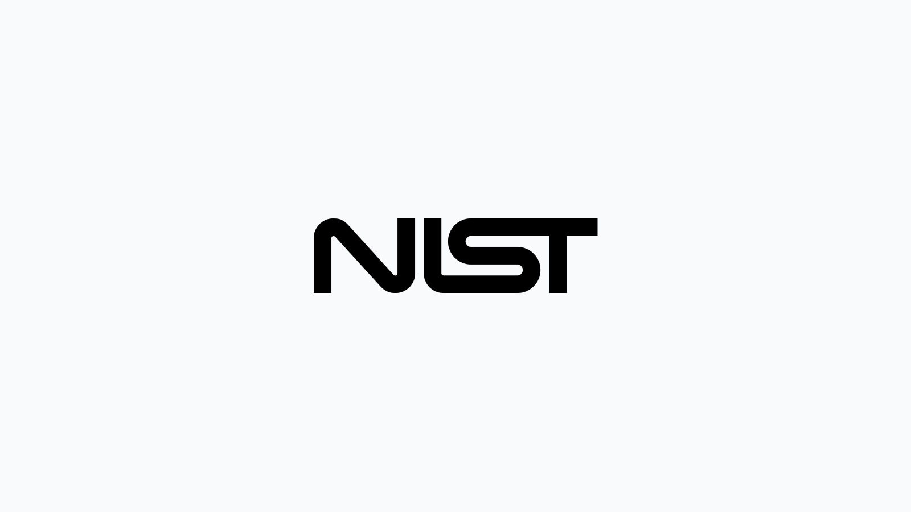

In the ever-evolving cybersecurity landscape, staying ahead isn't just an advantage – it's anecessity. That's why the upcoming transition in the National Vulnerability Database (NVD) is more than just news; it's a pivotal change for everyone in the field of vulnerability management. Come December 15th, 2023, NIST will move exclusively to their new [NVD 2.0 API](https://nvd.nist.gov/general/news/api-20-announcements). This advancement marks a step and a giant stride forward, offering a more robust, flexible, and user-friendly way to access crucial vulnerability data.

For users of Fleet, this transition is particularly important. The older versions of Fleet will no longer work with the NVD’s data feed after the transition. To align with these changes and harness the full capabilities of the NVD's API 2.0, an upgrade to Fleet v4.41.0 (or later) is essential. Failing to upgrade means allowing crucial updates on vulnerabilities to slip right past your defenses, a risk no one in our community can afford.

So, what does this mean for you, and why is it crucial to make the shift? Let's delve into the heart of these changes and understand how upgrading to Fleet v4.41.0 will empower your vulnerability management like never before.

## Why this matters to you

The NVD is the U.S. government repository of standards-based vulnerability management data represented using the Security Content Automation Protocol (SCAP). This data enables automation of vulnerability management, security measurement, and compliance. The transition to API 2.0 is not merely an update—it's a significant shift in how this vital data is accessed and processed.

## Key changes in NVD 2.0 API

Updated Data Model: The NVD 2.0 API adopts a new data model (SCAP) that better reflects the evolving nature of vulnerability information. This model is more granular and provides a richer representation of vulnerability details.

Enhanced Search Capabilities: The NVD 2.0 API offers advanced search functionalities, enabling users to filter and retrieve vulnerability data based on various criteria, including CVE IDs, CVSS scores, product names, and publication dates.

Structured Data Representation: The NVD 2.0 API delivers vulnerability data in JSON format, providing a well-defined and consistent structure for consuming and processing the information.

In addition, they have implemented API Versioning, improved developer documentation, and now offer official API client libraries for various programming languages.

## Fleet's proactive approach

We are committed to staying ahead of the curve. That's why we're excited to announce that with our
the release of Fleet v4.41.0, we will fully support the NVD's API 2.0. This
update will ensure a seamless transition for our users and bring enhanced stability and security
features that come with the new API.

## Your next steps

To continue receiving the latest vulnerability data without interruption, all Fleet users should upgrade to [v4.41.0](/releases/fleet-4.41.0) as soon as it's released. Delaying this update could result in your service no longer receiving new vulnerability updates after the December 15th cutoff.

Keep your defenses up by taking advantage of critical vulnerability updates. Plan your upgrade to Fleet v4.41.0 and continue safeguarding your systems with confidence.

## FAQ

### What is the NVD Data Feed API 2.0?

The NVD 2.0 API is a modern, structured, real-time API that provides comprehensive access to vulnerability data, enabling developers and security professionals to manage vulnerabilities and protect their systems effectively.

### Is there a deadline for upgrading Fleet?

To continue receiving the latest vulnerability data without interruption, all Fleet users should upgrade to v4.41.0 before December 15, 2023.

### How can I upgrade to Fleet v4.41.0?

Visit our [Upgrade guide](https://fleetdm.com/docs/deploying/upgrading-fleet) in the Fleet docs for instructions on updating to Fleet 4.41.0.

### What happens if I don’t upgrade Fleet by the deadline?

Delaying this update could result in your service no longer receiving new vulnerability updates after the December 15th cutoff.

<meta name="category" value="announcements">
<meta name="authorFullName" value="JD Strong">
<meta name="authorGitHubUsername" value="spokanemac">
<meta name="publishedOn" value="2023-11-28">
<meta name="articleTitle" value="NVD API 2.0: An important update for Fleet users">
<meta name="articleImageUrl" value="../website/assets/images/articles/nvd-api-2.0-1600x900@2x.jpg">
