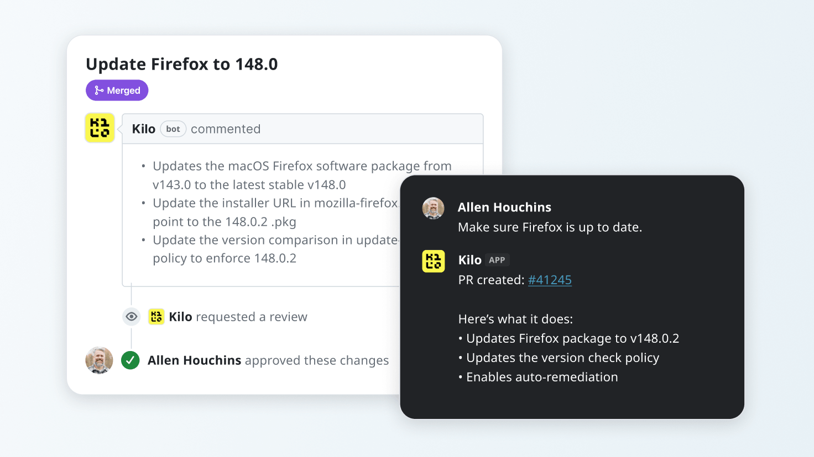

# Old IT is dead - GitOps & AI are burying it

I was a skeptic.

For years, "AI in IT" meant chatbots that confidently gave you wrong answers, autocomplete that finished your sentences badly, and a lot of vendor hype that amounted to a fancy search bar. If you tried AI tooling before late 2025 and walked away unimpressed, I completely understand. So did I.

But something changed around November 2025. These models got *good*. Not incrementally better but genuinely, meaningfully good. And for those of us working with structured, well-documented, open data, the leap forward is almost unfair in the best possible way.

This is my journey of how I started using AI to manage devices with Fleet and why I think it represents the biggest shift in how IT work gets done in a generation.

## First, a word about "Old IT"

You know the drill. A change needs to happen. You schedule a meeting. Then another meeting to review the output from the first meeting. A change advisory board convenes. Someone asks if we've documented the rollback plan, and the honest answer is "not really." The change goes in, something breaks, and you spend three days figuring out what happened because there's no true audit trail, no version history, and no transparency into exactly what changed and when.

Old IT is slow, opaque, and manual. And for a long time, we accepted it because there wasn't a better way.

There is now.

## Why Fleet? Why now?

Fleet is an open-source device management platform, and it is uniquely positioned for this moment in a way that no other vendor comes close to matching.

Here's why:

The source code is open. AI models can read it, reason about it, and work with it. There's no black box and no proprietary API that the model has to guess at.

There is a single, well-documented API. When you give an AI a coherent, documented surface to work against, the results are dramatically better. Fleet's API isn't a patchwork of legacy endpoints. It's structured, consistent, and readable.

GitOps is a first-class citizen. Fleet is designed from the ground up to be managed through code: through pull requests, version history, and Infrastructure as Code workflows. That's not a bolt-on feature. It's the architecture.

No other device management company is as well-positioned to take advantage of this new era of IT.

## The Intune breach we should all be thinking about

The [recent Microsoft Intune breach](https://krebsonsecurity.com/2026/03/iran-backed-hackers-claim-wiper-attack-on-medtech-firm-stryker/) is a case study in what happens when your management plane is a GUI that any compromised account can click through.

Think about what Infrastructure-as-Code, and the products built natively around it, can actually give you: a read-only UI. Changes can only come through code, through pull requests, through a reviewable, auditable process. There is no "log in and click deploy" path for a bad actor, or an honest mistake, to exploit.

If the Intune environment that was breached had been managed through Infrastructure as Code, the blast radius of that breach would have been fundamentally different. The attack surface shrinks dramatically when the UI can show you the state but cannot change it.

This isn't hypothetical security theater. It's a structural property of the GitOps model. And it matters, in this moment.

## How the journey started: small, specific, concrete

I didn't start by asking AI to solve everything. 

I started small.

*"Make sure all my workstations are running the latest version of Mozilla Firefox."*

That's it. A simple, finite, verifiable task. The AI looked at [Fleet's GitOps documentation](https://fleetdm.com/docs/configuration/yaml-files), understood the desired state model, and produced a policy that I could review, commit, and ship. It worked exactly as expected.

From there, the requests got a little more abstract. *"Make Slack and Zoom available during the setup experience and self-service."* *"Make sure screen lock activates after fifteen minutes of inactivity."* Each time, correct output, correctly structured, ready to review. It even created configuration profiles without me having to use iMazing or Apple Configurator.

But here's where it started to surprise me. When I asked it to deploy Mozilla Firefox, I was thinking about the *deployment*. The AI was thinking further ahead than I was originally. It detected that the installer was x86 and automatically created a label so the software would be scoped only to compatible devices. I hadn't asked for that. I hadn't even thought about it. And in the old world, I probably wouldn't have until an IT ticket landed in my team's queue from a confused user on an incompatible machine. The AI caught the edge case before it became someone's problem. That shift from "AI does what I ask" to "AI thinks about what I actually need" is when I realized this was something different.

## Ready for production

We started asking bigger questions. Not "configure this specific setting" but:

*"Apply industry best practice security controls to my workstations."*

*"Make my devices ready for ISO 27001 compliance."* ([Link to pull request](https://github.com/fleetdm/fleet/pull/40958))

And it delivered. Not just a list of things to configure, but a complete picture. The pull request included what controls we already had in place, called out what was missing, and explained why each addition mattered. Structured, coherent, policy-ready output mapped to real compliance frameworks, grounded in Fleet's actual configuration model, and ready for human review.

You can see every experiment we've been running, including how we are using AI to keep documentation up to date in our public repo: [fleetdm/fleet on GitHub](https://github.com/fleetdm/fleet/issues?q=is%3Apr%20author%3Aapp%2Fkilo-code-bot%20state%3Aclosed)

## A pleasant surprise: naming conventions

Anyone who's worked in IT for more than a few years has opinions about naming conventions. Strong opinions. Perhaps, at times, unreasonably strong opinions.

(I include myself in this. Fully. No apologies.)

What caught me off guard was that when the AI generated policies, labels, and configuration files, the output matched my naming conventions. My commenting style. My structural preferences. It wasn't generic boilerplate. It read like something I had written.

I don't know whether to attribute this to the AI being genuinely good at picking up on patterns or to the fact that good conventions in a well-documented open-source project tend to converge on something sensible. Either way, it was this small detail that made me think, "Okay, this is actually going to work."

## Human in the loop: this is not "AI just deploys things"

I want to be direct about something, because I think it's the most important part of this post for anyone who manages real devices for real people.

Nothing ships without a human reviewing it.

**This is GitOps:** Every change is a pull request. Every pull request is a diff you can read, a history you can audit, and a commit you can revert. Every change is documented. The AI proposes. A human reviews. The human approves or rejects. Only then does anything change in your environment.

This is also why [GitOps training](https://fleetdm.com/gitops-workshop) matters. The workflow is the safety layer. If you haven't invested in understanding pull requests, branching strategies, and rollback procedures, now is the time because that understanding is what makes AI-assisted management safe, not just fast.

The human is not a rubber stamp. The human is the point.

## The tool that made this click for me: Kilo Code

I've confirmed this workflow with two AI setups - Kilo Code and Claude - directly. It should work with any AI you're already invested in — OpenAI, Gemini, local models, whatever your organization has standardized on. 

Fleet's open architecture means the AI just needs to be able to read and reason about well-structured text, which all the capable modern models can do.

But I want to specifically call out why Kilo Code resonated with me: I never opened a text editor. I never opened an IDE. I never typed a `git` command.

I chatted with Slack. That's it. I described what I wanted in plain English, got back a diff to review, approved it, and it was done. For IT practitioners who are interested in GitOps but intimidated by the toolchain, this is the on-ramp. The barrier to entry is collapsing.

## This is a superpower, not a pink slip

I know what some of you are thinking. I've thought of it too.

*"If AI can do my job, what do I do?"*

Here's my honest answer: AI can handle repetitive, structured, and lookup-based work. It is genuinely, impressively good at that work now. And that should free you, not threaten you.

The engineering work that requires human creativity, judgment, relationship, and context is not going anywhere:

- Understanding your organization's actual risk tolerance
- Navigating a complex stakeholder conversation about a security tradeoff
- Knowing that the policy that's technically correct will cause a rebellion in the engineering org if you ship it on a Friday
- Building the trust that makes your IT and security programs actually work

AI cannot do any of that. You can.

What AI can do is handle the eighty percent of your backlog that is well-defined, documented, and implementable, so you can spend your time and energy on the twenty percent that actually requires you.

That's not a threat. That's a gift, and you should exploit it.

## The future is open source

The through-line in all of this is openness. Open source platform. Open API. Open configuration manifests. Open workflows that any auditor, any colleague, any future team member can read and understand.

Old IT was closed, opaque, and tribal — knowledge locked in the heads of whoever happened to have been there longest. New IT is transparent, reviewable, and collaborative.

Fleet is built for new IT. AI just made new IT available to everyone.

If you dismissed AI tooling before late 2025, I'd genuinely encourage you to try again. The models are different now. And when you point a good AI model at a well-documented, open-source solution, what comes out looks a lot like the future of device management.

---

*Tested and confirmed working with Kilo Code and Claude. Architecturally compatible with any AI investment your organization has already made. The open source future is already here — you can see it and experience it yourself, right now.*

<meta name="articleTitle" value="Old IT is dead - GitOps & AI are burying it">
<meta name="authorFullName" value="Allen Houchins">
<meta name="authorGitHubUsername" value="allenhouchins">
<meta name="category" value="articles">
<meta name="publishedOn" value="2026-03-18">
<meta name="description" value="AI and open-source solutions are enabling the future of device management, right now.">
<meta name="articleImageUrl" value="../website/assets/images/articles/old-IT-is-dead-736x414@2x.png">
