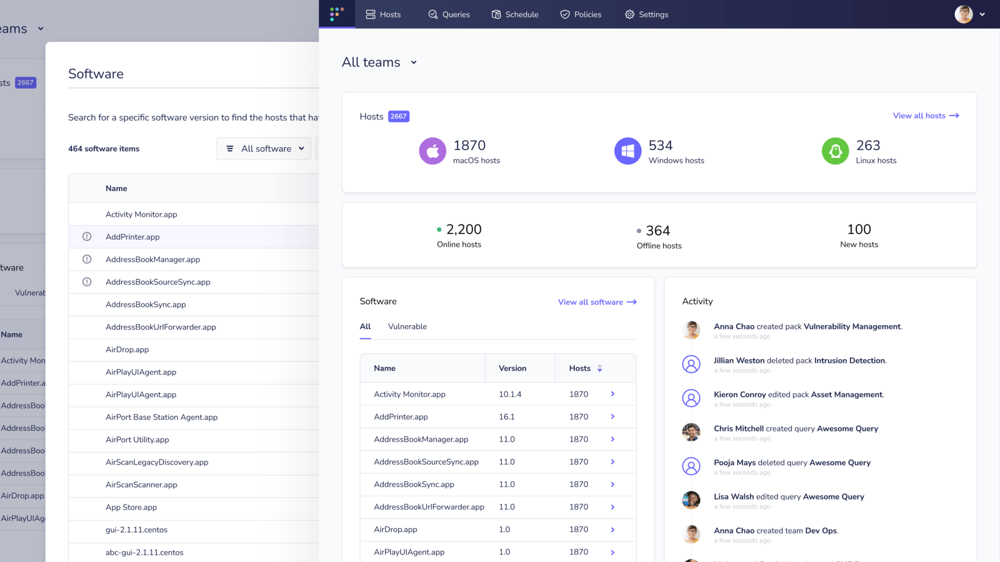

# Osquery: a tool to easily ask questions about operating systems

## What is osquery?
Osquery is an easy-to-use operating system monitoring tool that uses SQL to expose a device’s operating system as a highly performant relational database. But what does that mean? In short, osquery allows you to ask questions about your operating system. More than that, though:

- Osquery is compatible with any operating system and unifies how we ask questions across Windows, macOS, and Linux distributions like Ubuntu or Debian.
- It gives access to the underlying state of an operating system.
- It’s fast and lightweight.
- It’s open-source and easy to use by folks of varying technical skill levels.
- It’s a single-agent solution for meeting many of the needs of security and admin teams — who typically have to deploy and manage several proprietary and expensive device management tools.
- And lastly, it’s a breath of fresh air compared to other operating system monitoring tools, which often have complicated learning curves and consume many system resources.

With simple SQL statements, osquery can easily pull information about an operating system’s status and health, from something simple, such as getting the uptime data for a MacBook, or checking its battery health, to checking for vulnerabilities on your CentOS servers.

## What can you use osquery for?

So, we’ve established that osquery is a powerful, flexible tool that uses SQL to get real-time data to monitor and manage devices. Now let’s look at some of its uses.

### Osquery for vulnerability management

With osquery, you can easily monitor devices for vulnerabilities and misconfigurations.
osquery-a-tool-to-easily-ask-questions-about-operating-systems
- Check for security misconfigurations.
- See if unwanted or malicious applications or extensions are running.
- Verify the status of firewalls and drive encryption.
- Check for outdated or vulnerable operating system and software versions.

### Osquery for incidence response / digital forensics

Use osquery to investigate devices accurately, in real-time, and then feed your osquery data into your SIEM (Security Information and Event Manager) of choice. Incident responders can use these event logs to help them detect any digital footprints left behind by intruders and respond to threats swiftly before they become an emergency.

- Osquery for support teams / CPEs (Client Platform Engineers)
- Osquery support teams can quickly diagnose issues with any device in their fleet by querying that device for information.
- For Client Platform Engineers(CPEs), osquery helps make it easy to diagnose a device remotely once you deploy osquery at scale.

### Osquery for Zero Trust

In the wake of Covid-19, there’s been an extremely high occurrence of breaches. Implementing Zero Trust Support teams with osquery can help them quickly diagnose issues with a specific device in their fleet.

### How to install osquery

This article is only a high-level look at what osquery is capable of. If you are interested in trying out osquery for yourself, follow the installation guides for [macOS](https://osquery.readthedocs.io/en/latest/installation/install-macos/), [Windows](https://osquery.readthedocs.io/en/latest/installation/install-windows/), [Linux](https://osquery.readthedocs.io/en/latest/installation/install-linux/), and [FreeBSD](https://osquery.readthedocs.io/en/latest/installation/install-freebsd/).

### Deploy osquery at scale
To deploy osquery at scale across your organization’s devices, an osquery manager, such as [Fleet](https://fleetdm.com/), is required. Fleet makes osquery easy to deploy and scales to your organization’s needs. With Fleet, you can supercharge osquery to:

- Maintain secure laptops and servers.
- Interpret incidents accurately and make decisions using real-time device data.
- Notify your team when a CVE is detected.
- Verify changes made with other systems in your security environment.
- Keep an accurate inventory of all your devices and software, including those with vulnerabilities.
- Meet compliance goals.
- Automate security workflows in a single application.

Ready to give Fleet a try? Head over to our [try Fleet page](https://fleetdm.com/try-fleet/register), and you can be up and running with a preview environment in less than 5 minutes. Or you can check out the [docs](https://fleetdm.com/docs) to learn how to deploy Fleet across your organization.

<meta name="category" value="guides">
<meta name="authorGitHubUsername" value="dominuskelvin">
<meta name="authorFullName" value="Kelvin Omereshone">
<meta name="publishedOn" value="2022-04-04">
<meta name="articleTitle" value="Osquery: a tool to easily ask questions about operating systems">
<meta name="articleImageUrl" value="../website/assets/images/articles/osquery-a-tool-to-easily-ask-questions-about-operating-systems-cover-1600x900@2x.jpg">
