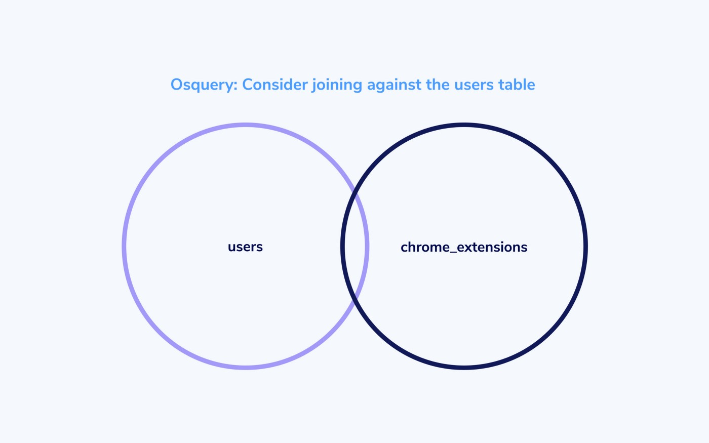

# Osquery: Consider joining against the users table

## Proper use of JOIN to return osquery data for users



Many an osquery user has encountered a situation like the following:

```
$ osqueryi
Using a virtual database. Need help, type '.help'
osquery> SELECT uid, name FROM chrome_extensions LIMIT 3;
+-----+--------------------------------------------+
| uid | name                                       |
+-----+--------------------------------------------+
| 501 | Slides                                     |
| 501 | Docs                                       |
| 501 | 1Password extension (desktop app required) |
+-----+--------------------------------------------+
osquery>

$ sudo osqueryi
Using a virtual database. Need help, type '.help'
osquery> SELECT uid, name FROM chrome_extensions LIMIT 3;
W0519 09:35:27.624747 415233472 virtual_table.cpp:959] The chrome_extensions table returns data based on the current user by default, consider JOINing against the users table
W0519 09:35:27.625207 415233472 virtual_table.cpp:974] Please see the table documentation: https://osquery.io/schema/#chrome_extensions
```

Our query runs as expected when `osqueryi` is run as a normal user, but returns a warning message and no results when run as root via `sudo osqueryi`.

This same issue manifests on many tables that include a `uid` column:

- `authorized_keys`
- `chrome_extension_content_scripts`
- `chrome_extensions`
- `crashes`
- `docker_container_processes`
- `firefox_addons`
- `known_hosts`
- `opera_extensions`
- `safari_extensions`
- `shell_history`
- `user_ssh_keys`

### What’s going on here?

As stated in the error message, these tables return “data based on the current user by default”. When run as a normal user, the implementations know to look in paths relative to the user’s home directories. A query running as root does not know which directories to check.

### The solution

Show osquery which users to retrieve the data for. Typically this is achieved by a `JOIN` against the `users` table to retrieve data for every user on the system:

```
SELECT uid, name
FROM users CROSS JOIN chrome_extensions USING (uid)
```

Writing the query with this `JOIN` ensures that osquery first generates the list of users, and then provides the user `uid`s to the `chrome_extensions` table when generating that data.

Note: It is important to use `CROSS JOIN` as this tells the query optimizer not to reorder the evaluation of the tables. If we use a regular `JOIN` it is possible that reordering could result in the original error being encountered (because the `chrome_extensions` table generates with no `uid` in its context).

<meta name="category" value="guides">
<meta name="authorGitHubUsername" value="zwass">
<meta name="authorFullName" value="Zach Wasserman">
<meta name="publishedOn" value="2021-05-06">
<meta name="articleTitle" value="Osquery: Consider joining against the users table">
<meta name="articleImageUrl" value="../website/assets/images/articles/osquery-consider-joining-against-the-users-table-cover-700x437@2x.jpeg">
