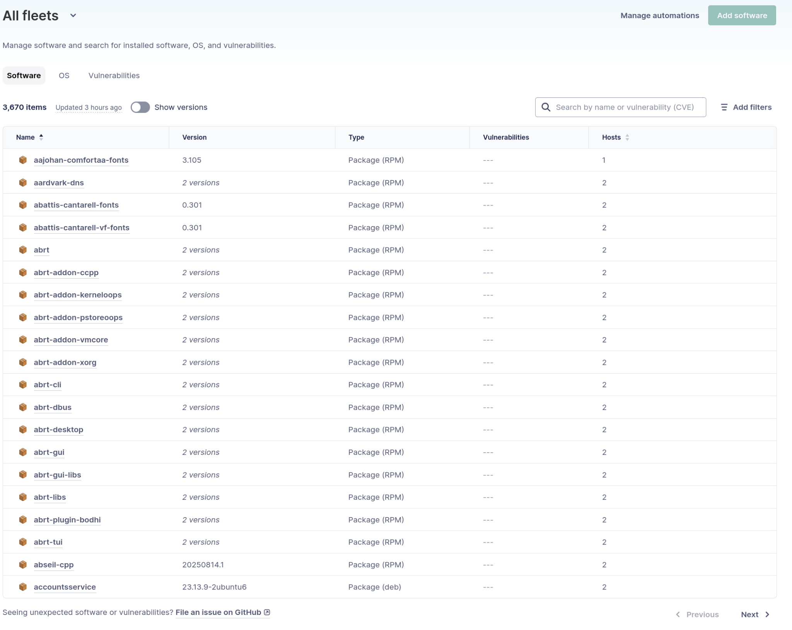
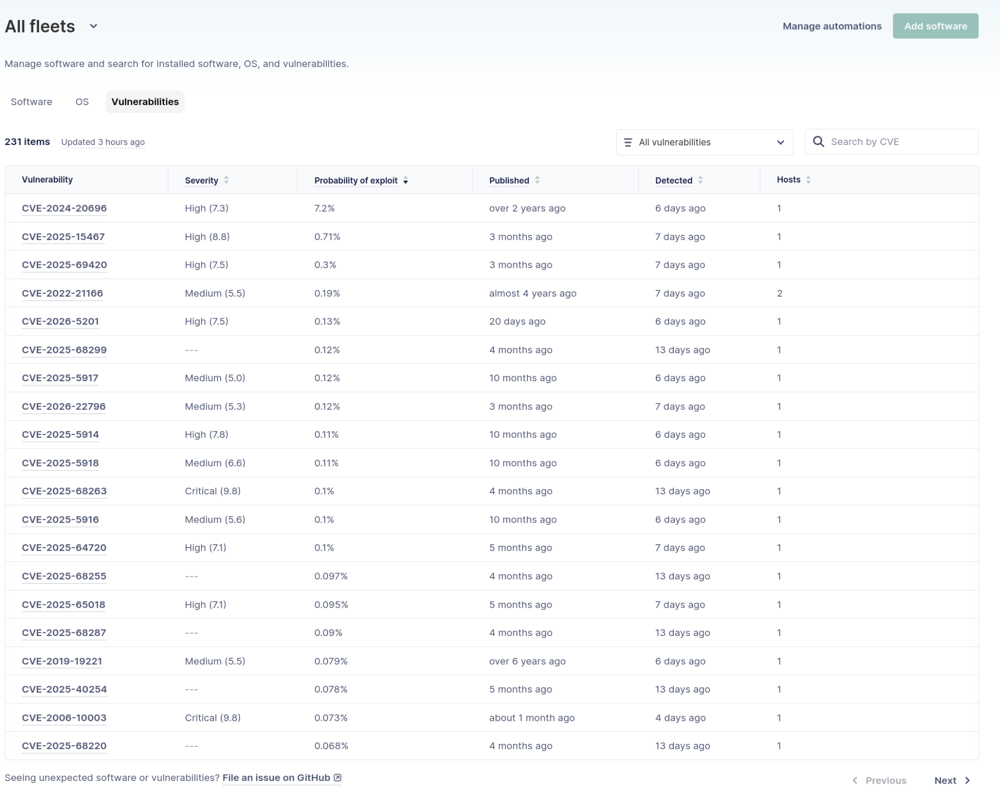
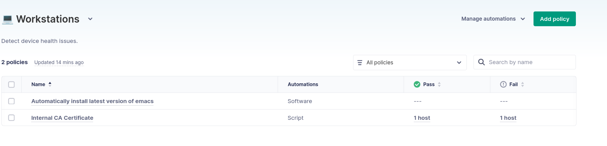

# Patch management and vulnerability reporting for Linux desktops

Every organization must regularly update software and identify security vulnerabilities. This process has proven challenging even for mature IT teams. Automating software inventory, policy enforcement, and remediation is difficult. Finding actionable insights among a trove of publicly available vulnerability data is even harder.

This process becomes even more important when you begin supporting Linux desktops. The Linux ecosystem introduces unique challenges that must be considered when creating a patching and vulnerability management approach. Tooling has traditionally been geared toward server administration, and it often lacks features needed for desktop environments.

In this article, we'll take a look at the unique needs of Linux desktops and the tooling that you'll need to support them.

## Patch management

Patch management is a proactive process that maintains correct and consistent software versions across your environment. Regularly patching your software helps to avoid security issues before they happen.

A good patch management strategy looks different based on organizational needs. Some teams aim to always deploy the latest versions of software. Other teams simply aim to backport security fixes or critical patches. Either way, you should be consistent and methodical in your approach to patching hosts.

Most practitioners associate security with patching. However, a robust patching process brings benefits beyond securing your systems:

- **Performance** - Newer software versions often include bug fixes and technical improvements. These enhancements often promote better software performance.
- **Compatibility** - A strong patch management strategy ensures compatibility between software running on a host. For example, you may have an internal application that needs a specific version of Java. A good patch management strategy will ensure this happens.
- **Consistency** - Problems quickly arise when different users are running different versions of software with different configurations. Patch management ensures that users are running consistent software versions, even if they are on different operating systems.

## Vulnerability reporting

Vulnerability reporting is a reactive approach to detect known security issues in installed software. This is often accomplished through agents or scanning-based tools that inventory software and find vulnerabilities based on package versions.

The Common Vulnerabilities and Exposures (CVE) catalog assigns unique identifiers to vulnerabilities. The CVE provides information about a vulnerability, including impacted software versions. While a CVE identifies a vulnerability, further information is needed to prioritize the impact of vulnerabilities.

Common Vulnerability Scoring System (CVSS) scores assign a severity to a vulnerability based on several criteria. The Exploit Prediction Scoring System (EPSS) is a standard that estimates the exploitation probability for a vulnerability within the next 30 days. It is a constantly evolving data set. The Known Exploited Vulnerabilities (KEV) catalog provides a source for known-exploited vulnerabilities. Together, these tools can be used to determine a vulnerability's overall severity for your organization.

## Why you need both

Patch management and vulnerability reporting work together to secure your environment. Good patch hygiene reduces the attack surface of your environment, but it won't eliminate it. Zero-day vulnerabilities can be exploited before you patch, or your patching process may lag behind cutting-edge exploits. Sometimes, it isn't practical to quickly patch because of compatibility and version constraints between software.

Vulnerability reporting helps to catch and alert you to these issues. It reveals where the patch management process is failing. This gives you a chance to remediate problems, both with the identified vulnerabilities and in the patching process itself. This can involve manually installing time-sensitive security fixes or modifying your patch system to be more aggressive in certain circumstances.

Together, these processes work together to form a closed loop:

- **Patch** - your systems to give yourself the best chance of avoiding problems.
- **Detect vulnerabilities** - to identify areas that patching has missed.
- **Remediate** - these vulnerabilities and improve your patching system.
- **Verify** -  the efficacy of your remediations.

## Linux challenges

Managing Linux patches and vulnerabilities comes with unique challenges. The most obvious challenge is the heterogeneous nature of package management on Linux. Each distribution uses its own package manager and package format. Examples include `apt`, `dnf`, `zypper`, and `pacman`. You must be able to track package installations across all of these tools when you support multiple Linux distributions.

It's also easy to lose visibility into Linux software due to "shadow" software installations outside of the operating system's package manager. Technically-savvy users will install software using programming language tools, such as `pip`, `npm`, or `cargo`. Alternative packaging formats, such as Flatpak and AppImage, add another potential installation source. Finally, users can manually compile software from source code.

The current tooling for Linux focuses on the needs of server administrators. Patch automation tools, such as `yum-cron` and `unattended-upgrades`, are helpful. However, they lack the control and visibility necessary for heterogeneous desktop environments. Automation tools, such as Ansible and Puppet, provide a scalable way to manage hundreds of hosts. However, they are oriented toward a "cattle vs. pets" philosophy of server management.

The same problems exist with many security tools, such as Nessus and Qualys. These tools provide very robust visibility into system vulnerabilities. However, their interfaces are designed for server administrators. Desktop management requires a vulnerability reporting system that hooks into your MDM platform.

Linux desktop management comes with unique challenges, and you must select tooling that treats Linux as a first-class citizen.

## What to look for in a tool

The closed loop provided by patch management and vulnerability reporting is critical to a healthy desktop environment. The unique constraints of Linux desktops further underscore the importance of a robust patching and vulnerability management approach. There are several important features to consider when evaluating tools for Linux patch and vulnerability management.

### Cross-distribution software inventory

You must have visibility into installed software versions across your entire environment. This includes all distributions that your organization supports. Ideally, you should also have visibility into other software sources, such as developer ecosystems (`pip`, `npm`, `cargo`) and compiled software. There isn't a single tool to cover every Linux software source, but you want as much visibility as possible.

### Vulnerability detection with actionable prioritization

Simply identifying vulnerabilities based on CVE isn't enough. Flooding your IT team with potential vulnerabilities isn't actionable and leads to alert fatigue. You need tooling that provides severity scoring, based on exploitability data like EPSS. You must be able to drill down and view only the hosts that are impacted in your environment.

### Policy-driven automation

You must be able to define policies that encompass your organization's unique patch management goals. This may involve ensuring that packages are always on a specific version. You may also consider more complex relationships between packages to ensure compatibility. Your tooling must be able to tie policy failure to automated responses. This can include installing updates, running scripts, or creating ITSM tickets.

### Linux support for software deployment

Tooling must support Linux-native deployment tools. This includes support for installing software using distribution packaging formats, such as `.deb` and `.rpm` archives. It should also include running shell scripts. While they have limitations, scripts are often necessary in certain circumstances. A patch and vulnerability management system must be flexible enough to support your preferred deployment models.

### Infrastructure-as-code management

A robust graphical UI is an important part of any management software. However, many patch and vulnerability management activities are repetitive. These tasks lend themselves to an IaC approach, ideally using GitOps for change deployment. A codified approach also provides a historical record of changes, including verification and justification through code review. This approach fits the way that Linux teams already work using IaC and configuration-as-code tooling.

### Closed-loop verification

We previously discussed how patch management and vulnerability reporting provide a closed-loop system. The tool you choose must be able to accomplish both. It must be able to evaluate patching success. If vulnerabilities are discovered, it must be able to trigger remediations and identify any regressions. A proper tool will continuously patch, monitor, and evaluate your environment for deviations or vulnerabilities.

## Linux patch and vulnerability management with Fleet

### Software inventory

Fleet provides a single view into the packages installed across your Windows, Mac, and Linux devices. Fleet automatically inventories the software across your environment, tracks installed versions, and allows you to drill down into individual hosts.

To view software installed across your environment, navigate to the **Software** page. This page allows you to search, sort, and drill down into the software across all of your hosts.

### Vulnerability detection

Fleet uses its software inventory to identify vulnerable software across your entire environment. It doesn't just provide a list of CVEs. It gives you the ability to understand the severity of the vulnerability and its probability of exploitation. This information is based on KEV, CVSS, and EPSS, which Fleet automatically updates for you.

To view vulnerability information, navigate to **Software > Vulnerabilities**. You can search and sort by vulnerability criteria. You can also click on CVEs to find information about the CVE and identify impacted hosts.

You can also define automations when vulnerabilities are detected by clicking on **Manage automations**. Fleet can create a ticket in your ITSM system or send a webhook.

### Patch policies and automated remediation

Fleet provides details about the characteristics and state of hosts in your environment. You can use this information to define policies that meet your organization's needs. These policies can install packages, run scripts, create ITSM tickets, and send webhooks. This allows you to automate policy violations using the Linux-native tools that make sense for your organization.

To manage policies, navigate to the **Policies** page. You can automatically take action when policies fail by clicking the **Manage automations** button and configuring your desired action.

You can find a more detailed example of setting up a policy and remediation in our [How to detect and remediate Linux desktop drift with Fleet](https://fleetdm.com/articles/managing-linux-desktop-drift) article.

## Wrapping up

Patch management and vulnerability reporting are distinct disciplines that reinforce each other. They provide a closed-loop for ensuring the hosts in your environment have the correct software versions and configuration.

Linux desktop environments present challenges that many existing tools aren't well-suited for. An effective tool for patch management and vulnerability reporting must support heterogeneous Linux environments. It must provide the same inventory, detection, prioritization, automation, and verification capabilities across Windows, Mac, and Linux.

Fleet provides native Linux support for software inventory, policy-based patching, and vulnerability reporting. It can fully automate the closed-loop approach needed for a secure and properly configured Linux desktop environment. This allows your IT teams to provide the same security and configuration guarantees across Windows, Mac, and Linux.

To learn more about Fleet or to get a demo [contact us](https://fleetdm.com/contact).

<meta name="articleTitle" value="Patch management and vulnerability reporting for Linux desktops">
<meta name="authorFullName" value="Anthony Critelli">
<meta name="authorGitHubUsername" value="acritelli">
<meta name="category" value="articles">
<meta name="publishedOn" value="2026-05-20">
<meta name="description" value="Close the loop on Linux desktop security. Fleet gives IT teams cross-distro software inventory, CVE prioritization, and automated patch remediation.">
