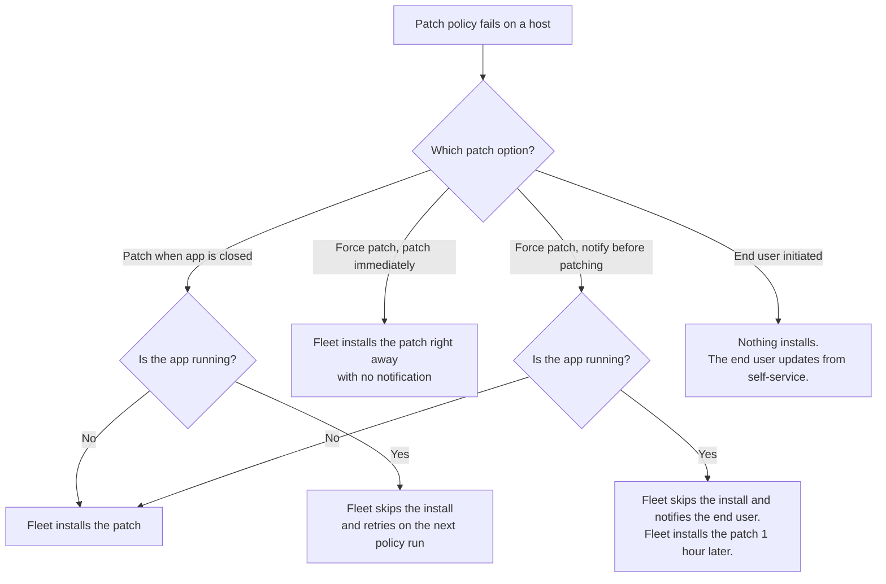
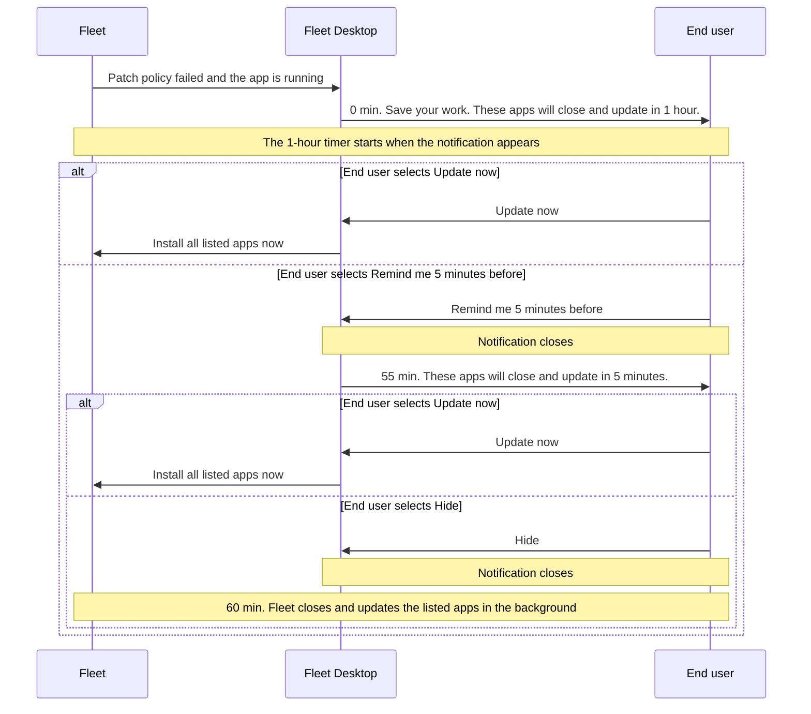
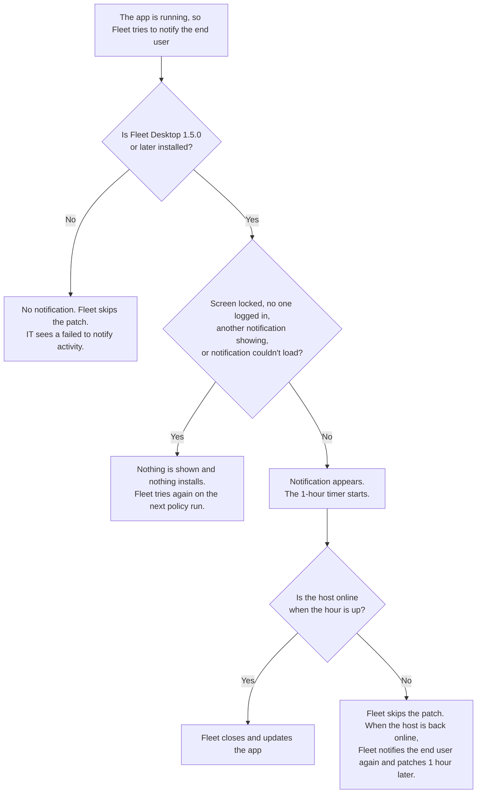

# Patching end user experience

When a patch policy for a Fleet-maintained app fails, Fleet can update the app for you. Each patch option gives your end users a different experience. Some options update apps quietly. One warns end users first, so they can save their work before the app closes. This guide shows what end users see on their Mac for each option, so you can pick the right one for each app.

Notify before patching is available on macOS only. Notifications for Windows are coming soon, targeted for Q1 2027. Until then, **Force patch** on Windows patches immediately.

<!-- TODO: embed explainer video. Replace VIDEO_ID with the YouTube video ID and uncomment the block below.

   <iframe src="https://www.youtube.com/embed/VIDEO_ID" frameborder="0" allowfullscreen></iframe>

-->

## Requirements

- Fleet Premium
- A [Fleet-maintained app](https://fleetdm.com/guides/fleet-maintained-apps) with a [patch policy](https://fleetdm.com/guides/how-to-use-policies-for-patch-management-in-fleet)
- For **Notify before patching**: macOS hosts with Fleet Desktop 1.5.0 or later. Fleet Desktop is available as a Fleet-maintained app.

## Choose a patch option

1. Go to **Software**, select a fleet, and select **Add software**.
2. Select **Add** next to the app you want.
3. Check **Patch** and choose an option.
4. Select **Add software**.

For an app you've already added, open the app's details page and select **Actions > Deploy**. You'll see the same options.

Here's what the end user sees with each option:

| Option | What the end user sees |
|:-------|:-----------------------|
| **Patch when app is closed** (default) | Nothing. The patch installs only when the app isn't running. |
| **Force patch** > **Patch immediately** | Nothing. The patch installs as soon as the policy fails. |
| **Force patch** > **Notify before patching** | If the app is running, a notification that the app will close and update in 1 hour. If the app isn't running, nothing. |
| **End user initiated (manual)** | Nothing installs on its own. The end user updates the app from self-service when they choose. |

This chart shows what happens after a patch policy fails:

## Patch when app is closed

This is the default option. End users don't see anything.

When the patch policy fails, Fleet checks whether the app is running:

- If the app isn't running, Fleet installs the patch.
- If the app is running, Fleet skips the install and tries again on the next policy run.

You'll see the skipped install in the host's activity feed.

> **Note:** Fleet uses a read-only pre-install query to check whether the app is closed. **Patch when app is closed** overrides any pre-install query you set under **Advanced options**.

## Force patch: patch immediately

End users aren't notified. Fleet installs the patch as soon as the policy fails. Fleet doesn't check whether the app is running first.

Choose this option when a patch can't wait.

## Force patch: notify before patching

_Available on macOS_

This option gives end users 1 hour to save their work before Fleet closes and updates the app. To turn it on, select **Force patch**, then select **Notify before patching** in the **End user experience** dropdown.

When the patch policy fails, Fleet checks whether the app is running:

- If the app isn't running, Fleet installs the patch. The end user isn't notified, since there's nothing to interrupt.
- If the app is running, Fleet skips the install and Fleet Desktop shows a notification.

The notification is titled "Save your work" and says "These apps will close and update in 1 hour." It shows your organization's logo from **Settings > Organization settings > Organization info**.

The end user has two choices:

- **Remind me 5 minutes before** closes the notification. 55 minutes later, a second notification says "These apps will close and update in 5 minutes." The end user can select **Hide** or **Update now**. If they select **Hide**, the update still happens in the background when the hour is up.
- **Update now** starts updating all listed apps right away. After that, only **Hide** is available. Updates keep running after the end user hides the notification.

If the notification is still open when the hour is up, the updates start and each app shows "Updating...".

The 1-hour timer starts only after the notification appears on screen. If the notification can't be shown, nothing installs. See [When notifications aren't shown](#when-notifications-arent-shown).

The notification has no title bar, no close button, and doesn't close with Esc. Only its buttons, or Cmd+Shift+X, close it.

This timeline shows what happens after the notification appears:

### Multiple apps

When several apps are waiting on the same timer, they appear together in one notification. If more than four apps are listed, the list scrolls.

If the end user updates one of the listed apps from self-service during the hour, Fleet drops it from the 5-minute reminder and doesn't install it again.

If another patch policy fails while a timer is running, that app gets its own notification and its own 1-hour timer.

## When notifications aren't shown

Fleet only starts the 1-hour timer after the end user sees the notification. Here's what happens when Fleet can't show it:

- **The host is offline when the patch is due.** Fleet skips the patch. When the host comes back online, Fleet notifies the end user again, and the patch is forced 1 hour later.
- **The screen is locked, another notification is already showing, or the notification couldn't load.** Nothing is shown and nothing installs. Fleet tries again on the next policy run.
- **No one is logged in.** Nothing installs. The notification appears after the end user logs in.
- **Fleet Desktop is missing or older than 1.5.0.** There's no notification and Fleet skips the patch. You'll see a "failed to notify" activity telling you to deploy Fleet Desktop.

### Installs that never show a notification

Fleet doesn't show a notification, and ignores the pre-install query, when the install starts from:

- Self-service, when the end user installs or updates the app
- **Host details > Software > Library**, when IT installs the app
- The setup experience

## End user initiated (manual)

Fleet creates the patch policy with no software automation, so nothing installs on its own. The policy tells you which hosts run an outdated version.

End users update the app when they choose. If the app is available in [self-service](https://fleetdm.com/guides/software-self-service), they select the Fleet icon in the menu bar, select **Self-service**, and update the app from there.

## What IT sees in activities

Fleet records each notification in the host's activity feed. Find it in the **Activities** section on the host's **Details** tab.

| Activity | When |
|:---------|:-----|
| Fleet notified end user 1 hour before patching _app_ on _host_. | The notification appeared on screen. |
| Fleet failed to notify end user 1 hour before patching _app_ on _host_. | Fleet couldn't show the notification. |

If a notification lists more than three apps, the activity names the first three, then ", and _n_ more".

Open a failed activity to see why Fleet couldn't notify the end user:

| Cause | Message |
|:------|:--------|
| Fleet Desktop isn't installed | The Fleet Desktop app is required to notify end users. Add the app from the Fleet-maintained catalog and deploy to all your hosts. |
| Fleet Desktop is older than 1.5.0 | The Fleet Desktop app v1.5.0 is required to notify end users. |
| The notification didn't load | The notification couldn't load. Fleet will try again on the next policy run. |
| The screen was locked | The screen was locked so the end user couldn't see the notification. Fleet will try again on the next policy run. |
| Another notification was showing | Another notification was displayed. Fleet will try again on the next policy run. |

If you change an app's patch settings while a host's timer is running, the host's activity feed shows the change. For example, if you switch to **End user initiated (manual)**, the app won't install when the timer runs out.

## Further reading

- [Fleet-maintained apps](https://fleetdm.com/guides/fleet-maintained-apps)
- [How to use policies for patch management in Fleet](https://fleetdm.com/guides/how-to-use-policies-for-patch-management-in-fleet)
- [Self-service](https://fleetdm.com/guides/software-self-service)
- [Fleet Desktop](https://fleetdm.com/guides/fleet-desktop)

<meta name="articleTitle" value="Patching end user experience">
<meta name="authorFullName" value="Marko Lisica">
<meta name="authorGitHubUsername" value="marko-lisica">
<meta name="category" value="guides">
<meta name="publishedOn" value="2026-09-24">
<meta name="description" value="See what end users experience for each Fleet-maintained app patch option, including notifications before Fleet closes and updates apps.">
