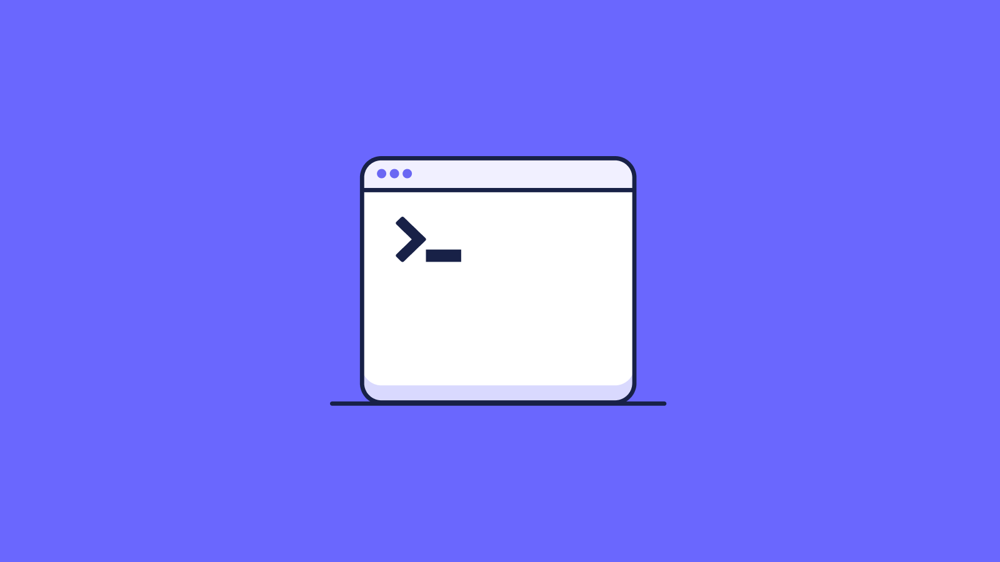

# Automatically run scripts

Fleet [v4.58.0](https://github.com/fleetdm/fleet/releases/tag/fleet-v4.58.0) introduces the ability to execute scripts on hosts automatically based on predefined policy failures. This guide will walk you through configuring Fleet to automatically execute scripts on hosts using uploaded scripts based on programmed policies.

Fleet allows users to upload scripts executed on macOS, Windows, and Linux hosts to remediate issues with those hosts. These scripts can now be automated to run when a policy fails. Learn more about scripts [here](https://fleetdm.com/guides/scripts).

## Prerequisites

* `fleetd` deployed with the `--enable-scripts` flag. If you're using MDM features, scripts are enabled by default.

## Step-by-step instructions

1. **Add a script**: Navigate to **Controls** > **Scripts**, select the team on which you want the script and policy to run, and upload the script you want to run.
2. **Add a policy**: Navigate to **Policies**, select the team you want the policy to run on, and click **Add policy**. Follow the instructions to set up a custom policy or use one baked into Fleet. You can also add a script automation to an existing policy.
3. **Set the automation**: In the previous step's **Policies** list view you navigated to, click **Manage automations**, then click **Run script**. Check the box beside the policy (or policies) for which you want to run scripts, then select a script in the drop-down that appears next to the policy name. When you're done associating policies to scripts, click **Save**.

The next time a fleetd host fails the policy you added automation for, Fleet will queue up the script you selected and run it on the host as if you had requested a script run manually.

> Adding a script to a policy will reset the policy's host counts.

## How does it work?

* Online hosts report policy status when on a configurable cadence, with hourly default.
* Fleet will send scripts to the hosts on the first policy failure (first "No" result for the host) or if a policy goes from "Yes" to "No". Policies that remain failed ("No") for a host in consecutive reports will not be resent to the script.

> When script automation on a policy is added or switched to a different script, the policy's status will reset for associated hosts. This allows the newly attached script to run on hosts that had previously failed the policy.

* Scripts are run once regardless of exit code.
* When used in policy automation, Fleet does not run shell scripts on Windows hosts or PowerShell scripts on non-Windows hosts.

## Via the API

Script policy automation can be managed by setting the `script_id` field on the Fleet REST API's [Add team policy](https://fleetdm.com/docs/rest-api/rest-api#add-team-policy) or [Edit team policy](https://fleetdm.com/docs/rest-api/rest-api#edit-team-policy) endpoints.

## Via GitOps

To configure script policy automation via GitOps, nest a `run_script` entry under the `policy` you want to automate, then make sure you have the same `path` field both there and in the same team's `controls > scripts` section. See the [GitOps reference documentation](https://fleetdm.com/docs/configuration/yaml-files#policies) for an example.

## Conclusion

Fleet now supports running scripts on hosts that fail a policy check. We showed how to set up these automations via the Fleet admin UI, our REST API, and GitOps.

Host condition-related issues can be resolved by running a script on those hosts. You can now automate those resolutions inside Fleet, allowing zero-touch remediation of policy failures on hosts running fleetd.

<meta name="articleTitle" value="Automatically run scripts">
<meta name="authorFullName" value="Ian Littman">
<meta name="authorGitHubUsername" value="iansltx">
<meta name="category" value="guides">
<meta name="publishedOn" value="2024-10-07">
<meta name="description" value="A guide to workflows using automatic script execution in Fleet.">

