# Pre-CVE threat response: a Dirty Frag walkthrough with Fleet

> **The point of this writeup:** vulnerability management isn't CVE management. When a public exploit lands before NVD has caught up, traditional vuln scanners return empty and incident response stalls waiting for a row in a database. Fleet's primitives, live osquery, run-script, and policies, let you investigate, scope, mitigate, and verify based on the technical artifacts of the threat (loaded modules, running processes, sysctls, file paths) instead of the catalog representation of it. This is a worked example.

| At a glance | |
|---|---|
| **Threat** | Dirty Frag, Linux kernel privilege escalation, public PoC, no CVE assigned |
| **Time from intel landing to scoped mitigation** | ~25 minutes |
| **Hosts in scope** | 7 Linux across 3 teams (Workstations, IT Servers, Testing & QA) |
| **Outcome** | Mitigation deployed to non-Docker hosts, alternative hardening on Docker Swarm hosts, reboot queue established for long-uptime servers |

## Why this is a problem the catalog can't solve

Most vulnerability response is gated on the CVE pipeline:

```
PoC public  →  CVE reserved  →  CVE published  →  vendor advisory  →  NVD entry  →  scanner signature  →  you find out
```

Each arrow can be hours or weeks. During that window, scanners that key off CVE IDs and vendor advisories are blind. The exploit is real, the artifacts of vulnerability are present on hosts, but no catalog yet knows about it. Fleet doesn't have to wait. You can query the artifacts directly.

I've hit this pattern before with the Axios npm supply chain compromise (no CVE for the malicious version at first) and BlueHammer (CVE assigned, but standard correlation returned 204 because Microsoft Defender's out-of-band update channel doesn't surface the patched version through normal version metadata). Detection has to come from the artifacts.

## The workflow

```
Telegram TL;DR  →  Slack @Fleet bot  →  fleet-mcp scoping    
                                                    ↓
                                         per-host artifact report
                                                    ↓
                                        in-place mitigation viable?
                                      ↓                             ↓
                                     yes                       edge case
                                      ↓                             ↓
                                  run mitigation          diagnose userspace pin
                                      ↓                             ↓
                                      ↓                   blast radius analysis
                                      ↓                             ↓
                                      ↓                   alternative mitigation
                                      ↓                             ↓
                                      └─→  verification policy ←─┘
                                                  ↓
                                         reboot queue tracker
```

Each box below is something Fleet (plus a Slack bot wired to fleet-mcp) actually does. None of it requires a CVE.

## Step 1: intel ingestion (Telegram)

A small Telegram bot subscribed to threat-intel feeds (SecurityAffairs, oss-security, GitHub Advisories, vendor PSIRTs) auto-summarizes new posts to a TL;DR. The Dirty Frag summary triggered this response.

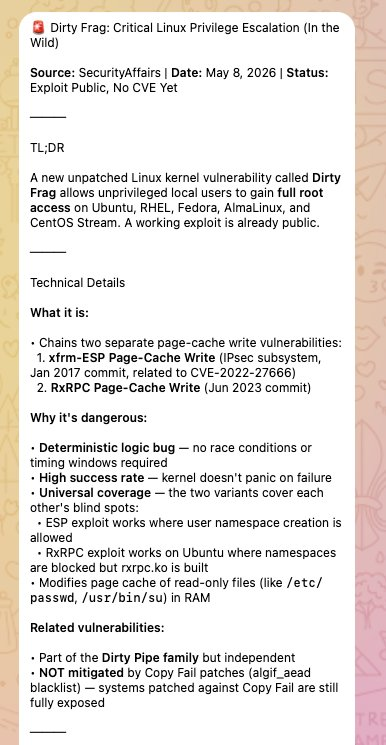

> **Why this routing matters.** A summary in Telegram is the smallest possible nudge. It has no authority. It's just a heads-up. The decision to escalate to a full Fleet investigation is human. The automation comes after that decision, not before. This avoids the failure mode where a noisy intel feed triggers fleet-wide queries on every CVE-7 PHP plugin issue.

Operationally awkward properties of this particular intel:

- No CVE, so CVE correlation lookups return empty
- Vendor advisories not yet published, so no patches to schedule
- Two attack variants (xfrm-ESP and RxRPC), so mitigation choice is non-obvious
- Page cache write, so traditional integrity monitoring (file hash on disk) won't catch it because the on-disk file is unchanged

## Step 2: scoping via Slack and fleet-mcp

I drop the TL;DR into a thread and tag `@Fleet`.

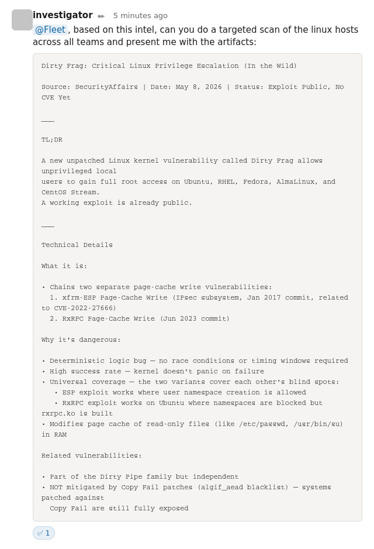

Behind the bot is **[fleet-mcp](https://fleetdm.com/articles/natural-language-endpoint-security-fleet-mcp)**, a Model Context Protocol server exposing Fleet's API as tools. The bot synthesizes the intel into an osquery scan covering distro family and version, kernel version, kernel module state for the implicated modules (`esp4`, `esp6`, `rxrpc`, `af_rxrpc`, `xfrm_user`, `xfrm_algo`, `algif_aead`), and uptime. The scan SQL:

```sql
-- 01-scope-scan.sql
SELECT
  os.platform,
  os.name              AS distro_name,
  os.version           AS distro_version,
  os.codename          AS distro_codename,
  k.version            AS kernel_version,
  k.arch,
  CAST(u.total_seconds / 86400 AS INTEGER) AS uptime_days,

  -- Per-module presence flags. Note: absence here is NOT a mitigation,
  -- these modules auto-load on demand when an unprivileged process
  -- opens the relevant socket family.
  COALESCE((SELECT 1 FROM kernel_modules WHERE name = 'esp4'),       0) AS mod_esp4,
  COALESCE((SELECT 1 FROM kernel_modules WHERE name = 'esp6'),       0) AS mod_esp6,
  COALESCE((SELECT 1 FROM kernel_modules WHERE name = 'rxrpc'),      0) AS mod_rxrpc,
  COALESCE((SELECT 1 FROM kernel_modules WHERE name = 'af_rxrpc'),   0) AS mod_af_rxrpc,
  COALESCE((SELECT 1 FROM kernel_modules WHERE name = 'xfrm_user'),  0) AS mod_xfrm_user,
  COALESCE((SELECT 1 FROM kernel_modules WHERE name = 'xfrm_algo'),  0) AS mod_xfrm_algo,
  COALESCE((SELECT 1 FROM kernel_modules WHERE name = 'algif_aead'), 0) AS mod_algif_aead
FROM os_version os
CROSS JOIN kernel_info k
CROSS JOIN uptime u;
```

This isn't a CVE check. It's an artifact check. It would have worked the day the exploit dropped.

## Step 3: findings and risk assessment

The bot returns a structured per-host report:

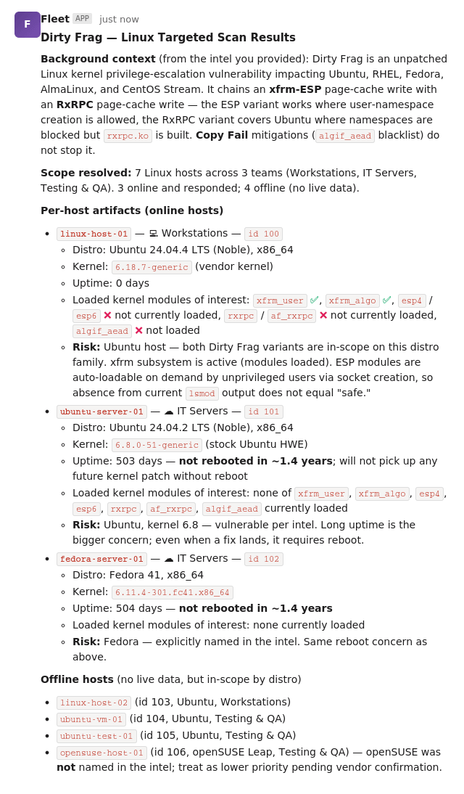

Followed by a top-line observations block:

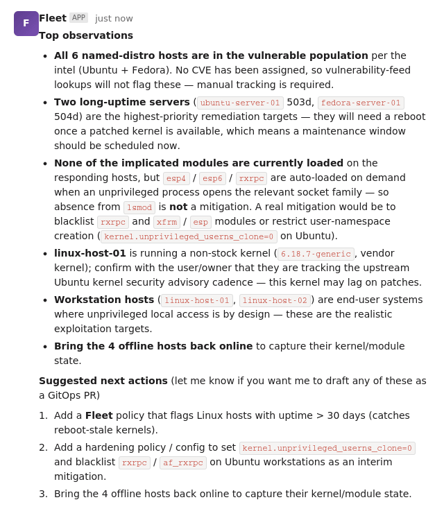

My reading of the report:

- **All 6 named-distro hosts are in the vulnerable population** per the intel (Ubuntu and Fedora). No CVE has been assigned, so vulnerability-feed lookups will not flag these. Manual tracking is required.
- **Two long-uptime servers** (503 days and 504 days uptime) are the highest-priority remediation targets. They need a reboot once a patched kernel ships, which means a maintenance window should be scheduled now, in parallel with the mitigation rollout.
- **None of the implicated modules are currently loaded** on the responding hosts, but `esp4`, `esp6`, and `rxrpc` are auto-loaded on demand when an unprivileged process opens the relevant socket family. Absence from `lsmod` is **not** a mitigation. A real mitigation requires blocking module load (`modprobe.d`) or restricting user-namespace creation (`kernel.unprivileged_userns_clone=0`).
- **One workstation** is running a non-stock kernel. Confirm with the owner that they're tracking the upstream Ubuntu kernel security advisory cadence. A vendor-customized kernel may lag on patches.
- **Workstation hosts** are end-user systems where unprivileged local access is by design. These are the realistic exploitation targets.
- **openSUSE Leap** was not named in the intel. Treat as lower priority pending vendor confirmation.

> The "absence from `lsmod` is not mitigation" point is the kind of detail that gets lost when responders only look at vendor advisories. A future advisory will likely say "affects kernels with `CONFIG_INET_ESP=y`". Most distros ship that as a module, not built-in. So `lsmod` will say "no esp4 here, we're fine", but the moment any unprivileged process calls `socket(AF_INET, SOCK_RAW, IPPROTO_ESP)`, the module loads and the host is exposed. The **kernel build configuration** is the actual exposure indicator, not the running module list. Artifact-based queries have to encode that nuance.

## Step 4: mitigation design

The exploit requires a target module to be loaded (or loadable). The minimal mitigation has three parts:

- **Block future load attempts.** Drop a file in `/etc/modprobe.d/` that maps each implicated module to `/bin/false`. This is stronger than the `blacklist` directive. `blacklist` only stops alias-based auto-load, while `install ... /bin/false` blocks explicit `modprobe` too.
- **Unload any in-flight copies.** `rmmod` the modules if they're currently resident. This will fail when something is using them. That's a separate problem (Step 6).
- **Drop page caches.** Both attack chains write to the page cache. Flushing cached pages forces a re-read from disk on next access, which clears any in-memory file modification an attacker may have already staged.

Full script: `dirtyfrag-mitigation.sh`. Key choices:

```bash
#!/bin/bash
# dirtyfrag-mitigation.sh
set -u

CONF_FILE="/etc/modprobe.d/dirtyfrag.conf"
MODULES=(esp4 esp6 rxrpc)
EXIT=0

if [ "$(id -u)" -ne 0 ]; then
    echo "ERROR: must run as root" >&2
    exit 1
fi

# Strong blacklist, blocks alias resolution AND explicit modprobe
cat > "$CONF_FILE" <<'EOF'
install esp4 /bin/false
install esp6 /bin/false
install rxrpc /bin/false
EOF
chmod 0644 "$CONF_FILE"
echo "WROTE: $CONF_FILE"

for mod in "${MODULES[@]}"; do
    if lsmod | awk '{print $1}' | grep -qx "$mod"; then
        if rmmod "$mod" 2>/dev/null; then
            echo "UNLOADED: $mod"
        else
            echo "WARN: $mod loaded but could not be unloaded (likely in use)"
            EXIT=2
        fi
    else
        echo "NOT-LOADED: $mod"
    fi
done

echo 3 > /proc/sys/vm/drop_caches 2>/dev/null && echo "CACHES: dropped"

# Exit 0 = clean; 2 = blacklist written but module still resident (reboot needed)
exit "$EXIT"
```

**Exit-code semantics** are deliberate so Fleet's run-script results page tells you something useful:

| Exit | Meaning |
|------|---------|
| 0 | Blacklist written, no target modules resident, fully mitigated |
| 1 | Hard failure (not root, couldn't write conf), host needs follow-up |
| 2 | Blacklist written, but a target module is in-use, host needs reboot to clear |

Exit 2 is intentionally non-zero so it surfaces in the Fleet UI as something distinct from clean success. This is a tradeoff. You get a "script execution error" badge on hosts that aren't actually broken, but you also get an at-a-glance reboot queue.

## Step 5: deploy via Fleet run-script

Target selection, scoped to Linux:

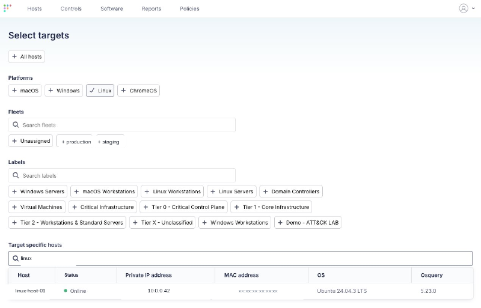

Before running the script, validate the scope query against the picked host to confirm the artifact baseline:

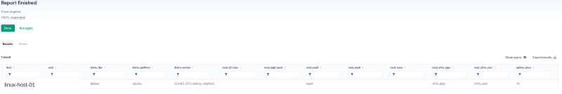

Trigger the script from the host details page (Actions, then Run script):

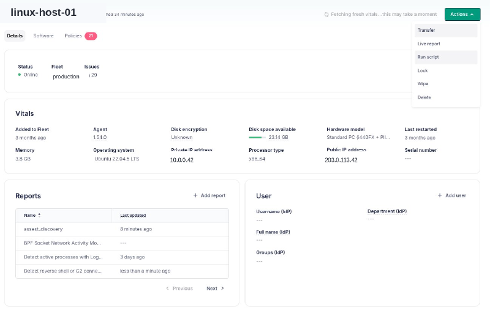

Or via `fleetctl`:

```bash
fleetctl run-script \
  --script-path ./dirtyfrag-mitigation.sh \
  --host linux-host-01
```

The script enters the run queue:

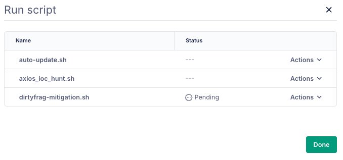

And shows up in the host activity log:

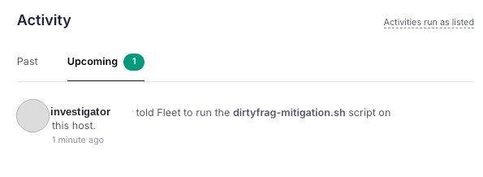

For most hosts (workstations, the offline hosts once they come back online), this completes the mitigation cycle. The verification policy in Step 9 confirms it. But.

## Step 6: the snag

Running the same script against a Docker Swarm manager returned exit 2:

```
WROTE: /etc/modprobe.d/dirtyfrag.conf
WARN: esp4 loaded but could not be unloaded (likely in use)
NOT-LOADED: esp6
NOT-LOADED: rxrpc
CACHES: dropped
----- verification -----
[loaded target modules]
esp4
script execution error: exit status 2
```

Per the script's exit-code contract this means the conf file landed but `esp4` is pinned in the running kernel. **The modprobe blacklist only takes effect at next boot.** If the host reboots without first identifying what's pinning `esp4`, two things happen:

- The blacklist activates and blocks `esp4` from loading.
- Whatever was using `esp4` either fails or silently degrades.

This is the part vendor advisories cannot tell you. The advisory will say "blacklist these modules". It cannot know that on *your* hosts, these modules have legitimate consumers.

## Step 7: diagnose the userspace pin

Two queries find the holder.

**Query A, module state** (`02-module-state.sql`):

```sql
SELECT name, size, used_by, status
FROM kernel_modules
WHERE name IN ('esp4','esp6','rxrpc','xfrm_user','xfrm_algo');
```

Result:

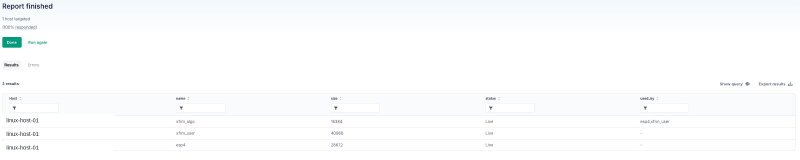

Reading: `esp4` and `xfrm_user` are loaded with no kernel-side dependents (`used_by = -`) but their refcount is non-zero. That's the userspace-pin signature. Something is using the xfrm netlink interface directly.

**Query B, userspace consumers** (`03-userspace-consumers.sql`):

```sql
SELECT p.pid, p.name AS process, p.path, p.cmdline
FROM processes p
WHERE p.name IN ('charon','pluto','starter','ipsec','iked','racoon','swanctl',
                 'dockerd','containerd','docker-proxy')
   OR p.cmdline LIKE '%strongswan%'
   OR p.cmdline LIKE '%libreswan%'
   OR p.path  LIKE '%/dockerd%'
   OR p.path  LIKE '%/containerd%';
```

Result:

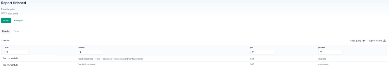

No `charon`, no `pluto`, no traditional IPsec stack. **Docker is the consumer.** Docker Swarm encrypted overlay networks (`docker network create --opt encrypted`) program xfrm state directly via netlink, with no userland daemon involved. That programming pulls in `xfrm_user` and `esp4`.

## Step 8: blast radius and alternative mitigation

Consequence of going forward with the blacklist on this host:

- On reboot, `esp4` cannot load.
- Docker Swarm encrypted overlay networking on this manager fails. Depending on Docker version, this is either silent fall-back to unencrypted (worse than expected) or hard failure to attach overlay networks.
- Any container relying on encrypted overlay traffic is impacted.

The right move is to **not** deploy the modprobe blacklist on Docker Swarm hosts and instead apply a **second-tier mitigation** that blunts the attack without breaking Docker:

```bash
# /etc/sysctl.d/99-dirtyfrag-userns.conf
kernel.unprivileged_userns_clone = 0
```

This stops unprivileged processes from creating user namespaces, which is the prerequisite for the xfrm-ESP variant. The RxRPC variant is unaffected by this knob. For that, Docker hosts have to wait for a kernel patch. **This is an honest tradeoff, documented as such, not a clean win.**

Full script: `dirtyfrag-userns-mitigation.sh`. Detects distro family and sets the right sysctl (`kernel.unprivileged_userns_clone` on Debian and Ubuntu, `user.max_user_namespaces` on RHEL and Fedora).

For the Docker host specifically:

```bash
# Roll back the modprobe blacklist
ssh docker-host 'sudo rm -f /etc/modprobe.d/dirtyfrag.conf'

# Apply the userns mitigation instead
fleetctl run-script \
  --script-path ./dirtyfrag-userns-mitigation.sh \
  --host docker-host
```

## Step 9: verification policies

After the mitigation lands, a `file` query confirms the conf file is in place:

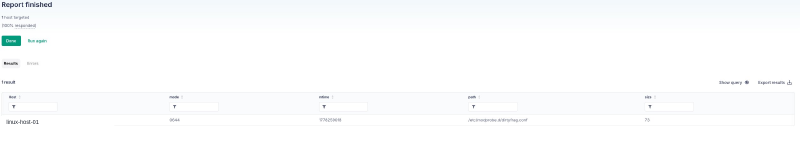

Three Fleet policies track the rollout:

| Policy | Pass condition |
|--------|----------------|
| `dirtyfrag-blacklist-deployed` | `/etc/modprobe.d/dirtyfrag.conf` exists and is non-empty |
| `dirtyfrag-userns-hardened` (Docker hosts) | `kernel.unprivileged_userns_clone = 0` at runtime |
| `dirtyfrag-fully-mitigated` | Blacklist deployed AND no target module resident |

The reboot queue is just the failing set of `dirtyfrag-fully-mitigated` minus the failing set of `dirtyfrag-blacklist-deployed`. Hosts that have the blacklist but still have a module loaded.

## What this gives you that a CVE pipeline doesn't

Three concrete things:

- **Latency.** Time from intel landing to scoped fleet-wide visibility was minutes, gated only on the on-call's decision to escalate. No waiting on NIST, no waiting on a vendor PSIRT, no waiting on a scanner vendor to ship a signature.
- **Specificity.** The investigation surfaced something a generic advisory could not, the Docker Swarm blast radius. The general "blacklist these modules" guidance from a future advisory would have caused a Docker Swarm outage on this host. Artifact-based investigation caught it before the reboot.
- **Honest gaps.** The userns mitigation doesn't cover the RxRPC variant. The reboot queue is real and tracked. The offline hosts remain unverified until they come back online. None of this is hidden by a green "patched" badge. Fleet shows exactly which hosts are in which state.

The framing that helps:

> A vulnerability scanner asks: *which CVEs apply to this host?*
> An artifact query asks: *what does this host actually look like right now?*

The first is bounded by the catalog. The second is bounded only by what osquery can see, which on Linux is most of what matters. For pre-CVE threats, only the second one works.

## Reusing this pattern

The shape of this response is generalizable. For any pre-CVE Linux kernel threat:

1. Translate the intel into a list of **artifacts** (modules, sysctls, files, processes, distro versions).
2. Write a **scope query** that returns those artifacts per host.
3. Write a **mitigation script** that touches only the artifacts the threat depends on.
4. Write a **verification policy** that confirms the mitigation landed.
5. Run the script. If anything pushes back (exit 2, errors), **diagnose the userspace context** before forcing the mitigation.
6. Track residual state (reboot queues, offline hosts, exception cohorts) as named policies.

The Slack-bot front-end is convenience, not the substance. The substance is osquery, scripts, and policies. Those three primitives, applied artifact-first, cover the gap that CVE-based tooling can't.

## Caveats

- **The mitigation script's `drop_caches` step is best-effort.** It does not retroactively undo a successful exploit. If the host was already compromised before the script ran, dropping caches forces a re-read of legitimate on-disk content but does not remediate any persistence the attacker may have established outside the page cache. Treat as harm-reduction, not detection.
- **The userns mitigation is partial.** It only blocks the xfrm-ESP variant. The RxRPC variant works on hosts that have `rxrpc.ko` built (default on Ubuntu kernels) regardless of namespace policy. Docker hosts running Ubuntu remain partially exposed until a patched kernel ships.
- **Long-uptime hosts won't pick up future kernel patches without reboot.** The mitigation script does not address this. The reboot queue policy does. Schedule maintenance windows in parallel with the mitigation rollout, not after.
- **Offline hosts are unverified.** Fleet returns no live data for offline hosts. The findings table treats them as in-scope-by-distro, not as confirmed-vulnerable or confirmed-mitigated. A second pass is required when they come online.

## Downloads

| File | What it does |
|------|--------------|
| `dirtyfrag-mitigation.sh` | Modprobe blacklist, rmmod, and drop_caches |
| `dirtyfrag-userns-mitigation.sh` | Sysctl-based alternative for Docker and IPsec hosts |
| `01-scope-scan.sql` | Initial fleet-wide artifact scan |
| `02-module-state.sql` | Post-mitigation module diagnostic |
| `03-userspace-consumers.sql` | Find what's pinning a stuck module |
| `04-blacklist-deployed.sql` | Verification SQL backing the policy |
| `dirtyfrag-policies.yml` | Three Fleet GitOps policies for tracking |

All artifacts are MIT-licensed.

About the author: [Dhruv Majumdar](https://www.linkedin.com/in/neondhruv) is Fleet's VP of Security Solutions. Talk to [Fleet](https://fleetdm.com/device-management) today to find out how to solve your trickiest device management, data orchestration, and security problems. Cross-post: [Pre-CVE Threat Response: A Dirty Frag Walkthrough with Fleet](https://karmine05.github.io/dirtyfrag-blog/posts/pre-cve-response-with-fleet/)

<meta name="articleTitle" value="Pre-CVE threat response: a Dirty Frag walkthrough with Fleet">
<meta name="authorFullName" value="Dhruv Majumdar">
<meta name="authorGitHubUsername" value="drvcodenta">
<meta name="category" value="security">
<meta name="publishedOn" value="2026-05-22">
<meta name="description" value="How to use Fleet to scope, mitigate, and verify a Linux kernel privilege escalation across a fleet before a CVE is assigned.">
